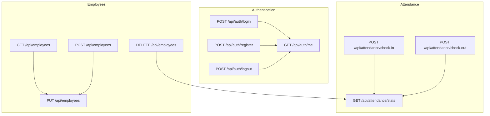
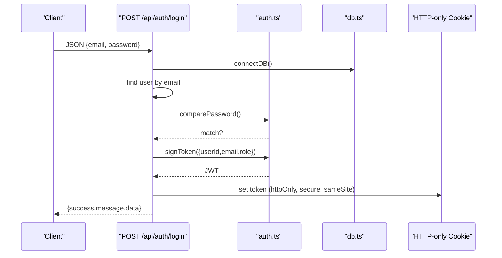
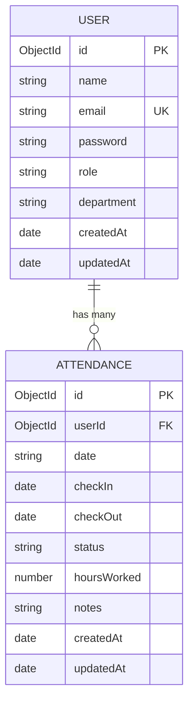
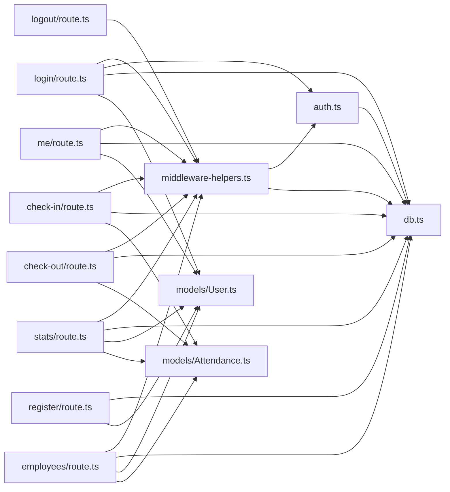

# API Reference

<cite>
**Referenced Files in This Document**
- [login/route.ts](file://app/api/auth/login/route.ts)
- [register/route.ts](file://app/api/auth/register/route.ts)
- [logout/route.ts](file://app/api/auth/logout/route.ts)
- [me/route.ts](file://app/api/auth/me/route.ts)
- [check-in/route.ts](file://app/api/attendance/check-in/route.ts)
- [check-out/route.ts](file://app/api/attendance/check-out/route.ts)
- [stats/route.ts](file://app/api/attendance/stats/route.ts)
- [employees/route.ts](file://app/api/employees/route.ts)
- [middleware-helpers.ts](file://lib/middleware-helpers.ts)
- [auth.ts](file://lib/auth.ts)
- [db.ts](file://lib/db.ts)
- [User.ts](file://models/User.ts)
- [Attendance.ts](file://models/Attendance.ts)
</cite>

## Table of Contents
1. [Introduction](#introduction)
2. [Project Structure](#project-structure)
3. [Core Components](#core-components)
4. [Architecture Overview](#architecture-overview)
5. [Detailed Component Analysis](#detailed-component-analysis)
6. [Dependency Analysis](#dependency-analysis)
7. [Performance Considerations](#performance-considerations)
8. [Troubleshooting Guide](#troubleshooting-guide)
9. [Conclusion](#conclusion)
10. [Appendices](#appendices)

## Introduction
This document provides comprehensive API documentation for the Attendance Management System. It covers authentication endpoints (login, register, logout, profile), attendance management endpoints (check-in, check-out, statistics), and user management endpoints. For each endpoint, you will find HTTP methods, URL patterns, request/response schemas, authentication requirements, error codes, parameter descriptions, validation rules, and example requests/responses. Pagination and filtering capabilities are also documented, along with client integration examples and SDK usage patterns.

## Project Structure
The API is organized under Next.js App Router conventions, with route handlers grouped by feature:
- Authentication: app/api/auth/{login, register, logout, me}
- Attendance: app/api/attendance/{check-in, check-out, stats}
- Employees: app/api/employees

**Diagram sources**
- [login/route.ts:1-101](file://app/api/auth/login/route.ts#L1-L101)
- [register/route.ts:1-102](file://app/api/auth/register/route.ts#L1-L102)
- [logout/route.ts:1-31](file://app/api/auth/logout/route.ts#L1-L31)
- [me/route.ts:1-66](file://app/api/auth/me/route.ts#L1-L66)
- [check-in/route.ts:1-79](file://app/api/attendance/check-in/route.ts#L1-L79)
- [check-out/route.ts:1-90](file://app/api/attendance/check-out/route.ts#L1-L90)
- [stats/route.ts:1-131](file://app/api/attendance/stats/route.ts#L1-L131)
- [employees/route.ts:1-311](file://app/api/employees/route.ts#L1-L311)

**Section sources**
- [login/route.ts:1-101](file://app/api/auth/login/route.ts#L1-L101)
- [register/route.ts:1-102](file://app/api/auth/register/route.ts#L1-L102)
- [logout/route.ts:1-31](file://app/api/auth/logout/route.ts#L1-L31)
- [me/route.ts:1-66](file://app/api/auth/me/route.ts#L1-L66)
- [check-in/route.ts:1-79](file://app/api/attendance/check-in/route.ts#L1-L79)
- [check-out/route.ts:1-90](file://app/api/attendance/check-out/route.ts#L1-L90)
- [stats/route.ts:1-131](file://app/api/attendance/stats/route.ts#L1-L131)
- [employees/route.ts:1-311](file://app/api/employees/route.ts#L1-L311)

## Core Components
- Authentication via HTTP-only cookie "token" signed with JWT. Token payload includes userId, email, and role.
- Middleware helpers enforce authentication and admin checks.
- Data persistence uses MongoDB via Mongoose with two primary models:
  - User: stores name, email, password, role, department, timestamps
  - Attendance: stores userId, date (YYYY-MM-DD), checkIn/checkOut timestamps, status, hoursWorked, notes

Key behaviors:
- Login sets a secure, HTTP-only cookie for session management.
- Check-in prevents duplicate daily check-ins and marks status as "present" or "late".
- Check-out validates prior check-in, computes worked hours, and optionally appends notes.
- Statistics endpoint requires admin role and computes daily, monthly, and trend metrics.

**Section sources**
- [middleware-helpers.ts:1-81](file://lib/middleware-helpers.ts#L1-L81)
- [auth.ts:1-50](file://lib/auth.ts#L1-L50)
- [db.ts:1-54](file://lib/db.ts#L1-L54)
- [User.ts:1-50](file://models/User.ts#L1-L50)
- [Attendance.ts:1-58](file://models/Attendance.ts#L1-L58)

## Architecture Overview
The system uses Next.js App Router route handlers with a layered architecture:
- Route handlers: parse requests, validate inputs, enforce auth/admin policies, interact with models, and return JSON responses.
- Middleware helpers: extract and verify tokens, enforce auth/admin roles.
- Models: define schemas and indexes for efficient queries.
- Database connection: centralized connection with caching.

**Diagram sources**
- [login/route.ts:1-101](file://app/api/auth/login/route.ts#L1-L101)
- [auth.ts:1-50](file://lib/auth.ts#L1-L50)
- [db.ts:1-54](file://lib/db.ts#L1-L54)

**Section sources**
- [login/route.ts:1-101](file://app/api/auth/login/route.ts#L1-L101)
- [auth.ts:1-50](file://lib/auth.ts#L1-L50)
- [db.ts:1-54](file://lib/db.ts#L1-L54)

## Detailed Component Analysis

### Authentication Endpoints

#### POST /api/auth/login
- Description: Authenticate a user and set an HTTP-only session cookie.
- Authentication: None (initial login).
- Request body:
  - email: string, required
  - password: string, required
- Response body:
  - success: boolean
  - message: string
  - data.user: object with _id, name, email, role, department, createdAt
- Status codes:
  - 200 OK on success
  - 400 Bad Request if missing fields
  - 401 Unauthorized if invalid credentials
  - 500 Internal Server Error on failure
- Notes:
  - Sets cookie "token" with httpOnly, secure, sameSite lax, 7-day expiry.

Example request:
- POST /api/auth/login
- Content-Type: application/json
- Body: {"email":"john@example.com","password":"securePass"}

Example response:
- 200 OK
- Body: {"success":true,"message":"Login successful","data":{"_id":"...","name":"John Doe","email":"john@example.com","role":"employee","department":"","createdAt":"2024-01-01T00:00:00Z"}}

Validation rules:
- email and password required
- email format validated by server-side regex
- password minimum length enforced

**Section sources**
- [login/route.ts:1-101](file://app/api/auth/login/route.ts#L1-L101)

#### POST /api/auth/register
- Description: Register a new user account.
- Authentication: None.
- Request body:
  - name: string, required
  - email: string, required
  - password: string, required (min length 6)
  - role: string, optional ("admin" or "employee"), defaults to "employee"
  - department: string, optional
- Response body:
  - success: boolean
  - message: string
  - data.user: object with _id, name, email, role, department, createdAt
- Status codes:
  - 201 Created on success
  - 400 Bad Request for validation errors
  - 409 Conflict if email exists
  - 500 Internal Server Error on failure
- Notes:
  - Password is hashed before storage.

Example request:
- POST /api/auth/register
- Content-Type: application/json
- Body: {"name":"Jane","email":"jane@example.com","password":"mypwd123","role":"employee"}

Example response:
- 201 Created
- Body: {"success":true,"message":"User registered successfully","data":{"_id":"...","name":"Jane","email":"jane@example.com","role":"employee","department":"","createdAt":"2024-01-01T00:00:00Z"}}

Validation rules:
- name, email, password required
- email format validated
- password min length 6
- unique email constraint enforced

**Section sources**
- [register/route.ts:1-102](file://app/api/auth/register/route.ts#L1-L102)

#### POST /api/auth/logout
- Description: Clear the session cookie.
- Authentication: None required.
- Request body: none.
- Response body:
  - success: boolean
  - message: string
- Status codes:
  - 200 OK on success
  - 500 Internal Server Error on failure

Example request:
- POST /api/auth/logout

Example response:
- 200 OK
- Body: {"success":true,"message":"Logout successful"}

**Section sources**
- [logout/route.ts:1-31](file://app/api/auth/logout/route.ts#L1-L31)

#### GET /api/auth/me
- Description: Retrieve currently authenticated user profile.
- Authentication: Required (cookie "token").
- Request body: none.
- Response body:
  - success: boolean
  - data.user: object with _id, name, email, role, department, createdAt
- Status codes:
  - 200 OK on success
  - 401 Unauthorized if not authenticated
  - 404 Not Found if user does not exist
  - 500 Internal Server Error on failure

Example request:
- GET /api/auth/me
- Cookie: token=...

Example response:
- 200 OK
- Body: {"success":true,"data":{"_id":"...","name":"John Doe","email":"john@example.com","role":"employee","department":"","createdAt":"2024-01-01T00:00:00Z"}}

**Section sources**
- [me/route.ts:1-66](file://app/api/auth/me/route.ts#L1-L66)
- [middleware-helpers.ts:1-81](file://lib/middleware-helpers.ts#L1-L81)

### Attendance Management Endpoints

#### POST /api/attendance/check-in
- Description: Record a check-in for the authenticated user for the current calendar day.
- Authentication: Required (cookie "token").
- Request body:
  - notes: string, optional
- Response body:
  - success: boolean
  - message: string
  - data.record: object with _id, date, checkIn, status
- Status codes:
  - 201 Created on success
  - 400 Bad Request if already checked in today
  - 401 Unauthorized if not authenticated
  - 500 Internal Server Error on failure
- Notes:
  - Status is "late" if after 9:00 AM on the same day; otherwise "present".
  - Daily uniqueness enforced by compound index on (userId, date).

Example request:
- POST /api/attendance/check-in
- Cookie: token=...
- Content-Type: application/json
- Body: {"notes":"Early start"}

Example response:
- 201 Created
- Body: {"success":true,"message":"Check-in successful","data":{"_id":"...","date":"2024-06-15","checkIn":"2024-06-15T09:05:00Z","status":"late"}}

**Section sources**
- [check-in/route.ts:1-79](file://app/api/attendance/check-in/route.ts#L1-L79)
- [Attendance.ts:1-58](file://models/Attendance.ts#L1-L58)

#### POST /api/attendance/check-out
- Description: Record a check-out for the authenticated user for the current calendar day.
- Authentication: Required (cookie "token").
- Request body:
  - notes: string, optional (appended to existing notes)
- Response body:
  - success: boolean
  - message: string
  - data.record: object with _id, date, checkIn, checkOut, hoursWorked, status
- Status codes:
  - 200 OK on success
  - 400 Bad Request if no check-in today or already checked out
  - 401 Unauthorized if not authenticated
  - 500 Internal Server Error on failure
- Notes:
  - Hours worked computed as difference between checkOut and checkIn, rounded to 2 decimals.
  - Existing notes are preserved and new notes appended with separator.

Example request:
- POST /api/attendance/check-out
- Cookie: token=...
- Content-Type: application/json
- Body: {"notes":"Meeting ended"}

Example response:
- 200 OK
- Body: {"success":true,"message":"Check-out successful","data":{"_id":"...","date":"2024-06-15","checkIn":"2024-01-01T09:05:00Z","checkOut":"2024-01-01T17:30:00Z","hoursWorked":8.42,"status":"late"}}

**Section sources**
- [check-out/route.ts:1-90](file://app/api/attendance/check-out/route.ts#L1-L90)
- [Attendance.ts:1-58](file://models/Attendance.ts#L1-L58)

#### GET /api/attendance/stats
- Description: Retrieve aggregated attendance statistics for admins.
- Authentication: Required (cookie "token"); admin role required.
- Query parameters:
  - month: string, optional, format YYYY-M or YYYY-MM (defaults to current month)
- Response body:
  - success: boolean
  - data.stats: object with:
    - totalEmployees: number
    - presentToday: number
    - absentToday: number
    - lateToday: number
    - avgHoursThisMonth: number (rounded to 2 decimals)
    - attendanceRate: number (percentage, rounded to 2 decimals)
    - totalLateThisMonth: number
    - presentTrend: number (percentage change vs previous day, rounded to 2 decimals)
    - lateTrend: number (percentage change vs previous day, rounded to 2 decimals)
    - month: string (YYYY-MM)
- Status codes:
  - 200 OK on success
  - 401 Unauthorized if not authenticated
  - 403 Forbidden if not admin
  - 500 Internal Server Error on failure
- Notes:
  - Working days calculated by excluding Sundays and Saturdays.
  - Trends computed vs previous day.

Example request:
- GET /api/attendance/stats?month=2024-06
- Cookie: token=...

Example response:
- 200 OK
- Body: {"success":true,"data":{"totalEmployees":50,"presentToday":47,"absentToday":3,"lateToday":2,"avgHoursThisMonth":8.12,"attendanceRate":92.31,"totalLateThisMonth":5,"presentTrend":-1.23,"lateTrend":5.67,"month":"2024-06"}}

**Section sources**
- [stats/route.ts:1-131](file://app/api/attendance/stats/route.ts#L1-L131)
- [middleware-helpers.ts:1-81](file://lib/middleware-helpers.ts#L1-L81)

### User Management Endpoints

#### GET /api/employees
- Description: List employees (admins only).
- Authentication: Required (cookie "token"); admin role required.
- Query parameters:
  - search: string, optional, case-insensitive name or email regex match
- Response body:
  - success: boolean
  - data.users: array of user objects (without password)
- Status codes:
  - 200 OK on success
  - 401 Unauthorized if not authenticated
  - 403 Forbidden if not admin
  - 500 Internal Server Error on failure
- Notes:
  - Results sorted by name ascending.
  - Password excluded from returned documents.

Example request:
- GET /api/employees?search=john
- Cookie: token=...

Example response:
- 200 OK
- Body: {"success":true,"data":[{"_id":"...","name":"John Doe","email":"john@example.com","role":"employee","department":"","createdAt":"2024-01-01T00:00:00Z"}]}

**Section sources**
- [employees/route.ts:1-311](file://app/api/employees/route.ts#L1-L311)
- [middleware-helpers.ts:1-81](file://lib/middleware-helpers.ts#L1-L81)

#### POST /api/employees
- Description: Create a new employee (admins only).
- Authentication: Required (cookie "token"); admin role required.
- Request body:
  - name: string, required
  - email: string, required
  - password: string, required (min length 6)
  - role: string, optional ("admin" or "employee")
  - department: string, optional
- Response body:
  - success: boolean
  - message: string
  - data.user: object with _id, name, email, role, department, createdAt
- Status codes:
  - 201 Created on success
  - 400 Bad Request for validation errors
  - 409 Conflict if email exists
  - 401 Unauthorized if not authenticated
  - 403 Forbidden if not admin
  - 500 Internal Server Error on failure

Example request:
- POST /api/employees
- Cookie: token=...
- Content-Type: application/json
- Body: {"name":"Alice","email":"alice@example.com","password":"pwd123","role":"employee","department":"Engineering"}

Example response:
- 201 Created
- Body: {"success":true,"message":"Employee created successfully","data":{"_id":"...","name":"Alice","email":"alice@example.com","role":"employee","department":"Engineering","createdAt":"2024-01-01T00:00:00Z"}}

**Section sources**
- [employees/route.ts:62-141](file://app/api/employees/route.ts#L62-L141)
- [middleware-helpers.ts:1-81](file://lib/middleware-helpers.ts#L1-L81)

#### PUT /api/employees
- Description: Update an existing employee (admins only).
- Authentication: Required (cookie "token"); admin role required.
- Request body:
  - id: string, required
  - name: string, optional
  - email: string, optional (must be unique)
  - role: string, optional
  - department: string, optional (explicitly allowing empty)
  - password: string, optional (hashed if provided)
- Response body:
  - success: boolean
  - message: string
  - data.user: object with _id, name, email, role, department, createdAt
- Status codes:
  - 200 OK on success
  - 400 Bad Request for missing id
  - 404 Not Found if user does not exist
  - 409 Conflict if email taken
  - 401 Unauthorized if not authenticated
  - 403 Forbidden if not admin
  - 500 Internal Server Error on failure

Example request:
- PUT /api/employees
- Cookie: token=...
- Content-Type: application/json
- Body: {"id":"...","department":"HR","password":"newSecurePass"}

Example response:
- 200 OK
- Body: {"success":true,"message":"Employee updated successfully","data":{"_id":"...","name":"Alice","email":"alice@example.com","role":"employee","department":"HR","createdAt":"2024-01-01T00:00:00Z"}}

**Section sources**
- [employees/route.ts:143-236](file://app/api/employees/route.ts#L143-L236)
- [middleware-helpers.ts:1-81](file://lib/middleware-helpers.ts#L1-L81)

#### DELETE /api/employees
- Description: Delete an employee and all associated attendance records (admins only).
- Authentication: Required (cookie "token"); admin role required.
- Query parameters:
  - id: string, required (alternative to body)
- Or request body:
  - id: string, required (if query param not provided)
- Response body:
  - success: boolean
  - message: string
- Status codes:
  - 200 OK on success
  - 400 Bad Request if id missing
  - 404 Not Found if user does not exist
  - 401 Unauthorized if not authenticated
  - 403 Forbidden if not admin
  - 500 Internal Server Error on failure
- Notes:
  - Deletes all Attendance records for the user before deleting the user.

Example request:
- DELETE /api/employees?id=...
- Cookie: token=...

Example response:
- 200 OK
- Body: {"success":true,"message":"Employee and associated attendance records deleted successfully"}

**Section sources**
- [employees/route.ts:238-311](file://app/api/employees/route.ts#L238-L311)
- [middleware-helpers.ts:1-81](file://lib/middleware-helpers.ts#L1-L81)

### Data Models

**Diagram sources**
- [User.ts:1-50](file://models/User.ts#L1-L50)
- [Attendance.ts:1-58](file://models/Attendance.ts#L1-L58)

## Dependency Analysis

**Diagram sources**
- [middleware-helpers.ts:1-81](file://lib/middleware-helpers.ts#L1-L81)
- [auth.ts:1-50](file://lib/auth.ts#L1-L50)
- [db.ts:1-54](file://lib/db.ts#L1-L54)
- [User.ts:1-50](file://models/User.ts#L1-L50)
- [Attendance.ts:1-58](file://models/Attendance.ts#L1-L58)
- [login/route.ts:1-101](file://app/api/auth/login/route.ts#L1-L101)
- [register/route.ts:1-102](file://app/api/auth/register/route.ts#L1-L102)
- [logout/route.ts:1-31](file://app/api/auth/logout/route.ts#L1-L31)
- [me/route.ts:1-66](file://app/api/auth/me/route.ts#L1-L66)
- [check-in/route.ts:1-79](file://app/api/attendance/check-in/route.ts#L1-L79)
- [check-out/route.ts:1-90](file://app/api/attendance/check-out/route.ts#L1-L90)
- [stats/route.ts:1-131](file://app/api/attendance/stats/route.ts#L1-L131)
- [employees/route.ts:1-311](file://app/api/employees/route.ts#L1-L311)

**Section sources**
- [middleware-helpers.ts:1-81](file://lib/middleware-helpers.ts#L1-L81)
- [auth.ts:1-50](file://lib/auth.ts#L1-L50)
- [db.ts:1-54](file://lib/db.ts#L1-L54)
- [User.ts:1-50](file://models/User.ts#L1-L50)
- [Attendance.ts:1-58](file://models/Attendance.ts#L1-L58)

## Performance Considerations
- Database connection caching: The connection is cached globally to avoid reconnect overhead.
- Indexes:
  - User: index on email for fast lookup.
  - Attendance: compound index on (userId, date) for unique daily records; separate indices on date and userId for efficient queries.
- Payload sizes: Responses exclude sensitive fields (e.g., password) and use compact date strings for attendance records.
- Recommendations:
  - Use pagination for large lists (not implemented yet) by adding limit/skip or cursor-based pagination.
  - Add rate limiting at the edge (e.g., Vercel Rate Limiting) to protect login/register endpoints.
  - Consider caching frequent stats queries with appropriate invalidation.

[No sources needed since this section provides general guidance]

## Troubleshooting Guide
Common issues and resolutions:
- Authentication failures:
  - Ensure the "token" cookie is present and valid. Verify with GET /api/auth/me.
  - Confirm the token has not expired (7-day expiry).
- Authorization failures:
  - Admin-only endpoints require role "admin". Verify user role.
- Validation errors:
  - Login/Register: confirm required fields and email/password constraints.
  - Employee creation/update: confirm unique email and presence of required fields.
- Duplicate records:
  - Check-in enforces daily uniqueness. Attempting to check-in twice on the same day will fail.
- Missing data:
  - Check-out requires a prior check-in on the same day. Ensure check-in occurred.

Error response format:
- All endpoints return a standardized envelope with success and error fields on failure.

**Section sources**
- [login/route.ts:1-101](file://app/api/auth/login/route.ts#L1-L101)
- [register/route.ts:1-102](file://app/api/auth/register/route.ts#L1-L102)
- [logout/route.ts:1-31](file://app/api/auth/logout/route.ts#L1-L31)
- [me/route.ts:1-66](file://app/api/auth/me/route.ts#L1-L66)
- [check-in/route.ts:1-79](file://app/api/attendance/check-in/route.ts#L1-L79)
- [check-out/route.ts:1-90](file://app/api/attendance/check-out/route.ts#L1-L90)
- [stats/route.ts:1-131](file://app/api/attendance/stats/route.ts#L1-L131)
- [employees/route.ts:1-311](file://app/api/employees/route.ts#L1-L311)
- [middleware-helpers.ts:1-81](file://lib/middleware-helpers.ts#L1-L81)

## Conclusion
This API provides a complete foundation for an attendance management system with secure authentication, robust attendance tracking, and administrative reporting. The endpoints are designed for simplicity and clarity, with consistent error handling and response envelopes. Extending the system with pagination, rate limiting, and advanced filtering will further improve scalability and usability.

[No sources needed since this section summarizes without analyzing specific files]

## Appendices

### Request/Response Schemas

- Standard envelope:
  - Success response: { success: boolean, data: any, message?: string }
  - Error response: { success: boolean, error: string }

- Authentication payloads:
  - Login/Me/Register/Logout: user object without password
  - JWT payload: { userId: string, email: string, role: string }

- Attendance record:
  - Fields: _id, userId, date (YYYY-MM-DD), checkIn, checkOut, status, hoursWorked, notes, createdAt, updatedAt

- Employee CRUD:
  - Create/Update: name, email, password (optional), role, department
  - Response excludes password

**Section sources**
- [login/route.ts:1-101](file://app/api/auth/login/route.ts#L1-L101)
- [register/route.ts:1-102](file://app/api/auth/register/route.ts#L1-L102)
- [me/route.ts:1-66](file://app/api/auth/me/route.ts#L1-L66)
- [check-in/route.ts:1-79](file://app/api/attendance/check-in/route.ts#L1-L79)
- [check-out/route.ts:1-90](file://app/api/attendance/check-out/route.ts#L1-L90)
- [stats/route.ts:1-131](file://app/api/attendance/stats/route.ts#L1-L131)
- [employees/route.ts:1-311](file://app/api/employees/route.ts#L1-L311)
- [User.ts:1-50](file://models/User.ts#L1-L50)
- [Attendance.ts:1-58](file://models/Attendance.ts#L1-L58)

### Client Integration Examples

- JavaScript (fetch):
  - Login: send JSON {email, password}; handle 200 and set cookie; redirect to dashboard.
  - Check-in: POST /api/attendance/check-in with optional notes; handle 201 or 400.
  - Check-out: POST /api/attendance/check-out with optional notes; handle 200.
  - Get stats: GET /api/attendance/stats with admin credentials; handle 200 with computed metrics.
  - Manage employees: GET /api/employees with admin credentials; POST/PUT/DELETE with admin credentials.

- SDK usage patterns:
  - Centralize HTTP client with automatic cookie handling.
  - Wrap endpoints in service functions returning typed results.
  - Implement retry/backoff for transient errors.
  - Cache frequently accessed data (e.g., user profile) with invalidation on updates.

[No sources needed since this section provides general guidance]