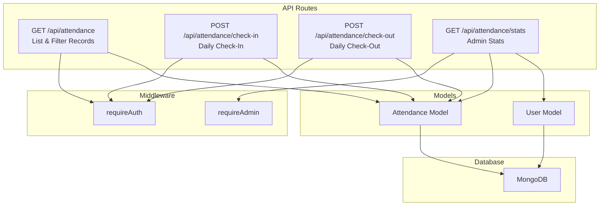
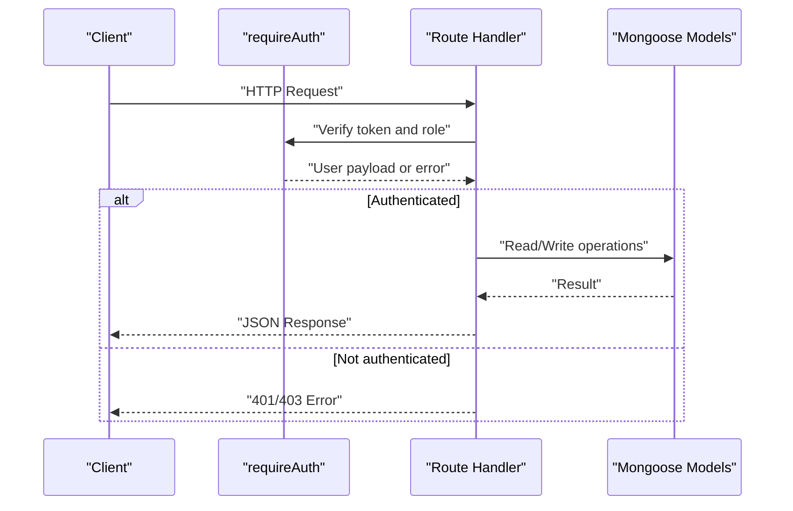
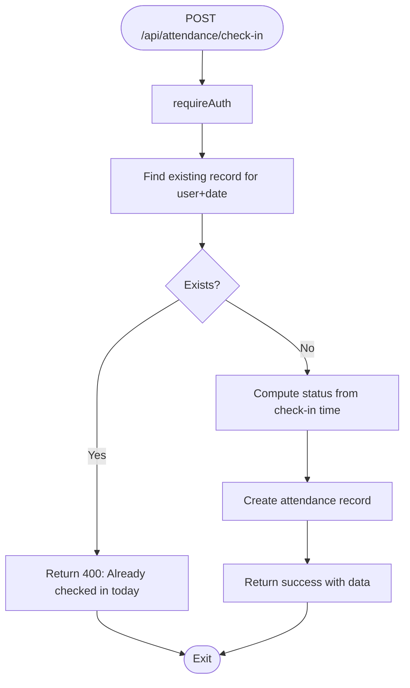
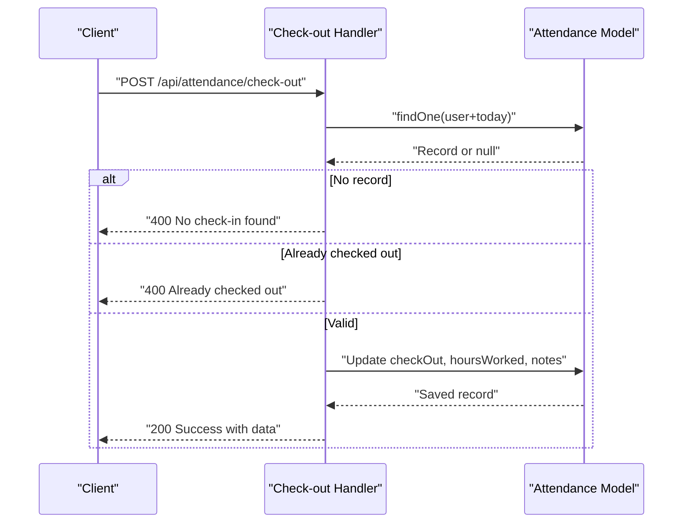
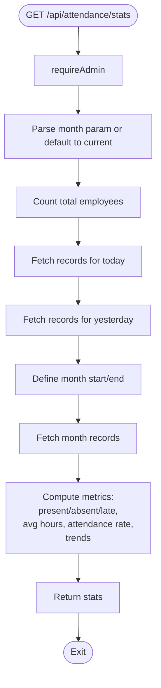
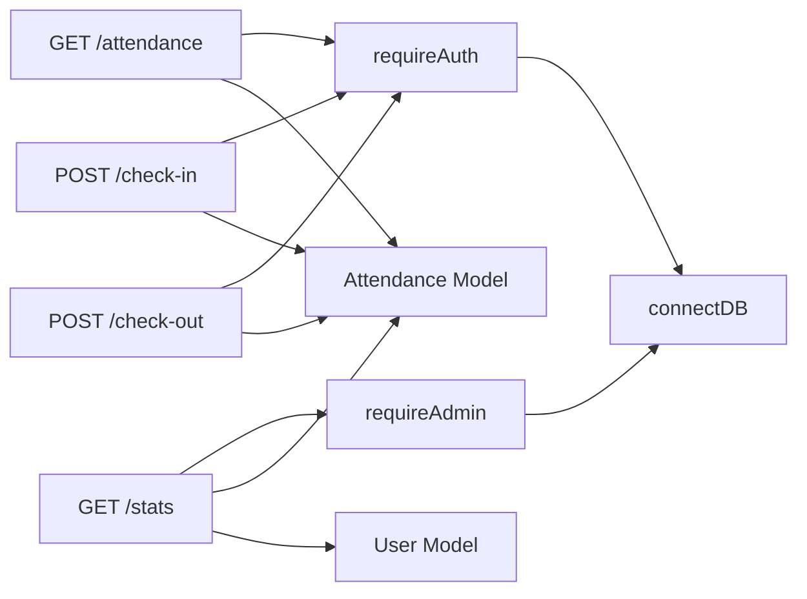

# Attendance Endpoints

<cite>
**Referenced Files in This Document**
- [route.ts](file://app/api/attendance/route.ts)
- [route.ts](file://app/api/attendance/check-in/route.ts)
- [route.ts](file://app/api/attendance/check-out/route.ts)
- [route.ts](file://app/api/attendance/stats/route.ts)
- [middleware-helpers.ts](file://lib/middleware-helpers.ts)
- [db.ts](file://lib/db.ts)
- [Attendance.ts](file://models/Attendance.ts)
- [User.ts](file://models/User.ts)
</cite>

## Table of Contents
1. [Introduction](#introduction)
2. [Project Structure](#project-structure)
3. [Core Components](#core-components)
4. [Architecture Overview](#architecture-overview)
5. [Detailed Component Analysis](#detailed-component-analysis)
6. [Dependency Analysis](#dependency-analysis)
7. [Performance Considerations](#performance-considerations)
8. [Troubleshooting Guide](#troubleshooting-guide)
9. [Conclusion](#conclusion)

## Introduction
This document provides comprehensive API documentation for the attendance management endpoints. It covers:
- Listing and creating attendance records via the main endpoint
- Check-in and check-out operations with validation and business rules
- Statistics endpoint for daily/weekly/monthly summaries and productivity metrics
- Request/response schemas, validation rules, error handling patterns, and integration examples for time tracking workflows

## Project Structure
The attendance module is organized under Next.js App Router conventions with route handlers for each endpoint and supporting models and middleware.

**Diagram sources**
- [route.ts:30-95](file://app/api/attendance/route.ts#L30-L95)
- [route.ts:7-78](file://app/api/attendance/check-in/route.ts#L7-L78)
- [route.ts:7-89](file://app/api/attendance/check-out/route.ts#L7-L89)
- [route.ts:8-114](file://app/api/attendance/stats/route.ts#L8-L114)
- [middleware-helpers.ts:32-80](file://lib/middleware-helpers.ts#L32-L80)
- [Attendance.ts:4-57](file://models/Attendance.ts#L4-L57)
- [User.ts:4-49](file://models/User.ts#L4-L49)

**Section sources**
- [route.ts:1-96](file://app/api/attendance/route.ts#L1-L96)
- [route.ts:1-79](file://app/api/attendance/check-in/route.ts#L1-L79)
- [route.ts:1-90](file://app/api/attendance/check-out/route.ts#L1-L90)
- [route.ts:1-131](file://app/api/attendance/stats/route.ts#L1-L131)
- [middleware-helpers.ts:1-81](file://lib/middleware-helpers.ts#L1-L81)
- [db.ts:1-54](file://lib/db.ts#L1-L54)
- [Attendance.ts:1-58](file://models/Attendance.ts#L1-L58)
- [User.ts:1-50](file://models/User.ts#L1-L50)

## Core Components
- Authentication and authorization middleware ensures only authenticated users can access endpoints, and admin privileges are required for statistics.
- Attendance and User models define the data schema and enforce uniqueness constraints for daily records.
- Route handlers implement the business logic for listing, checking in/out, and computing statistics.

**Section sources**
- [middleware-helpers.ts:32-80](file://lib/middleware-helpers.ts#L32-L80)
- [Attendance.ts:4-57](file://models/Attendance.ts#L4-L57)
- [User.ts:4-49](file://models/User.ts#L4-L49)

## Architecture Overview
The endpoints follow a layered architecture:
- HTTP layer: Next.js route handlers
- Authorization layer: Middleware helpers
- Persistence layer: MongoDB via Mongoose models
- Data consistency: Unique compound index on user+date prevents duplicate daily entries

**Diagram sources**
- [middleware-helpers.ts:32-80](file://lib/middleware-helpers.ts#L32-L80)
- [route.ts:10-14](file://app/api/attendance/check-in/route.ts#L10-L14)
- [route.ts:10-14](file://app/api/attendance/check-out/route.ts#L10-L14)
- [route.ts:34-37](file://app/api/attendance/route.ts#L34-L37)
- [route.ts:12-16](file://app/api/attendance/stats/route.ts#L12-L16)

## Detailed Component Analysis

### Main Attendance Endpoint
- Path: GET /api/attendance
- Purpose: List attendance records with optional pagination and monthly filtering
- Authentication: requireAuth
- Query parameters:
  - month: "YYYY-MM" for month-based filtering
  - page: integer, default 1
  - limit: integer, default 30
- Behavior:
  - Employees see only their own records
  - Admins see all records for the selected month
  - Results are paginated and include total count and page metadata
- Response shape:
  - records: array of attendance items with populated user info
  - total, page, totalPages

Validation and constraints:
- Month parsing enforces a start and end date for the given month
- Pagination computed via skip/limit
- Population of user fields (name, email, department)

Error handling:
- 500 Internal Server Error on database failures

**Section sources**
- [route.ts:30-95](file://app/api/attendance/route.ts#L30-L95)
- [middleware-helpers.ts:32-47](file://lib/middleware-helpers.ts#L32-L47)
- [Attendance.ts:43-50](file://models/Attendance.ts#L43-L50)

### Check-in Endpoint
- Path: POST /api/attendance/check-in
- Purpose: Record a check-in for the current day
- Authentication: requireAuth
- Body: Optional notes field
- Business rules:
  - Prevents duplicate check-ins per user per day (unique constraint enforced at DB level)
  - Determines status: "late" if after 9:00 AM, otherwise "present"
  - Uses current date in YYYY-MM-DD string format
- Response:
  - success flag
  - message
  - data: minimal attendance summary (id, date, checkIn, status)

Validation and constraints:
- JSON parse failure is handled gracefully (empty body allowed)
- Status derived from check-in time comparison

Error handling:
- 400 Already checked in today
- 500 Internal Server Error on failure

**Diagram sources**
- [route.ts:7-78](file://app/api/attendance/check-in/route.ts#L7-L78)
- [Attendance.ts:43-44](file://models/Attendance.ts#L43-L44)

**Section sources**
- [route.ts:7-78](file://app/api/attendance/check-in/route.ts#L7-L78)
- [middleware-helpers.ts:32-47](file://lib/middleware-helpers.ts#L32-L47)
- [Attendance.ts:4-57](file://models/Attendance.ts#L4-L57)

### Check-out Endpoint
- Path: POST /api/attendance/check-out
- Purpose: Record a check-out for the current day and compute worked hours
- Authentication: requireAuth
- Body: Optional notes field (appended to existing notes)
- Business rules:
  - Requires a prior check-in for the same day
  - Prevents multiple check-outs
  - Computes hoursWorked as difference between check-out and check-in (in hours, rounded to two decimals)
- Response:
  - success flag
  - message
  - data: full attendance summary including hoursWorked

Validation and constraints:
- JSON parse failure is handled gracefully (empty body allowed)
- Notes concatenation with separator if both old and new notes exist

Error handling:
- 400 No check-in found for today
- 400 Already checked out today
- 500 Internal Server Error on failure

**Diagram sources**
- [route.ts:7-89](file://app/api/attendance/check-out/route.ts#L7-L89)
- [Attendance.ts:4-57](file://models/Attendance.ts#L4-L57)

**Section sources**
- [route.ts:7-89](file://app/api/attendance/check-out/route.ts#L7-L89)
- [middleware-helpers.ts:32-47](file://lib/middleware-helpers.ts#L32-L47)
- [Attendance.ts:4-57](file://models/Attendance.ts#L4-L57)

### Statistics Endpoint
- Path: GET /api/attendance/stats
- Purpose: Provide administrative summaries for daily/weekly/monthly insights
- Authentication: requireAdmin
- Query parameters:
  - month: "YYYY-MM" (optional, defaults to current month)
- Metrics computed:
  - Total employees
  - Present/absent/late counts for today and yesterday (with trends)
  - Average hours worked this month
  - Attendance rate (present or late divided by expected working days)
  - Working days calculated by excluding weekends in the selected month
- Response:
  - totalEmployees
  - presentToday, absentToday, lateToday
  - avgHoursThisMonth
  - attendanceRate
  - totalLateThisMonth
  - presentTrend, lateTrend
  - month

Validation and constraints:
- Uses current date for "today" and calculates "yesterday"
- Calculates working days by iterating days in the month and excluding Sunday/Saturday

Error handling:
- 401/403 for missing/invalid auth/admin
- 500 Internal Server Error on failure

**Diagram sources**
- [route.ts:8-114](file://app/api/attendance/stats/route.ts#L8-L114)
- [route.ts:116-130](file://app/api/attendance/stats/route.ts#L116-L130)
- [User.ts:23-27](file://models/User.ts#L23-L27)
- [Attendance.ts:23-27](file://models/Attendance.ts#L23-L27)

**Section sources**
- [route.ts:8-114](file://app/api/attendance/stats/route.ts#L8-L114)
- [middleware-helpers.ts:54-80](file://lib/middleware-helpers.ts#L54-L80)
- [User.ts:23-27](file://models/User.ts#L23-L27)
- [Attendance.ts:23-27](file://models/Attendance.ts#L23-L27)

## Dependency Analysis
- Route handlers depend on:
  - Authentication middleware for user verification and role checks
  - Database connection helper for MongoDB connectivity
  - Mongoose models for data persistence and indexing
- Models define:
  - Compound index on userId+date to prevent duplicates
  - Separate indexes on date and userId for efficient queries
- No circular dependencies observed among the analyzed files.

**Diagram sources**
- [route.ts:30-95](file://app/api/attendance/route.ts#L30-L95)
- [route.ts:7-78](file://app/api/attendance/check-in/route.ts#L7-L78)
- [route.ts:7-89](file://app/api/attendance/check-out/route.ts#L7-L89)
- [route.ts:8-114](file://app/api/attendance/stats/route.ts#L8-L114)
- [middleware-helpers.ts:32-80](file://lib/middleware-helpers.ts#L32-L80)
- [db.ts:28-51](file://lib/db.ts#L28-L51)
- [Attendance.ts:43-50](file://models/Attendance.ts#L43-L50)
- [User.ts:43-44](file://models/User.ts#L43-L44)

**Section sources**
- [route.ts:1-96](file://app/api/attendance/route.ts#L1-L96)
- [route.ts:1-79](file://app/api/attendance/check-in/route.ts#L1-L79)
- [route.ts:1-90](file://app/api/attendance/check-out/route.ts#L1-L90)
- [route.ts:1-131](file://app/api/attendance/stats/route.ts#L1-L131)
- [middleware-helpers.ts:1-81](file://lib/middleware-helpers.ts#L1-L81)
- [db.ts:1-54](file://lib/db.ts#L1-L54)
- [Attendance.ts:1-58](file://models/Attendance.ts#L1-L58)
- [User.ts:1-50](file://models/User.ts#L1-L50)

## Performance Considerations
- Indexing:
  - Compound index on userId+date prevents duplicate daily entries and supports fast lookups
  - Separate indexes on date and userId optimize filtering and population queries
- Pagination:
  - Skip/limit pattern used for scalable listing
- Aggregation:
  - Statistics endpoint performs filtering and reduce operations client-side; consider database-side aggregation for very large datasets
- Network:
  - Single connection caching via the database helper reduces overhead

[No sources needed since this section provides general guidance]

## Troubleshooting Guide
Common issues and resolutions:
- Authentication errors:
  - 401 Authentication required: Missing or invalid token
  - 403 Admin access required: Non-admin user attempting to access stats
- Duplicate check-in:
  - 400 Already checked in today: Unique constraint prevents multiple check-ins per day
- Missing check-in:
  - 400 No check-in found for today: Attempting check-out without prior check-in
- Duplicate check-out:
  - 400 Already checked out today: Second check-out attempt in the same day
- Database connectivity:
  - 500 Internal Server Error: Connection or query failures; verify environment variables and connection helper

Operational tips:
- Ensure the token cookie is present for authenticated endpoints
- Confirm the month parameter format matches "YYYY-MM" for listing and stats
- For stats, verify admin credentials and that the requested month falls within available data

**Section sources**
- [middleware-helpers.ts:32-80](file://lib/middleware-helpers.ts#L32-L80)
- [route.ts:20-33](file://app/api/attendance/check-in/route.ts#L20-L33)
- [route.ts:20-43](file://app/api/attendance/check-out/route.ts#L20-L43)
- [route.ts:12-16](file://app/api/attendance/stats/route.ts#L12-L16)
- [db.ts:13-17](file://lib/db.ts#L13-L17)

## Conclusion
The attendance endpoints provide a robust foundation for time tracking with strong validation, clear error handling, and admin-focused analytics. The schema and middleware ensure secure and consistent operations, while indexing and pagination support scalability. Integrators should adhere to the documented request/response formats and handle the described error scenarios to build reliable time tracking workflows.