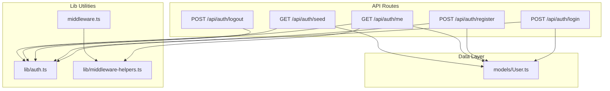
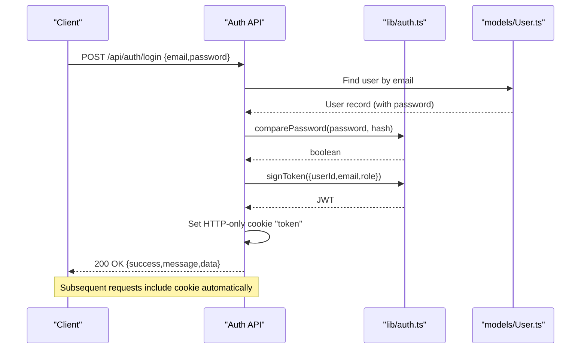
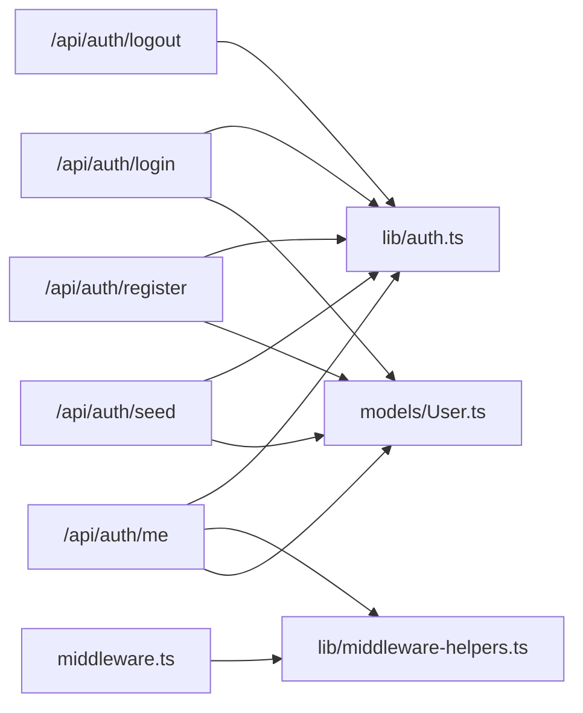

# Authentication Endpoints

<cite>
**Referenced Files in This Document**
- [login/route.ts](file://app/api/auth/login/route.ts)
- [register/route.ts](file://app/api/auth/register/route.ts)
- [logout/route.ts](file://app/api/auth/logout/route.ts)
- [me/route.ts](file://app/api/auth/me/route.ts)
- [seed/route.ts](file://app/api/auth/seed/route.ts)
- [auth.ts](file://lib/auth.ts)
- [middleware-helpers.ts](file://lib/middleware-helpers.ts)
- [middleware.ts](file://middleware.ts)
- [User.ts](file://models/User.ts)
</cite>

## Table of Contents
1. [Introduction](#introduction)
2. [Project Structure](#project-structure)
3. [Core Components](#core-components)
4. [Architecture Overview](#architecture-overview)
5. [Detailed Component Analysis](#detailed-component-analysis)
6. [Dependency Analysis](#dependency-analysis)
7. [Performance Considerations](#performance-considerations)
8. [Troubleshooting Guide](#troubleshooting-guide)
9. [Conclusion](#conclusion)

## Introduction
This document provides comprehensive API documentation for the authentication endpoints used by the attendance application. It covers the login, registration, logout, profile retrieval, and seed endpoints, including request/response schemas, validation rules, error handling, and security considerations such as cookie configuration and token expiration.

## Project Structure
The authentication endpoints are implemented as Next.js App Router API routes under the `/app/api/auth` directory. Supporting utilities for authentication and authorization are located in the `lib` directory, while the user model resides in `models`.

**Diagram sources**
- [login/route.ts:1-101](file://app/api/auth/login/route.ts#L1-L101)
- [register/route.ts:1-102](file://app/api/auth/register/route.ts#L1-L102)
- [logout/route.ts:1-30](file://app/api/auth/logout/route.ts#L1-L30)
- [me/route.ts:1-66](file://app/api/auth/me/route.ts#L1-L66)
- [seed/route.ts:1-66](file://app/api/auth/seed/route.ts#L1-L66)
- [auth.ts:1-50](file://lib/auth.ts#L1-L50)
- [middleware-helpers.ts:1-81](file://lib/middleware-helpers.ts#L1-L81)
- [middleware.ts:1-35](file://middleware.ts#L1-L35)
- [User.ts:1-50](file://models/User.ts#L1-L50)

**Section sources**
- [login/route.ts:1-101](file://app/api/auth/login/route.ts#L1-L101)
- [register/route.ts:1-102](file://app/api/auth/register/route.ts#L1-L102)
- [logout/route.ts:1-30](file://app/api/auth/logout/route.ts#L1-L30)
- [me/route.ts:1-66](file://app/api/auth/me/route.ts#L1-L66)
- [seed/route.ts:1-66](file://app/api/auth/seed/route.ts#L1-L66)
- [auth.ts:1-50](file://lib/auth.ts#L1-L50)
- [middleware-helpers.ts:1-81](file://lib/middleware-helpers.ts#L1-L81)
- [middleware.ts:1-35](file://middleware.ts#L1-L35)
- [User.ts:1-50](file://models/User.ts#L1-L50)

## Core Components
- Authentication utilities: password hashing/verification, JWT signing/verification.
- Middleware helpers: extracting and validating tokens from cookies, enforcing authentication and admin roles.
- Route handlers: implementing login, registration, logout, profile retrieval, and seeding logic.
- User model: Mongoose schema defining user fields, validation, and indexes.

Key responsibilities:
- lib/auth.ts: cryptographic operations and token lifecycle.
- lib/middleware-helpers.ts: cookie-based token extraction and role checks.
- app/api/auth/*: API endpoints handling requests, validation, persistence, and responses.
- models/User.ts: data definition and constraints.

**Section sources**
- [auth.ts:1-50](file://lib/auth.ts#L1-L50)
- [middleware-helpers.ts:1-81](file://lib/middleware-helpers.ts#L1-L81)
- [User.ts:1-50](file://models/User.ts#L1-L50)

## Architecture Overview
The authentication system uses HTTP-only cookies to store JWT tokens. On successful login, the server signs a JWT containing user identity and role, then sets it as an HTTP-only cookie. Subsequent authenticated requests rely on the presence of this cookie. Role-based access control is enforced via middleware and route-level checks.

**Diagram sources**
- [login/route.ts:1-101](file://app/api/auth/login/route.ts#L1-L101)
- [auth.ts:1-50](file://lib/auth.ts#L1-L50)
- [User.ts:1-50](file://models/User.ts#L1-L50)

## Detailed Component Analysis

### Login Endpoint
- Method: POST
- Path: /api/auth/login
- Purpose: Authenticate a user and set an HTTP-only JWT cookie.

Request Body Schema
- email: string, required
- password: string, required

Validation Rules
- Both email and password are required.
- Email must exist in the database.
- Password must match the stored hash.

Response Format
- Success: 200 OK with data containing user profile excluding sensitive fields.
- Errors: 400 Bad Request (missing fields), 401 Unauthorized (invalid credentials), 500 Internal Server Error.

Cookie Configuration
- Name: token
- Attributes: httpOnly, secure (in production), sameSite lax, maxAge 604800 seconds (7 days), path /

Security Considerations
- Token stored in HTTP-only cookie prevents client-side script access.
- SameSite lax balances CSRF protection with usability.
- Secure flag ensures transmission over HTTPS in production.

Example Requests and Responses
- Request: POST /api/auth/login with JSON body containing email and password.
- Successful Response: 200 OK with success flag, message, and user data.
- Error Responses:
  - 400 Bad Request when fields are missing.
  - 401 Unauthorized when credentials are invalid.
  - 500 Internal Server Error for unexpected failures.

**Section sources**
- [login/route.ts:1-101](file://app/api/auth/login/route.ts#L1-L101)
- [auth.ts:1-50](file://lib/auth.ts#L1-L50)
- [User.ts:1-50](file://models/User.ts#L1-L50)

### Registration Endpoint
- Method: POST
- Path: /api/auth/register
- Purpose: Create a new user account.

Request Body Schema
- name: string, required
- email: string, required
- password: string, required
- role: string, optional (defaults to employee)
- department: string, optional

Validation Rules
- Required fields: name, email, password.
- Email format validation.
- Password minimum length validation.
- Unique email constraint enforced by database.

Response Format
- Success: 201 Created with created user data.
- Errors: 400 Bad Request (validation failures), 409 Conflict (duplicate email), 500 Internal Server Error.

Example Requests and Responses
- Request: POST /api/auth/register with JSON body containing name, email, password, optional role and department.
- Successful Response: 201 Created with success flag and user data.
- Error Responses:
  - 400 Bad Request for invalid input.
  - 409 Conflict if email already exists.
  - 500 Internal Server Error for unexpected failures.

**Section sources**
- [register/route.ts:1-102](file://app/api/auth/register/route.ts#L1-L102)
- [auth.ts:1-50](file://lib/auth.ts#L1-L50)
- [User.ts:1-50](file://models/User.ts#L1-L50)

### Logout Endpoint
- Method: POST
- Path: /api/auth/logout
- Purpose: Clear the authentication cookie to end the session.

Behavior
- Deletes the "token" cookie.
- Returns success regardless of whether a cookie was present.

Response Format
- Success: 200 OK with success flag and message.
- Errors: 500 Internal Server Error for unexpected failures.

Example Requests and Responses
- Request: POST /api/auth/logout.
- Response: 200 OK with success flag and message.

**Section sources**
- [logout/route.ts:1-30](file://app/api/auth/logout/route.ts#L1-L30)

### Profile Endpoint
- Method: GET
- Path: /api/auth/me
- Purpose: Retrieve the authenticated user's profile.

Authentication Requirements
- Requires a valid "token" cookie.
- The middleware enforces token presence for protected routes; the API route re-validates via JWT verification.

Behavior
- Extracts token from cookie, verifies it, and loads user data by ID.
- Excludes sensitive fields from the response.

Response Format
- Success: 200 OK with user data.
- Errors: 401 Unauthorized (no/invalid token), 404 Not Found (user deleted), 500 Internal Server Error.

Example Requests and Responses
- Request: GET /api/auth/me with Authorization header or cookie as applicable.
- Response: 200 OK with success flag and user data.
- Error Responses:
  - 401 Unauthorized when not authenticated.
  - 404 Not Found if user no longer exists.
  - 500 Internal Server Error for unexpected failures.

**Section sources**
- [me/route.ts:1-66](file://app/api/auth/me/route.ts#L1-L66)
- [middleware-helpers.ts:1-81](file://lib/middleware-helpers.ts#L1-L81)
- [User.ts:1-50](file://models/User.ts#L1-L50)

### Seed Endpoint
- Method: GET
- Path: /api/auth/seed
- Purpose: Initialize the database with a default admin user if none exists.

Behavior
- Checks for existing admin user.
- Creates a default admin user with predefined credentials and role.
- Returns created user data with a note about changing the default password.

Response Format
- Success: 201 Created with created user data and informational note.
- Errors: 409 Conflict (admin already exists), 500 Internal Server Error.

Example Requests and Responses
- Request: GET /api/auth/seed.
- Response: 201 Created with success flag, message, and user data including a note.
- Error Responses:
  - 409 Conflict if admin user already exists.
  - 500 Internal Server Error for unexpected failures.

**Section sources**
- [seed/route.ts:1-66](file://app/api/auth/seed/route.ts#L1-L66)
- [auth.ts:1-50](file://lib/auth.ts#L1-L50)
- [User.ts:1-50](file://models/User.ts#L1-L50)

## Dependency Analysis
The authentication endpoints depend on shared utilities and the user model. The middleware provides coarse-grained protection, while route-level logic performs fine-grained validation and authorization.

**Diagram sources**
- [login/route.ts:1-101](file://app/api/auth/login/route.ts#L1-L101)
- [register/route.ts:1-102](file://app/api/auth/register/route.ts#L1-L102)
- [logout/route.ts:1-30](file://app/api/auth/logout/route.ts#L1-L30)
- [me/route.ts:1-66](file://app/api/auth/me/route.ts#L1-L66)
- [seed/route.ts:1-66](file://app/api/auth/seed/route.ts#L1-L66)
- [auth.ts:1-50](file://lib/auth.ts#L1-L50)
- [middleware-helpers.ts:1-81](file://lib/middleware-helpers.ts#L1-L81)
- [middleware.ts:1-35](file://middleware.ts#L1-L35)
- [User.ts:1-50](file://models/User.ts#L1-L50)

**Section sources**
- [login/route.ts:1-101](file://app/api/auth/login/route.ts#L1-L101)
- [register/route.ts:1-102](file://app/api/auth/register/route.ts#L1-L102)
- [logout/route.ts:1-30](file://app/api/auth/logout/route.ts#L1-L30)
- [me/route.ts:1-66](file://app/api/auth/me/route.ts#L1-L66)
- [seed/route.ts:1-66](file://app/api/auth/seed/route.ts#L1-L66)
- [auth.ts:1-50](file://lib/auth.ts#L1-L50)
- [middleware-helpers.ts:1-81](file://lib/middleware-helpers.ts#L1-L81)
- [middleware.ts:1-35](file://middleware.ts#L1-L35)
- [User.ts:1-50](file://models/User.ts#L1-L50)

## Performance Considerations
- Password hashing uses bcrypt with 12 rounds; acceptable for most applications but consider adjusting cost based on hardware and latency requirements.
- JWT expiry is 7 days; balance convenience against security by evaluating shorter expirations and refresh token strategies if needed.
- Database queries use indexed email lookups for efficient user retrieval.
- Cookie attributes are optimized for security and cross-environment compatibility.

## Troubleshooting Guide
Common Issues and Resolutions
- Missing JWT_SECRET environment variable: The authentication library throws an error if the secret is not configured. Ensure the environment variable is set.
- Invalid or expired token: The profile endpoint returns 401 if the token is missing, invalid, or cannot be verified.
- Duplicate email during registration: Returns 409 Conflict; resolve by using a unique email.
- No user found: The profile endpoint returns 404 if the user no longer exists in the database.
- Database connectivity errors: All endpoints return 500 Internal Server Error on exceptions; check connection configuration and logs.

Operational Notes
- The middleware redirects unauthenticated users to the login page with a redirect parameter.
- The seed endpoint prevents duplicate admin creation and provides a clear message when seeding is not required.

**Section sources**
- [auth.ts:1-50](file://lib/auth.ts#L1-L50)
- [middleware.ts:1-35](file://middleware.ts#L1-L35)
- [me/route.ts:1-66](file://app/api/auth/me/route.ts#L1-L66)
- [register/route.ts:1-102](file://app/api/auth/register/route.ts#L1-L102)
- [seed/route.ts:1-66](file://app/api/auth/seed/route.ts#L1-L66)

## Conclusion
The authentication endpoints provide a secure, cookie-based session mechanism using HTTP-only JWT tokens. They enforce strong validation, handle common error scenarios gracefully, and integrate with middleware for route-level protection. The seed endpoint simplifies initial setup, while the profile endpoint enables authenticated user access. For production deployments, ensure proper environment configuration, monitor token lifetimes, and review security policies regularly.