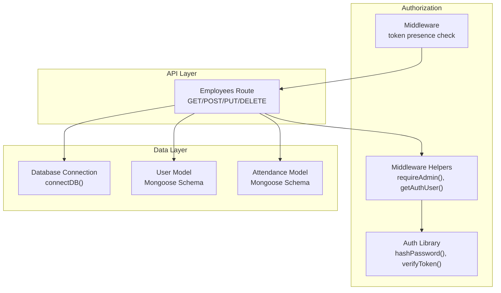
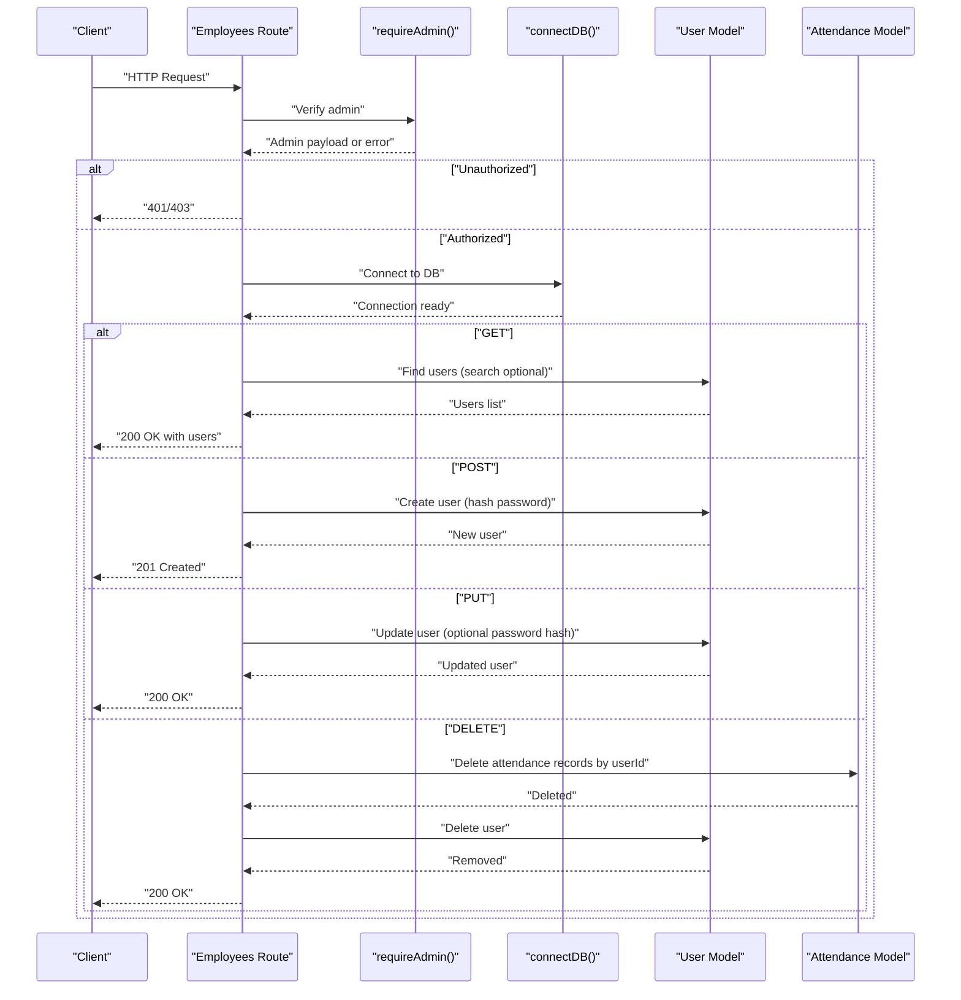
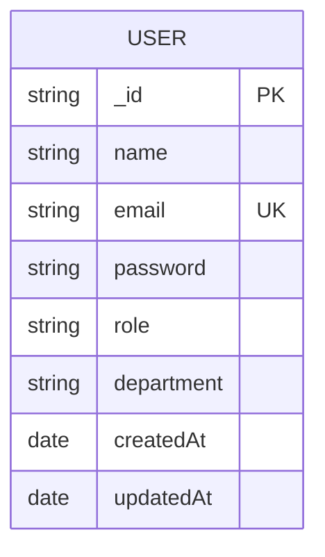
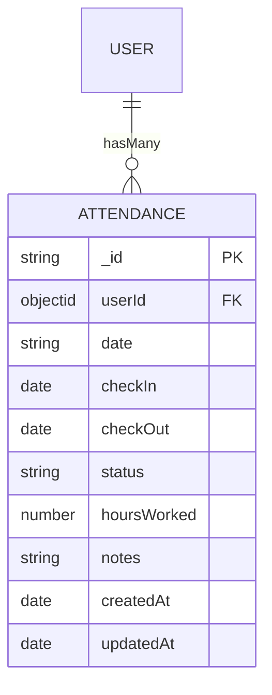
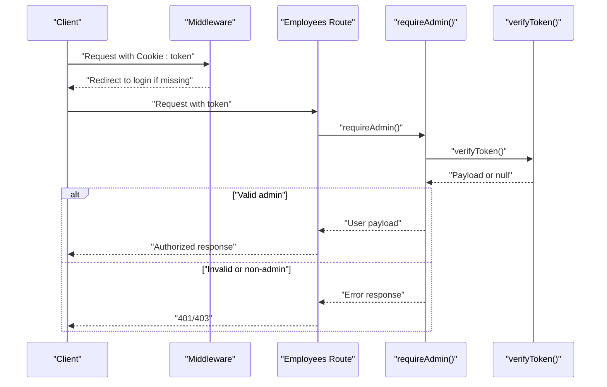
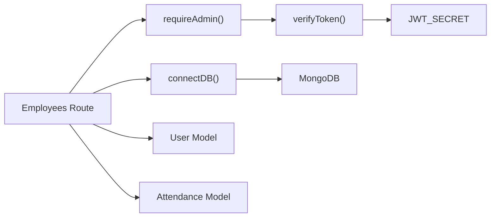

# User Management Endpoints

<cite>
**Referenced Files in This Document**
- [route.ts](file://app/api/employees/route.ts)
- [User.ts](file://models/User.ts)
- [Attendance.ts](file://models/Attendance.ts)
- [middleware-helpers.ts](file://lib/middleware-helpers.ts)
- [auth.ts](file://lib/auth.ts)
- [db.ts](file://lib/db.ts)
- [middleware.ts](file://middleware.ts)
</cite>

## Table of Contents
1. [Introduction](#introduction)
2. [Project Structure](#project-structure)
3. [Core Components](#core-components)
4. [Architecture Overview](#architecture-overview)
5. [Detailed Component Analysis](#detailed-component-analysis)
6. [Dependency Analysis](#dependency-analysis)
7. [Performance Considerations](#performance-considerations)
8. [Troubleshooting Guide](#troubleshooting-guide)
9. [Conclusion](#conclusion)

## Introduction
This document provides comprehensive API documentation for user management endpoints focused on employees. It covers listing employees with search capabilities, creating new employees with role-based access control, retrieving individual employee profiles, updating employee information, and deleting employees with cascade handling for related attendance records. The documentation includes request/response schemas, authorization requirements, validation rules, error handling, and practical administrative workflows for HR management.

## Project Structure
The user management functionality is implemented as a Next.js App Router API route under `/api/employees`. It integrates with MongoDB via Mongoose models for Users and Attendance, uses JWT-based authentication, and enforces admin-only access for sensitive operations.

**Diagram sources**
- [route.ts:1-311](file://app/api/employees/route.ts#L1-L311)
- [middleware-helpers.ts:1-81](file://lib/middleware-helpers.ts#L1-L81)
- [auth.ts:1-50](file://lib/auth.ts#L1-L50)
- [db.ts:1-54](file://lib/db.ts#L1-L54)
- [User.ts:1-50](file://models/User.ts#L1-L50)
- [Attendance.ts:1-58](file://models/Attendance.ts#L1-L58)
- [middleware.ts:1-35](file://middleware.ts#L1-L35)

**Section sources**
- [route.ts:1-311](file://app/api/employees/route.ts#L1-L311)
- [User.ts:1-50](file://models/User.ts#L1-L50)
- [Attendance.ts:1-58](file://models/Attendance.ts#L1-L58)
- [middleware-helpers.ts:1-81](file://lib/middleware-helpers.ts#L1-L81)
- [auth.ts:1-50](file://lib/auth.ts#L1-L50)
- [db.ts:1-54](file://lib/db.ts#L1-L54)
- [middleware.ts:1-35](file://middleware.ts#L1-L35)

## Core Components
- Employees API Route: Implements GET (list/search), POST (create), PUT (update), and DELETE (remove with cascade) for employees.
- Authorization Helpers: Provides admin-only enforcement and JWT verification.
- Authentication Utilities: Handles password hashing and token signing/verification.
- Database Connection: Manages MongoDB connection with caching.
- User Model: Defines the User schema, roles, and indexes.
- Attendance Model: Defines the Attendance schema and indexes used for cascade deletion.

Key responsibilities:
- Enforce admin-only access for all employee operations.
- Validate input and prevent duplicate emails.
- Hash passwords before persisting.
- Cascade delete related attendance records upon employee removal.

**Section sources**
- [route.ts:1-311](file://app/api/employees/route.ts#L1-L311)
- [middleware-helpers.ts:54-80](file://lib/middleware-helpers.ts#L54-L80)
- [auth.ts:16-49](file://lib/auth.ts#L16-L49)
- [db.ts:28-51](file://lib/db.ts#L28-L51)
- [User.ts:4-41](file://models/User.ts#L4-L41)
- [Attendance.ts:4-41](file://models/Attendance.ts#L4-L41)

## Architecture Overview
The employees API follows a layered architecture:
- HTTP handlers (Next.js route handlers) orchestrate requests.
- Authorization middleware ensures only admins can modify users.
- Database layer persists and retrieves data via Mongoose models.
- Password hashing and token verification are handled by dedicated libraries.

**Diagram sources**
- [route.ts:10-311](file://app/api/employees/route.ts#L10-L311)
- [middleware-helpers.ts:54-80](file://lib/middleware-helpers.ts#L54-L80)
- [db.ts:28-51](file://lib/db.ts#L28-L51)
- [User.ts:4-41](file://models/User.ts#L4-L41)
- [Attendance.ts:4-41](file://models/Attendance.ts#L4-L41)

## Detailed Component Analysis

### Endpoint: GET /api/employees
Purpose: List all employees with optional search by name or email.

Behavior:
- Requires admin access.
- Supports a query parameter `search` to filter by name or email (case-insensitive regex).
- Returns all users excluding the password field, sorted by name.

Request
- Method: GET
- URL: /api/employees
- Query Parameters:
  - search: string (optional)
- Headers:
  - Cookie: token=<JWT>
- Response Codes:
  - 200: Success with array of user objects
  - 401: Unauthorized if missing/invalid token
  - 403: Forbidden if not admin
  - 500: Internal server error

Response Schema (success):
- success: boolean
- data: Array of user objects
  - _id: string
  - name: string
  - email: string
  - role: "admin" | "employee"
  - department: string
  - createdAt: string (ISO date)

Example Request
- GET /api/employees?search=john

Example Response
- 200: [{ "_id": "...", "name": "John Doe", "email": "john@example.com", "role": "employee", "department": "", "createdAt": "2024-01-01T00:00:00Z" }]

**Section sources**
- [route.ts:10-60](file://app/api/employees/route.ts#L10-L60)
- [middleware-helpers.ts:54-80](file://lib/middleware-helpers.ts#L54-L80)
- [User.ts:4-41](file://models/User.ts#L4-L41)

### Endpoint: POST /api/employees (Create Employee)
Purpose: Add a new employee with role-based access control.

Behavior:
- Requires admin access.
- Validates presence of name, email, and password.
- Checks for duplicate email (case-insensitive).
- Hashes the password before saving.
- Defaults role to "employee" if not provided; defaults department to empty string.

Request
- Method: POST
- URL: /api/employees
- Headers:
  - Cookie: token=<JWT>
  - Content-Type: application/json
- Body Fields:
  - name: string (required)
  - email: string (required)
  - password: string (required)
  - role: "admin" | "employee" (optional)
  - department: string (optional)
- Response Codes:
  - 201: Created with user object
  - 400: Bad request (missing fields)
  - 401: Unauthorized
  - 403: Forbidden (non-admin)
  - 409: Conflict (email exists)
  - 500: Internal server error

Response Schema (success):
- success: boolean
- message: string
- data: user object (same as GET response)

Validation Rules:
- name: required, trimmed
- email: required, unique, lowercase, trimmed
- password: required
- role: enum ["admin", "employee"], default "employee"
- department: optional, trimmed, default ""

Error Handling:
- Duplicate email: 409 with error message
- Missing required fields: 400 with error message
- Admin-only operations: 401/403 when unauthorized

Example Request
- POST /api/employees
- Body: { "name": "Jane Smith", "email": "jane@example.com", "password": "SecurePass!2024", "role": "employee", "department": "Engineering" }

Example Response
- 201: { "success": true, "message": "Employee created successfully", "data": { "_id": "...", "name": "Jane Smith", "email": "jane@example.com", "role": "employee", "department": "Engineering", "createdAt": "..." } }

**Section sources**
- [route.ts:62-141](file://app/api/employees/route.ts#L62-L141)
- [middleware-helpers.ts:54-80](file://lib/middleware-helpers.ts#L54-L80)
- [auth.ts:16-18](file://lib/auth.ts#L16-L18)
- [User.ts:4-41](file://models/User.ts#L4-L41)

### Endpoint: PUT /api/employees (Update Employee)
Purpose: Modify an existing employee’s profile, role, department, or password.

Behavior:
- Requires admin access.
- Requires a valid user ID in the request body.
- Finds the user by ID; returns 404 if not found.
- Prevents changing to an existing email (case-insensitive).
- Updates provided fields: name, email, role, department.
- Optionally updates password by hashing if provided.
- Returns the updated user object without password.

Request
- Method: PUT
- URL: /api/employees
- Headers:
  - Cookie: token=<JWT>
  - Content-Type: application/json
- Body Fields:
  - id: string (required)
  - name: string (optional)
  - email: string (optional)
  - role: "admin" | "employee" (optional)
  - department: string (optional)
  - password: string (optional)
- Response Codes:
  - 200: OK with updated user object
  - 400: Bad request (missing ID)
  - 401: Unauthorized
  - 403: Forbidden (non-admin)
  - 404: Not found (user does not exist)
  - 409: Conflict (email taken)
  - 500: Internal server error

Response Schema (success):
- success: boolean
- message: string
- data: user object (same as GET response)

Validation Rules:
- id: required
- email uniqueness enforced when changed
- role enum ["admin", "employee"]

Example Request
- PUT /api/employees
- Body: { "id": "...", "department": "HR", "password": "NewPass!2024" }

Example Response
- 200: { "success": true, "message": "Employee updated successfully", "data": { "_id": "...", "name": "Jane Smith", "email": "jane@example.com", "role": "employee", "department": "HR", "createdAt": "..." } }

**Section sources**
- [route.ts:143-236](file://app/api/employees/route.ts#L143-L236)
- [middleware-helpers.ts:54-80](file://lib/middleware-helpers.ts#L54-L80)
- [auth.ts:16-18](file://lib/auth.ts#L16-L18)
- [User.ts:23-27](file://models/User.ts#L23-L27)

### Endpoint: DELETE /api/employees (Delete Employee)
Purpose: Remove an employee and all related attendance records.

Behavior:
- Requires admin access.
- Accepts the user ID via query parameter (?id=...) or JSON body (id).
- Returns 400 if ID is missing.
- Returns 404 if user does not exist.
- Cascades by deleting all Attendance records linked to the user ID.
- Deletes the user after cascading.

Request
- Method: DELETE
- URL: /api/employees?id=...
- Headers:
  - Cookie: token=<JWT>
- Query Parameters:
  - id: string (required)
- Response Codes:
  - 200: OK with success message
  - 400: Bad request (missing ID)
  - 401: Unauthorized
  - 403: Forbidden (non-admin)
  - 404: Not found (user does not exist)
  - 500: Internal server error

Response Schema (success):
- success: boolean
- message: string

Cascade Behavior:
- All Attendance documents with userId equal to the deleted user are removed before removing the user.

Example Request
- DELETE /api/employees?id=...

Example Response
- 200: { "success": true, "message": "Employee and associated attendance records deleted successfully" }

**Section sources**
- [route.ts:238-311](file://app/api/employees/route.ts#L238-L311)
- [middleware-helpers.ts:54-80](file://lib/middleware-helpers.ts#L54-L80)
- [Attendance.ts:6-9](file://models/Attendance.ts#L6-L9)

### Data Models and Schemas

#### User Model
Fields:
- name: string, required, trimmed
- email: string, required, unique, lowercase, trimmed
- password: string, required, hidden by default in queries
- role: enum ["admin", "employee"], default "employee"
- department: string, optional, trimmed, default ""
- createdAt: date (managed by timestamps)

Indexes:
- Unique index on email for fast lookup and uniqueness.

**Diagram sources**
- [User.ts:4-41](file://models/User.ts#L4-L41)

**Section sources**
- [User.ts:4-41](file://models/User.ts#L4-L41)

#### Attendance Model
Fields:
- userId: ObjectId referencing User, required
- date: string (YYYY-MM-DD), required
- checkIn: date, required
- checkOut: date, nullable
- status: enum ["present", "absent", "late"], default "present"
- hoursWorked: number, default 0
- notes: string, optional, trimmed

Indexes:
- Compound unique index on (userId, date)
- Single indexes on date and userId for efficient queries

**Diagram sources**
- [Attendance.ts:4-58](file://models/Attendance.ts#L4-L58)
- [User.ts:4-41](file://models/User.ts#L4-L41)

**Section sources**
- [Attendance.ts:4-58](file://models/Attendance.ts#L4-L58)

### Authorization and Authentication
- Token Storage: JWT stored in a cookie named "token".
- Middleware Protection: Basic presence check for token on protected routes.
- API-Level Verification: Admin-only enforcement via requireAdmin() which verifies the token and checks role.
- Password Security: bcrypt hashing with 12 rounds; tokens signed with 7-day expiry.

**Diagram sources**
- [middleware.ts:13-29](file://middleware.ts#L13-L29)
- [middleware-helpers.ts:54-80](file://lib/middleware-helpers.ts#L54-L80)
- [auth.ts:42-49](file://lib/auth.ts#L42-L49)

**Section sources**
- [middleware.ts:13-29](file://middleware.ts#L13-L29)
- [middleware-helpers.ts:54-80](file://lib/middleware-helpers.ts#L54-L80)
- [auth.ts:42-49](file://lib/auth.ts#L42-L49)

## Dependency Analysis
The employees API depends on:
- Authorization helpers for admin enforcement
- Database connection for persistence
- User and Attendance models for data operations
- Auth utilities for password hashing and token verification

**Diagram sources**
- [route.ts:1-311](file://app/api/employees/route.ts#L1-L311)
- [middleware-helpers.ts:54-80](file://lib/middleware-helpers.ts#L54-L80)
- [auth.ts:5-11](file://lib/auth.ts#L5-L11)
- [db.ts:11-17](file://lib/db.ts#L11-L17)

**Section sources**
- [route.ts:1-311](file://app/api/employees/route.ts#L1-L311)
- [middleware-helpers.ts:54-80](file://lib/middleware-helpers.ts#L54-L80)
- [auth.ts:5-11](file://lib/auth.ts#L5-L11)
- [db.ts:11-17](file://lib/db.ts#L11-L17)

## Performance Considerations
- Database Connection Caching: The connection utility caches the Mongoose connection to avoid reconnect overhead.
- Email Indexing: The User model has a unique index on email to speed up duplicate checks and lookups.
- Attendance Indexing: Compound index on (userId, date) prevents duplicate daily entries and speeds up queries; separate indexes on date and userId optimize range and join-like queries.
- Query Efficiency: The GET endpoint excludes password fields and sorts by name for predictable ordering.

Recommendations:
- Use pagination for large datasets if search scope grows significantly.
- Monitor query plans for complex filters and consider adding targeted indexes if needed.
- Keep JWT_SECRET secure and rotate periodically.

**Section sources**
- [db.ts:28-51](file://lib/db.ts#L28-L51)
- [User.ts:43-44](file://models/User.ts#L43-L44)
- [Attendance.ts:43-50](file://models/Attendance.ts#L43-L50)

## Troubleshooting Guide
Common Issues and Resolutions:
- 401 Unauthorized
  - Cause: Missing or invalid token cookie.
  - Resolution: Ensure client stores a valid "token" cookie from authentication flow.
- 403 Forbidden
  - Cause: Non-admin user attempting admin-only operation.
  - Resolution: Authenticate as an admin user.
- 400 Bad Request
  - Cause: Missing required fields (name, email, password) for creation; missing ID for update/delete.
  - Resolution: Include all required fields in the request body.
- 404 Not Found
  - Cause: Attempting to update or delete a user that does not exist.
  - Resolution: Verify the user ID is correct.
- 409 Conflict (Email Exists)
  - Cause: Duplicate email during creation or update.
  - Resolution: Use a unique email address.
- 500 Internal Server Error
  - Cause: Unexpected server-side failure.
  - Resolution: Check server logs for stack traces; ensure environment variables are set.

Operational Tips:
- Use the GET endpoint with the search parameter to locate users before performing updates or deletions.
- For bulk operations, iterate with caution and handle errors per record.
- When deleting, confirm cascade behavior removes all attendance records for the user.

**Section sources**
- [route.ts:50-59](file://app/api/employees/route.ts#L50-L59)
- [route.ts:78-87](file://app/api/employees/route.ts#L78-L87)
- [route.ts:159-167](file://app/api/employees/route.ts#L159-L167)
- [route.ts:265-273](file://app/api/employees/route.ts#L265-L273)
- [route.ts:89-99](file://app/api/employees/route.ts#L89-L99)
- [route.ts:181-193](file://app/api/employees/route.ts#L181-L193)
- [route.ts:300-309](file://app/api/employees/route.ts#L300-L309)

## Conclusion
The employees API provides a robust foundation for HR management with strong security controls, clear validation, and predictable data handling. Admin-only operations protect sensitive user data, while cascading deletes ensure referential integrity for attendance records. By following the documented schemas, authorization requirements, and validation rules, administrators can efficiently manage employee profiles and maintain accurate attendance data.