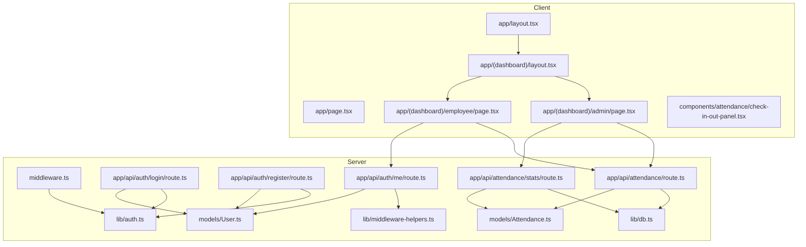
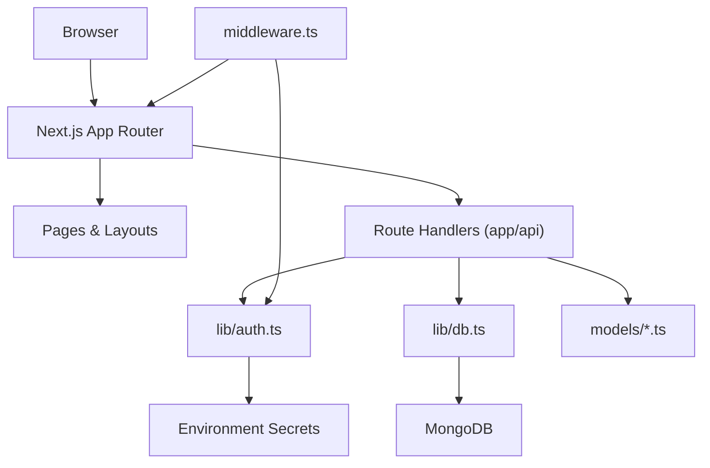
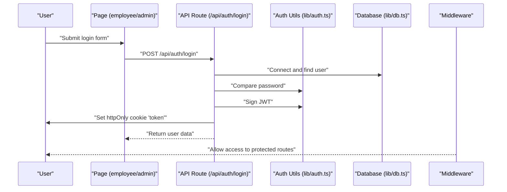
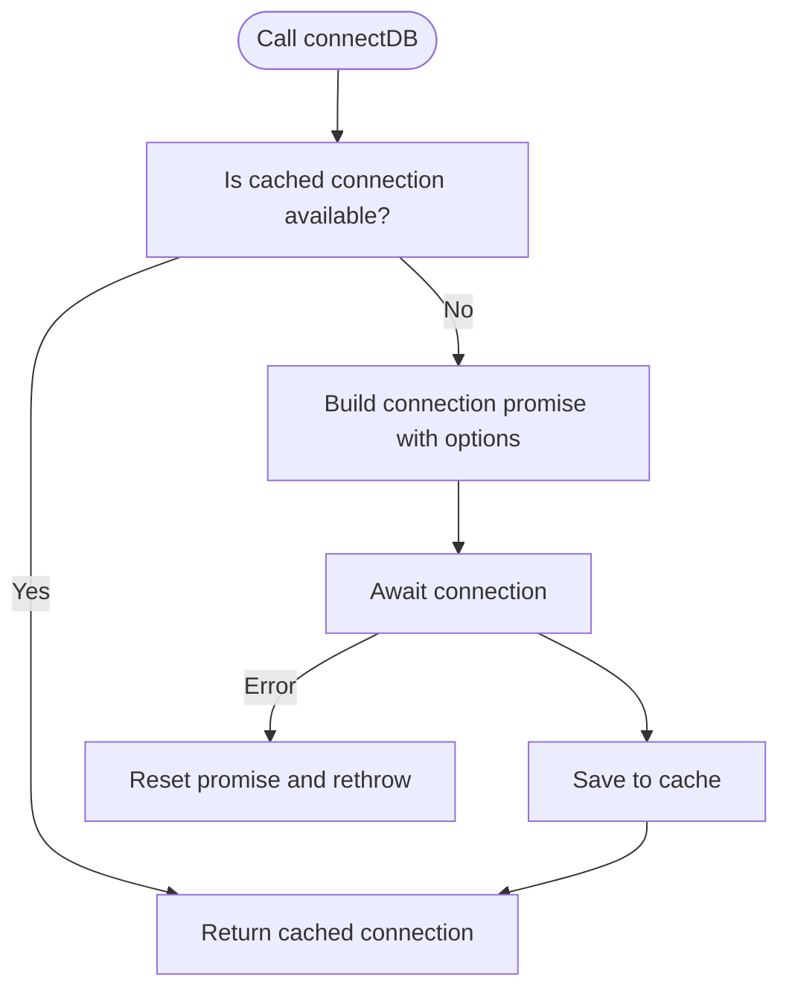
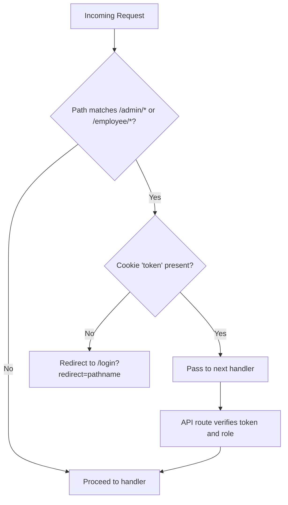
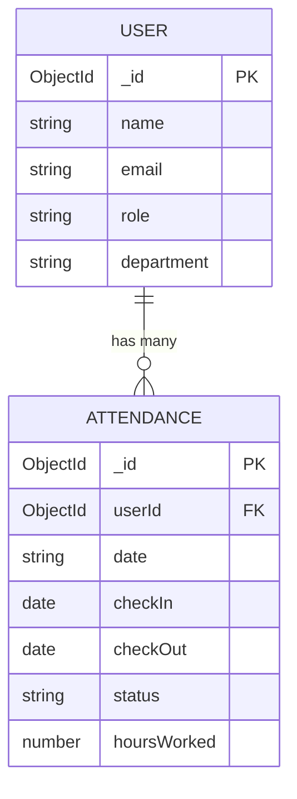
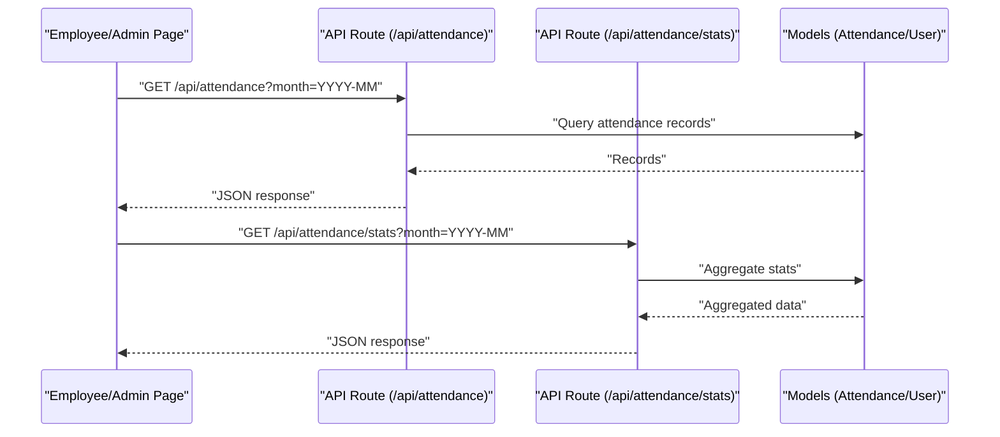
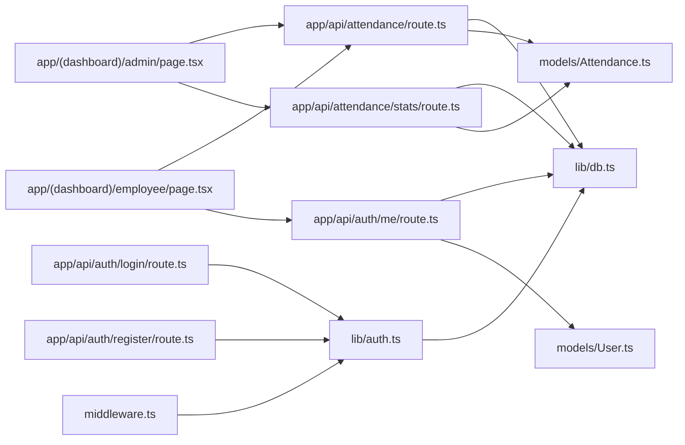

# Architecture Overview

<cite>
**Referenced Files in This Document**
- [README.md](file://README.md)
- [app/layout.tsx](file://app/layout.tsx)
- [app/page.tsx](file://app/page.tsx)
- [middleware.ts](file://middleware.ts)
- [lib/auth.ts](file://lib/auth.ts)
- [lib/db.ts](file://lib/db.ts)
- [lib/middleware-helpers.ts](file://lib/middleware-helpers.ts)
- [lib/utils.ts](file://lib/utils.ts)
- [models/User.ts](file://models/User.ts)
- [models/Attendance.ts](file://models/Attendance.ts)
- [app/api/auth/login/route.ts](file://app/api/auth/login/route.ts)
- [app/api/auth/register/route.ts](file://app/api/auth/register/route.ts)
- [app/api/auth/me/route.ts](file://app/api/auth/me/route.ts)
- [app/api/attendance/route.ts](file://app/api/attendance/route.ts)
- [app/api/attendance/stats/route.ts](file://app/api/attendance/stats/route.ts)
- [app/(dashboard)/layout.tsx](file://app/(dashboard)/layout.tsx)
- [app/(dashboard)/admin/page.tsx](file://app/(dashboard)/admin/page.tsx)
- [app/(dashboard)/employee/page.tsx](file://app/(dashboard)/employee/page.tsx)
- [components/attendance/check-in-out-panel.tsx](file://components/attendance/check-in-out-panel.tsx)
</cite>

## Table of Contents
1. [Introduction](#introduction)
2. [Project Structure](#project-structure)
3. [Core Components](#core-components)
4. [Architecture Overview](#architecture-overview)
5. [Detailed Component Analysis](#detailed-component-analysis)
6. [Dependency Analysis](#dependency-analysis)
7. [Performance Considerations](#performance-considerations)
8. [Troubleshooting Guide](#troubleshooting-guide)
9. [Conclusion](#conclusion)

## Introduction
This document describes the architecture of the Attendance Management System built with Next.js App Router. It covers high-level design patterns, system boundaries, component interactions, authentication and session management, database connectivity, role-based access control, and data flow. The system separates public routes (login, register, home) from protected dashboards for admin and employees, enforcing route protection via middleware and validating tokens in API routes.

## Project Structure
The project follows Next.js App Router conventions with:
- app/: Route handlers, pages, and nested layouts
- lib/: Shared utilities for authentication, database connection, and helpers
- models/: Mongoose models for domain entities
- components/: Reusable UI components
- public/: Static assets

**Diagram sources**
- [app/layout.tsx:1-34](file://app/layout.tsx#L1-L34)
- [app/page.tsx:1-32](file://app/page.tsx#L1-L32)
- [app/(dashboard)/layout.tsx](file://app/(dashboard)/layout.tsx#L1-L34)
- [app/(dashboard)/admin/page.tsx](file://app/(dashboard)/admin/page.tsx#L1-L274)
- [app/(dashboard)/employee/page.tsx](file://app/(dashboard)/employee/page.tsx#L1-L254)
- [middleware.ts:1-35](file://middleware.ts#L1-L35)
- [lib/auth.ts:1-50](file://lib/auth.ts#L1-L50)
- [lib/db.ts:1-54](file://lib/db.ts#L1-L54)
- [lib/middleware-helpers.ts:1-200](file://lib/middleware-helpers.ts#L1-L200)
- [models/User.ts:1-50](file://models/User.ts#L1-L50)
- [models/Attendance.ts:1-58](file://models/Attendance.ts#L1-L58)
- [app/api/auth/login/route.ts:1-101](file://app/api/auth/login/route.ts#L1-L101)
- [app/api/auth/register/route.ts:1-102](file://app/api/auth/register/route.ts#L1-L102)
- [app/api/auth/me/route.ts:1-66](file://app/api/auth/me/route.ts#L1-L66)
- [app/api/attendance/route.ts:1-200](file://app/api/attendance/route.ts#L1-L200)
- [app/api/attendance/stats/route.ts:1-200](file://app/api/attendance/stats/route.ts#L1-L200)

**Section sources**
- [README.md:1-37](file://README.md#L1-L37)
- [app/layout.tsx:1-34](file://app/layout.tsx#L1-L34)
- [app/page.tsx:1-32](file://app/page.tsx#L1-L32)

## Core Components
- Authentication utilities: hashing, password comparison, JWT signing/verification
- Database connector: Mongoose connection with caching and error handling
- Domain models: User and Attendance with indexes and schema constraints
- Middleware: route protection and cookie-based token presence check
- API routes: authentication endpoints, attendance queries, and stats
- Dashboard pages: admin and employee dashboards with client-side data fetching
- UI components: reusable cards, buttons, tables, and the check-in/out panel

**Section sources**
- [lib/auth.ts:1-50](file://lib/auth.ts#L1-L50)
- [lib/db.ts:1-54](file://lib/db.ts#L1-L54)
- [models/User.ts:1-50](file://models/User.ts#L1-L50)
- [models/Attendance.ts:1-58](file://models/Attendance.ts#L1-L58)
- [middleware.ts:1-35](file://middleware.ts#L1-L35)
- [app/api/auth/login/route.ts:1-101](file://app/api/auth/login/route.ts#L1-L101)
- [app/api/auth/register/route.ts:1-102](file://app/api/auth/register/route.ts#L1-L102)
- [app/api/auth/me/route.ts:1-66](file://app/api/auth/me/route.ts#L1-L66)
- [app/api/attendance/route.ts:1-200](file://app/api/attendance/route.ts#L1-L200)
- [app/api/attendance/stats/route.ts:1-200](file://app/api/attendance/stats/route.ts#L1-L200)
- [app/(dashboard)/admin/page.tsx](file://app/(dashboard)/admin/page.tsx#L1-L274)
- [app/(dashboard)/employee/page.tsx](file://app/(dashboard)/employee/page.tsx#L1-L254)

## Architecture Overview
The system uses a layered architecture:
- Presentation layer: Next.js App Router pages and components
- API layer: Route handlers under app/api implementing REST-like endpoints
- Domain layer: Mongoose models encapsulating business entities
- Infrastructure layer: Authentication utilities, database connection, and middleware

**Diagram sources**
- [middleware.ts:1-35](file://middleware.ts#L1-L35)
- [lib/auth.ts:1-50](file://lib/auth.ts#L1-L50)
- [lib/db.ts:1-54](file://lib/db.ts#L1-L54)
- [models/User.ts:1-50](file://models/User.ts#L1-L50)
- [models/Attendance.ts:1-58](file://models/Attendance.ts#L1-L58)

## Detailed Component Analysis

### Authentication and Session Management
- Cookie-based session: JWT stored in an httpOnly cookie to mitigate XSS risks
- Token lifecycle: signed with expiration, validated in API routes, refreshed on successful login
- Password security: bcrypt hashing with configurable rounds
- Middleware pre-check: redirects unauthenticated users to login with redirect param

**Diagram sources**
- [app/api/auth/login/route.ts:1-101](file://app/api/auth/login/route.ts#L1-L101)
- [lib/auth.ts:1-50](file://lib/auth.ts#L1-L50)
- [lib/db.ts:1-54](file://lib/db.ts#L1-L54)
- [middleware.ts:1-35](file://middleware.ts#L1-L35)

**Section sources**
- [lib/auth.ts:1-50](file://lib/auth.ts#L1-L50)
- [app/api/auth/login/route.ts:1-101](file://app/api/auth/login/route.ts#L1-L101)
- [middleware.ts:1-35](file://middleware.ts#L1-L35)

### Database Connectivity Layer
- Singleton-like connection with caching to avoid multiple connections
- Connection options configured for production-grade behavior
- Error propagation and promise-based retry semantics

**Diagram sources**
- [lib/db.ts:1-54](file://lib/db.ts#L1-L54)

**Section sources**
- [lib/db.ts:1-54](file://lib/db.ts#L1-L54)

### Role-Based Access Control and Protected Routes
- Public routes: home, login, register, and API auth endpoints
- Protected routes: admin and employee dashboards
- Middleware enforces token presence; API routes enforce role-specific permissions
- Token payload carries role for runtime authorization decisions

**Diagram sources**
- [middleware.ts:1-35](file://middleware.ts#L1-L35)
- [app/api/auth/me/route.ts:1-66](file://app/api/auth/me/route.ts#L1-L66)

**Section sources**
- [middleware.ts:1-35](file://middleware.ts#L1-L35)
- [app/api/auth/me/route.ts:1-66](file://app/api/auth/me/route.ts#L1-L66)

### Attendance Data Model and Queries
- Attendance schema enforces uniqueness per user-date and includes indexes for efficient queries
- User schema defines roles and constraints
- API routes expose attendance records and aggregated stats

**Diagram sources**
- [models/User.ts:1-50](file://models/User.ts#L1-L50)
- [models/Attendance.ts:1-58](file://models/Attendance.ts#L1-L58)

**Section sources**
- [models/User.ts:1-50](file://models/User.ts#L1-L50)
- [models/Attendance.ts:1-58](file://models/Attendance.ts#L1-L58)
- [app/api/attendance/route.ts:1-200](file://app/api/attendance/route.ts#L1-L200)
- [app/api/attendance/stats/route.ts:1-200](file://app/api/attendance/stats/route.ts#L1-L200)

### Dashboard Data Flow
- Admin dashboard: fetches stats and records, applies client-side filtering and pagination
- Employee dashboard: fetches personal records and displays summary metrics
- Both dashboards rely on API routes for data and use client-side state for interactivity

**Diagram sources**
- [app/(dashboard)/admin/page.tsx](file://app/(dashboard)/admin/page.tsx#L1-L274)
- [app/(dashboard)/employee/page.tsx](file://app/(dashboard)/employee/page.tsx#L1-L254)
- [app/api/attendance/route.ts:1-200](file://app/api/attendance/route.ts#L1-L200)
- [app/api/attendance/stats/route.ts:1-200](file://app/api/attendance/stats/route.ts#L1-L200)
- [models/Attendance.ts:1-58](file://models/Attendance.ts#L1-L58)

**Section sources**
- [app/(dashboard)/admin/page.tsx](file://app/(dashboard)/admin/page.tsx#L1-L274)
- [app/(dashboard)/employee/page.tsx](file://app/(dashboard)/employee/page.tsx#L1-L254)
- [app/api/attendance/route.ts:1-200](file://app/api/attendance/route.ts#L1-L200)
- [app/api/attendance/stats/route.ts:1-200](file://app/api/attendance/stats/route.ts#L1-L200)

## Dependency Analysis
Key dependencies and relationships:
- Pages depend on route handlers for data
- API routes depend on authentication utilities and database connector
- Models encapsulate persistence and indexes
- Middleware depends on authentication utilities for token verification

**Diagram sources**
- [app/(dashboard)/admin/page.tsx](file://app/(dashboard)/admin/page.tsx#L1-L274)
- [app/(dashboard)/employee/page.tsx](file://app/(dashboard)/employee/page.tsx#L1-L254)
- [app/api/attendance/route.ts:1-200](file://app/api/attendance/route.ts#L1-L200)
- [app/api/attendance/stats/route.ts:1-200](file://app/api/attendance/stats/route.ts#L1-L200)
- [app/api/auth/me/route.ts:1-66](file://app/api/auth/me/route.ts#L1-L66)
- [app/api/auth/login/route.ts:1-101](file://app/api/auth/login/route.ts#L1-L101)
- [app/api/auth/register/route.ts:1-102](file://app/api/auth/register/route.ts#L1-L102)
- [lib/db.ts:1-54](file://lib/db.ts#L1-L54)
- [lib/auth.ts:1-50](file://lib/auth.ts#L1-L50)
- [models/Attendance.ts:1-58](file://models/Attendance.ts#L1-L58)
- [models/User.ts:1-50](file://models/User.ts#L1-L50)
- [middleware.ts:1-35](file://middleware.ts#L1-L35)

**Section sources**
- [lib/middleware-helpers.ts:1-200](file://lib/middleware-helpers.ts#L1-L200)
- [lib/utils.ts:1-200](file://lib/utils.ts#L1-L200)

## Performance Considerations
- Database connection caching reduces overhead and avoids connection thrashing
- Schema indexes on user email and compound user-date attendance enable fast lookups
- Client-side pagination and filtering reduce payload sizes on dashboards
- Avoid unnecessary re-renders by using memoized callbacks and controlled state updates

## Troubleshooting Guide
Common issues and resolutions:
- Missing environment variables: ensure JWT_SECRET and MONGODB_URI are defined
- Authentication failures: verify token presence and validity; check cookie settings (httpOnly, secure, sameSite)
- Database connection errors: confirm URI correctness and network accessibility
- Role-based access denied: ensure token payload includes correct role; verify API route authorization logic

**Section sources**
- [lib/auth.ts:1-50](file://lib/auth.ts#L1-L50)
- [lib/db.ts:1-54](file://lib/db.ts#L1-L54)
- [middleware.ts:1-35](file://middleware.ts#L1-L35)
- [app/api/auth/login/route.ts:1-101](file://app/api/auth/login/route.ts#L1-L101)

## Conclusion
The Attendance Management System employs a clean separation of concerns with Next.js App Router, robust authentication via JWT cookies, and a well-structured API layer backed by Mongoose models. Middleware provides coarse-grained protection, while API routes enforce fine-grained authorization. The architecture supports scalable growth with clear boundaries between presentation, API, domain, and infrastructure layers.