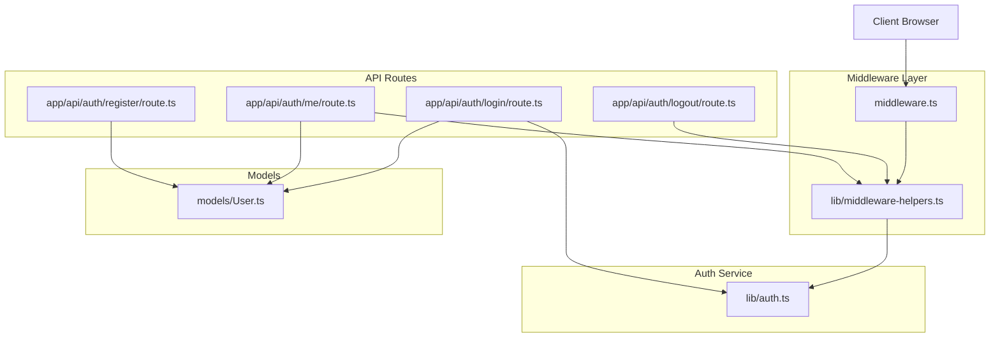
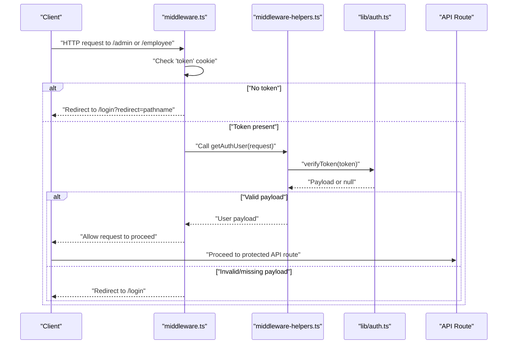
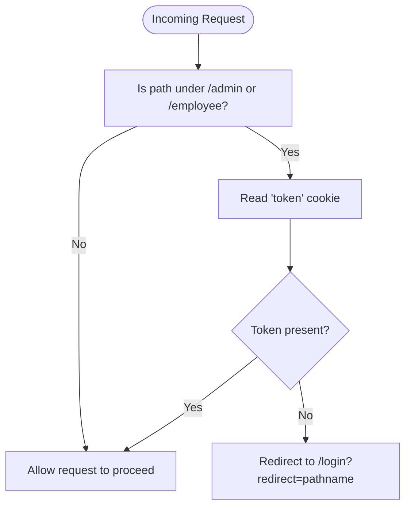
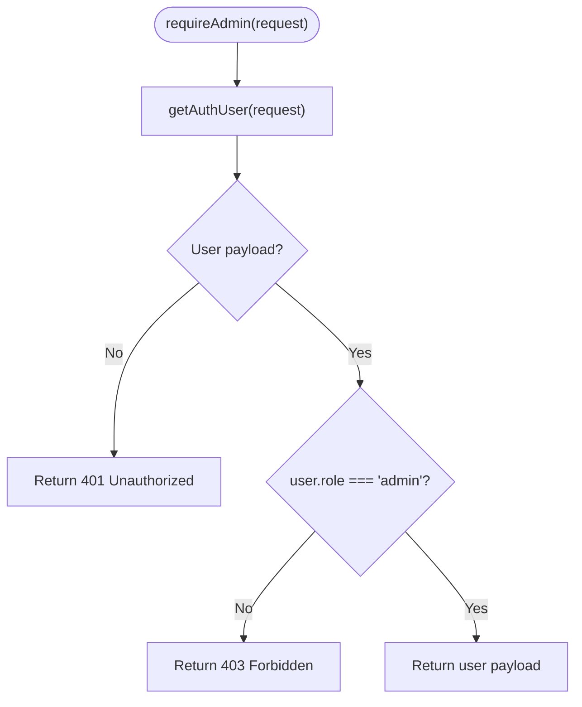
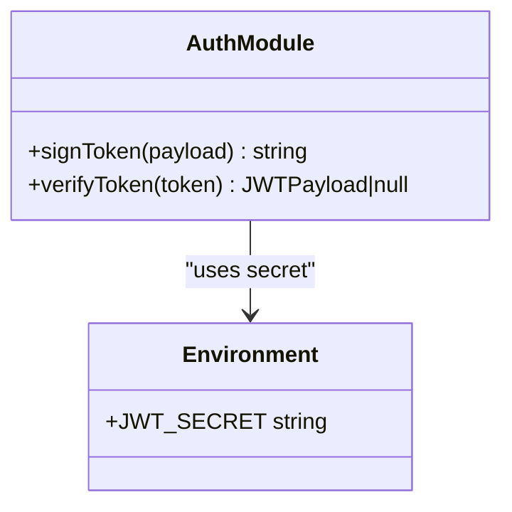
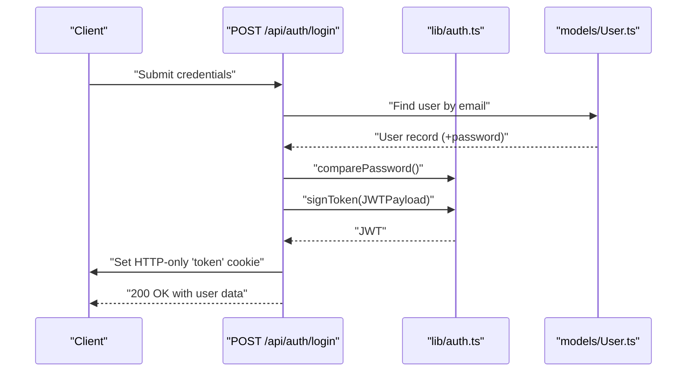
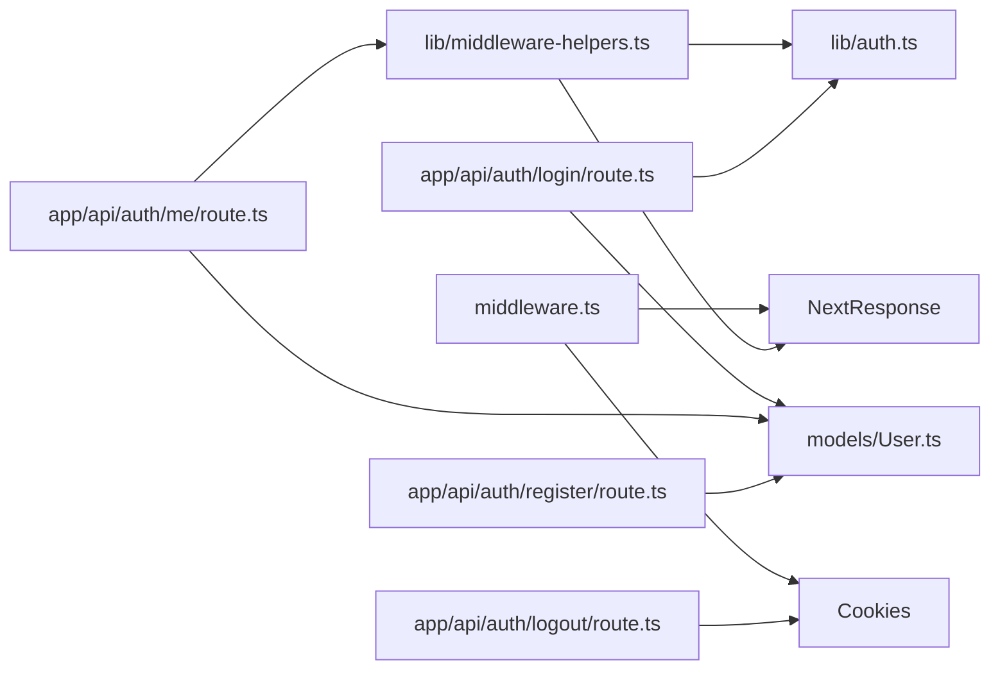

# Authentication Middleware

<cite>
**Referenced Files in This Document**
- [middleware.ts](file://middleware.ts)
- [middleware-helpers.ts](file://lib/middleware-helpers.ts)
- [auth.ts](file://lib/auth.ts)
- [login/route.ts](file://app/api/auth/login/route.ts)
- [logout/route.ts](file://app/api/auth/logout/route.ts)
- [me/route.ts](file://app/api/auth/me/route.ts)
- [register/route.ts](file://app/api/auth/register/route.ts)
- [User.ts](file://models/User.ts)
</cite>

## Table of Contents
1. [Introduction](#introduction)
2. [Project Structure](#project-structure)
3. [Core Components](#core-components)
4. [Architecture Overview](#architecture-overview)
5. [Detailed Component Analysis](#detailed-component-analysis)
6. [Dependency Analysis](#dependency-analysis)
7. [Performance Considerations](#performance-considerations)
8. [Troubleshooting Guide](#troubleshooting-guide)
9. [Conclusion](#conclusion)

## Introduction
This document explains the authentication middleware system used to protect routes and enforce role-based access control in a Next.js application. It covers how middleware.ts intercepts incoming requests, validates JWT tokens via cookie inspection, and redirects unauthenticated users to the login page. It also documents the middleware-helpers.ts utilities that extract and verify tokens, and outlines the complete authentication flow from login through protected route access, including session management via HTTP-only cookies and user context propagation. Examples of protected route enforcement and error handling for unauthorized access attempts are included.

## Project Structure
The authentication system spans middleware, helper utilities, authentication services, and API routes:

- Middleware: middleware.ts protects routes under /admin and /employee by checking for the presence of a token cookie.
- Helpers: lib/middleware-helpers.ts provides reusable functions to extract and verify tokens, and to enforce authentication and admin roles.
- Authentication service: lib/auth.ts handles JWT signing and verification using a secret from environment variables.
- API routes: app/api/auth/* implement login, logout, registration, and user retrieval with proper session and context handling.
- Models: models/User.ts defines the user schema and role enumeration.

**Diagram sources**
- [middleware.ts:1-35](file://middleware.ts#L1-L35)
- [middleware-helpers.ts:1-81](file://lib/middleware-helpers.ts#L1-L81)
- [auth.ts:1-50](file://lib/auth.ts#L1-L50)
- [login/route.ts:1-101](file://app/api/auth/login/route.ts#L1-L101)
- [logout/route.ts:1-31](file://app/api/auth/logout/route.ts#L1-L31)
- [me/route.ts:1-66](file://app/api/auth/me/route.ts#L1-L66)
- [register/route.ts:1-102](file://app/api/auth/register/route.ts#L1-L102)
- [User.ts:1-50](file://models/User.ts#L1-L50)

**Section sources**
- [middleware.ts:1-35](file://middleware.ts#L1-L35)
- [middleware-helpers.ts:1-81](file://lib/middleware-helpers.ts#L1-L81)
- [auth.ts:1-50](file://lib/auth.ts#L1-L50)
- [login/route.ts:1-101](file://app/api/auth/login/route.ts#L1-L101)
- [logout/route.ts:1-31](file://app/api/auth/logout/route.ts#L1-L31)
- [me/route.ts:1-66](file://app/api/auth/me/route.ts#L1-L66)
- [register/route.ts:1-102](file://app/api/auth/register/route.ts#L1-L102)
- [User.ts:1-50](file://models/User.ts#L1-L50)

## Core Components
- Route Protection Middleware: middleware.ts checks for the presence of a token cookie and redirects to /login with a redirect query parameter if missing. It applies only to /admin and /employee routes.
- Token Extraction and Verification Helpers: middleware-helpers.ts provides:
  - getAuthUser(request): extracts the token from cookies and verifies it using lib/auth.ts, returning the decoded payload or null.
  - requireAuth(request): returns the user payload or a 401 Unauthorized response.
  - requireAdmin(request): returns the user payload if role is admin, or a 403 Forbidden response.
- JWT Signing and Verification: lib/auth.ts signs tokens with a 7-day expiry and verifies them using the configured secret.
- Authentication Flow APIs:
  - Login sets an HTTP-only token cookie and returns user data.
  - Logout deletes the token cookie.
  - Me retrieves the current user based on the verified token.
  - Register creates a new user with hashed password and default role.

**Section sources**
- [middleware.ts:13-29](file://middleware.ts#L13-L29)
- [middleware.ts:32-34](file://middleware.ts#L32-L34)
- [middleware-helpers.ts:10-26](file://lib/middleware-helpers.ts#L10-L26)
- [middleware-helpers.ts:32-48](file://lib/middleware-helpers.ts#L32-L48)
- [middleware-helpers.ts:54-80](file://lib/middleware-helpers.ts#L54-L80)
- [auth.ts:33-49](file://lib/auth.ts#L33-L49)
- [login/route.ts:64-72](file://app/api/auth/login/route.ts#L64-L72)
- [logout/route.ts:9-11](file://app/api/auth/logout/route.ts#L9-L11)
- [me/route.ts:11-22](file://app/api/auth/me/route.ts#L11-L22)
- [register/route.ts:67-73](file://app/api/auth/register/route.ts#L67-L73)

## Architecture Overview
The authentication architecture separates concerns across middleware, helpers, and API routes:

- Middleware layer enforces pre-authentication checks for protected paths.
- Helper utilities encapsulate token extraction and verification logic.
- API routes handle user actions (login, logout, register, profile) and manage sessions via cookies.
- Models define user data and roles.

**Diagram sources**
- [middleware.ts:13-29](file://middleware.ts#L13-L29)
- [middleware-helpers.ts:10-26](file://lib/middleware-helpers.ts#L10-L26)
- [auth.ts:42-49](file://lib/auth.ts#L42-L49)

## Detailed Component Analysis

### Middleware: Route Protection
- Purpose: Intercept requests to /admin and /employee paths and ensure a token cookie exists.
- Behavior:
  - Extracts the token from cookies.
  - If absent, constructs a redirect URL with the original pathname and responds with a 307 redirect.
  - If present, allows the request to proceed; role-based checks are enforced in API routes.
- Matcher: Applies only to /admin/:path* and /employee/:path*.

**Diagram sources**
- [middleware.ts:13-29](file://middleware.ts#L13-L29)
- [middleware.ts:32-34](file://middleware.ts#L32-L34)

**Section sources**
- [middleware.ts:13-29](file://middleware.ts#L13-L29)
- [middleware.ts:32-34](file://middleware.ts#L32-L34)

### Middleware Helpers: Token Extraction and Verification
- getAuthUser(request):
  - Reads the token from cookies.
  - Calls verifyToken(token) from lib/auth.ts.
  - Returns the decoded payload or null on failure.
- requireAuth(request):
  - Uses getAuthUser(request).
  - Returns JSON error with 401 Unauthorized if not authenticated.
- requireAdmin(request):
  - Uses getAuthUser(request).
  - Returns JSON error with 401 Unauthorized if not authenticated.
  - Returns JSON error with 403 Forbidden if role is not admin.

**Diagram sources**
- [middleware-helpers.ts:54-80](file://lib/middleware-helpers.ts#L54-L80)
- [middleware-helpers.ts:32-48](file://lib/middleware-helpers.ts#L32-L48)
- [middleware-helpers.ts:10-26](file://lib/middleware-helpers.ts#L10-L26)

**Section sources**
- [middleware-helpers.ts:10-26](file://lib/middleware-helpers.ts#L10-L26)
- [middleware-helpers.ts:32-48](file://lib/middleware-helpers.ts#L32-L48)
- [middleware-helpers.ts:54-80](file://lib/middleware-helpers.ts#L54-L80)

### JWT Signing and Verification
- signToken(payload): Creates a signed JWT with a 7-day expiry using the secret from environment variables.
- verifyToken(token): Verifies the token and returns the payload or null on failure.
- Secret requirement: JWT_SECRET must be defined in environment variables; otherwise, an error is thrown during module initialization.

**Diagram sources**
- [auth.ts:33-49](file://lib/auth.ts#L33-L49)
- [auth.ts:5-11](file://lib/auth.ts#L5-L11)

**Section sources**
- [auth.ts:33-49](file://lib/auth.ts#L33-L49)
- [auth.ts:5-11](file://lib/auth.ts#L5-L11)

### Authentication Flow: Login to Protected Access
- Login:
  - Validates request body, connects to the database, finds the user by email, compares passwords, signs a JWT, and sets an HTTP-only cookie with secure attributes.
  - Returns user data excluding sensitive fields.
- Protected Route Access:
  - Middleware checks for the token cookie and redirects if missing.
  - API routes enforce role-based access using requireAdmin or similar helpers.
- Session Management:
  - Token stored in an HTTP-only cookie to mitigate XSS risks.
  - Cookie includes secure, sameSite, and maxAge settings appropriate for production.

**Diagram sources**
- [login/route.ts:8-101](file://app/api/auth/login/route.ts#L8-L101)
- [auth.ts:23-37](file://lib/auth.ts#L23-L37)
- [User.ts:1-50](file://models/User.ts#L1-L50)

**Section sources**
- [login/route.ts:8-101](file://app/api/auth/login/route.ts#L8-L101)
- [auth.ts:23-37](file://lib/auth.ts#L23-L37)
- [User.ts:1-50](file://models/User.ts#L1-L50)

### Protected Route Enforcement Examples
- Admin-only routes:
  - Use requireAdmin(request) in API routes to ensure only users with role "admin" can access.
  - On failure, return a JSON error with 401 (not authenticated) or 403 (insufficient permissions).
- Employee-only routes:
  - Use requireAuth(request) to ensure any authenticated user can access.
  - Combine with additional business logic to restrict by ownership or department if needed.
- Public routes:
  - /login, /register, /api/auth/*, and root path are publicly accessible and do not require authentication.

**Section sources**
- [middleware-helpers.ts:54-80](file://lib/middleware-helpers.ts#L54-L80)
- [middleware.ts:32-34](file://middleware.ts#L32-L34)

### Error Handling for Unauthorized Access
- Missing or invalid token:
  - Middleware redirects to /login with the original pathname preserved.
  - API routes return 401 Unauthorized when authentication is required but not provided or invalid.
- Insufficient permissions:
  - API routes return 403 Forbidden when a user is authenticated but lacks the required role.
- Logout:
  - Deleting the token cookie revokes access to protected routes on subsequent requests.

**Section sources**
- [middleware.ts:20-24](file://middleware.ts#L20-L24)
- [middleware-helpers.ts:38-47](file://lib/middleware-helpers.ts#L38-L47)
- [middleware-helpers.ts:69-77](file://lib/middleware-helpers.ts#L69-L77)
- [logout/route.ts:9-11](file://app/api/auth/logout/route.ts#L9-L11)

## Dependency Analysis
The authentication system exhibits clear separation of concerns:

- middleware.ts depends on cookies to read the token and NextResponse for redirection.
- middleware-helpers.ts depends on lib/auth.ts for token verification and on NextResponse for standardized API responses.
- API routes depend on middleware-helpers.ts for authentication checks and on models/User.ts for user data.
- lib/auth.ts depends on environment variables for JWT secrets.

**Diagram sources**
- [middleware.ts:1-35](file://middleware.ts#L1-L35)
- [middleware-helpers.ts:1-81](file://lib/middleware-helpers.ts#L1-L81)
- [auth.ts:1-50](file://lib/auth.ts#L1-L50)
- [login/route.ts:1-101](file://app/api/auth/login/route.ts#L1-L101)
- [logout/route.ts:1-31](file://app/api/auth/logout/route.ts#L1-L31)
- [me/route.ts:1-66](file://app/api/auth/me/route.ts#L1-L66)
- [register/route.ts:1-102](file://app/api/auth/register/route.ts#L1-L102)
- [User.ts:1-50](file://models/User.ts#L1-L50)

**Section sources**
- [middleware.ts:1-35](file://middleware.ts#L1-L35)
- [middleware-helpers.ts:1-81](file://lib/middleware-helpers.ts#L1-L81)
- [auth.ts:1-50](file://lib/auth.ts#L1-L50)
- [login/route.ts:1-101](file://app/api/auth/login/route.ts#L1-L101)
- [logout/route.ts:1-31](file://app/api/auth/logout/route.ts#L1-L31)
- [me/route.ts:1-66](file://app/api/auth/me/route.ts#L1-L66)
- [register/route.ts:1-102](file://app/api/auth/register/route.ts#L1-L102)
- [User.ts:1-50](file://models/User.ts#L1-L50)

## Performance Considerations
- Token verification cost: JWT verification is lightweight; however, avoid verifying tokens unnecessarily by relying on middleware for initial checks and helpers for route-level enforcement.
- Cookie size: Keep the token payload minimal to reduce cookie overhead.
- Database queries: API routes should minimize database calls by selecting only required fields and using indexes (e.g., email index in the user model).
- Environment configuration: Ensure JWT_SECRET is set in production to prevent runtime errors.

## Troubleshooting Guide
- 401 Unauthorized on protected routes:
  - Confirm the client has a valid token cookie set by the login endpoint.
  - Verify the cookie is HTTP-only and matches the expected domain/path.
- 403 Forbidden:
  - Ensure the user's role is "admin" when accessing admin-only endpoints.
- Redirect loops to /login:
  - Check that the token cookie is present and not expired.
  - Verify middleware matcher configuration for /admin and /employee routes.
- Logout does not work:
  - Confirm the cookie deletion succeeds and the client clears local state.
- Registration failures:
  - Validate input fields and email format; ensure the email is unique.

**Section sources**
- [middleware.ts:20-24](file://middleware.ts#L20-L24)
- [middleware-helpers.ts:38-47](file://lib/middleware-helpers.ts#L38-L47)
- [middleware-helpers.ts:69-77](file://lib/middleware-helpers.ts#L69-L77)
- [logout/route.ts:9-11](file://app/api/auth/logout/route.ts#L9-L11)
- [register/route.ts:14-23](file://app/api/auth/register/route.ts#L14-L23)

## Conclusion
The authentication middleware system provides robust, layered protection for routes and endpoints. Middleware.ts ensures early interception of unauthenticated requests to protected paths, while middleware-helpers.ts centralizes token extraction and role-based enforcement. lib/auth.ts manages secure token signing and verification, and API routes implement login, logout, registration, and user retrieval with proper session and context handling. Together, these components form a maintainable and secure authentication pipeline suitable for production use.