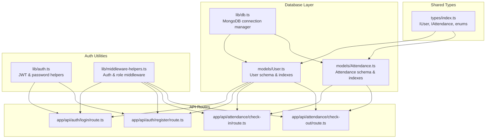
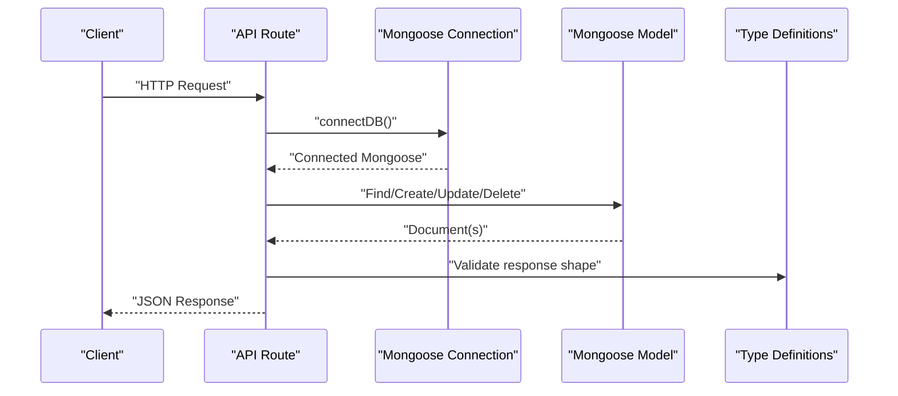
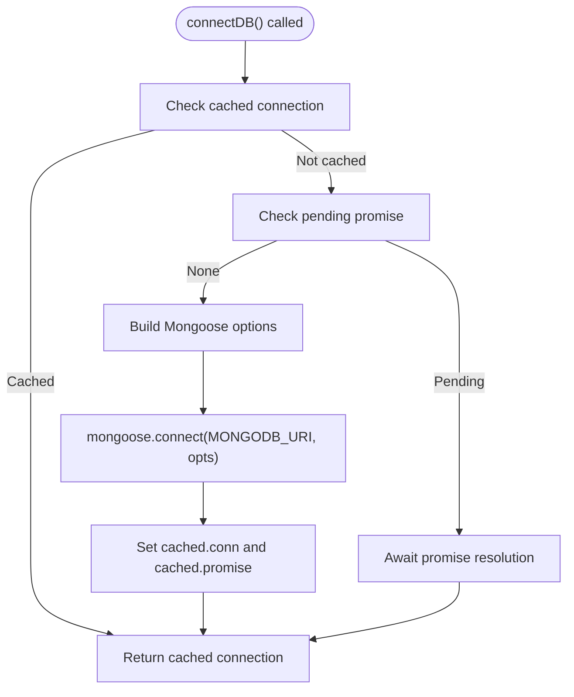
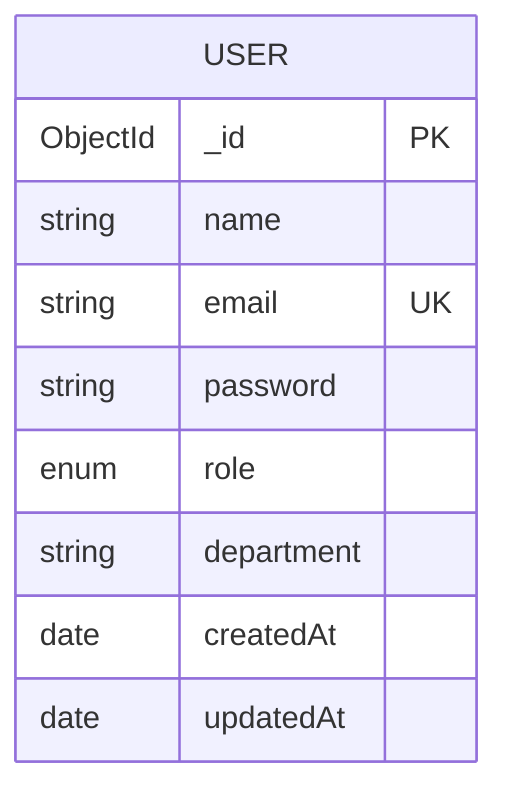
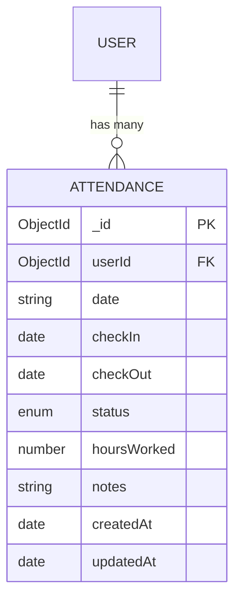
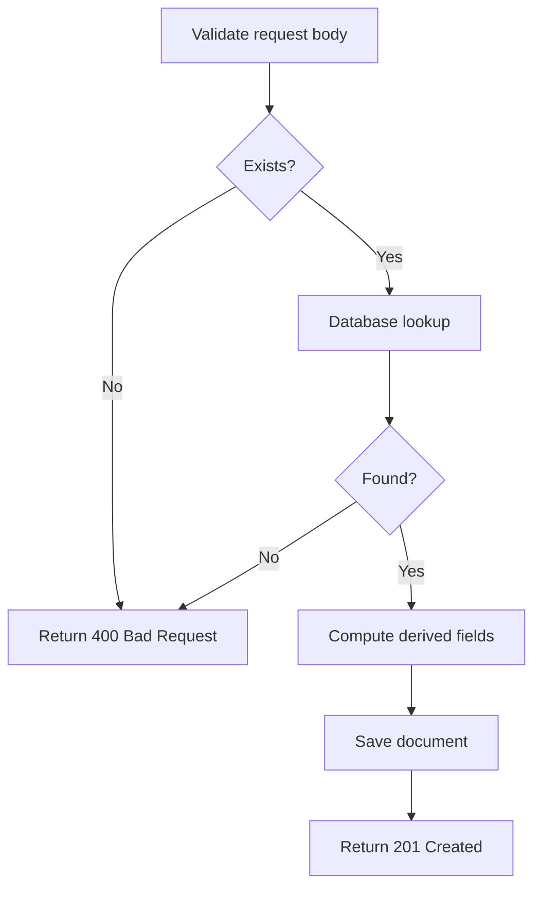
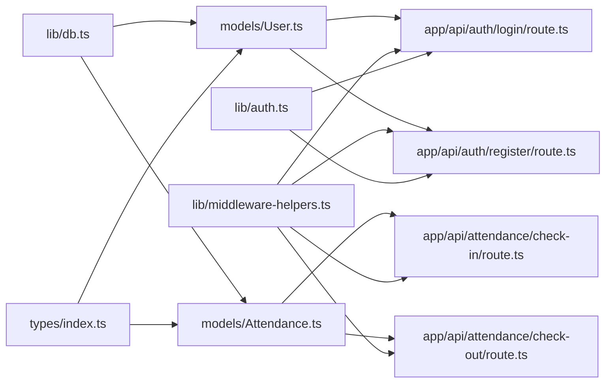

# Database Layer

<cite>
**Referenced Files in This Document**
- [lib/db.ts](file://lib/db.ts)
- [models/User.ts](file://models/User.ts)
- [models/Attendance.ts](file://models/Attendance.ts)
- [types/index.ts](file://types/index.ts)
- [lib/middleware-helpers.ts](file://lib/middleware-helpers.ts)
- [lib/auth.ts](file://lib/auth.ts)
- [app/api/auth/login/route.ts](file://app/api/auth/login/route.ts)
- [app/api/auth/register/route.ts](file://app/api/auth/register/route.ts)
- [app/api/attendance/check-in/route.ts](file://app/api/attendance/check-in/route.ts)
- [app/api/attendance/check-out/route.ts](file://app/api/attendance/check-out/route.ts)
</cite>

## Table of Contents
1. [Introduction](#introduction)
2. [Project Structure](#project-structure)
3. [Core Components](#core-components)
4. [Architecture Overview](#architecture-overview)
5. [Detailed Component Analysis](#detailed-component-analysis)
6. [Dependency Analysis](#dependency-analysis)
7. [Performance Considerations](#performance-considerations)
8. [Troubleshooting Guide](#troubleshooting-guide)
9. [Conclusion](#conclusion)

## Introduction
This document provides comprehensive data model documentation for the database layer of the application. It covers the MongoDB connection setup using Mongoose, the User model schema with role-based permissions, and the Attendance model for tracking employee check-ins. It also documents entity relationships, field definitions, data types, validation rules, indexing strategies, and connection pooling behavior. Finally, it explains common database operations, query patterns, and data access methods used by the API endpoints.

## Project Structure
The database layer is organized around:
- A centralized connection module that manages the Mongoose connection with caching and error handling.
- Two primary Mongoose models: User and Attendance.
- Shared TypeScript types that define schemas, roles, and API response structures.
- Authentication middleware and helper utilities for role checks.
- API routes that orchestrate database operations for login, registration, check-in, and check-out.

**Diagram sources**
- [lib/db.ts:1-53](file://lib/db.ts#L1-L53)
- [models/User.ts:1-49](file://models/User.ts#L1-L49)
- [models/Attendance.ts:1-58](file://models/Attendance.ts#L1-L58)
- [types/index.ts:1-61](file://types/index.ts#L1-L61)
- [lib/middleware-helpers.ts:1-81](file://lib/middleware-helpers.ts#L1-L81)
- [lib/auth.ts:1-50](file://lib/auth.ts#L1-L50)
- [app/api/auth/login/route.ts:1-101](file://app/api/auth/login/route.ts#L1-L101)
- [app/api/auth/register/route.ts:1-102](file://app/api/auth/register/route.ts#L1-L102)
- [app/api/attendance/check-in/route.ts:1-78](file://app/api/attendance/check-in/route.ts#L1-L78)
- [app/api/attendance/check-out/route.ts:1-52](file://app/api/attendance/check-out/route.ts#L1-L52)

**Section sources**
- [lib/db.ts:1-53](file://lib/db.ts#L1-L53)
- [models/User.ts:1-49](file://models/User.ts#L1-L49)
- [models/Attendance.ts:1-58](file://models/Attendance.ts#L1-L58)
- [types/index.ts:1-61](file://types/index.ts#L1-L61)
- [lib/middleware-helpers.ts:1-81](file://lib/middleware-helpers.ts#L1-L81)
- [lib/auth.ts:1-50](file://lib/auth.ts#L1-L50)
- [app/api/auth/login/route.ts:1-101](file://app/api/auth/login/route.ts#L1-L101)
- [app/api/auth/register/route.ts:1-102](file://app/api/auth/register/route.ts#L1-L102)
- [app/api/attendance/check-in/route.ts:1-78](file://app/api/attendance/check-in/route.ts#L1-L78)
- [app/api/attendance/check-out/route.ts:1-52](file://app/api/attendance/check-out/route.ts#L1-L52)

## Core Components
- MongoDB connection manager with caching and retry semantics.
- User model with role-based permissions and indexed fields.
- Attendance model with composite uniqueness and date-based indexes.
- Shared types for schema definitions and API contracts.
- Authentication utilities and middleware for protected routes.

**Section sources**
- [lib/db.ts:1-53](file://lib/db.ts#L1-L53)
- [models/User.ts:1-49](file://models/User.ts#L1-L49)
- [models/Attendance.ts:1-58](file://models/Attendance.ts#L1-L58)
- [types/index.ts:1-61](file://types/index.ts#L1-L61)
- [lib/middleware-helpers.ts:1-81](file://lib/middleware-helpers.ts#L1-L81)
- [lib/auth.ts:1-50](file://lib/auth.ts#L1-L50)

## Architecture Overview
The database layer follows a layered architecture:
- Connection layer: Centralized Mongoose connection with caching to avoid reconnects and support Next.js development hot reload.
- Model layer: Mongoose schemas with indexes optimized for common queries.
- Type layer: Strongly typed interfaces and enums for schema fields and API responses.
- Access control layer: Middleware utilities enforce authentication and role checks.
- API layer: Route handlers coordinate database operations, apply validation, and return structured responses.

**Diagram sources**
- [lib/db.ts:28-51](file://lib/db.ts#L28-L51)
- [models/User.ts:46-47](file://models/User.ts#L46-L47)
- [models/Attendance.ts:53-55](file://models/Attendance.ts#L53-L55)
- [types/index.ts:6-32](file://types/index.ts#L6-L32)
- [app/api/auth/login/route.ts:26-32](file://app/api/auth/login/route.ts#L26-L32)
- [app/api/attendance/check-in/route.ts:16-23](file://app/api/attendance/check-in/route.ts#L16-L23)

## Detailed Component Analysis

### MongoDB Connection Setup
The connection module exports a function that:
- Validates the presence of the MongoDB URI environment variable.
- Uses a global cache to store the connection and a pending promise to prevent duplicate connections.
- Configures Mongoose with buffering disabled for immediate command failures.
- Handles connection errors by clearing the cached promise.

Key behaviors:
- Caching prevents multiple simultaneous connections.
- Buffering disabled ensures immediate feedback on connectivity issues.
- Global cache avoids model redefinition during hot reload.

**Diagram sources**
- [lib/db.ts:28-51](file://lib/db.ts#L28-L51)

**Section sources**
- [lib/db.ts:1-53](file://lib/db.ts#L1-L53)

### User Model Schema and Role-Based Permissions
The User model defines:
- Fields: name, email, password, role, department, timestamps.
- Validation: required fields, unique email, trimmed strings, role enum restricted to admin or employee.
- Security: password excluded by default from queries; included only when needed (e.g., login).
- Indexes: unique email for fast lookups and uniqueness.

Role-based permissions:
- Middleware enforces admin-only access for administrative tasks.
- API routes use requireAuth to ensure requests originate from authenticated users.

**Diagram sources**
- [models/User.ts:4-41](file://models/User.ts#L4-L41)
- [types/index.ts:3-14](file://types/index.ts#L3-L14)

**Section sources**
- [models/User.ts:1-49](file://models/User.ts#L1-L49)
- [types/index.ts:1-61](file://types/index.ts#L1-L61)
- [lib/middleware-helpers.ts:54-80](file://lib/middleware-helpers.ts#L54-L80)

### Attendance Model for Tracking Employee Check-ins
The Attendance model defines:
- Fields: userId (ObjectId referencing User), date (YYYY-MM-DD string), checkIn, checkOut, status, hoursWorked, notes, timestamps.
- Validation: required fields, status enum restricted to present, absent, late.
- Indexes: compound unique index on (userId, date), separate indexes on date and userId for efficient queries.

**Diagram sources**
- [models/Attendance.ts:4-41](file://models/Attendance.ts#L4-L41)
- [types/index.ts:16-25](file://types/index.ts#L16-L25)

**Section sources**
- [models/Attendance.ts:1-58](file://models/Attendance.ts#L1-L58)
- [types/index.ts:1-61](file://types/index.ts#L1-L61)

### Data Validation Rules
Validation enforced at the route level and model level:
- Login: requires email and password; validates credentials against stored hash.
- Registration: validates email format and password length; checks for duplicate emails.
- Check-in: ensures a user is authenticated, prevents duplicate check-ins per day, computes status based on check-in time.
- Check-out: ensures a prior check-in exists, prevents duplicate check-outs, calculates worked hours.

**Diagram sources**
- [app/api/auth/login/route.ts:15-42](file://app/api/auth/login/route.ts#L15-L42)
- [app/api/auth/register/route.ts:14-61](file://app/api/auth/register/route.ts#L14-L61)
- [app/api/attendance/check-in/route.ts:18-33](file://app/api/attendance/check-in/route.ts#L18-L33)
- [app/api/attendance/check-out/route.ts:18-33](file://app/api/attendance/check-out/route.ts#L18-L33)

**Section sources**
- [app/api/auth/login/route.ts:1-101](file://app/api/auth/login/route.ts#L1-L101)
- [app/api/auth/register/route.ts:1-102](file://app/api/auth/register/route.ts#L1-L102)
- [app/api/attendance/check-in/route.ts:1-78](file://app/api/attendance/check-in/route.ts#L1-L78)
- [app/api/attendance/check-out/route.ts:1-52](file://app/api/attendance/check-out/route.ts#L1-L52)

### Indexing Strategies
Indexes configured for optimal query performance:
- User: unique index on email to prevent duplicates and speed up lookups.
- Attendance: 
  - Compound unique index on (userId, date) to enforce single daily record per user.
  - Separate index on date for date-range queries.
  - Separate index on userId for user-centric queries.

These indexes align with typical API usage patterns:
- Login and registration rely on email uniqueness.
- Check-in/out rely on user+date uniqueness and date-range filtering.

**Section sources**
- [models/User.ts:43-44](file://models/User.ts#L43-L44)
- [models/Attendance.ts:43-50](file://models/Attendance.ts#L43-L50)

### Connection Pooling
- The connection manager caches a single Mongoose instance globally.
- Options disable command buffering to surface connection errors immediately.
- This design minimizes overhead and avoids redundant connections in development and production.

**Section sources**
- [lib/db.ts:34-36](file://lib/db.ts#L34-L36)
- [lib/db.ts:19-26](file://lib/db.ts#L19-L26)

### Data Access Methods Used by API Endpoints
Common patterns observed across routes:
- Authentication middleware: requireAuth and requireAdmin enforce access control.
- Database connection: connectDB is invoked at the start of each handler.
- Queries: findOne for uniqueness checks (e.g., duplicate check-in prevention), create for new records.
- Updates: findOne followed by save or updateOne for check-out calculations.
- Responses: standardized ApiResponse wrapper with success/error/message/data.

Representative examples (paths only):
- [app/api/auth/login/route.ts:26-32](file://app/api/auth/login/route.ts#L26-L32)
- [app/api/auth/register/route.ts:48-52](file://app/api/auth/register/route.ts#L48-L52)
- [app/api/attendance/check-in/route.ts:16-23](file://app/api/attendance/check-in/route.ts#L16-L23)
- [app/api/attendance/check-out/route.ts:16-23](file://app/api/attendance/check-out/route.ts#L16-L23)

**Section sources**
- [lib/middleware-helpers.ts:32-48](file://lib/middleware-helpers.ts#L32-L48)
- [lib/middleware-helpers.ts:54-80](file://lib/middleware-helpers.ts#L54-L80)
- [app/api/auth/login/route.ts:26-32](file://app/api/auth/login/route.ts#L26-L32)
- [app/api/auth/register/route.ts:48-52](file://app/api/auth/register/route.ts#L48-L52)
- [app/api/attendance/check-in/route.ts:16-23](file://app/api/attendance/check-in/route.ts#L16-L23)
- [app/api/attendance/check-out/route.ts:16-23](file://app/api/attendance/check-out/route.ts#L16-L23)

## Dependency Analysis
The following diagram shows how components depend on each other:

**Diagram sources**
- [lib/db.ts:1-53](file://lib/db.ts#L1-L53)
- [models/User.ts:1-49](file://models/User.ts#L1-L49)
- [models/Attendance.ts:1-58](file://models/Attendance.ts#L1-L58)
- [types/index.ts:1-61](file://types/index.ts#L1-L61)
- [lib/middleware-helpers.ts:1-81](file://lib/middleware-helpers.ts#L1-L81)
- [lib/auth.ts:1-50](file://lib/auth.ts#L1-L50)
- [app/api/auth/login/route.ts:1-101](file://app/api/auth/login/route.ts#L1-L101)
- [app/api/auth/register/route.ts:1-102](file://app/api/auth/register/route.ts#L1-L102)
- [app/api/attendance/check-in/route.ts:1-78](file://app/api/attendance/check-in/route.ts#L1-L78)
- [app/api/attendance/check-out/route.ts:1-52](file://app/api/attendance/check-out/route.ts#L1-L52)

**Section sources**
- [lib/db.ts:1-53](file://lib/db.ts#L1-L53)
- [models/User.ts:1-49](file://models/User.ts#L1-L49)
- [models/Attendance.ts:1-58](file://models/Attendance.ts#L1-L58)
- [types/index.ts:1-61](file://types/index.ts#L1-L61)
- [lib/middleware-helpers.ts:1-81](file://lib/middleware-helpers.ts#L1-L81)
- [lib/auth.ts:1-50](file://lib/auth.ts#L1-L50)
- [app/api/auth/login/route.ts:1-101](file://app/api/auth/login/route.ts#L1-L101)
- [app/api/auth/register/route.ts:1-102](file://app/api/auth/register/route.ts#L1-L102)
- [app/api/attendance/check-in/route.ts:1-78](file://app/api/attendance/check-in/route.ts#L1-L78)
- [app/api/attendance/check-out/route.ts:1-52](file://app/api/attendance/check-out/route.ts#L1-L52)

## Performance Considerations
- Prefer compound indexes for unique constraints (e.g., (userId, date)) to avoid race conditions and ensure atomicity.
- Use targeted projections and selective field retrieval to minimize payload sizes.
- Leverage environment-specific configurations (e.g., production cookies) to reduce unnecessary overhead.
- Keep connection caching enabled to avoid repeated connection setup costs.

[No sources needed since this section provides general guidance]

## Troubleshooting Guide
Common issues and resolutions:
- Missing environment variables:
  - MONGODB_URI must be defined; otherwise, the connection function throws an error.
  - JWT_SECRET must be defined for authentication utilities.
- Duplicate entries:
  - Unique indexes on email (User) and (userId, date) (Attendance) prevent duplicates; handle 409 conflicts gracefully in clients.
- Authentication failures:
  - Ensure tokens are present and valid; middleware returns 401/403 for missing or insufficient privileges.
- Connection errors:
  - The connection manager clears the cached promise on failure; retry after fixing the URI or network.

**Section sources**
- [lib/db.ts:13-17](file://lib/db.ts#L13-L17)
- [lib/auth.ts:7-11](file://lib/auth.ts#L7-L11)
- [models/User.ts:43-44](file://models/User.ts#L43-L44)
- [models/Attendance.ts:43-44](file://models/Attendance.ts#L43-L44)
- [lib/middleware-helpers.ts:32-48](file://lib/middleware-helpers.ts#L32-L48)

## Conclusion
The database layer is designed around a robust connection manager, strongly typed models with targeted indexes, and clear separation of concerns across authentication, access control, and API routes. The schema choices and indexes align with common operational patterns for user management and attendance tracking, while middleware and utilities provide consistent security and validation across endpoints.

[No sources needed since this section summarizes without analyzing specific files]