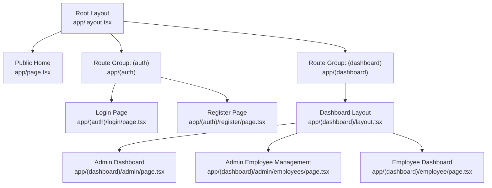
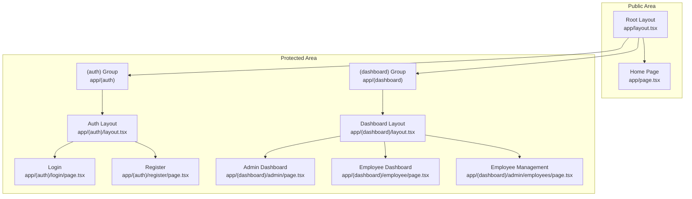
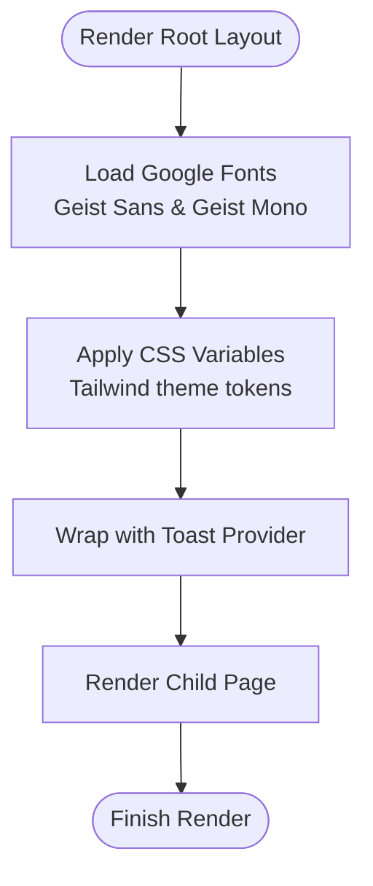
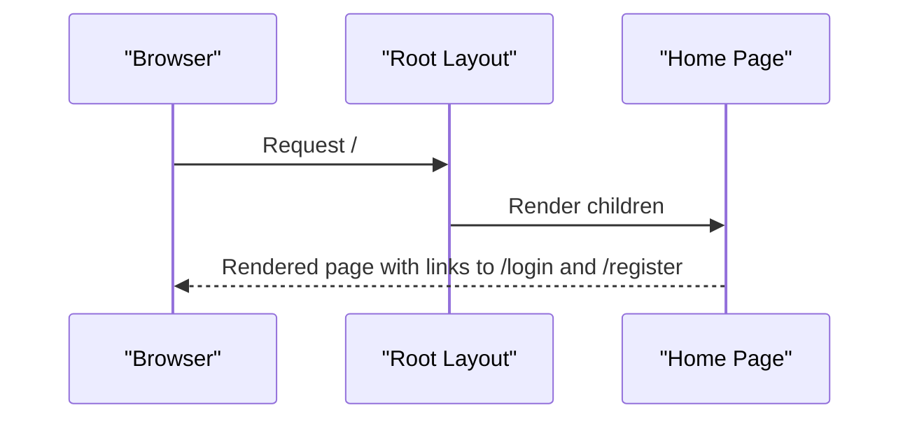
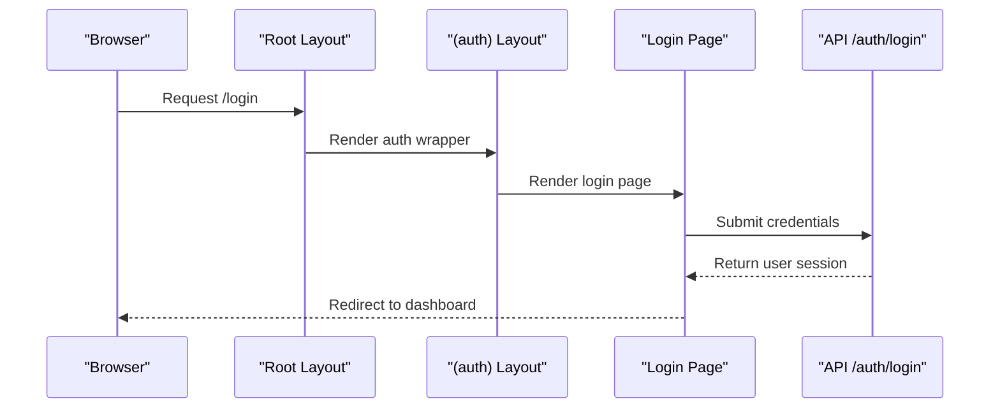
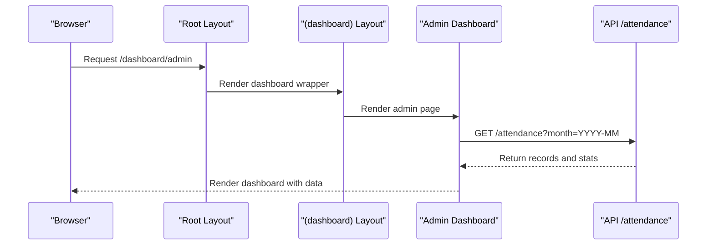
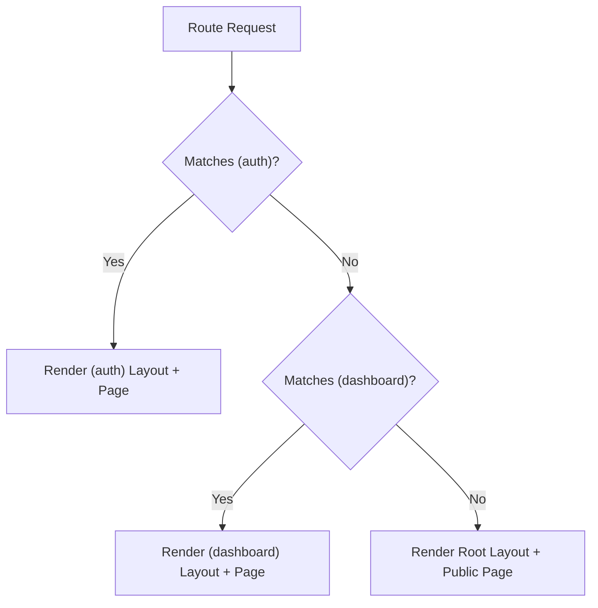
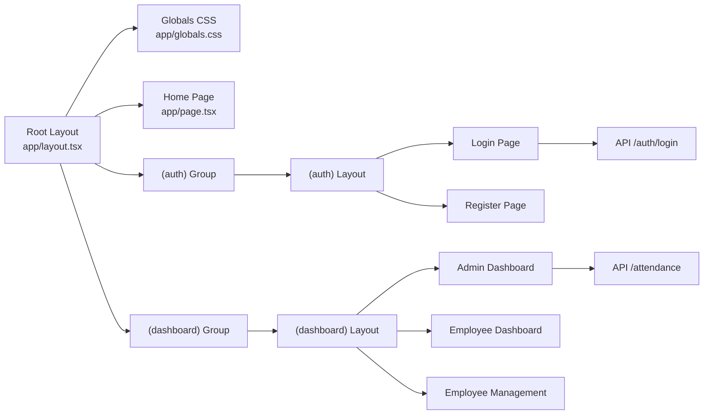

# Routing Architecture

<cite>
**Referenced Files in This Document**
- [app/layout.tsx](file://app/layout.tsx)
- [app/globals.css](file://app/globals.css)
- [app/page.tsx](file://app/page.tsx)
- [(auth)/layout.tsx](file://app/(auth)/layout.tsx)
- [(auth)/login/page.tsx](file://app/(auth)/login/page.tsx)
- [(auth)/register/page.tsx](file://app/(auth)/register/page.tsx)
- [(dashboard)/layout.tsx](file://app/(dashboard)/layout.tsx)
- [(dashboard)/admin/page.tsx](file://app/(dashboard)/admin/page.tsx)
- [(dashboard)/admin/employees/page.tsx](file://app/(dashboard)/admin/employees/page.tsx)
- [(dashboard)/employee/page.tsx](file://app/(dashboard)/employee/page.tsx)
- [app/api/attendance/route.ts](file://app/api/attendance/route.ts)
- [app/api/auth/login/route.ts](file://app/api/auth/login/route.ts)
</cite>

## Table of Contents
1. [Introduction](#introduction)
2. [Project Structure](#project-structure)
3. [Core Components](#core-components)
4. [Architecture Overview](#architecture-overview)
5. [Detailed Component Analysis](#detailed-component-analysis)
6. [Dependency Analysis](#dependency-analysis)
7. [Performance Considerations](#performance-considerations)
8. [Troubleshooting Guide](#troubleshooting-guide)
9. [Conclusion](#conclusion)

## Introduction
This document explains the Next.js App Router architecture used in the project, focusing on route groups, file-based routing, nested layouts, and how the router manages public versus protected pages. It covers:
- Route groups (auth) and (dashboard) and their rendering hierarchy
- How the root layout.tsx provides global styling and fonts
- How dashboard-specific layouts enable role-based navigation
- Examples of route organization, dynamic routes, and protected/public page separation
- The relationship between different route groups and their rendering order

## Project Structure
The routing follows Next.js file-based routing conventions with route groups to organize related pages under logical namespaces. The top-level app directory defines:
- Global root layout and global styles
- Public home page
- Route groups:
  - (auth): login and register pages
  - (dashboard): admin and employee dashboards

**Diagram sources**
- [app/layout.tsx:1-38](file://app/layout.tsx#L1-L38)
- [app/page.tsx:1-142](file://app/page.tsx#L1-L142)
- [(auth)/layout.tsx](file://app/(auth)/layout.tsx#L1-L4)
- [(auth)/login/page.tsx](file://app/(auth)/login/page.tsx#L1-L43)
- [(auth)/register/page.tsx](file://app/(auth)/register/page.tsx#L1-L43)
- [(dashboard)/layout.tsx](file://app/(dashboard)/layout.tsx#L1-L34)
- [(dashboard)/admin/page.tsx](file://app/(dashboard)/admin/page.tsx#L1-L274)
- [(dashboard)/admin/employees/page.tsx](file://app/(dashboard)/admin/employees/page.tsx#L1-L560)
- [(dashboard)/employee/page.tsx](file://app/(dashboard)/employee/page.tsx#L1-L254)

**Section sources**
- [app/layout.tsx:1-38](file://app/layout.tsx#L1-L38)
- [app/page.tsx:1-142](file://app/page.tsx#L1-L142)
- [(auth)/layout.tsx](file://app/(auth)/layout.tsx#L1-L4)
- [(auth)/login/page.tsx](file://app/(auth)/login/page.tsx#L1-L43)
- [(auth)/register/page.tsx](file://app/(auth)/register/page.tsx#L1-L43)
- [(dashboard)/layout.tsx](file://app/(dashboard)/layout.tsx#L1-L34)
- [(dashboard)/admin/page.tsx](file://app/(dashboard)/admin/page.tsx#L1-L274)
- [(dashboard)/admin/employees/page.tsx](file://app/(dashboard)/admin/employees/page.tsx#L1-L560)
- [(dashboard)/employee/page.tsx](file://app/(dashboard)/employee/page.tsx#L1-L254)

## Core Components
- Root layout and global styles:
  - Defines global metadata, fonts via Next Font, and toast provider wrapper around children.
  - Applies global CSS variables and Tailwind-based theme tokens.
- Public home page:
  - Client-side page with hero, features, and links to auth routes.
- Route groups:
  - (auth): minimal layout wrapper; login and register pages with dynamic backgrounds.
  - (dashboard): layout with navbar, footer, and fixed background; admin and employee dashboards.

Key responsibilities:
- Root layout: global HTML/document shell, fonts, and theme.
- (auth) group: unauthenticated flows.
- (dashboard) group: authenticated, role-aware dashboards.

**Section sources**
- [app/layout.tsx:1-38](file://app/layout.tsx#L1-L38)
- [app/globals.css:1-61](file://app/globals.css#L1-L61)
- [app/page.tsx:1-142](file://app/page.tsx#L1-L142)
- [(auth)/layout.tsx](file://app/(auth)/layout.tsx#L1-L4)
- [(auth)/login/page.tsx](file://app/(auth)/login/page.tsx#L1-L43)
- [(auth)/register/page.tsx](file://app/(auth)/register/page.tsx#L1-L43)
- [(dashboard)/layout.tsx](file://app/(dashboard)/layout.tsx#L1-L34)

## Architecture Overview
The routing hierarchy enforces separation between public and protected areas:
- Public area: root layout plus public home page
- Protected area: (auth) group for login/register; (dashboard) group for authenticated dashboards

**Diagram sources**
- [app/layout.tsx:1-38](file://app/layout.tsx#L1-L38)
- [app/page.tsx:1-142](file://app/page.tsx#L1-L142)
- [(auth)/layout.tsx](file://app/(auth)/layout.tsx#L1-L4)
- [(auth)/login/page.tsx](file://app/(auth)/login/page.tsx#L1-L43)
- [(auth)/register/page.tsx](file://app/(auth)/register/page.tsx#L1-L43)
- [(dashboard)/layout.tsx](file://app/(dashboard)/layout.tsx#L1-L34)
- [(dashboard)/admin/page.tsx](file://app/(dashboard)/admin/page.tsx#L1-L274)
- [(dashboard)/admin/employees/page.tsx](file://app/(dashboard)/admin/employees/page.tsx#L1-L560)
- [(dashboard)/employee/page.tsx](file://app/(dashboard)/employee/page.tsx#L1-L254)

## Detailed Component Analysis

### Root Layout and Global Styling
- Provides metadata and Next Font configuration for Geist Sans and Geist Mono.
- Wraps children with a toast provider and applies CSS variables for a cohesive design system.
- Global CSS defines theme tokens and neumorphic shadows, consumed by all pages.

**Diagram sources**
- [app/layout.tsx:1-38](file://app/layout.tsx#L1-L38)
- [app/globals.css:1-61](file://app/globals.css#L1-L61)

**Section sources**
- [app/layout.tsx:1-38](file://app/layout.tsx#L1-L38)
- [app/globals.css:1-61](file://app/globals.css#L1-L61)

### Public Home Page
- Client-rendered page with animated hero, feature cards, and links to login/register.
- Uses Tailwind-based design tokens and neumorphic components.

**Diagram sources**
- [app/layout.tsx:1-38](file://app/layout.tsx#L1-L38)
- [app/page.tsx:1-142](file://app/page.tsx#L1-L142)

**Section sources**
- [app/page.tsx:1-142](file://app/page.tsx#L1-L142)

### Auth Route Group: (auth)
- Minimal layout wrapper that passes children through.
- Login and register pages:
  - Client-side with dynamic imports for components that rely on browser APIs.
  - Use a neural background component and form components.

**Diagram sources**
- [app/layout.tsx:1-38](file://app/layout.tsx#L1-L38)
- [(auth)/layout.tsx](file://app/(auth)/layout.tsx#L1-L4)
- [(auth)/login/page.tsx](file://app/(auth)/login/page.tsx#L1-L43)
- [app/api/auth/login/route.ts:1-101](file://app/api/auth/login/route.ts#L1-L101)

**Section sources**
- [(auth)/layout.tsx](file://app/(auth)/layout.tsx#L1-L4)
- [(auth)/login/page.tsx](file://app/(auth)/login/page.tsx#L1-L43)
- [(auth)/register/page.tsx](file://app/(auth)/register/page.tsx#L1-L43)
- [app/api/auth/login/route.ts:1-101](file://app/api/auth/login/route.ts#L1-L101)

### Dashboard Route Group: (dashboard)
- Dashboard layout integrates a fixed background, navbar, and footer, with a main content area.
- Admin dashboard:
  - Fetches attendance statistics and records, supports filtering and pagination.
  - Integrates with attendance API endpoints.
- Employee dashboard:
  - Shows personal stats, recent history, and check-in/out panel.
  - Fetches user profile and monthly attendance data.

**Diagram sources**
- [app/layout.tsx:1-38](file://app/layout.tsx#L1-L38)
- [(dashboard)/layout.tsx](file://app/(dashboard)/layout.tsx#L1-L34)
- [(dashboard)/admin/page.tsx](file://app/(dashboard)/admin/page.tsx#L1-L274)
- [app/api/attendance/route.ts:1-96](file://app/api/attendance/route.ts#L1-L96)

**Section sources**
- [(dashboard)/layout.tsx](file://app/(dashboard)/layout.tsx#L1-L34)
- [(dashboard)/admin/page.tsx](file://app/(dashboard)/admin/page.tsx#L1-L274)
- [(dashboard)/admin/employees/page.tsx](file://app/(dashboard)/admin/employees/page.tsx#L1-L560)
- [(dashboard)/employee/page.tsx](file://app/(dashboard)/employee/page.tsx#L1-L254)
- [app/api/attendance/route.ts:1-96](file://app/api/attendance/route.ts#L1-L96)

### Dynamic Routes and Nested Layouts
- File-based routing determines URLs from directory structure:
  - /login and /register under (auth)
  - /admin and /employee under (dashboard)
  - Nested routes like /admin/employees are supported by placing page.tsx inside the folder
- Route groups (auth) and (dashboard) isolate routing concerns and allow independent layouts.

[No sources needed since this diagram shows conceptual workflow, not actual code structure]

## Dependency Analysis
- Root layout depends on:
  - Global CSS for theme tokens
  - Next Font providers for fonts
  - Toast provider for notifications
- Pages depend on:
  - Shared UI components (neumorphic buttons, cards, tables)
  - API routes for data fetching
- Auth and dashboard groups encapsulate their own UI and data dependencies.

**Diagram sources**
- [app/layout.tsx:1-38](file://app/layout.tsx#L1-L38)
- [app/globals.css:1-61](file://app/globals.css#L1-L61)
- [app/page.tsx:1-142](file://app/page.tsx#L1-L142)
- [(auth)/layout.tsx](file://app/(auth)/layout.tsx#L1-L4)
- [(auth)/login/page.tsx](file://app/(auth)/login/page.tsx#L1-L43)
- [(auth)/register/page.tsx](file://app/(auth)/register/page.tsx#L1-L43)
- [(dashboard)/layout.tsx](file://app/(dashboard)/layout.tsx#L1-L34)
- [(dashboard)/admin/page.tsx](file://app/(dashboard)/admin/page.tsx#L1-L274)
- [(dashboard)/admin/employees/page.tsx](file://app/(dashboard)/admin/employees/page.tsx#L1-L560)
- [(dashboard)/employee/page.tsx](file://app/(dashboard)/employee/page.tsx#L1-L254)
- [app/api/attendance/route.ts:1-96](file://app/api/attendance/route.ts#L1-L96)
- [app/api/auth/login/route.ts:1-101](file://app/api/auth/login/route.ts#L1-L101)

**Section sources**
- [app/layout.tsx:1-38](file://app/layout.tsx#L1-L38)
- [app/globals.css:1-61](file://app/globals.css#L1-L61)
- [app/page.tsx:1-142](file://app/page.tsx#L1-L142)
- [(auth)/layout.tsx](file://app/(auth)/layout.tsx#L1-L4)
- [(auth)/login/page.tsx](file://app/(auth)/login/page.tsx#L1-L43)
- [(auth)/register/page.tsx](file://app/(auth)/register/page.tsx#L1-L43)
- [(dashboard)/layout.tsx](file://app/(dashboard)/layout.tsx#L1-L34)
- [(dashboard)/admin/page.tsx](file://app/(dashboard)/admin/page.tsx#L1-L274)
- [(dashboard)/admin/employees/page.tsx](file://app/(dashboard)/admin/employees/page.tsx#L1-L560)
- [(dashboard)/employee/page.tsx](file://app/(dashboard)/employee/page.tsx#L1-L254)
- [app/api/attendance/route.ts:1-96](file://app/api/attendance/route.ts#L1-L96)
- [app/api/auth/login/route.ts:1-101](file://app/api/auth/login/route.ts#L1-L101)

## Performance Considerations
- Client-side rendering is used for interactive dashboards and pages that rely on browser APIs (e.g., dynamic imports for background components).
- API routes handle data fetching and filtering server-side, reducing client workload.
- Pagination and selective data loading (e.g., per-month attendance) help manage large datasets efficiently.

[No sources needed since this section provides general guidance]

## Troubleshooting Guide
Common issues and checks:
- Authentication redirects:
  - Verify API login endpoint returns a signed token stored in an HTTP-only cookie.
  - Confirm client-side requests to protected APIs include credentials when required.
- Data fetching:
  - Ensure API routes apply appropriate filters based on user roles (admin vs employee).
  - Validate query parameters (month, pagination) passed from dashboard pages.
- Layout rendering:
  - Confirm (dashboard) layout wraps child pages and renders navbar/footer consistently.
  - Check that (auth) layout does not unintentionally block protected content.

**Section sources**
- [app/api/auth/login/route.ts:1-101](file://app/api/auth/login/route.ts#L1-L101)
- [app/api/attendance/route.ts:1-96](file://app/api/attendance/route.ts#L1-L96)
- [(dashboard)/layout.tsx](file://app/(dashboard)/layout.tsx#L1-L34)

## Conclusion
The project’s Next.js App Router architecture leverages route groups to cleanly separate public and protected areas. The root layout centralizes global styling and fonts, while (auth) and (dashboard) groups provide focused layouts and role-aware dashboards. File-based routing and nested layouts enable straightforward organization of routes, dynamic pages, and protected content, with API routes handling data access and filtering.