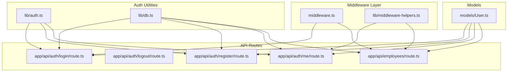
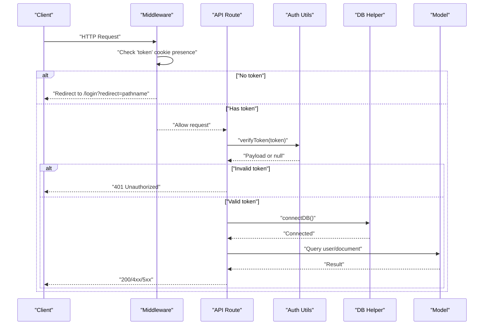
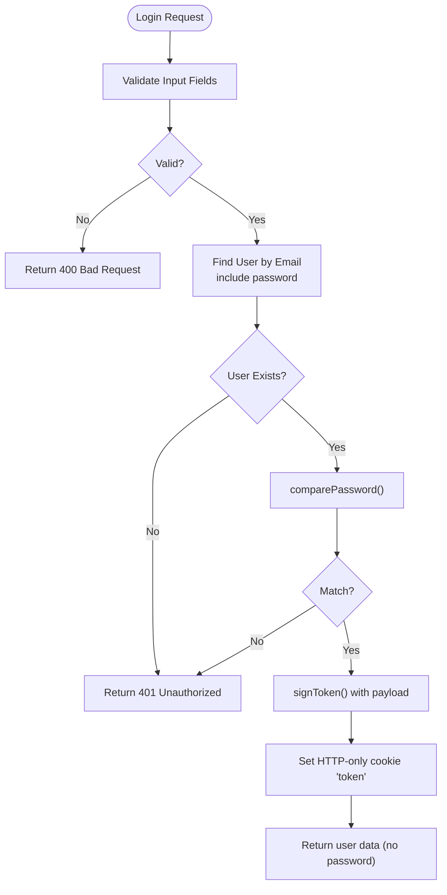
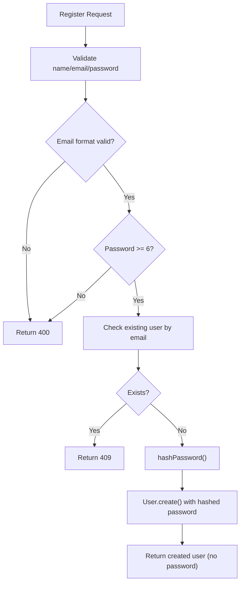
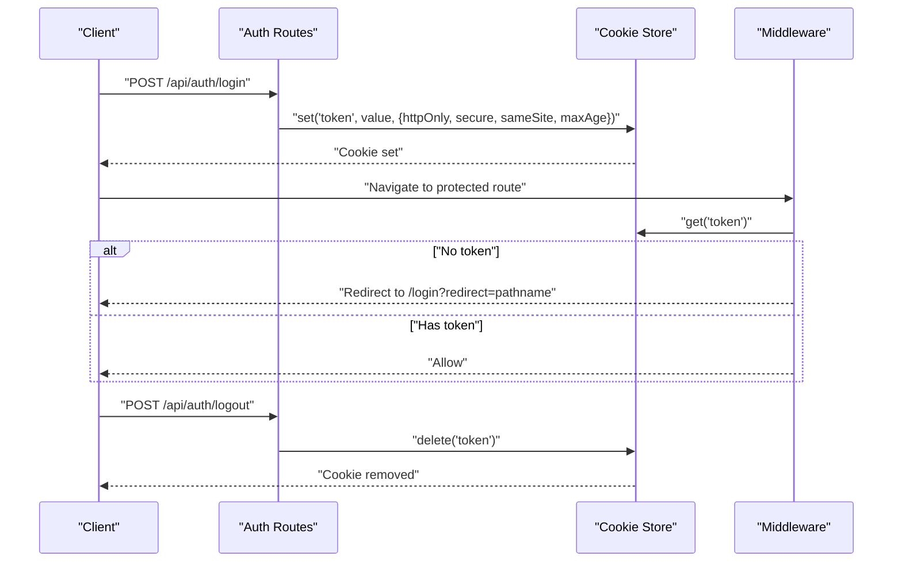
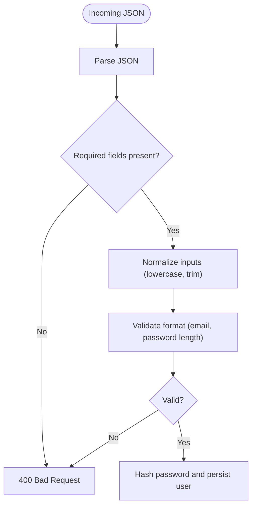
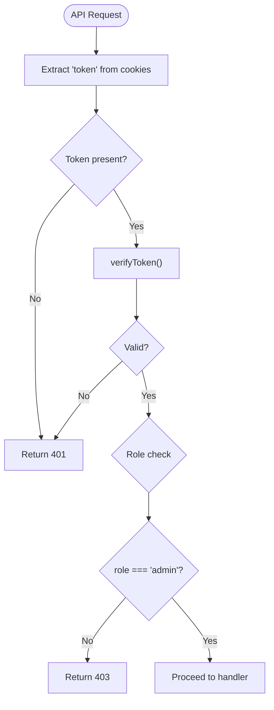
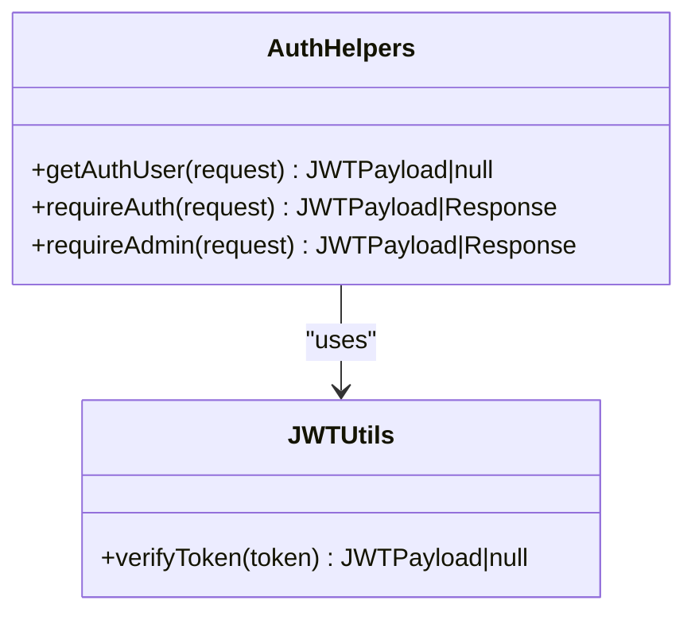
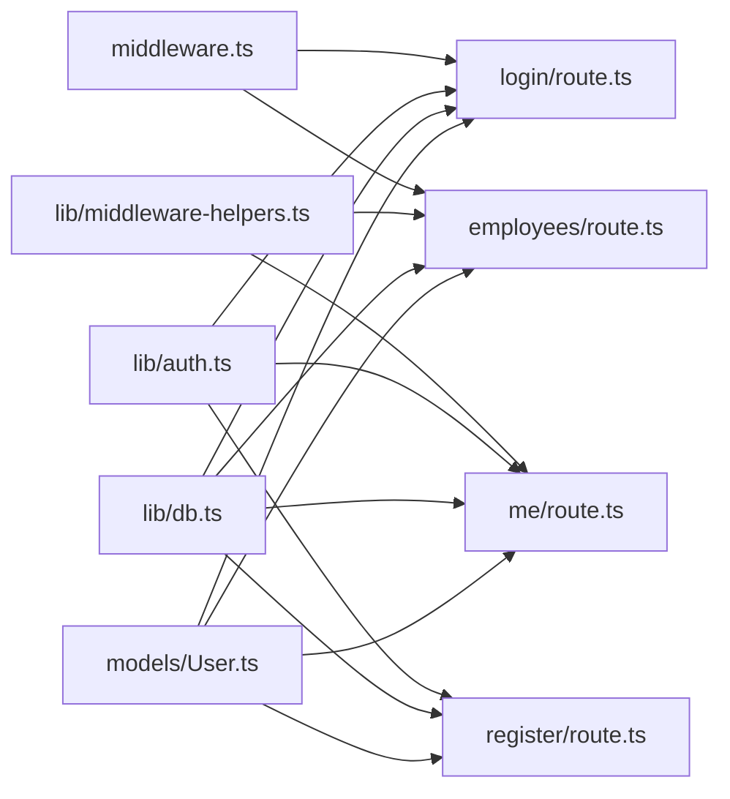

# Security Patterns

<cite>
**Referenced Files in This Document**
- [middleware.ts](file://middleware.ts)
- [middleware-helpers.ts](file://lib/middleware-helpers.ts)
- [auth.ts](file://lib/auth.ts)
- [db.ts](file://lib/db.ts)
- [User.ts](file://models/User.ts)
- [login/route.ts](file://app/api/auth/login/route.ts)
- [logout/route.ts](file://app/api/auth/logout/route.ts)
- [register/route.ts](file://app/api/auth/register/route.ts)
- [me/route.ts](file://app/api/auth/me/route.ts)
- [employees/route.ts](file://app/api/employees/route.ts)
</cite>

## Table of Contents
1. [Introduction](#introduction)
2. [Project Structure](#project-structure)
3. [Core Components](#core-components)
4. [Architecture Overview](#architecture-overview)
5. [Detailed Component Analysis](#detailed-component-analysis)
6. [Dependency Analysis](#dependency-analysis)
7. [Performance Considerations](#performance-considerations)
8. [Troubleshooting Guide](#troubleshooting-guide)
9. [Conclusion](#conclusion)

## Introduction
This document explains the security patterns and best practices implemented in the system. It covers JWT token generation and validation, password hashing strategies, session-like management via HTTP-only cookies, CORS configuration, CSRF protection, input sanitization, role-based access control (RBAC), permission checking mechanisms, and secure API endpoint design. It also includes examples of secure authentication flows, token refresh patterns, and security middleware configurations.

## Project Structure
Security-related logic is organized across middleware, authentication utilities, database connection helpers, and API routes:
- Middleware enforces route-level access checks and redirects unauthenticated users.
- Authentication utilities handle password hashing/verification and JWT signing/verification.
- Database connection helper ensures consistent DB initialization and caching.
- API routes implement RBAC and protect sensitive endpoints.

**Diagram sources**
- [middleware.ts:1-35](file://middleware.ts#L1-L35)
- [middleware-helpers.ts:1-81](file://lib/middleware-helpers.ts#L1-L81)
- [auth.ts:1-50](file://lib/auth.ts#L1-L50)
- [db.ts:1-54](file://lib/db.ts#L1-L54)
- [User.ts:1-50](file://models/User.ts#L1-L50)
- [login/route.ts:1-101](file://app/api/auth/login/route.ts#L1-L101)
- [logout/route.ts:1-31](file://app/api/auth/logout/route.ts#L1-L31)
- [register/route.ts:1-102](file://app/api/auth/register/route.ts#L1-L102)
- [me/route.ts:1-66](file://app/api/auth/me/route.ts#L1-L66)
- [employees/route.ts:1-311](file://app/api/employees/route.ts#L1-L311)

**Section sources**
- [middleware.ts:1-35](file://middleware.ts#L1-L35)
- [middleware-helpers.ts:1-81](file://lib/middleware-helpers.ts#L1-L81)
- [auth.ts:1-50](file://lib/auth.ts#L1-L50)
- [db.ts:1-54](file://lib/db.ts#L1-L54)
- [User.ts:1-50](file://models/User.ts#L1-L50)
- [login/route.ts:1-101](file://app/api/auth/login/route.ts#L1-L101)
- [logout/route.ts:1-31](file://app/api/auth/logout/route.ts#L1-L31)
- [register/route.ts:1-102](file://app/api/auth/register/route.ts#L1-L102)
- [me/route.ts:1-66](file://app/api/auth/me/route.ts#L1-L66)
- [employees/route.ts:1-311](file://app/api/employees/route.ts#L1-L311)

## Core Components
- JWT utilities: Password hashing/verification, JWT signing/verification, and secret management.
- Middleware helpers: Authentication extraction and RBAC enforcement.
- Database helper: Robust connection caching and initialization.
- Models: Secure schema design with selective field exposure and indexes.
- API routes: Comprehensive validation, RBAC, and secure cookie handling.

Key implementation highlights:
- Password hashing uses bcrypt with 12 rounds.
- JWT signing uses a server-side secret with 7-day expiry.
- Tokens stored in HTTP-only cookies with production-grade flags.
- Middleware performs presence checks; full verification occurs in API routes.
- RBAC enforced via dedicated helpers for admin-only endpoints.

**Section sources**
- [auth.ts:1-50](file://lib/auth.ts#L1-L50)
- [middleware-helpers.ts:1-81](file://lib/middleware-helpers.ts#L1-L81)
- [db.ts:1-54](file://lib/db.ts#L1-L54)
- [User.ts:1-50](file://models/User.ts#L1-L50)
- [login/route.ts:1-101](file://app/api/auth/login/route.ts#L1-L101)
- [logout/route.ts:1-31](file://app/api/auth/logout/route.ts#L1-L31)
- [register/route.ts:1-102](file://app/api/auth/register/route.ts#L1-L102)
- [me/route.ts:1-66](file://app/api/auth/me/route.ts#L1-L66)
- [employees/route.ts:1-311](file://app/api/employees/route.ts#L1-L311)

## Architecture Overview
The system enforces authentication and authorization at two layers:
- Route-level middleware for basic access checks.
- Endpoint-level verification for robust token validation and RBAC.

**Diagram sources**
- [middleware.ts:13-29](file://middleware.ts#L13-L29)
- [middleware-helpers.ts:10-26](file://lib/middleware-helpers.ts#L10-L26)
- [auth.ts:42-49](file://lib/auth.ts#L42-L49)
- [db.ts:28-51](file://lib/db.ts#L28-L51)
- [User.ts:1-50](file://models/User.ts#L1-L50)
- [login/route.ts:1-101](file://app/api/auth/login/route.ts#L1-L101)
- [me/route.ts:1-66](file://app/api/auth/me/route.ts#L1-L66)

## Detailed Component Analysis

### JWT Token Generation and Validation
- Secret management: JWT_SECRET must be defined; missing secret causes startup failure.
- Signing: Payload includes user identity and role; expires in 7 days.
- Verification: Centralized verifyToken handles decoding and catches errors gracefully.
- Cookie storage: HTTP-only cookie with secure flag enabled in production, lax SameSite, 7-day max age.

**Diagram sources**
- [login/route.ts:11-99](file://app/api/auth/login/route.ts#L11-L99)
- [auth.ts:16-49](file://lib/auth.ts#L16-L49)

**Section sources**
- [auth.ts:5-11](file://lib/auth.ts#L5-L11)
- [auth.ts:33-37](file://lib/auth.ts#L33-L37)
- [auth.ts:42-49](file://lib/auth.ts#L42-L49)
- [login/route.ts:57-72](file://app/api/auth/login/route.ts#L57-L72)

### Password Hashing Strategies
- bcrypt with 12 rounds is used for hashing and comparison.
- Registration endpoint validates email format and password length, hashes the password, and stores it.
- Model schema excludes password by default from queries to reduce exposure.

**Diagram sources**
- [register/route.ts:14-90](file://app/api/auth/register/route.ts#L14-L90)
- [auth.ts:16-28](file://lib/auth.ts#L16-L28)
- [User.ts:18-22](file://models/User.ts#L18-L22)

**Section sources**
- [auth.ts:16-28](file://lib/auth.ts#L16-L28)
- [register/route.ts:25-46](file://app/api/auth/register/route.ts#L25-L46)
- [User.ts:18-22](file://models/User.ts#L18-L22)

### Session Management with HTTP-Only Cookies
- Login sets a token cookie with httpOnly, secure (production), lax SameSite, 7-day maxAge, and root path.
- Logout deletes the token cookie.
- Middleware checks for token presence and redirects unauthenticated requests to login.
- API routes perform full JWT verification and RBAC checks.

**Diagram sources**
- [login/route.ts:64-72](file://app/api/auth/login/route.ts#L64-L72)
- [logout/route.ts:9-11](file://app/api/auth/logout/route.ts#L9-L11)
- [middleware.ts:16-24](file://middleware.ts#L16-L24)

**Section sources**
- [login/route.ts:64-72](file://app/api/auth/login/route.ts#L64-L72)
- [logout/route.ts:9-11](file://app/api/auth/logout/route.ts#L9-L11)
- [middleware.ts:13-29](file://middleware.ts#L13-L29)

### CORS Configuration
- The repository does not include explicit CORS configuration in the provided files.
- Recommendation: Configure CORS at the framework level to restrict origins, methods, and headers, and to avoid wildcard origins in production.

[No sources needed since this section provides general guidance]

### CSRF Protection
- The repository does not include CSRF protection middleware or tokens in the provided files.
- Recommendation: Implement CSRF protection using anti-CSRF tokens or SameSite cookies with strict policy for state-changing requests.

[No sources needed since this section provides general guidance]

### Input Sanitization and Validation
- Registration endpoint validates email format and password length and normalizes inputs (lowercase email, trimmed name/department).
- Login endpoint validates presence of required fields.
- API routes consistently return structured error responses with appropriate HTTP status codes.

**Diagram sources**
- [register/route.ts:11-73](file://app/api/auth/register/route.ts#L11-L73)
- [login/route.ts:12-24](file://app/api/auth/login/route.ts#L12-L24)

**Section sources**
- [register/route.ts:14-46](file://app/api/auth/register/route.ts#L14-L46)
- [login/route.ts:15-24](file://app/api/auth/login/route.ts#L15-L24)

### Role-Based Access Control (RBAC)
- Middleware enforces route-level access by checking for the presence of the token cookie.
- API-level RBAC helpers:
  - requireAuth: Ensures a valid token and returns the user payload or a 401 response.
  - requireAdmin: Ensures admin role after authentication or returns a 403 response.
- Employee management endpoints wrap all handlers with requireAdmin to enforce admin-only access.

**Diagram sources**
- [middleware.ts:16-24](file://middleware.ts#L16-L24)
- [middleware-helpers.ts:10-26](file://lib/middleware-helpers.ts#L10-L26)
- [middleware-helpers.ts:54-79](file://lib/middleware-helpers.ts#L54-L79)
- [employees/route.ts:14-18](file://app/api/employees/route.ts#L14-L18)

**Section sources**
- [middleware.ts:13-29](file://middleware.ts#L13-L29)
- [middleware-helpers.ts:32-48](file://lib/middleware-helpers.ts#L32-L48)
- [middleware-helpers.ts:54-79](file://lib/middleware-helpers.ts#L54-L79)
- [employees/route.ts:14-18](file://app/api/employees/route.ts#L14-L18)

### Permission Checking Mechanisms
- requireAuth centralizes authentication checks and returns either the user payload or a 401 response.
- requireAdmin centralizes admin checks and returns either the user payload or a 403 response.
- These helpers are reused across endpoints to maintain consistent RBAC behavior.

**Diagram sources**
- [middleware-helpers.ts:10-80](file://lib/middleware-helpers.ts#L10-L80)
- [auth.ts:42-49](file://lib/auth.ts#L42-L49)

**Section sources**
- [middleware-helpers.ts:10-80](file://lib/middleware-helpers.ts#L10-L80)
- [auth.ts:42-49](file://lib/auth.ts#L42-L49)

### Secure API Endpoint Design
- All sensitive endpoints are protected by RBAC helpers.
- Input validation and normalization occur at the route level.
- Structured error responses with appropriate HTTP status codes are returned.
- Database operations are wrapped with centralized connection logic.

Examples of protected endpoints:
- GET /api/employees (admin-only)
- POST /api/employees (admin-only)
- PUT /api/employees (admin-only)
- DELETE /api/employees (admin-only)
- GET /api/auth/me (authenticated-only)

**Section sources**
- [employees/route.ts:9-60](file://app/api/employees/route.ts#L9-L60)
- [employees/route.ts:62-141](file://app/api/employees/route.ts#L62-L141)
- [employees/route.ts:143-236](file://app/api/employees/route.ts#L143-L236)
- [employees/route.ts:238-311](file://app/api/employees/route.ts#L238-L311)
- [me/route.ts:7-54](file://app/api/auth/me/route.ts#L7-L54)

### Token Refresh Patterns
- Current implementation uses a single long-lived token stored in an HTTP-only cookie.
- Recommended pattern: Separate short-lived access token and long-lived refresh token strategy with a dedicated refresh endpoint that validates the refresh token and issues a new access token.

[No sources needed since this section provides general guidance]

### Security Middleware Configurations
- Middleware runs on protected routes (/admin/* and /employee/*) and redirects to login if the token cookie is absent.
- Full JWT verification and RBAC checks are performed in API routes for stronger security guarantees.

**Section sources**
- [middleware.ts:31-34](file://middleware.ts#L31-L34)
- [middleware.ts:13-29](file://middleware.ts#L13-L29)

## Dependency Analysis
The following diagram shows the primary dependencies among security-related modules:

**Diagram sources**
- [middleware.ts:1-35](file://middleware.ts#L1-L35)
- [middleware-helpers.ts:1-81](file://lib/middleware-helpers.ts#L1-L81)
- [auth.ts:1-50](file://lib/auth.ts#L1-L50)
- [db.ts:1-54](file://lib/db.ts#L1-L54)
- [User.ts:1-50](file://models/User.ts#L1-L50)
- [login/route.ts:1-101](file://app/api/auth/login/route.ts#L1-L101)
- [logout/route.ts:1-31](file://app/api/auth/logout/route.ts#L1-L31)
- [register/route.ts:1-102](file://app/api/auth/register/route.ts#L1-L102)
- [me/route.ts:1-66](file://app/api/auth/me/route.ts#L1-L66)
- [employees/route.ts:1-311](file://app/api/employees/route.ts#L1-L311)

**Section sources**
- [middleware.ts:1-35](file://middleware.ts#L1-L35)
- [middleware-helpers.ts:1-81](file://lib/middleware-helpers.ts#L1-L81)
- [auth.ts:1-50](file://lib/auth.ts#L1-L50)
- [db.ts:1-54](file://lib/db.ts#L1-L54)
- [User.ts:1-50](file://models/User.ts#L1-L50)
- [login/route.ts:1-101](file://app/api/auth/login/route.ts#L1-L101)
- [logout/route.ts:1-31](file://app/api/auth/logout/route.ts#L1-L31)
- [register/route.ts:1-102](file://app/api/auth/register/route.ts#L1-L102)
- [me/route.ts:1-66](file://app/api/auth/me/route.ts#L1-L66)
- [employees/route.ts:1-311](file://app/api/employees/route.ts#L1-L311)

## Performance Considerations
- JWT verification is lightweight; ensure the secret is securely managed and not logged.
- bcrypt cost of 12 provides a good balance; adjust based on hardware capabilities.
- HTTP-only cookies prevent client-side JavaScript access, reducing XSS risks.
- Database connection caching avoids repeated connections; ensure proper error handling on connection failures.

[No sources needed since this section provides general guidance]

## Troubleshooting Guide
Common issues and resolutions:
- Missing JWT_SECRET: Startup throws an error indicating the environment variable must be defined.
- Invalid or expired token: verifyToken returns null; API routes respond with 401.
- Missing token cookie: Middleware redirects to login with redirect query parameter.
- Insufficient permissions: requireAdmin returns 403 for non-admin users.
- Database connectivity errors: db.ts caches and retries connections; inspect logs for connection failures.

**Section sources**
- [auth.ts:7-11](file://lib/auth.ts#L7-L11)
- [auth.ts:42-49](file://lib/auth.ts#L42-L49)
- [middleware.ts:20-24](file://middleware.ts#L20-L24)
- [middleware-helpers.ts:59-77](file://lib/middleware-helpers.ts#L59-L77)
- [db.ts:33-48](file://lib/db.ts#L33-L48)

## Conclusion
The system implements a layered security model with strong foundations:
- Robust password hashing and JWT-based authentication.
- Secure cookie storage with production-grade flags.
- Middleware and API-level RBAC enforcement.
- Input validation and normalized processing.
To further harden the system, consider adding explicit CORS configuration, CSRF protection, and a token refresh strategy with separate access/refresh tokens.