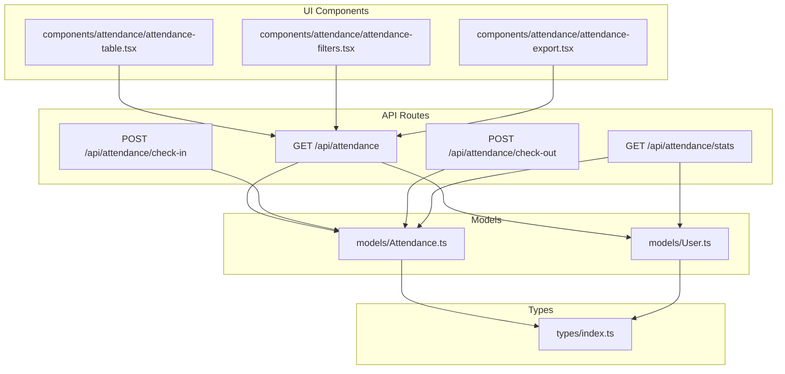
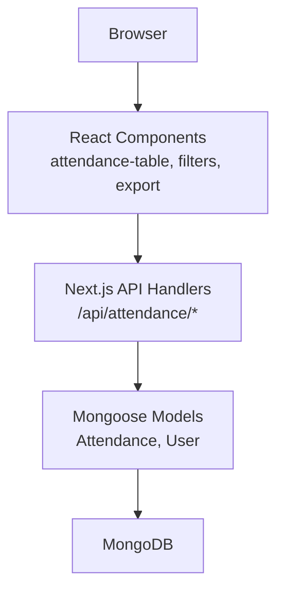
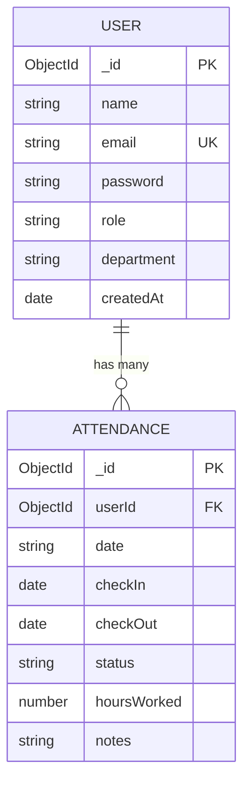
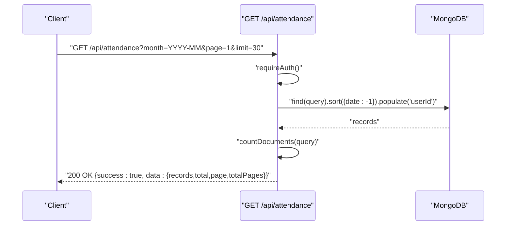
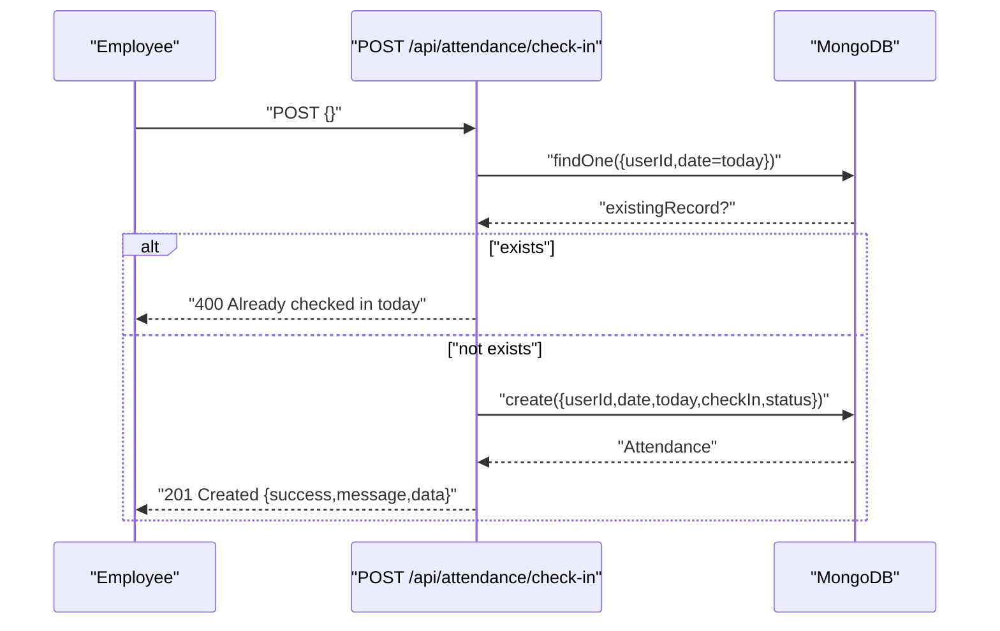
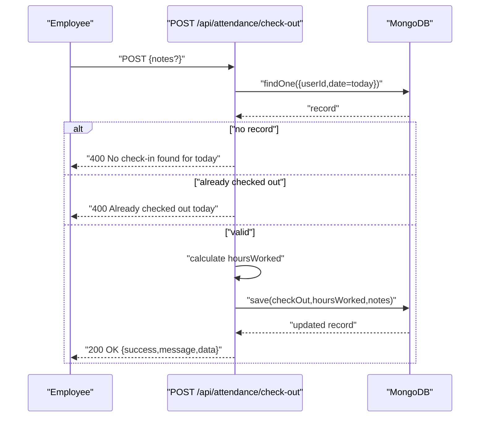
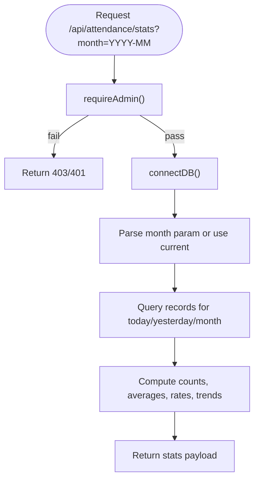
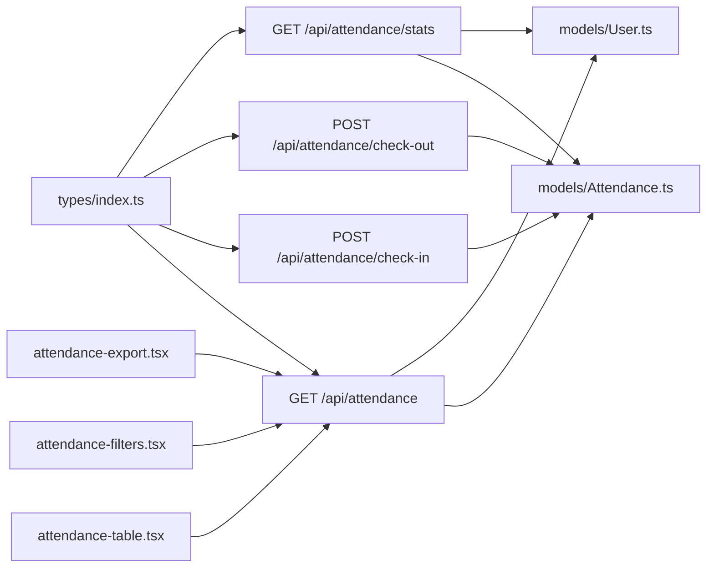

# Attendance Management

<cite>
**Referenced Files in This Document**
- [app/api/attendance/route.ts](file://app/api/attendance/route.ts)
- [app/api/attendance/check-in/route.ts](file://app/api/attendance/check-in/route.ts)
- [app/api/attendance/check-out/route.ts](file://app/api/attendance/check-out/route.ts)
- [app/api/attendance/stats/route.ts](file://app/api/attendance/stats/route.ts)
- [models/Attendance.ts](file://models/Attendance.ts)
- [models/User.ts](file://models/User.ts)
- [types/index.ts](file://types/index.ts)
- [components/attendance/attendance-table.tsx](file://components/attendance/attendance-table.tsx)
- [components/attendance/attendance-filters.tsx](file://components/attendance/attendance-filters.tsx)
- [components/attendance/attendance-export.tsx](file://components/attendance/attendance-export.tsx)
</cite>

## Table of Contents
1. [Introduction](#introduction)
2. [Project Structure](#project-structure)
3. [Core Components](#core-components)
4. [Architecture Overview](#architecture-overview)
5. [Detailed Component Analysis](#detailed-component-analysis)
6. [Dependency Analysis](#dependency-analysis)
7. [Performance Considerations](#performance-considerations)
8. [Troubleshooting Guide](#troubleshooting-guide)
9. [Conclusion](#conclusion)
10. [Appendices](#appendices)

## Introduction
This document provides comprehensive documentation for the Attendance Management system. It covers the complete check-in and check-out workflow, reporting and statistics, API endpoints, data models, validation rules, and UI components for displaying, filtering, and exporting attendance data. It also outlines database schema design, relationships, and data integrity constraints, along with practical examples, edge cases, and integration considerations with payroll systems.

## Project Structure
The system follows a Next.js app router structure with API routes under app/api and domain models under models. UI components are organized under components/attendance and shared UI primitives under components/ui. Type definitions reside in types/index.ts.

**Diagram sources**
- [app/api/attendance/route.ts:30-95](file://app/api/attendance/route.ts#L30-L95)
- [app/api/attendance/check-in/route.ts:7-78](file://app/api/attendance/check-in/route.ts#L7-L78)
- [app/api/attendance/check-out/route.ts:7-89](file://app/api/attendance/check-out/route.ts#L7-L89)
- [app/api/attendance/stats/route.ts:8-113](file://app/api/attendance/stats/route.ts#L8-L113)
- [models/Attendance.ts:4-57](file://models/Attendance.ts#L4-L57)
- [models/User.ts:4-47](file://models/User.ts#L4-L47)
- [types/index.ts:1-61](file://types/index.ts#L1-L61)
- [components/attendance/attendance-table.tsx:79-125](file://components/attendance/attendance-table.tsx#L79-L125)
- [components/attendance/attendance-filters.tsx:34-144](file://components/attendance/attendance-filters.tsx#L34-L144)
- [components/attendance/attendance-export.tsx:119-143](file://components/attendance/attendance-export.tsx#L119-L143)

**Section sources**
- [app/api/attendance/route.ts:30-95](file://app/api/attendance/route.ts#L30-L95)
- [app/api/attendance/check-in/route.ts:7-78](file://app/api/attendance/check-in/route.ts#L7-L78)
- [app/api/attendance/check-out/route.ts:7-89](file://app/api/attendance/check-out/route.ts#L7-L89)
- [app/api/attendance/stats/route.ts:8-113](file://app/api/attendance/stats/route.ts#L8-L113)
- [models/Attendance.ts:4-57](file://models/Attendance.ts#L4-L57)
- [models/User.ts:4-47](file://models/User.ts#L4-L47)
- [types/index.ts:1-61](file://types/index.ts#L1-L61)
- [components/attendance/attendance-table.tsx:79-125](file://components/attendance/attendance-table.tsx#L79-L125)
- [components/attendance/attendance-filters.tsx:34-144](file://components/attendance/attendance-filters.tsx#L34-L144)
- [components/attendance/attendance-export.tsx:119-143](file://components/attendance/attendance-export.tsx#L119-L143)

## Core Components
- Attendance API endpoints:
  - List monthly attendance with pagination and optional filters
  - Check-in for the current day with late status detection
  - Check-out for the current day with hours calculation
  - Statistics dashboard for present/absent/late counts, averages, and trends
- Data models:
  - Attendance: user association, date, check-in/out timestamps, status, hours worked, notes
  - User: name, email, role, department, timestamps
- UI components:
  - Attendance table for displaying records
  - Filters for month, employee, status, and search
  - Export to CSV functionality
- Types:
  - Role and status enums, request bodies, API response wrapper

**Section sources**
- [app/api/attendance/route.ts:30-95](file://app/api/attendance/route.ts#L30-L95)
- [app/api/attendance/check-in/route.ts:7-78](file://app/api/attendance/check-in/route.ts#L7-L78)
- [app/api/attendance/check-out/route.ts:7-89](file://app/api/attendance/check-out/route.ts#L7-L89)
- [app/api/attendance/stats/route.ts:8-113](file://app/api/attendance/stats/route.ts#L8-L113)
- [models/Attendance.ts:4-57](file://models/Attendance.ts#L4-L57)
- [models/User.ts:4-47](file://models/User.ts#L4-L47)
- [types/index.ts:1-61](file://types/index.ts#L1-L61)
- [components/attendance/attendance-table.tsx:79-125](file://components/attendance/attendance-table.tsx#L79-L125)
- [components/attendance/attendance-filters.tsx:34-144](file://components/attendance/attendance-filters.tsx#L34-L144)
- [components/attendance/attendance-export.tsx:119-143](file://components/attendance/attendance-export.tsx#L119-L143)

## Architecture Overview
The system uses a layered architecture:
- Presentation layer: React components for attendance display, filtering, and export
- API layer: Next.js app router handlers implementing CRUD-like operations for attendance
- Domain layer: Mongoose models for Attendance and User
- Data layer: MongoDB via Mongoose ODM

**Diagram sources**
- [components/attendance/attendance-table.tsx:79-125](file://components/attendance/attendance-table.tsx#L79-L125)
- [components/attendance/attendance-filters.tsx:34-144](file://components/attendance/attendance-filters.tsx#L34-L144)
- [components/attendance/attendance-export.tsx:119-143](file://components/attendance/attendance-export.tsx#L119-L143)
- [app/api/attendance/route.ts:30-95](file://app/api/attendance/route.ts#L30-L95)
- [app/api/attendance/check-in/route.ts:7-78](file://app/api/attendance/check-in/route.ts#L7-L78)
- [app/api/attendance/check-out/route.ts:7-89](file://app/api/attendance/check-out/route.ts#L7-L89)
- [app/api/attendance/stats/route.ts:8-113](file://app/api/attendance/stats/route.ts#L8-L113)
- [models/Attendance.ts:4-57](file://models/Attendance.ts#L4-L57)
- [models/User.ts:4-47](file://models/User.ts#L4-L47)

## Detailed Component Analysis

### Data Models and Schema
The Attendance and User models define the core data structures and constraints.

Key constraints and indexes:
- Compound index on (userId, date) ensures uniqueness per user per day
- Index on date for efficient date-range queries
- Index on userId for user lookups
- Unique email on User

**Diagram sources**
- [models/Attendance.ts:4-57](file://models/Attendance.ts#L4-L57)
- [models/User.ts:4-47](file://models/User.ts#L4-L47)

**Section sources**
- [models/Attendance.ts:4-57](file://models/Attendance.ts#L4-L57)
- [models/User.ts:4-47](file://models/User.ts#L4-L47)
- [types/index.ts:6-25](file://types/index.ts#L6-L25)

### Attendance API Endpoints

#### GET /api/attendance
- Purpose: Retrieve paginated attendance records with optional month filter
- Authentication: Required; enforces role-based access
- Query parameters:
  - month: YYYY-MM for month filter
  - page: integer page number (default 1)
  - limit: integer page size (default 30)
- Behavior:
  - Admin sees all records; employee sees only their own
  - Applies date range filter when month is provided
  - Returns records with populated user info (name, email, department)

**Diagram sources**
- [app/api/attendance/route.ts:30-95](file://app/api/attendance/route.ts#L30-L95)

**Section sources**
- [app/api/attendance/route.ts:30-95](file://app/api/attendance/route.ts#L30-L95)
- [types/index.ts:27-32](file://types/index.ts#L27-L32)

#### POST /api/attendance/check-in
- Purpose: Record employee check-in for the current day
- Authentication: Required; employee only
- Validation rules:
  - Cannot check in twice on the same day
  - Late status determined by time threshold (after 9:00 AM)
- Response includes created record identifiers and status

**Diagram sources**
- [app/api/attendance/check-in/route.ts:7-78](file://app/api/attendance/check-in/route.ts#L7-L78)

**Section sources**
- [app/api/attendance/check-in/route.ts:7-78](file://app/api/attendance/check-in/route.ts#L7-L78)
- [types/index.ts:54-56](file://types/index.ts#L54-L56)

#### POST /api/attendance/check-out
- Purpose: Record employee check-out for the current day and compute hours worked
- Authentication: Required; employee only
- Validation rules:
  - Must have a check-in record for the day
  - Cannot check out twice on the same day
- Hours calculation:
  - Difference between check-out and check-in in hours, rounded to two decimals
- Notes:
  - Existing notes are preserved; new notes appended with separator if provided

**Diagram sources**
- [app/api/attendance/check-out/route.ts:7-89](file://app/api/attendance/check-out/route.ts#L7-L89)

**Section sources**
- [app/api/attendance/check-out/route.ts:7-89](file://app/api/attendance/check-out/route.ts#L7-L89)
- [types/index.ts:58-60](file://types/index.ts#L58-L60)

#### GET /api/attendance/stats
- Purpose: Generate administrative statistics for a given month
- Authentication: Admin required
- Calculations:
  - Present, absent, late counts for today and yesterday (trends)
  - Average hours worked for the month
  - Attendance rate based on working days (Monday-Friday)
  - Late occurrences for the month
- Working days calculation excludes weekends

**Diagram sources**
- [app/api/attendance/stats/route.ts:8-113](file://app/api/attendance/stats/route.ts#L8-L113)

**Section sources**
- [app/api/attendance/stats/route.ts:8-113](file://app/api/attendance/stats/route.ts#L8-L113)

### Business Logic: Check-in/Check-out Validation and Overtime

- Daily uniqueness:
  - Compound index prevents duplicate check-ins per user per day
- Check-in validation:
  - Enforces single check-in per day
  - Determines late status based on time threshold
- Check-out validation:
  - Requires prior check-in
  - Prevents multiple check-outs
  - Calculates worked hours from timestamps
- Overtime:
  - Not explicitly calculated in the provided code
  - Can be derived by comparing hoursWorked against standard work hours per policy

**Section sources**
- [models/Attendance.ts:43-47](file://models/Attendance.ts#L43-L47)
- [app/api/attendance/check-in/route.ts:20-33](file://app/api/attendance/check-in/route.ts#L20-L33)
- [app/api/attendance/check-out/route.ts:20-43](file://app/api/attendance/check-out/route.ts#L20-L43)
- [app/api/attendance/check-out/route.ts:46-48](file://app/api/attendance/check-out/route.ts#L46-L48)

### Reporting and Statistics Generation
- Monthly aggregation:
  - Uses date range queries to compute monthly metrics
- Attendance rate:
  - Expected vs actual based on working days
- Trends:
  - Percentage change from yesterday to today for present and late counts

**Section sources**
- [app/api/attendance/stats/route.ts:50-84](file://app/api/attendance/stats/route.ts#L50-L84)
- [app/api/attendance/stats/route.ts:116-130](file://app/api/attendance/stats/route.ts#L116-L130)

### UI Components for Attendance Display, Filtering, and Export

#### Attendance Table
- Displays employee name, department, date, check-in/out times, hours worked, and status badges
- Formats dates/times for readability
- Handles missing values gracefully

**Section sources**
- [components/attendance/attendance-table.tsx:79-125](file://components/attendance/attendance-table.tsx#L79-L125)

#### Attendance Filters
- Provides month picker, employee dropdown, status filter, and free-text search
- Loads employees dynamically from the employees endpoint
- Supports apply/reset actions

**Section sources**
- [components/attendance/attendance-filters.tsx:34-144](file://components/attendance/attendance-filters.tsx#L34-L144)

#### Attendance Export
- Generates CSV with headers: Name, Email, Department, Date, Check In, Check Out, Hours, Status
- Escapes CSV values safely
- Downloads file named attendance-YYYY-MM.csv by default

**Section sources**
- [components/attendance/attendance-export.tsx:119-143](file://components/attendance/attendance-export.tsx#L119-L143)

## Dependency Analysis
- API routes depend on:
  - Authentication middleware for access control
  - Mongoose models for persistence
  - Shared types for request/response contracts
- UI components depend on:
  - API routes for data fetching
  - Shared UI primitives for consistent UX

**Diagram sources**
- [types/index.ts:1-61](file://types/index.ts#L1-L61)
- [app/api/attendance/route.ts:30-95](file://app/api/attendance/route.ts#L30-L95)
- [app/api/attendance/check-in/route.ts:7-78](file://app/api/attendance/check-in/route.ts#L7-L78)
- [app/api/attendance/check-out/route.ts:7-89](file://app/api/attendance/check-out/route.ts#L7-L89)
- [app/api/attendance/stats/route.ts:8-113](file://app/api/attendance/stats/route.ts#L8-L113)
- [models/Attendance.ts:4-57](file://models/Attendance.ts#L4-L57)
- [models/User.ts:4-47](file://models/User.ts#L4-L47)
- [components/attendance/attendance-table.tsx:79-125](file://components/attendance/attendance-table.tsx#L79-L125)
- [components/attendance/attendance-filters.tsx:34-144](file://components/attendance/attendance-filters.tsx#L34-L144)
- [components/attendance/attendance-export.tsx:119-143](file://components/attendance/attendance-export.tsx#L119-L143)

**Section sources**
- [types/index.ts:1-61](file://types/index.ts#L1-L61)
- [models/Attendance.ts:4-57](file://models/Attendance.ts#L4-L57)
- [models/User.ts:4-47](file://models/User.ts#L4-L47)
- [app/api/attendance/route.ts:30-95](file://app/api/attendance/route.ts#L30-L95)
- [app/api/attendance/check-in/route.ts:7-78](file://app/api/attendance/check-in/route.ts#L7-L78)
- [app/api/attendance/check-out/route.ts:7-89](file://app/api/attendance/check-out/route.ts#L7-L89)
- [app/api/attendance/stats/route.ts:8-113](file://app/api/attendance/stats/route.ts#L8-L113)
- [components/attendance/attendance-table.tsx:79-125](file://components/attendance/attendance-table.tsx#L79-L125)
- [components/attendance/attendance-filters.tsx:34-144](file://components/attendance/attendance-filters.tsx#L34-L144)
- [components/attendance/attendance-export.tsx:119-143](file://components/attendance/attendance-export.tsx#L119-L143)

## Performance Considerations
- Indexing:
  - Compound (userId, date) prevents duplicate daily records
  - Separate indices on date and userId optimize queries
- Pagination:
  - Page size defaults to 30; adjust based on dataset size and network constraints
- Population:
  - Populate user fields only when needed to reduce payload size
- Aggregation:
  - Stats endpoint computes aggregates client-side; consider server-side aggregation for very large datasets

[No sources needed since this section provides general guidance]

## Troubleshooting Guide
- Authentication failures:
  - Ensure requests include valid session/credentials; admin-only endpoints require admin role
- Duplicate check-in:
  - Error indicates a record already exists for today; wait until next day or contact support
- No check-in found:
  - Check-out requires a prior check-in; verify check-in occurred on the same day
- Already checked out:
  - Attempting multiple check-outs on the same day is rejected
- Internal server errors:
  - Inspect server logs for detailed error messages; endpoints return generic 500 on exceptions

**Section sources**
- [app/api/attendance/check-in/route.ts:25-33](file://app/api/attendance/check-in/route.ts#L25-L33)
- [app/api/attendance/check-out/route.ts:25-43](file://app/api/attendance/check-out/route.ts#L25-L43)
- [app/api/attendance/route.ts:85-94](file://app/api/attendance/route.ts#L85-L94)
- [app/api/attendance/check-in/route.ts:68-77](file://app/api/attendance/check-in/route.ts#L68-L77)
- [app/api/attendance/check-out/route.ts:79-88](file://app/api/attendance/check-out/route.ts#L79-L88)
- [app/api/attendance/stats/route.ts:104-113](file://app/api/attendance/stats/route.ts#L104-L113)

## Conclusion
The Attendance Management system provides a robust foundation for tracking employee check-in/out, enforcing daily uniqueness, computing worked hours, and generating administrative reports. Its modular design supports future enhancements such as overtime computation, advanced payroll integrations, and expanded reporting capabilities.

[No sources needed since this section summarizes without analyzing specific files]

## Appendices

### API Definitions

- GET /api/attendance
  - Query params: month (YYYY-MM), page (integer), limit (integer)
  - Response: records array with pagination metadata
  - Access: authenticated; admin sees all; employee sees own
  - Section sources
    - [app/api/attendance/route.ts:30-95](file://app/api/attendance/route.ts#L30-L95)

- POST /api/attendance/check-in
  - Body: optional notes
  - Response: created record summary
  - Access: authenticated employee
  - Validation: no duplicate check-in today; late status based on time threshold
  - Section sources
    - [app/api/attendance/check-in/route.ts:7-78](file://app/api/attendance/check-in/route.ts#L7-L78)
    - [types/index.ts:54-56](file://types/index.ts#L54-L56)

- POST /api/attendance/check-out
  - Body: optional notes
  - Response: updated record summary with hours worked
  - Access: authenticated employee
  - Validation: requires prior check-in; prevents multiple check-outs
  - Section sources
    - [app/api/attendance/check-out/route.ts:7-89](file://app/api/attendance/check-out/route.ts#L7-L89)
    - [types/index.ts:58-60](file://types/index.ts#L58-L60)

- GET /api/attendance/stats
  - Query params: month (YYYY-MM)
  - Response: totals, averages, attendance rate, trends
  - Access: admin only
  - Section sources
    - [app/api/attendance/stats/route.ts:8-113](file://app/api/attendance/stats/route.ts#L8-L113)

### Example Scenarios and Edge Cases
- Employee checks in after 9:00 AM:
  - Status marked as late; hours computed normally
- Employee forgets to check out:
  - Subsequent check-in fails; must resolve via admin intervention
- Exporting empty results:
  - Export button disabled; UI handles gracefully
- Month boundary:
  - Stats endpoint uses proper last-day-of-month calculation

**Section sources**
- [app/api/attendance/check-in/route.ts:35-53](file://app/api/attendance/check-in/route.ts#L35-L53)
- [app/api/attendance/check-out/route.ts:20-62](file://app/api/attendance/check-out/route.ts#L20-L62)
- [components/attendance/attendance-export.tsx:120-130](file://components/attendance/attendance-export.tsx#L120-L130)
- [app/api/attendance/stats/route.ts:50-58](file://app/api/attendance/stats/route.ts#L50-L58)

### Payroll Integration Considerations
- Use hoursWorked for regular hours
- Use status to flag late arrivals for productivity metrics
- Use monthly stats for attendance rate and late counts
- Export CSV for third-party payroll systems

**Section sources**
- [app/api/attendance/stats/route.ts:60-76](file://app/api/attendance/stats/route.ts#L60-L76)
- [components/attendance/attendance-export.tsx:74-103](file://components/attendance/attendance-export.tsx#L74-L103)