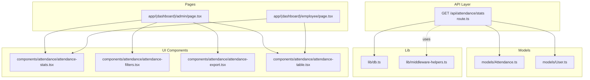
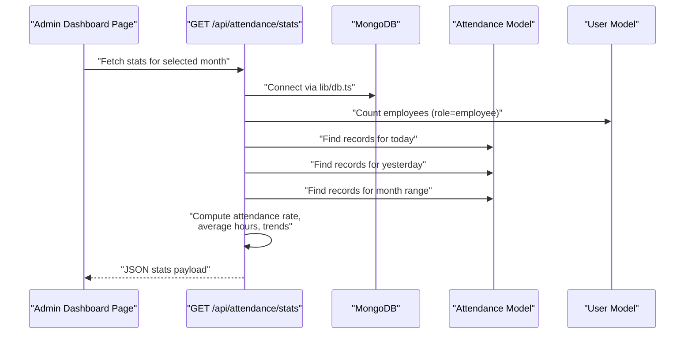
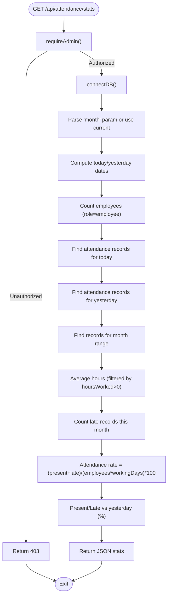
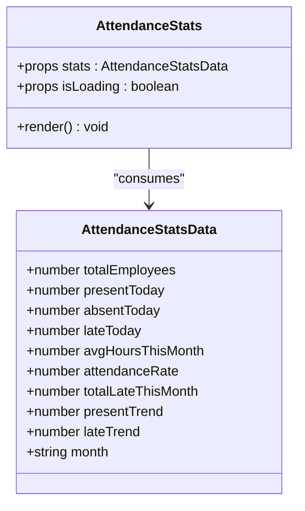
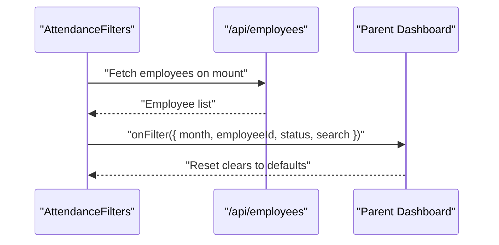
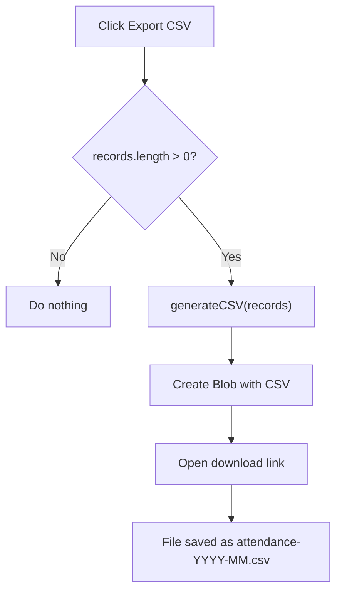
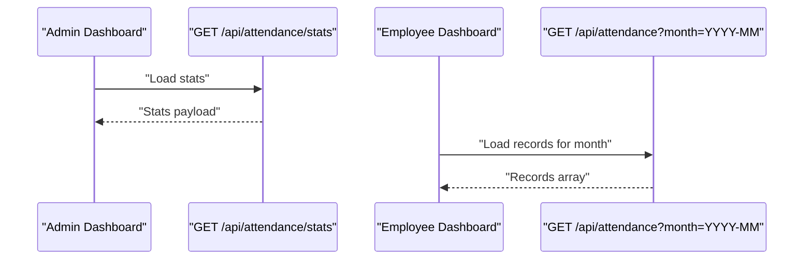
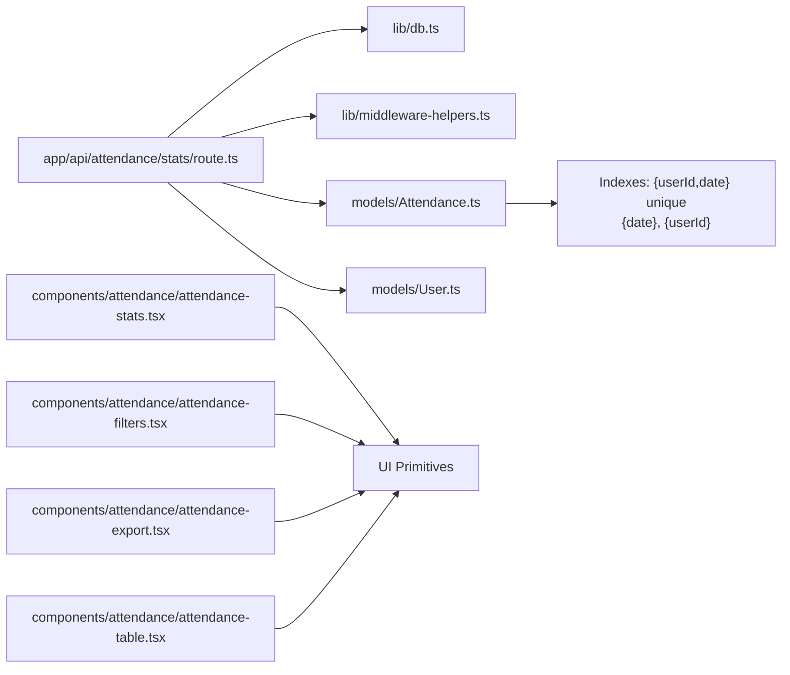

# Attendance Statistics and Reporting

<cite>
**Referenced Files in This Document**
- [route.ts](file://app/api/attendance/stats/route.ts)
- [attendance-stats.tsx](file://components/attendance/attendance-stats.tsx)
- [attendance-export.tsx](file://components/attendance/attendance-export.tsx)
- [attendance-filters.tsx](file://components/attendance/attendance-filters.tsx)
- [attendance-table.tsx](file://components/attendance/attendance-table.tsx)
- [Attendance.ts](file://models/Attendance.ts)
- [User.ts](file://models/User.ts)
- [db.ts](file://lib/db.ts)
- [middleware-helpers.ts](file://lib/middleware-helpers.ts)
- [page.tsx](file://app/(dashboard)/admin/page.tsx)
- [page.tsx](file://app/(dashboard)/employee/page.tsx)
</cite>

## Table of Contents
1. [Introduction](#introduction)
2. [Project Structure](#project-structure)
3. [Core Components](#core-components)
4. [Architecture Overview](#architecture-overview)
5. [Detailed Component Analysis](#detailed-component-analysis)
6. [Dependency Analysis](#dependency-analysis)
7. [Performance Considerations](#performance-considerations)
8. [Troubleshooting Guide](#troubleshooting-guide)
9. [Conclusion](#conclusion)

## Introduction
This document describes the attendance statistics and reporting system built with Next.js. It covers:
- The statistics API endpoint that computes daily/weekly/monthly metrics, present rates, late frequencies, absence patterns, and trends
- The statistics dashboard component that renders KPI cards and trend indicators
- The export functionality for CSV reports with customizable date ranges and filters
- Calculation algorithms for attendance percentages, monthly averages, and compliance reporting
- Practical examples for generating manager reports, HR analytics, and payroll preparation data

## Project Structure
The system is organized around a Next.js app router with TypeScript, MongoDB via Mongoose, and reusable UI components:
- API routes under app/api handle backend requests
- Models in models define Attendance and User collections
- Components in components/attendance implement UI for stats, filters, export, and tables
- lib contains database connection and middleware helpers
- Dashboard pages orchestrate data fetching and rendering

**Diagram sources**
- [route.ts:1-131](file://app/api/attendance/stats/route.ts#L1-L131)
- [Attendance.ts:1-58](file://models/Attendance.ts#L1-L58)
- [User.ts:1-50](file://models/User.ts#L1-L50)
- [db.ts:1-54](file://lib/db.ts#L1-L54)
- [middleware-helpers.ts:1-81](file://lib/middleware-helpers.ts#L1-L81)
- [attendance-stats.tsx:1-103](file://components/attendance/attendance-stats.tsx#L1-L103)
- [attendance-filters.tsx:1-145](file://components/attendance/attendance-filters.tsx#L1-L145)
- [attendance-export.tsx:1-144](file://components/attendance/attendance-export.tsx#L1-L144)
- [attendance-table.tsx:1-126](file://components/attendance/attendance-table.tsx#L1-L126)
- [page.tsx](file://app/(dashboard)/admin/page.tsx#L1-L44)
- [page.tsx](file://app/(dashboard)/employee/page.tsx#L79-L129)

**Section sources**
- [route.ts:1-131](file://app/api/attendance/stats/route.ts#L1-L131)
- [Attendance.ts:1-58](file://models/Attendance.ts#L1-L58)
- [User.ts:1-50](file://models/User.ts#L1-L50)
- [db.ts:1-54](file://lib/db.ts#L1-L54)
- [middleware-helpers.ts:1-81](file://lib/middleware-helpers.ts#L1-L81)
- [attendance-stats.tsx:1-103](file://components/attendance/attendance-stats.tsx#L1-L103)
- [attendance-filters.tsx:1-145](file://components/attendance/attendance-filters.tsx#L1-L145)
- [attendance-export.tsx:1-144](file://components/attendance/attendance-export.tsx#L1-L144)
- [attendance-table.tsx:1-126](file://components/attendance/attendance-table.tsx#L1-L126)
- [page.tsx](file://app/(dashboard)/admin/page.tsx#L1-L44)
- [page.tsx](file://app/(dashboard)/employee/page.tsx#L79-L129)

## Core Components
- Statistics API endpoint: Computes daily presence, lateness, absences, monthly averages, attendance rate, and trends
- Statistics dashboard card: Renders KPIs and trend indicators
- Filters: Month picker, employee selector, status filter, and free-text search
- Export: CSV generation and download for filtered records
- Attendance table: Tabular display of records with formatted fields

Key calculation highlights:
- Attendance rate: (present + late in month) / (total employees × working days) × 100
- Working days: weekdays in the selected month (weekends excluded)
- Trends: vs-yesterday percent change for present and late counts
- Average hours per day: average of hoursWorked for records with recorded hours

**Section sources**
- [route.ts:69-84](file://app/api/attendance/stats/route.ts#L69-L84)
- [route.ts:116-130](file://app/api/attendance/stats/route.ts#L116-L130)
- [attendance-stats.tsx:38-47](file://components/attendance/attendance-stats.tsx#L38-L47)
- [attendance-stats.tsx:77-82](file://components/attendance/attendance-stats.tsx#L77-L82)

## Architecture Overview
The system follows a layered architecture:
- Presentation: Dashboard pages and UI components
- Application: API route orchestrating data retrieval and computation
- Domain: Mongoose models for Attendance and User
- Infrastructure: Database connection and auth middleware

**Diagram sources**
- [route.ts:8-114](file://app/api/attendance/stats/route.ts#L8-L114)
- [db.ts:28-51](file://lib/db.ts#L28-L51)
- [User.ts:37-41](file://models/User.ts#L37-L41)
- [Attendance.ts:4-41](file://models/Attendance.ts#L4-L41)
- [page.tsx](file://app/(dashboard)/admin/page.tsx#L43-L44)

## Detailed Component Analysis

### Statistics API Endpoint
The endpoint validates admin access, connects to the database, parses the month parameter, and computes:
- Totals: total employees, present today, absent today, late today
- Monthly metrics: average hours worked, total late occurrences
- Attendance rate: based on working days (weekdays only)
- Trends: present and late vs yesterday

**Diagram sources**
- [route.ts:8-114](file://app/api/attendance/stats/route.ts#L8-L114)
- [route.ts:116-130](file://app/api/attendance/stats/route.ts#L116-L130)

**Section sources**
- [route.ts:8-114](file://app/api/attendance/stats/route.ts#L8-L114)
- [route.ts:116-130](file://app/api/attendance/stats/route.ts#L116-L130)

### Statistics Dashboard Component
The component renders six KPI cards:
- Present Today, Absent Today, Late Today, Attendance Rate, Average Hours/Day, Total Employees
- Uses trend indicators derived from percentage changes
- Responsive grid layout with loading skeleton

**Diagram sources**
- [attendance-stats.tsx:6-22](file://components/attendance/attendance-stats.tsx#L6-L22)

**Section sources**
- [attendance-stats.tsx:24-102](file://components/attendance/attendance-stats.tsx#L24-L102)

### Filters Component
Provides:
- Month picker (YYYY-MM)
- Employee dropdown (populated from /api/employees)
- Status filter (All, Present, Late, Absent)
- Free-text search by name
- Apply and Reset actions

**Diagram sources**
- [attendance-filters.tsx:52-67](file://components/attendance/attendance-filters.tsx#L52-L67)
- [attendance-filters.tsx:77-90](file://components/attendance/attendance-filters.tsx#L77-L90)

**Section sources**
- [attendance-filters.tsx:34-144](file://components/attendance/attendance-filters.tsx#L34-L144)

### Export Component
Generates CSV with:
- Headers: Name, Email, Department, Date, Check In, Check Out, Hours, Status
- Escapes CSV values properly
- Downloads a file named attendance-YYYY-MM.csv

**Diagram sources**
- [attendance-export.tsx:119-130](file://components/attendance/attendance-export.tsx#L119-L130)
- [attendance-export.tsx:74-103](file://components/attendance/attendance-export.tsx#L74-L103)

**Section sources**
- [attendance-export.tsx:119-143](file://components/attendance/attendance-export.tsx#L119-L143)

### Attendance Table Component
Displays records in a responsive table with:
- Formatted date and time fields
- Status badges mapped to variants
- Empty state messaging

**Section sources**
- [attendance-table.tsx:79-125](file://components/attendance/attendance-table.tsx#L79-L125)

### Dashboard Pages Integration
- Admin dashboard composes stats, filters, table, and export controls
- Employee dashboard fetches monthly records and computes personal stats

**Diagram sources**
- [page.tsx](file://app/(dashboard)/admin/page.tsx#L43-L44)
- [page.tsx](file://app/(dashboard)/employee/page.tsx#L112-L125)

**Section sources**
- [page.tsx](file://app/(dashboard)/admin/page.tsx#L1-L44)
- [page.tsx](file://app/(dashboard)/employee/page.tsx#L79-L129)

## Dependency Analysis
- API route depends on:
  - Database connection helper
  - Authentication middleware (admin)
  - Attendance and User models
- Components depend on:
  - UI primitives (neumorphic cards, buttons, inputs, selects, tables)
  - Shared formatting utilities (time/date/hours)
- Models define:
  - Compound index for unique daily records per user
  - Indices for date and user lookups to optimize queries

**Diagram sources**
- [route.ts:1-6](file://app/api/attendance/stats/route.ts#L1-L6)
- [db.ts:1-54](file://lib/db.ts#L1-L54)
- [middleware-helpers.ts:1-81](file://lib/middleware-helpers.ts#L1-L81)
- [Attendance.ts:43-50](file://models/Attendance.ts#L43-L50)
- [attendance-stats.tsx:1-4](file://components/attendance/attendance-stats.tsx#L1-L4)
- [attendance-filters.tsx:1-7](file://components/attendance/attendance-filters.tsx#L1-L7)
- [attendance-export.tsx:1-4](file://components/attendance/attendance-export.tsx#L1-L4)
- [attendance-table.tsx:1-4](file://components/attendance/attendance-table.tsx#L1-L4)

**Section sources**
- [route.ts:1-6](file://app/api/attendance/stats/route.ts#L1-L6)
- [Attendance.ts:43-50](file://models/Attendance.ts#L43-L50)

## Performance Considerations
- Database indices:
  - Compound index on {userId, date} prevents duplicates and supports daily lookups
  - Separate indices on {date} and {userId} optimize range queries and joins
- Query patterns:
  - Single pass per metric reduces round-trips
  - Filtering by status and date range leverages indices
- Frontend:
  - Client-side CSV generation avoids server overhead
  - Skeleton loaders improve perceived performance while stats load

Recommendations:
- Add a compound index on {date, status} if frequent status-range queries are introduced
- Consider pagination for large datasets when expanding the table to thousands of records
- Cache recent stats for short intervals to reduce DB load during peak dashboard usage

**Section sources**
- [Attendance.ts:43-50](file://models/Attendance.ts#L43-L50)
- [db.ts:28-51](file://lib/db.ts#L28-L51)

## Troubleshooting Guide
Common issues and resolutions:
- Authentication errors:
  - Ensure a valid JWT token is stored in cookies and the user role is admin
  - The middleware returns 401 if missing or invalid, 403 if not admin
- Database connectivity:
  - Confirm MONGODB_URI is set and reachable
  - The connection helper caches and reconnects; restart if stale
- Missing or empty data:
  - Verify the selected month has attendance records
  - Check that employees exist with role=employee
- CSV export:
  - Export is disabled when records are empty
  - Ensure records contain required fields (name, email, department, date, status)

**Section sources**
- [middleware-helpers.ts:54-80](file://lib/middleware-helpers.ts#L54-L80)
- [db.ts:11-17](file://lib/db.ts#L11-L17)
- [attendance-export.tsx:120-123](file://components/attendance/attendance-export.tsx#L120-L123)

## Conclusion
The attendance statistics and reporting system provides:
- A secure, admin-protected API endpoint that computes accurate daily/weekly/monthly metrics
- A responsive dashboard with KPI cards, filters, and export capabilities
- Robust calculation algorithms for attendance rates, trends, and averages
- Practical building blocks for manager reports, HR analytics, and payroll preparation

Future enhancements could include:
- PDF export alongside CSV
- Overtime tracking and compliance thresholds
- Department-level aggregations and drill-downs
- Historical trend charts and anomaly detection