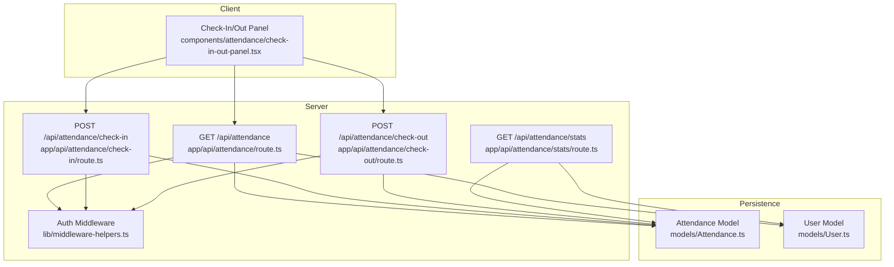
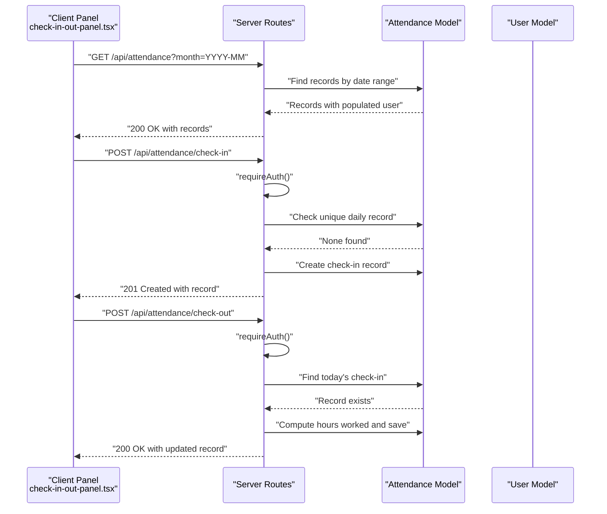
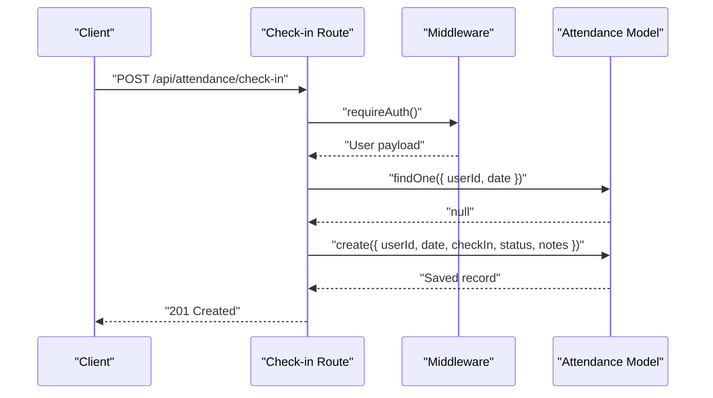
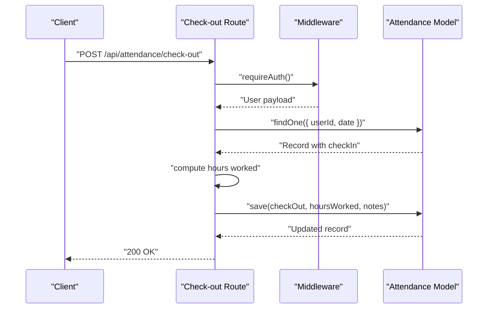
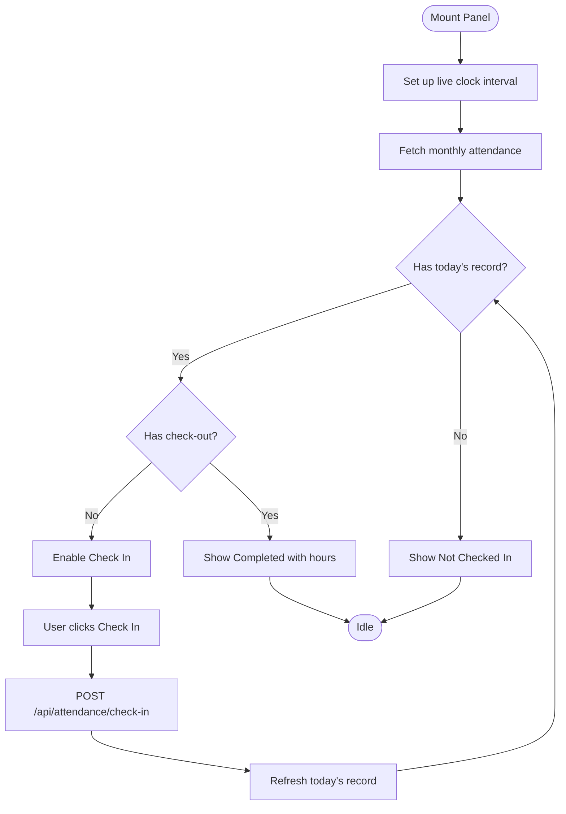
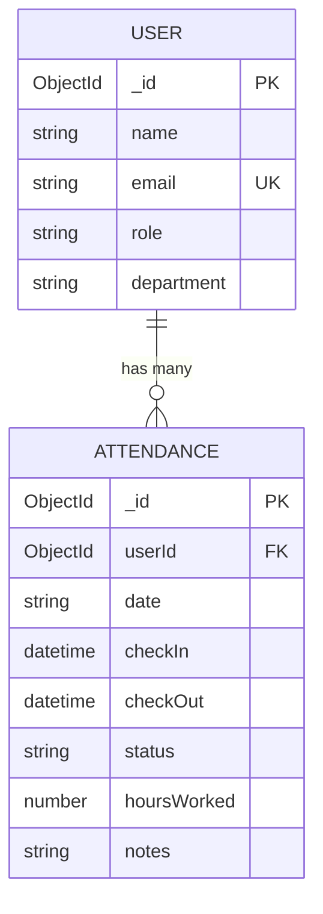
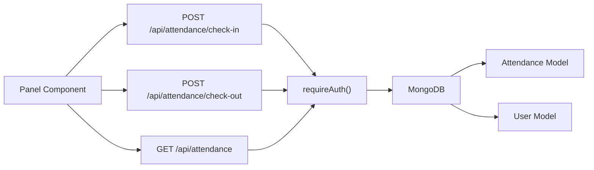
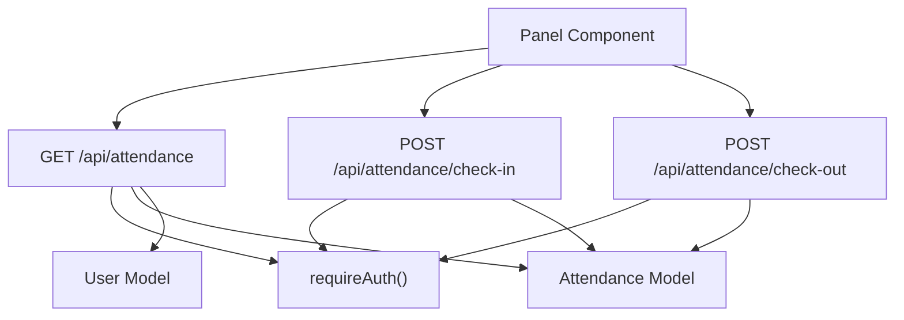

# Check-in and Check-out Operations

<cite>
**Referenced Files in This Document**
- [check-in route](file://app/api/attendance/check-in/route.ts)
- [check-out route](file://app/api/attendance/check-out/route.ts)
- [attendance route](file://app/api/attendance/route.ts)
- [check-in/out panel component](file://components/attendance/check-in-out-panel.tsx)
- [Attendance model](file://models/Attendance.ts)
- [User model](file://models/User.ts)
- [middleware helpers](file://lib/middleware-helpers.ts)
- [stats route](file://app/api/attendance/stats/route.ts)
</cite>

## Table of Contents
1. [Introduction](#introduction)
2. [Project Structure](#project-structure)
3. [Core Components](#core-components)
4. [Architecture Overview](#architecture-overview)
5. [Detailed Component Analysis](#detailed-component-analysis)
6. [Dependency Analysis](#dependency-analysis)
7. [Performance Considerations](#performance-considerations)
8. [Troubleshooting Guide](#troubleshooting-guide)
9. [Conclusion](#conclusion)

## Introduction
This document explains the check-in and check-out system for attendance tracking. It covers:
- The check-in API endpoint that validates employee eligibility, prevents duplicate check-ins, and handles timezone considerations
- The check-out endpoint including break time calculations, late arrival penalties, and automatic status updates
- The check-in/out panel UI component with real-time status indicators, validation feedback, and error handling
- Business rules for check-in windows, grace periods, and policy enforcement
- Examples of common scenarios like early check-ins, late arrivals, and missed check-outs with their resolution workflows

## Project Structure
The system is organized around API routes, a client-side panel component, and Mongoose models for persistence. Authentication is enforced via middleware helpers.

**Diagram sources**
- [check-in/out panel component](file://components/attendance/check-in-out-panel.tsx)
- [attendance route](file://app/api/attendance/route.ts)
- [check-in route](file://app/api/attendance/check-in/route.ts)
- [check-out route](file://app/api/attendance/check-out/route.ts)
- [stats route](file://app/api/attendance/stats/route.ts)
- [Attendance model](file://models/Attendance.ts)
- [User model](file://models/User.ts)
- [middleware helpers](file://lib/middleware-helpers.ts)

**Section sources**
- [check-in/out panel component](file://components/attendance/check-in-out-panel.tsx)
- [attendance route](file://app/api/attendance/route.ts)
- [check-in route](file://app/api/attendance/check-in/route.ts)
- [check-out route](file://app/api/attendance/check-out/route.ts)
- [stats route](file://app/api/attendance/stats/route.ts)
- [Attendance model](file://models/Attendance.ts)
- [User model](file://models/User.ts)
- [middleware helpers](file://lib/middleware-helpers.ts)

## Core Components
- Check-in endpoint: Validates authentication, prevents duplicate check-ins for the day, computes status based on time thresholds, and persists the record.
- Check-out endpoint: Validates prior check-in, prevents duplicate check-outs, calculates hours worked, and optionally appends notes.
- Attendance panel: Fetches today’s record, displays live clock and status, and triggers check-in/check-out actions with user feedback.
- Models: Attendance and User define the data schema and indexes used by the system.
- Middleware: Enforces authentication and role checks.

**Section sources**
- [check-in route](file://app/api/attendance/check-in/route.ts)
- [check-out route](file://app/api/attendance/check-out/route.ts)
- [check-in/out panel component](file://components/attendance/check-in-out-panel.tsx)
- [Attendance model](file://models/Attendance.ts)
- [User model](file://models/User.ts)
- [middleware helpers](file://lib/middleware-helpers.ts)

## Architecture Overview
The system follows a client-server pattern:
- The client panel fetches monthly attendance records and performs check-in/check-out requests.
- Server routes enforce authentication, query or mutate attendance records, and return structured responses.
- Models encapsulate schema and indexing for efficient queries.

**Diagram sources**
- [check-in/out panel component](file://components/attendance/check-in-out-panel.tsx)
- [attendance route](file://app/api/attendance/route.ts)
- [check-in route](file://app/api/attendance/check-in/route.ts)
- [check-out route](file://app/api/attendance/check-out/route.ts)
- [Attendance model](file://models/Attendance.ts)
- [User model](file://models/User.ts)
- [middleware helpers](file://lib/middleware-helpers.ts)

## Detailed Component Analysis

### Check-in Endpoint
Responsibilities:
- Authenticate the caller using middleware.
- Prevent duplicate check-ins for the same user on the same calendar day.
- Determine status based on check-in time thresholds.
- Persist the check-in record with optional notes.

Key behaviors:
- Duplicate prevention uses a unique compound index on user and date.
- Late status is determined by a fixed threshold (after a specific hour/minute).
- Response includes minimal success payload with essential fields.

**Diagram sources**
- [check-in route](file://app/api/attendance/check-in/route.ts)
- [middleware helpers](file://lib/middleware-helpers.ts)
- [Attendance model](file://models/Attendance.ts)

**Section sources**
- [check-in route](file://app/api/attendance/check-in/route.ts)
- [middleware helpers](file://lib/middleware-helpers.ts)
- [Attendance model](file://models/Attendance.ts)

### Check-out Endpoint
Responsibilities:
- Authenticate the caller.
- Ensure a prior check-in exists for the day.
- Prevent duplicate check-outs.
- Compute worked hours from check-in to check-out.
- Optionally append notes to the existing record.

Key behaviors:
- Hours worked computed as a floating-point value with two decimals.
- Notes are concatenated if provided.
- Response includes the updated record.

**Diagram sources**
- [check-out route](file://app/api/attendance/check-out/route.ts)
- [middleware helpers](file://lib/middleware-helpers.ts)
- [Attendance model](file://models/Attendance.ts)

**Section sources**
- [check-out route](file://app/api/attendance/check-out/route.ts)
- [middleware helpers](file://lib/middleware-helpers.ts)
- [Attendance model](file://models/Attendance.ts)

### Attendance Panel UI Component
Responsibilities:
- Display a live clock and formatted date.
- Fetch today’s attendance record via the monthly attendance endpoint.
- Render status indicators (not checked in, checked in, checked out with hours).
- Provide actionable buttons (Check In / Check Out) with loading states.
- Handle errors with user-friendly alerts.

Key behaviors:
- Uses a monthly query to locate today’s record.
- Determines actionability based on presence of check-in and check-out.
- Updates status after successful check-in or check-out.

**Diagram sources**
- [check-in/out panel component](file://components/attendance/check-in-out-panel.tsx)
- [attendance route](file://app/api/attendance/route.ts)
- [check-in route](file://app/api/attendance/check-in/route.ts)
- [check-out route](file://app/api/attendance/check-out/route.ts)

**Section sources**
- [check-in/out panel component](file://components/attendance/check-in-out-panel.tsx)
- [attendance route](file://app/api/attendance/route.ts)

### Data Models
The Attendance model defines the schema and indexes used by the system. The User model stores employee/admin identities.

**Diagram sources**
- [Attendance model](file://models/Attendance.ts)
- [User model](file://models/User.ts)

**Section sources**
- [Attendance model](file://models/Attendance.ts)
- [User model](file://models/User.ts)

## Architecture Overview
The system enforces authentication at the route level and relies on the Attendance model for persistence. The panel component orchestrates user interactions and reflects real-time status.

**Diagram sources**
- [check-in/out panel component](file://components/attendance/check-in-out-panel.tsx)
- [attendance route](file://app/api/attendance/route.ts)
- [check-in route](file://app/api/attendance/check-in/route.ts)
- [check-out route](file://app/api/attendance/check-out/route.ts)
- [middleware helpers](file://lib/middleware-helpers.ts)
- [Attendance model](file://models/Attendance.ts)
- [User model](file://models/User.ts)

## Detailed Component Analysis

### Check-in API Endpoint
- Authentication: Enforced via middleware; unauthorized requests receive a 401 response.
- Duplicate Prevention: Unique compound index on user and date ensures only one check-in per day per user.
- Status Determination: Late status is assigned when check-in occurs after a fixed threshold (after a specific hour/minute).
- Response: On success, returns a 201 with the created record’s essential fields.

Operational flow:
- Extract token from cookies, verify, and attach user payload.
- Connect to database and compute today’s date string.
- Query for an existing record; if found, return 400 with an error message.
- Create a new record with current time as check-in, derived status, and optional notes.

Edge cases handled:
- Empty or missing JSON body for notes is tolerated.
- Internal server errors return a 500 response.

**Section sources**
- [check-in route](file://app/api/attendance/check-in/route.ts)
- [middleware helpers](file://lib/middleware-helpers.ts)
- [Attendance model](file://models/Attendance.ts)

### Check-out API Endpoint
- Authentication: Same middleware enforcement applies.
- Precondition: Requires an existing check-in for the day; otherwise returns 400.
- Duplicate Prevention: Checks for an existing check-out; if present, returns 400.
- Hours Worked: Computed as the difference between check-out and check-in, normalized to two decimal places.
- Notes: Optional notes are appended to existing notes if provided.
- Response: Returns 200 with the updated record.

Operational flow:
- Extract token, verify, and attach user payload.
- Connect to database and compute today’s date string.
- Find today’s record; if none, return 400.
- If check-out already exists, return 400.
- Compute hours worked and update the record with check-out time, hours worked, and notes.
- Save and return the updated record.

**Section sources**
- [check-out route](file://app/api/attendance/check-out/route.ts)
- [middleware helpers](file://lib/middleware-helpers.ts)
- [Attendance model](file://models/Attendance.ts)

### Attendance Panel UI Component
- Real-time Clock: Updates every second to show current time and formatted date.
- Status Indicators: Displays “Not Checked In,” “Checked In,” or “Checked Out — Xh worked.”
- Action Buttons: Enables Check In or Check Out depending on current state; disabled when completed.
- Error Handling: Alerts the user on failure and logs errors to the console.
- Data Fetching: Requests monthly records and locates today’s entry for rendering.

User journey:
- On mount, sets up a live clock and fetches monthly records.
- Determines whether to show Check In, Check Out, or Completed state.
- Submits requests to the respective endpoints and refreshes the record upon success.

**Section sources**
- [check-in/out panel component](file://components/attendance/check-in-out-panel.tsx)
- [attendance route](file://app/api/attendance/route.ts)

### Business Rules and Policy Enforcement
- Check-in Windows:
  - Duplicate prevention: One check-in per user per calendar day.
  - Late status: Assigned when check-in occurs after a fixed threshold (after a specific hour/minute).
- Grace Periods:
  - No explicit grace period is implemented in the current code; early check-ins default to present status.
- Automatic Status Updates:
  - Status transitions from present to late based on time thresholds at check-in.
- Break Time Calculations:
  - The current implementation does not subtract break time; hours worked equals total elapsed time between check-in and check-out.
- Missed Check-outs:
  - The system does not automatically mark absent; if a check-out is not performed, the record remains with check-in and no check-out.

Policy alignment:
- Duplicate prevention aligns with single-entry-per-day policy.
- Late status enforcement supports punctuality policies.
- Absence detection requires additional logic beyond the current implementation.

**Section sources**
- [check-in route](file://app/api/attendance/check-in/route.ts)
- [check-out route](file://app/api/attendance/check-out/route.ts)
- [Attendance model](file://models/Attendance.ts)

### Common Scenarios and Resolution Workflows
- Early Check-in:
  - Behavior: Recorded as present; no penalty applied.
  - Resolution: Proceed with normal check-out; hours worked computed as usual.
- Late Arrival:
  - Behavior: Recorded as late based on threshold; no automatic penalty.
  - Resolution: Proceed with check-out; hours worked computed as usual.
- Missed Check-out:
  - Behavior: Record retains check-in without check-out.
  - Resolution: Employee should check out later; system allows check-out at any time during the day.
- Duplicate Check-in:
  - Behavior: Rejected with a 400 error indicating already checked in.
  - Resolution: Wait until the next day or contact support if the system indicates an anomaly.
- Duplicate Check-out:
  - Behavior: Rejected with a 400 error indicating already checked out.
  - Resolution: No action needed; record is already finalized for the day.

**Section sources**
- [check-in route](file://app/api/attendance/check-in/route.ts)
- [check-out route](file://app/api/attendance/check-out/route.ts)

## Dependency Analysis
- Authentication dependency: All attendance routes depend on middleware helpers for token verification and role checks.
- Persistence dependency: Attendance and User models underpin all data operations.
- UI dependency: Panel component depends on the monthly attendance endpoint and the check-in/check-out endpoints.

**Diagram sources**
- [check-in/out panel component](file://components/attendance/check-in-out-panel.tsx)
- [attendance route](file://app/api/attendance/route.ts)
- [check-in route](file://app/api/attendance/check-in/route.ts)
- [check-out route](file://app/api/attendance/check-out/route.ts)
- [middleware helpers](file://lib/middleware-helpers.ts)
- [Attendance model](file://models/Attendance.ts)
- [User model](file://models/User.ts)

**Section sources**
- [check-in/out panel component](file://components/attendance/check-in-out-panel.tsx)
- [attendance route](file://app/api/attendance/route.ts)
- [check-in route](file://app/api/attendance/check-in/route.ts)
- [check-out route](file://app/api/attendance/check-out/route.ts)
- [middleware helpers](file://lib/middleware-helpers.ts)
- [Attendance model](file://models/Attendance.ts)
- [User model](file://models/User.ts)

## Performance Considerations
- Database Indexes:
  - Compound index on user and date prevents duplicate check-ins efficiently.
  - Separate indexes on date and user improve query performance for filtering and pagination.
- Query Patterns:
  - Monthly aggregation reduces payload size compared to yearly scans.
  - Populate on user fields avoids N+1 queries for attendance lists.
- Client-Side:
  - Live clock updates every second; consider throttling if needed.
  - Debounce fetch calls to avoid redundant network requests.

[No sources needed since this section provides general guidance]

## Troubleshooting Guide
Common issues and resolutions:
- Authentication failures:
  - Symptom: 401 Unauthorized on attendance routes.
  - Cause: Missing or invalid token in cookies.
  - Resolution: Ensure the user is logged in and the token is present.
- Duplicate check-in:
  - Symptom: 400 error stating already checked in.
  - Cause: Attempting to check in twice on the same day.
  - Resolution: Wait until the next day or resolve anomalies with support.
- No check-in found:
  - Symptom: 400 error when checking out without a prior check-in.
  - Cause: Missing check-in record for the day.
  - Resolution: Perform a check-in first; ensure the correct day is selected.
- Duplicate check-out:
  - Symptom: 400 error stating already checked out.
  - Cause: Attempting to check out twice in a day.
  - Resolution: No further action; record is finalized.
- Internal server errors:
  - Symptom: 500 error on check-in or check-out.
  - Cause: Unexpected runtime exceptions.
  - Resolution: Check server logs; retry after verifying service health.

**Section sources**
- [check-in route](file://app/api/attendance/check-in/route.ts)
- [check-out route](file://app/api/attendance/check-out/route.ts)
- [middleware helpers](file://lib/middleware-helpers.ts)

## Conclusion
The check-in and check-out system provides a robust foundation for attendance tracking with authentication enforcement, duplicate prevention, and real-time status updates. Current policies support late status determination and absence detection requires extension. The UI component delivers immediate feedback and seamless interactions. Future enhancements could include configurable grace periods, break time adjustments, and automated absence marking.