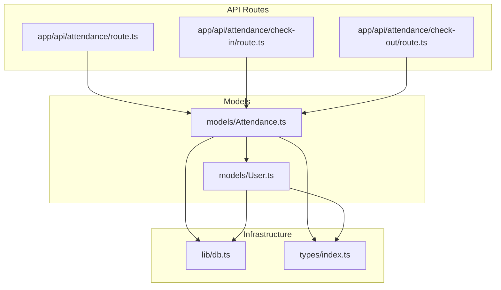
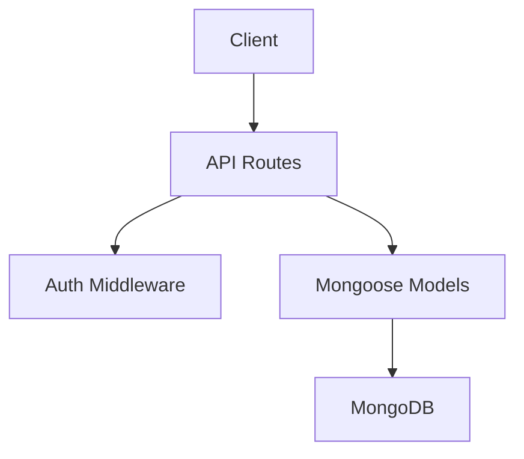
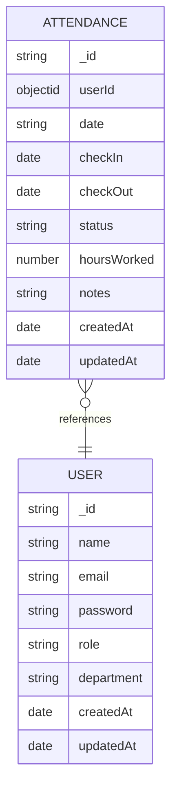
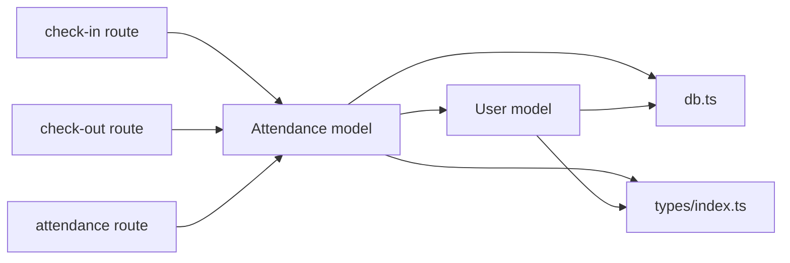

# Data Model and Schema

<cite>
**Referenced Files in This Document**
- [models/Attendance.ts](file://models/Attendance.ts)
- [models/User.ts](file://models/User.ts)
- [app/api/attendance/route.ts](file://app/api/attendance/route.ts)
- [app/api/attendance/check-in/route.ts](file://app/api/attendance/check-in/route.ts)
- [app/api/attendance/check-out/route.ts](file://app/api/attendance/check-out/route.ts)
- [lib/db.ts](file://lib/db.ts)
- [types/index.ts](file://types/index.ts)
</cite>

## Table of Contents
1. [Introduction](#introduction)
2. [Project Structure](#project-structure)
3. [Core Components](#core-components)
4. [Architecture Overview](#architecture-overview)
5. [Detailed Component Analysis](#detailed-component-analysis)
6. [Dependency Analysis](#dependency-analysis)
7. [Performance Considerations](#performance-considerations)
8. [Troubleshooting Guide](#troubleshooting-guide)
9. [Conclusion](#conclusion)

## Introduction
This document provides comprehensive data model documentation for the Attendance system. It defines the Attendance schema, describes the User-Attendance relationship, enumerates required and optional fields, explains computed fields, outlines validation rules, timezone handling, and date range restrictions. It also documents indexing strategies, common query patterns, and practical examples for creating, updating, and querying attendance records.

## Project Structure
The Attendance system is implemented as a Next.js application with MongoDB via Mongoose. The data model is defined in dedicated model files, while API routes handle CRUD operations and business logic. Database connection management is centralized, and TypeScript types define the schema contracts.

**Diagram sources**
- [models/Attendance.ts:1-58](file://models/Attendance.ts#L1-L58)
- [models/User.ts:1-50](file://models/User.ts#L1-L50)
- [app/api/attendance/route.ts:1-96](file://app/api/attendance/route.ts#L1-L96)
- [app/api/attendance/check-in/route.ts:1-79](file://app/api/attendance/check-in/route.ts#L1-L79)
- [app/api/attendance/check-out/route.ts:1-90](file://app/api/attendance/check-out/route.ts#L1-L90)
- [lib/db.ts:1-54](file://lib/db.ts#L1-L54)
- [types/index.ts](file://types/index.ts)

**Section sources**
- [models/Attendance.ts:1-58](file://models/Attendance.ts#L1-L58)
- [models/User.ts:1-50](file://models/User.ts#L1-L50)
- [app/api/attendance/route.ts:1-96](file://app/api/attendance/route.ts#L1-L96)
- [app/api/attendance/check-in/route.ts:1-79](file://app/api/attendance/check-in/route.ts#L1-L79)
- [app/api/attendance/check-out/route.ts:1-90](file://app/api/attendance/check-out/route.ts#L1-L90)
- [lib/db.ts:1-54](file://lib/db.ts#L1-L54)
- [types/index.ts](file://types/index.ts)

## Core Components
- Attendance model: Defines the attendance record schema, including required fields (userId, date, checkIn), optional fields (checkOut, notes), and computed-like fields (status, hoursWorked). Includes compound and single-field indexes for performance.
- User model: Defines user profiles with role-based access and department metadata.
- API routes: Provide endpoints for listing attendance records, checking in, and checking out, enforcing business rules and validations.
- Database connection: Centralized Mongoose connection with caching and error handling.
- Types: Define TypeScript interfaces and enums for schema contracts.

**Section sources**
- [models/Attendance.ts:1-58](file://models/Attendance.ts#L1-L58)
- [models/User.ts:1-50](file://models/User.ts#L1-L50)
- [app/api/attendance/route.ts:1-96](file://app/api/attendance/route.ts#L1-L96)
- [app/api/attendance/check-in/route.ts:1-79](file://app/api/attendance/check-in/route.ts#L1-L79)
- [app/api/attendance/check-out/route.ts:1-90](file://app/api/attendance/check-out/route.ts#L1-L90)
- [lib/db.ts:1-54](file://lib/db.ts#L1-L54)
- [types/index.ts](file://types/index.ts)

## Architecture Overview
The Attendance system follows a layered architecture:
- Presentation: Next.js API routes expose endpoints for client consumption.
- Application: Middleware enforces authentication and authorization; routes orchestrate data access and business logic.
- Data Access: Mongoose models define schemas and indexes; database connection is managed centrally.
- Persistence: MongoDB stores Attendance and User documents.

**Diagram sources**
- [app/api/attendance/route.ts:1-96](file://app/api/attendance/route.ts#L1-L96)
- [app/api/attendance/check-in/route.ts:1-79](file://app/api/attendance/check-in/route.ts#L1-L79)
- [app/api/attendance/check-out/route.ts:1-90](file://app/api/attendance/check-out/route.ts#L1-L90)
- [models/Attendance.ts:1-58](file://models/Attendance.ts#L1-L58)
- [models/User.ts:1-50](file://models/User.ts#L1-L50)
- [lib/db.ts:1-54](file://lib/db.ts#L1-L54)

## Detailed Component Analysis

### Attendance Schema Definition
The Attendance schema defines the structure and constraints for attendance records. It includes:
- Required fields:
  - userId: ObjectId referencing the User collection.
  - date: String in YYYY-MM-DD format for efficient date-range queries.
  - checkIn: Date representing the check-in timestamp.
- Optional fields:
  - checkOut: Date representing the check-out timestamp; defaults to null.
  - notes: String with trimming enabled; defaults to empty string.
- Computed-like fields:
  - status: Enumerated value among present, absent, late; defaults to present.
  - hoursWorked: Numeric value; defaults to 0.
- Timestamps:
  - createdAt and updatedAt are automatically maintained by Mongoose.

Field-level characteristics:
- userId: ObjectId, required, references User.
- date: String, required, formatted as YYYY-MM-DD.
- checkIn: Date, required.
- checkOut: Date, nullable.
- status: String enum, default present.
- hoursWorked: Number, default 0.
- notes: String, default empty.

Validation and constraints:
- Unique compound index on { userId: 1, date: 1 } prevents duplicate daily records per user.
- Additional indexes: { date: 1 } and { userId: 1 } optimize common queries.

Business rule validations:
- Daily uniqueness enforced by the compound index.
- Check-in occurs once per day; attempting to check in again on the same day returns an error.
- Check-out requires an existing check-in for the same day; otherwise returns an error.
- Hours worked calculated as the difference between checkOut and checkIn, rounded to two decimal places.
- Status set to late if check-in hour exceeds 9 AM or minute exceeds 0 after 9 AM.

**Diagram sources**
- [models/Attendance.ts:4-41](file://models/Attendance.ts#L4-L41)
- [models/User.ts:4-41](file://models/User.ts#L4-L41)

**Section sources**
- [models/Attendance.ts:4-41](file://models/Attendance.ts#L4-L41)
- [types/index.ts](file://types/index.ts)

### User-Attendance Relationship and Foreign Keys
- Relationship: Attendance.userId is a foreign key referencing User._id.
- Referential integrity: Enforced at application level via ObjectId references; MongoDB does not enforce referential constraints by default.
- Population: API routes populate user details (name, email, department) when retrieving attendance records.

**Section sources**
- [models/Attendance.ts:6-8](file://models/Attendance.ts#L6-L8)
- [app/api/attendance/route.ts:62-69](file://app/api/attendance/route.ts#L62-L69)

### Data Validation Rules
- Required fields: userId, date, checkIn.
- Unique constraint: One attendance record per user per calendar day.
- Business validations:
  - Check-in: Cannot create a new check-in if a record exists for the current day.
  - Check-out: Requires an existing check-in for the current day; prevents multiple check-outs.
  - Status: Automatically set to late if check-in occurs after 9:00 AM.
  - Hours worked: Calculated as (checkOut - checkIn) in hours, rounded to two decimals.

**Section sources**
- [models/Attendance.ts:43-47](file://models/Attendance.ts#L43-L47)
- [app/api/attendance/check-in/route.ts:20-33](file://app/api/attendance/check-in/route.ts#L20-L33)
- [app/api/attendance/check-out/route.ts:20-43](file://app/api/attendance/check-out/route.ts#L20-L43)
- [app/api/attendance/check-out/route.ts:46-48](file://app/api/attendance/check-out/route.ts#L46-L48)

### Timezone Handling and Date Range Restrictions
- Date storage: date is stored as a String in YYYY-MM-DD format to simplify date-range queries and avoid timezone ambiguity.
- Local time semantics: checkIn and checkOut are stored as Date objects in local time. Late threshold is evaluated using local hours and minutes.
- Date range filtering: API supports month-based filtering by constructing start and end dates from the provided month string.

**Section sources**
- [models/Attendance.ts:11-14](file://models/Attendance.ts#L11-L14)
- [app/api/attendance/route.ts:52-58](file://app/api/attendance/route.ts#L52-L58)
- [app/api/attendance/check-in/route.ts:18-38](file://app/api/attendance/check-in/route.ts#L18-L38)
- [app/api/attendance/check-out/route.ts:18-48](file://app/api/attendance/check-out/route.ts#L18-L48)

### Field Descriptions, Data Types, Defaults, and Enums
- userId: ObjectId (required), references User.
- date: String (required), format YYYY-MM-DD.
- checkIn: Date (required).
- checkOut: Date (optional), default null.
- status: String enum, values present | absent | late, default present.
- hoursWorked: Number, default 0.
- notes: String, default empty.
- createdAt, updatedAt: Auto-managed timestamps.

**Section sources**
- [models/Attendance.ts:4-41](file://models/Attendance.ts#L4-L41)
- [types/index.ts](file://types/index.ts)

### Examples: Creation, Updates, and Queries

- Create an attendance check-in:
  - Endpoint: POST /api/attendance/check-in
  - Behavior: Creates a new record for the authenticated user with today’s date, current time as checkIn, and status derived from the check-in time.
  - Notes: Optional notes can be included in the request body.
  - Constraints: Fails if a check-in already exists for the current day.

- Update an attendance check-out:
  - Endpoint: POST /api/attendance/check-out
  - Behavior: Sets checkOut to the current time, calculates hoursWorked, optionally appends notes, and persists the record.
  - Constraints: Fails if no check-in exists for the current day or if already checked out.

- Query attendance records:
  - Endpoint: GET /api/attendance
  - Behavior: Lists records with pagination and optional month filter; populates user details; employee users see only their own records.
  - Pagination: page and limit query parameters; default page=1, default limit=30.

**Section sources**
- [app/api/attendance/check-in/route.ts:7-79](file://app/api/attendance/check-in/route.ts#L7-L79)
- [app/api/attendance/check-out/route.ts:7-90](file://app/api/attendance/check-out/route.ts#L7-L90)
- [app/api/attendance/route.ts:30-96](file://app/api/attendance/route.ts#L30-L96)

### Indexing Strategies and Performance Optimization
- Compound index: { userId: 1, date: 1 } ensures uniqueness per user per day and supports efficient lookups for daily records.
- Single-field indexes:
  - { date: 1 } accelerates date-range queries.
  - { userId: 1 } improves user-scoped queries.
- Population: Using populate on userId reduces duplication and simplifies joins at the application level.

**Section sources**
- [models/Attendance.ts:43-50](file://models/Attendance.ts#L43-L50)

### Common Query Patterns
- Daily uniqueness enforcement via compound index.
- Month-based filtering by constructing date boundaries from the month parameter.
- Role-aware filtering: employees see only their own records; admins can list all records.
- Pagination with sort order by date descending.

**Section sources**
- [app/api/attendance/route.ts:48-71](file://app/api/attendance/route.ts#L48-L71)

## Dependency Analysis
The Attendance model depends on:
- User model for foreign key relationship.
- Database connection module for Mongoose initialization.
- Types module for TypeScript contracts.

API routes depend on:
- Authentication middleware for user context.
- Database connection module for Mongoose initialization.
- Attendance model for data access.

**Diagram sources**
- [app/api/attendance/check-in/route.ts:1-79](file://app/api/attendance/check-in/route.ts#L1-L79)
- [app/api/attendance/check-out/route.ts:1-90](file://app/api/attendance/check-out/route.ts#L1-L90)
- [app/api/attendance/route.ts:1-96](file://app/api/attendance/route.ts#L1-L96)
- [models/Attendance.ts:1-58](file://models/Attendance.ts#L1-L58)
- [models/User.ts:1-50](file://models/User.ts#L1-L50)
- [lib/db.ts:1-54](file://lib/db.ts#L1-L54)
- [types/index.ts](file://types/index.ts)

**Section sources**
- [models/Attendance.ts:1-58](file://models/Attendance.ts#L1-L58)
- [models/User.ts:1-50](file://models/User.ts#L1-L50)
- [app/api/attendance/route.ts:1-96](file://app/api/attendance/route.ts#L1-L96)
- [app/api/attendance/check-in/route.ts:1-79](file://app/api/attendance/check-in/route.ts#L1-L79)
- [app/api/attendance/check-out/route.ts:1-90](file://app/api/attendance/check-out/route.ts#L1-L90)
- [lib/db.ts:1-54](file://lib/db.ts#L1-L54)
- [types/index.ts](file://types/index.ts)

## Performance Considerations
- Use the compound index on { userId, date } to prevent duplicate daily entries and speed up daily lookups.
- Leverage the { date: 1 } index for efficient month-range queries.
- Use the { userId: 1 } index for user-scoped queries and role-based filtering.
- Avoid selecting unnecessary fields; rely on populate for user details to minimize payload size.
- Batch reads/writes when possible to reduce round trips.

[No sources needed since this section provides general guidance]

## Troubleshooting Guide
Common issues and resolutions:
- Duplicate check-in on the same day:
  - Symptom: Error response indicating a check-in already exists for today.
  - Cause: Compound index prevents duplicate daily records.
  - Resolution: Wait until the next day or contact support to resolve anomalies.
- No check-in found for check-out:
  - Symptom: Error response indicating no check-in was found for today.
  - Cause: Attempting to check out without a prior check-in on the same day.
  - Resolution: Ensure a valid check-in exists for the current day.
- Already checked out:
  - Symptom: Error response indicating checkout already performed.
  - Cause: Multiple check-out attempts in a single day.
  - Resolution: Submit a new check-in for the next day if applicable.
- Internal server errors:
  - Symptom: Generic 500 error responses.
  - Cause: Database connectivity or unexpected runtime exceptions.
  - Resolution: Verify MONGODB_URI configuration and retry; inspect server logs for stack traces.

**Section sources**
- [app/api/attendance/check-in/route.ts:25-33](file://app/api/attendance/check-in/route.ts#L25-L33)
- [app/api/attendance/check-out/route.ts:25-43](file://app/api/attendance/check-out/route.ts#L25-L43)
- [lib/db.ts:13-17](file://lib/db.ts#L13-L17)

## Conclusion
The Attendance system employs a clear, indexed schema with strong business rule enforcement. The combination of compound and selective indexes optimizes common queries, while API routes encapsulate validation and computation logic. The design balances simplicity with robustness, enabling scalable attendance tracking across users and time periods.