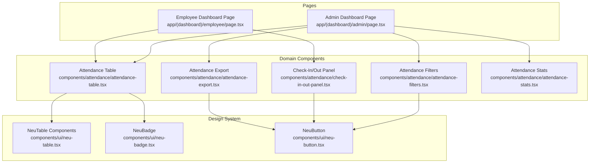
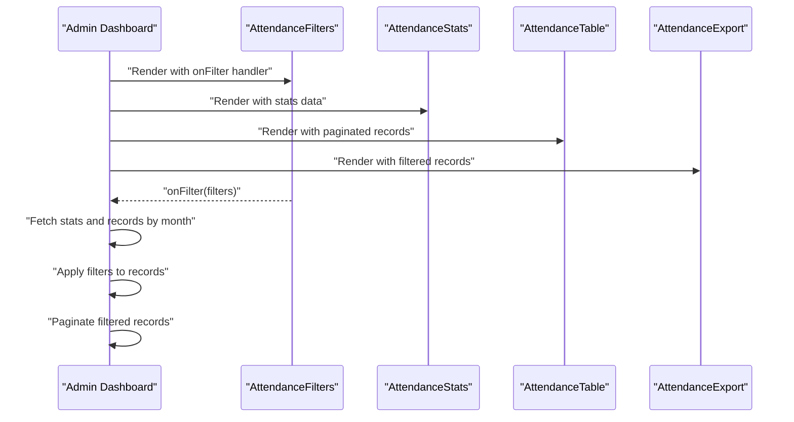
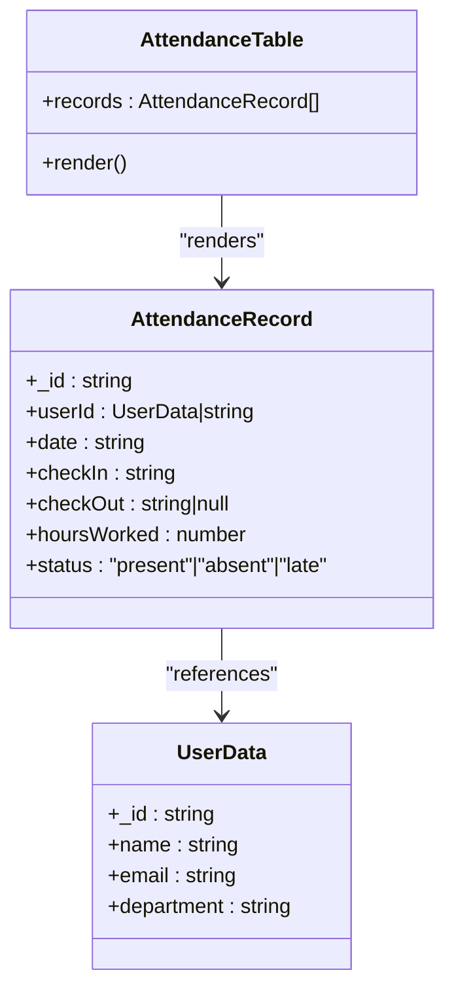
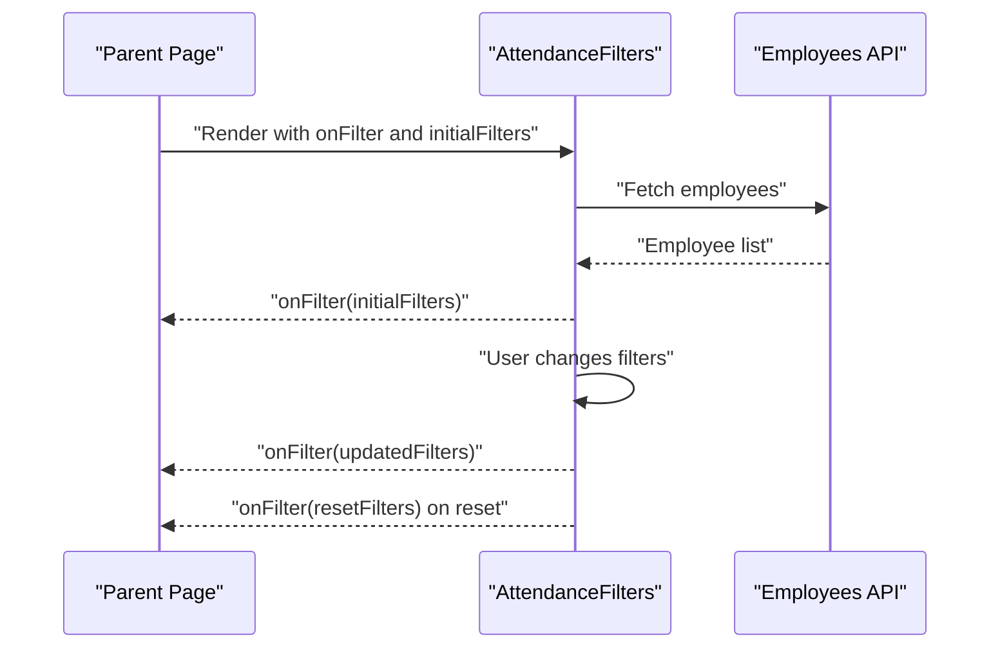
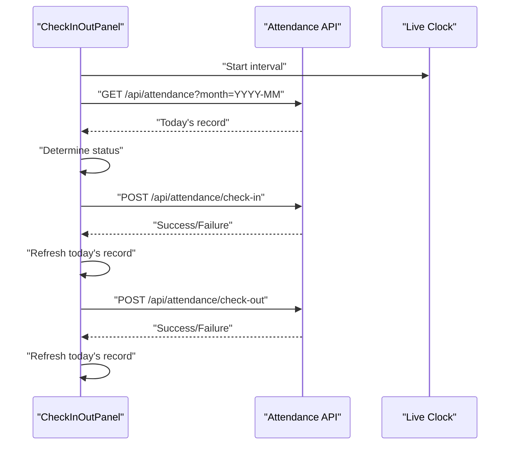
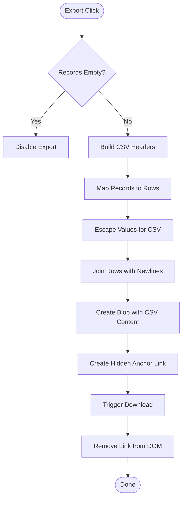
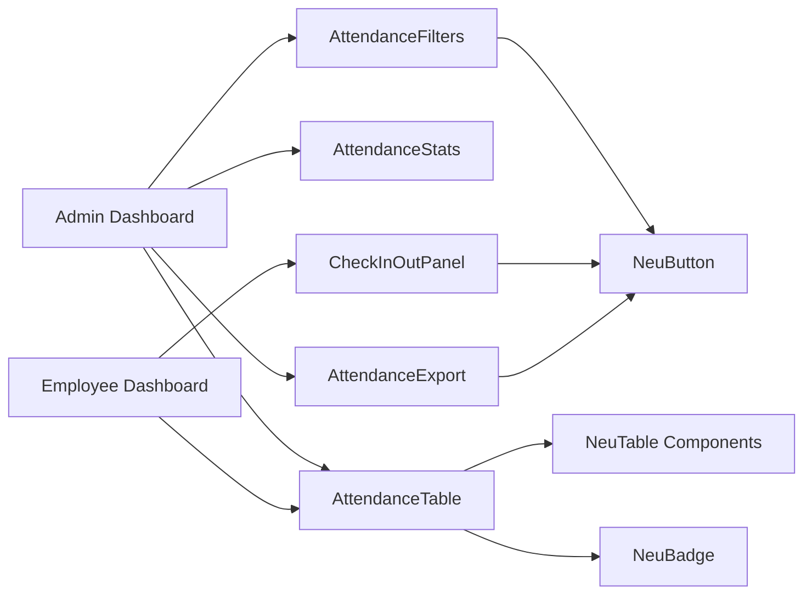

# UI Components and Interfaces

<cite>
**Referenced Files in This Document**
- [attendance-table.tsx](file://components/attendance/attendance-table.tsx)
- [attendance-filters.tsx](file://components/attendance/attendance-filters.tsx)
- [check-in-out-panel.tsx](file://components/attendance/check-in-out-panel.tsx)
- [attendance-export.tsx](file://components/attendance/attendance-export.tsx)
- [neu-table.tsx](file://components/ui/neu-table.tsx)
- [neu-badge.tsx](file://components/ui/neu-badge.tsx)
- [neu-button.tsx](file://components/ui/neu-button.tsx)
- [attendance-stats.tsx](file://components/attendance/attendance-stats.tsx)
- [admin-dashboard-page.tsx](file://app/(dashboard)/admin/page.tsx)
- [employee-dashboard-page.tsx](file://app/(dashboard)/employee/page.tsx)
- [globals.css](file://app/globals.css)
</cite>

## Table of Contents
1. [Introduction](#introduction)
2. [Project Structure](#project-structure)
3. [Core Components](#core-components)
4. [Architecture Overview](#architecture-overview)
5. [Detailed Component Analysis](#detailed-component-analysis)
6. [Dependency Analysis](#dependency-analysis)
7. [Performance Considerations](#performance-considerations)
8. [Troubleshooting Guide](#troubleshooting-guide)
9. [Conclusion](#conclusion)
10. [Appendices](#appendices)

## Introduction
This document provides comprehensive UI component documentation for the attendance management system. It focuses on:
- Attendance table with sorting, pagination, and row actions
- Filter component for date ranges, employee selection, and status filtering
- Check-in/out panel with form validation, real-time status updates, and error messaging
- Export component for CSV data download and report generation
- Prop interfaces, event handlers, and integration patterns
- Responsive design considerations, accessibility features, and UX guidelines

## Project Structure
The attendance UI is organized around reusable design system components and domain-specific components:
- Domain components: attendance table, filters, check-in/out panel, export, stats
- Design system components: table, badge, button, card, stat card
- Pages: admin dashboard and employee dashboard integrate these components

**Diagram sources**
- [admin-dashboard-page.tsx:1-274](file://app/(dashboard)/admin/page.tsx#L1-L274)
- [employee-dashboard-page.tsx:1-254](file://app/(dashboard)/employee/page.tsx#L1-L254)
- [attendance-table.tsx:1-126](file://components/attendance/attendance-table.tsx#L1-L126)
- [attendance-filters.tsx:1-145](file://components/attendance/attendance-filters.tsx#L1-L145)
- [check-in-out-panel.tsx:1-224](file://components/attendance/check-in-out-panel.tsx#L1-L224)
- [attendance-export.tsx:1-144](file://components/attendance/attendance-export.tsx#L1-L144)
- [neu-table.tsx:1-164](file://components/ui/neu-table.tsx#L1-L164)
- [neu-badge.tsx:1-73](file://components/ui/neu-badge.tsx#L1-L73)
- [neu-button.tsx:1-112](file://components/ui/neu-button.tsx#L1-L112)

**Section sources**
- [admin-dashboard-page.tsx:1-274](file://app/(dashboard)/admin/page.tsx#L1-L274)
- [employee-dashboard-page.tsx:1-254](file://app/(dashboard)/employee/page.tsx#L1-L254)
- [globals.css:1-61](file://app/globals.css#L1-L61)

## Core Components
This section outlines the primary UI components and their responsibilities.

- Attendance Table
  - Displays attendance records in a neumorphic table with formatted columns
  - Renders user name, department, date, check-in/out times, hours worked, and status badges
  - Handles empty state messaging

- Attendance Filters
  - Provides month picker, employee dropdown, status dropdown, and search input
  - Emits filter state via an event handler
  - Loads employees asynchronously and supports reset functionality

- Check-In/Out Panel
  - Shows live clock and current status
  - Enables check-in and check-out actions with loading states
  - Displays real-time status updates and completion indicators

- Attendance Export
  - Generates CSV from attendance records
  - Downloads CSV with appropriate filename based on selected month

- Attendance Stats
  - Renders summary statistics cards with trends and icons
  - Supports loading states and empty displays

**Section sources**
- [attendance-table.tsx:79-126](file://components/attendance/attendance-table.tsx#L79-L126)
- [attendance-filters.tsx:34-145](file://components/attendance/attendance-filters.tsx#L34-L145)
- [check-in-out-panel.tsx:45-224](file://components/attendance/check-in-out-panel.tsx#L45-L224)
- [attendance-export.tsx:119-144](file://components/attendance/attendance-export.tsx#L119-L144)
- [attendance-stats.tsx:24-103](file://components/attendance/attendance-stats.tsx#L24-L103)

## Architecture Overview
The admin and employee dashboards orchestrate domain components and pass data and callbacks down to child components. The design system components encapsulate styling and behavior for consistent UI.

**Diagram sources**
- [admin-dashboard-page.tsx:43-274](file://app/(dashboard)/admin/page.tsx#L43-L274)
- [attendance-filters.tsx:34-145](file://components/attendance/attendance-filters.tsx#L34-L145)
- [attendance-stats.tsx:24-103](file://components/attendance/attendance-stats.tsx#L24-L103)
- [attendance-table.tsx:79-126](file://components/attendance/attendance-table.tsx#L79-L126)
- [attendance-export.tsx:119-144](file://components/attendance/attendance-export.tsx#L119-L144)

## Detailed Component Analysis

### Attendance Table Component
Responsibilities:
- Render attendance records in a responsive table
- Format dates, times, and hours
- Map status to styled badges
- Handle empty state

Key behaviors:
- Accepts records array and renders header and body
- Uses helper functions for formatting and status mapping
- Falls back to "—" for missing values

Prop interfaces:
- records: AttendanceRecord[]

Event handlers:
- None (display-only component)

Integration patterns:
- Paginated subset passed from parent page
- Receives filtered data after user applies filters

**Diagram sources**
- [attendance-table.tsx:24-26](file://components/attendance/attendance-table.tsx#L24-L26)
- [attendance-table.tsx:13-22](file://components/attendance/attendance-table.tsx#L13-L22)
- [attendance-table.tsx:6-11](file://components/attendance/attendance-table.tsx#L6-L11)

**Section sources**
- [attendance-table.tsx:79-126](file://components/attendance/attendance-table.tsx#L79-L126)
- [neu-table.tsx:10-164](file://components/ui/neu-table.tsx#L10-L164)
- [neu-badge.tsx:41-73](file://components/ui/neu-badge.tsx#L41-L73)

### Attendance Filters Component
Responsibilities:
- Provide month, employee, status, and search filters
- Load employees from API
- Emit filter state changes to parent

Key behaviors:
- Initializes with current month
- Fetches employees on mount
- Supports apply and reset actions
- Converts status to dropdown options

Prop interfaces:
- onFilter: (filters: FilterState) => void
- initialFilters?: Partial<FilterState>

Event handlers:
- handleApply: emits current filters
- handleReset: resets to defaults and emits

**Diagram sources**
- [attendance-filters.tsx:34-145](file://components/attendance/attendance-filters.tsx#L34-L145)

**Section sources**
- [attendance-filters.tsx:15-25](file://components/attendance/attendance-filters.tsx#L15-L25)
- [attendance-filters.tsx:34-145](file://components/attendance/attendance-filters.tsx#L34-L145)

### Check-In/Out Panel Component
Responsibilities:
- Display live clock and formatted date
- Show current status with badge
- Enable check-in and check-out actions
- Handle loading states and errors

Key behaviors:
- Updates time every second
- Fetches today’s record on mount
- Determines status based on check-in/out presence
- Uses loading flags during API calls

Prop interfaces:
- None (self-contained)

Event handlers:
- handleCheckIn: posts to /api/attendance/check-in
- handleCheckOut: posts to /api/attendance/check-out

**Diagram sources**
- [check-in-out-panel.tsx:45-224](file://components/attendance/check-in-out-panel.tsx#L45-L224)

**Section sources**
- [check-in-out-panel.tsx:45-224](file://components/attendance/check-in-out-panel.tsx#L45-L224)

### Attendance Export Component
Responsibilities:
- Generate CSV from records
- Download CSV with filename based on month

Key behaviors:
- Escapes CSV values properly
- Formats dates and times consistently
- Disables when no records

Prop interfaces:
- records: AttendanceRecord[]
- month?: string

Event handlers:
- handleExport: generates CSV and triggers download

**Diagram sources**
- [attendance-export.tsx:119-144](file://components/attendance/attendance-export.tsx#L119-L144)

**Section sources**
- [attendance-export.tsx:119-144](file://components/attendance/attendance-export.tsx#L119-L144)

### Attendance Stats Component
Responsibilities:
- Render summary statistics cards
- Display trends and icons
- Support loading states

Prop interfaces:
- stats: AttendanceStatsData | null
- isLoading?: boolean

**Section sources**
- [attendance-stats.tsx:24-103](file://components/attendance/attendance-stats.tsx#L24-L103)

## Dependency Analysis
The components depend on the design system primitives and communicate via props and events.

**Diagram sources**
- [admin-dashboard-page.tsx:3-11](file://app/(dashboard)/admin/page.tsx#L3-L11)
- [employee-dashboard-page.tsx:3-10](file://app/(dashboard)/employee/page.tsx#L3-L10)
- [neu-table.tsx:10-164](file://components/ui/neu-table.tsx#L10-L164)
- [neu-badge.tsx:41-73](file://components/ui/neu-badge.tsx#L41-L73)
- [neu-button.tsx:61-112](file://components/ui/neu-button.tsx#L61-L112)

**Section sources**
- [admin-dashboard-page.tsx:3-11](file://app/(dashboard)/admin/page.tsx#L3-L11)
- [employee-dashboard-page.tsx:3-10](file://app/(dashboard)/employee/page.tsx#L3-L10)

## Performance Considerations
- Filtering and pagination
  - Apply filters client-side on the records array; keep arrays reasonably sized
  - Use slice for pagination to avoid rendering overhead
- Real-time updates
  - Live clock updates every second; consider throttling or pausing when tab is inactive
- Network requests
  - Debounce filter changes if backend allows; batch requests where possible
- Rendering
  - Memoize derived data (e.g., formatted values) to reduce re-renders
  - Virtualize long lists if records grow large

## Troubleshooting Guide
Common issues and resolutions:
- Filter fetch fails
  - Verify /api/employees endpoint availability and CORS configuration
  - Ensure error boundaries show retry option
- Check-in/out failures
  - Confirm API endpoints exist and return success/error in expected format
  - Display user-friendly alerts for failures
- Export downloads blank file
  - Ensure records are passed and month is valid
  - Validate CSV escaping and newline handling
- Empty states
  - Provide clear messages and actionable buttons (e.g., retry)

**Section sources**
- [attendance-filters.tsx:52-67](file://components/attendance/attendance-filters.tsx#L52-L67)
- [check-in-out-panel.tsx:84-128](file://components/attendance/check-in-out-panel.tsx#L84-L128)
- [attendance-export.tsx:120-130](file://components/attendance/attendance-export.tsx#L120-L130)
- [admin-dashboard-page.tsx:168-187](file://app/(dashboard)/admin/page.tsx#L168-L187)

## Conclusion
The attendance UI components leverage a cohesive design system to deliver a responsive, accessible, and efficient interface. The admin dashboard integrates filtering, pagination, and export capabilities, while the employee dashboard focuses on daily check-in/out and recent history. Following the documented patterns ensures consistent behavior, maintainability, and scalability.

## Appendices

### Responsive Design Considerations
- Use grid layouts for stats and filters; stack on smaller screens
- Ensure touch-friendly button sizes and spacing
- Make tables horizontally scrollable on small screens
- Maintain readable typography scales and contrast ratios

**Section sources**
- [globals.css:1-61](file://app/globals.css#L1-L61)

### Accessibility Features
- Provide labels for interactive elements (buttons, inputs)
- Use semantic HTML and ARIA attributes where needed
- Ensure keyboard navigation support
- Maintain sufficient color contrast for badges and status indicators

**Section sources**
- [neu-button.tsx:61-112](file://components/ui/neu-button.tsx#L61-L112)
- [neu-badge.tsx:41-73](file://components/ui/neu-badge.tsx#L41-L73)

### User Experience Guidelines
- Provide immediate feedback for actions (loading states, success indicators)
- Offer clear status messages for check-in/out states
- Allow bulk export with month context
- Keep filter controls discoverable and intuitive

**Section sources**
- [check-in-out-panel.tsx:155-224](file://components/attendance/check-in-out-panel.tsx#L155-L224)
- [attendance-export.tsx:119-144](file://components/attendance/attendance-export.tsx#L119-L144)
- [attendance-filters.tsx:92-145](file://components/attendance/attendance-filters.tsx#L92-L145)