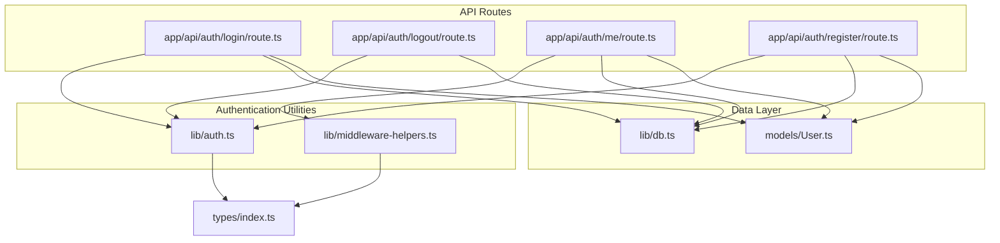
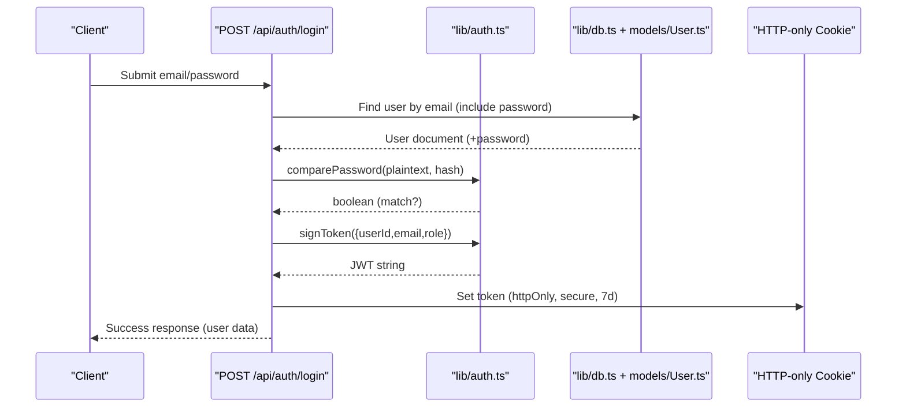
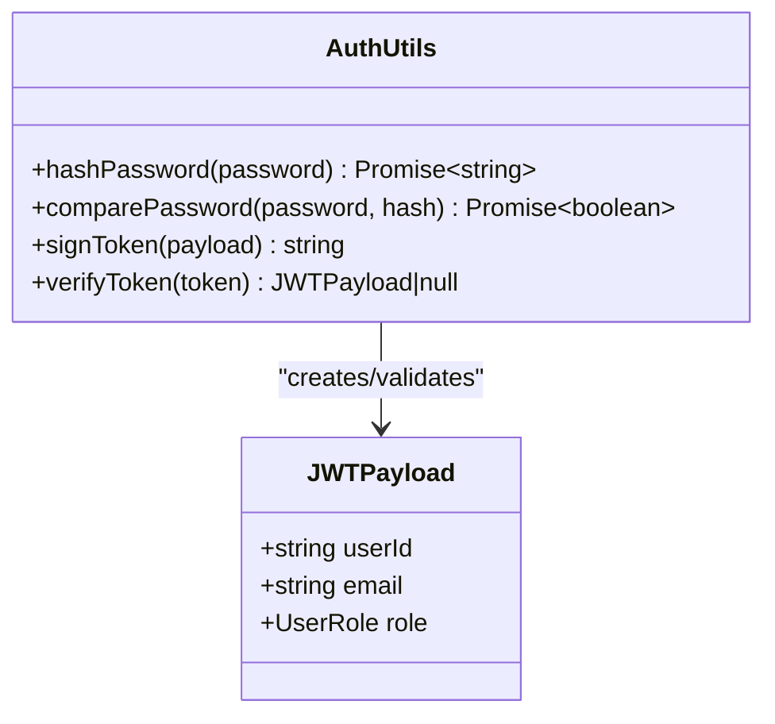
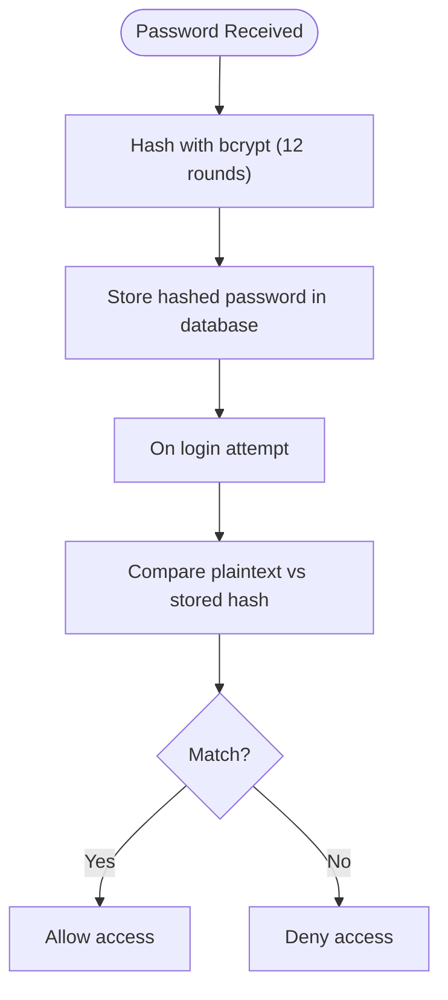
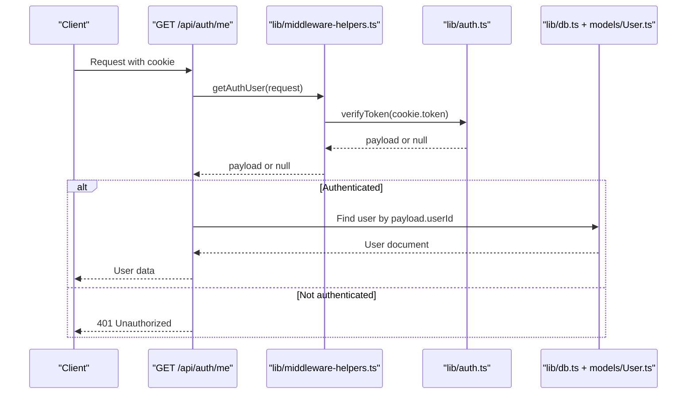
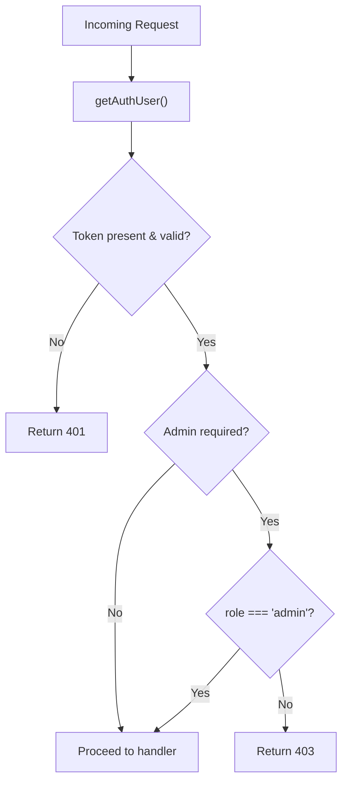
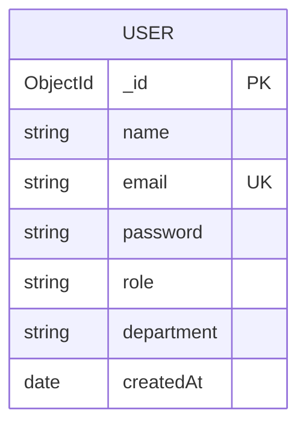
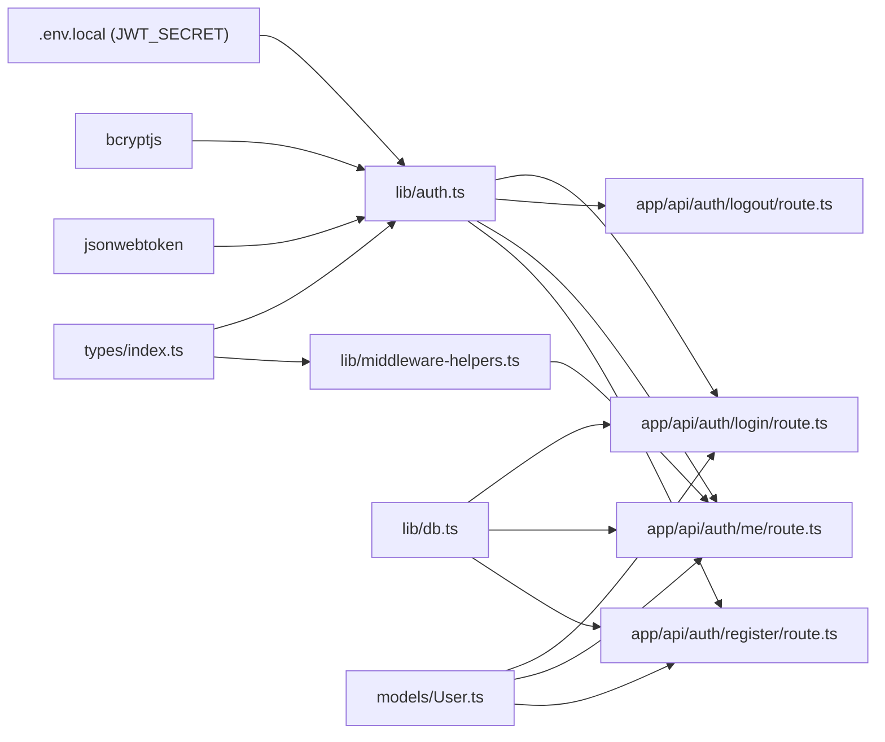

# Authentication Overview

<cite>
**Referenced Files in This Document**
- [auth.ts](file://lib/auth.ts)
- [middleware-helpers.ts](file://lib/middleware-helpers.ts)
- [db.ts](file://lib/db.ts)
- [User.ts](file://models/User.ts)
- [login.route.ts](file://app/api/auth/login/route.ts)
- [logout.route.ts](file://app/api/auth/logout/route.ts)
- [me.route.ts](file://app/api/auth/me/route.ts)
- [register.route.ts](file://app/api/auth/register/route.ts)
- [index.ts](file://types/index.ts)
</cite>

## Table of Contents
1. [Introduction](#introduction)
2. [Project Structure](#project-structure)
3. [Core Components](#core-components)
4. [Architecture Overview](#architecture-overview)
5. [Detailed Component Analysis](#detailed-component-analysis)
6. [Dependency Analysis](#dependency-analysis)
7. [Performance Considerations](#performance-considerations)
8. [Security Considerations](#security-considerations)
9. [Troubleshooting Guide](#troubleshooting-guide)
10. [Conclusion](#conclusion)

## Introduction
This document provides a comprehensive overview of the authentication system. It explains the JWT-based authentication architecture, password hashing implementation using bcryptjs, and token lifecycle management. It documents the core authentication functions, JWT payload structure, secret key management, token expiration policies, and outlines security considerations and best practices for password storage and token validation.

## Project Structure
The authentication system spans several modules:
- Core authentication utilities: password hashing, comparison, JWT signing, and verification
- API routes: login, logout, registration, and protected profile retrieval
- Middleware helpers: token extraction and verification for protected routes
- Database connection and user model
- Type definitions for JWT payload and request/response shapes

**Diagram sources**
- [auth.ts:1-50](file://lib/auth.ts#L1-L50)
- [middleware-helpers.ts:1-81](file://lib/middleware-helpers.ts#L1-L81)
- [login.route.ts:1-101](file://app/api/auth/login/route.ts#L1-L101)
- [logout.route.ts:1-31](file://app/api/auth/logout/route.ts#L1-L31)
- [me.route.ts:1-66](file://app/api/auth/me/route.ts#L1-L66)
- [register.route.ts:1-102](file://app/api/auth/register/route.ts#L1-L102)
- [db.ts:1-54](file://lib/db.ts#L1-L54)
- [User.ts:1-50](file://models/User.ts#L1-L50)
- [index.ts:1-61](file://types/index.ts#L1-L61)

**Section sources**
- [auth.ts:1-50](file://lib/auth.ts#L1-L50)
- [middleware-helpers.ts:1-81](file://lib/middleware-helpers.ts#L1-L81)
- [login.route.ts:1-101](file://app/api/auth/login/route.ts#L1-L101)
- [logout.route.ts:1-31](file://app/api/auth/logout/route.ts#L1-L31)
- [me.route.ts:1-66](file://app/api/auth/me/route.ts#L1-L66)
- [register.route.ts:1-102](file://app/api/auth/register/route.ts#L1-L102)
- [db.ts:1-54](file://lib/db.ts#L1-L54)
- [User.ts:1-50](file://models/User.ts#L1-L50)
- [index.ts:1-61](file://types/index.ts#L1-L61)

## Core Components
- Password hashing and comparison: bcryptjs integration for secure password handling
- JWT signing and verification: jsonwebtoken with environment-managed secret and 7-day expiration
- Token storage: HTTP-only cookies for secure client-side token persistence
- Protected route helpers: middleware to extract and validate tokens for API endpoints
- User model: Mongoose schema with password field and role-based access control

Key functions and responsibilities:
- hashPassword: Hashes passwords using bcrypt with 12 rounds
- comparePassword: Compares plaintext passwords against stored hashes
- signToken: Creates signed JWT with 7-day expiry using a secret from environment
- verifyToken: Validates JWT and returns payload or null on failure
- getAuthUser: Extracts token from cookies and verifies it
- requireAuth and requireAdmin: Enforce authentication and admin role checks

**Section sources**
- [auth.ts:13-49](file://lib/auth.ts#L13-L49)
- [middleware-helpers.ts:6-81](file://lib/middleware-helpers.ts#L6-L81)
- [User.ts:18-22](file://models/User.ts#L18-L22)
- [index.ts:34-38](file://types/index.ts#L34-L38)

## Architecture Overview
The authentication architecture follows a layered design:
- Presentation/API layer: Next.js App Router handlers for login, logout, register, and profile
- Service/utility layer: Authentication utilities and middleware helpers
- Persistence layer: MongoDB via Mongoose with a dedicated User model
- Security layer: Environment-backed JWT secret, bcrypt-based password hashing, and HTTP-only cookies

**Diagram sources**
- [login.route.ts:8-100](file://app/api/auth/login/route.ts#L8-L100)
- [auth.ts:23-37](file://lib/auth.ts#L23-L37)
- [db.ts:28-51](file://lib/db.ts#L28-L51)
- [User.ts:1-50](file://models/User.ts#L1-L50)

## Detailed Component Analysis

### JWT Payload and Secret Management
- Payload structure: userId, email, role
- Secret management: loaded from environment variable JWT_SECRET; validated at module load time
- Expiration policy: 7 days

**Diagram sources**
- [index.ts:34-38](file://types/index.ts#L34-L38)
- [auth.ts:33-49](file://lib/auth.ts#L33-L49)

**Section sources**
- [index.ts:34-38](file://types/index.ts#L34-L38)
- [auth.ts:5-11](file://lib/auth.ts#L5-L11)
- [auth.ts:33-37](file://lib/auth.ts#L33-L37)

### Password Hashing Implementation (bcryptjs)
- Rounds: 12
- Storage: Only hashed password is persisted
- Comparison: bcrypt.compare for secure timing-safe comparison

**Diagram sources**
- [auth.ts:16-28](file://lib/auth.ts#L16-L28)
- [register.route.ts:63-64](file://app/api/auth/register/route.ts#L63-L64)
- [login.route.ts:44-45](file://app/api/auth/login/route.ts#L44-L45)

**Section sources**
- [auth.ts:16-28](file://lib/auth.ts#L16-L28)
- [register.route.ts:63-64](file://app/api/auth/register/route.ts#L63-L64)
- [login.route.ts:44-45](file://app/api/auth/login/route.ts#L44-L45)

### Token Lifecycle Management
- Creation: signToken called after successful authentication
- Storage: HTTP-only cookie set with secure flags and 7-day maxAge
- Retrieval: getAuthUser reads cookie and verifies token
- Expiration: handled by JWT library; cookie cleared on logout

**Diagram sources**
- [me.route.ts:7-65](file://app/api/auth/me/route.ts#L7-L65)
- [middleware-helpers.ts:10-26](file://lib/middleware-helpers.ts#L10-L26)
- [auth.ts:42-49](file://lib/auth.ts#L42-L49)
- [db.ts:28-51](file://lib/db.ts#L28-L51)
- [User.ts:1-50](file://models/User.ts#L1-L50)

**Section sources**
- [login.route.ts:57-72](file://app/api/auth/login/route.ts#L57-L72)
- [logout.route.ts:9-11](file://app/api/auth/logout/route.ts#L9-L11)
- [middleware-helpers.ts:10-26](file://lib/middleware-helpers.ts#L10-L26)

### Protected Route Helpers
- requireAuth: Returns user payload if authenticated, otherwise 401
- requireAdmin: Enforces admin role in addition to authentication

**Diagram sources**
- [middleware-helpers.ts:32-80](file://lib/middleware-helpers.ts#L32-L80)

**Section sources**
- [middleware-helpers.ts:32-80](file://lib/middleware-helpers.ts#L32-L80)

### User Model and Database Integration
- Schema enforces unique email, stores hashed password, and defaults role to employee
- select: false prevents accidental exposure of password in queries
- Index on email for efficient lookups

**Diagram sources**
- [User.ts:4-41](file://models/User.ts#L4-L41)

**Section sources**
- [User.ts:18-22](file://models/User.ts#L18-L22)
- [User.ts:23-27](file://models/User.ts#L23-L27)
- [User.ts:43-44](file://models/User.ts#L43-L44)

## Dependency Analysis
Authentication components depend on:
- Environment variables for secrets
- Third-party libraries for cryptography and JWT
- Database connectivity and models
- Next.js runtime for cookies and routing

**Diagram sources**
- [auth.ts:1-3](file://lib/auth.ts#L1-L3)
- [login.route.ts:1-6](file://app/api/auth/login/route.ts#L1-L6)
- [logout.route.ts:1-4](file://app/api/auth/logout/route.ts#L1-L4)
- [me.route.ts:1-5](file://app/api/auth/me/route.ts#L1-L5)
- [register.route.ts:1-5](file://app/api/auth/register/route.ts#L1-L5)
- [db.ts:1-11](file://lib/db.ts#L1-L11)
- [User.ts:1-2](file://models/User.ts#L1-L2)
- [index.ts:1-3](file://types/index.ts#L1-L3)

**Section sources**
- [auth.ts:1-3](file://lib/auth.ts#L1-L3)
- [login.route.ts:1-6](file://app/api/auth/login/route.ts#L1-L6)
- [logout.route.ts:1-4](file://app/api/auth/logout/route.ts#L1-L4)
- [me.route.ts:1-5](file://app/api/auth/me/route.ts#L1-L5)
- [register.route.ts:1-5](file://app/api/auth/register/route.ts#L1-L5)
- [db.ts:1-11](file://lib/db.ts#L1-L11)
- [User.ts:1-2](file://models/User.ts#L1-L2)
- [index.ts:1-3](file://types/index.ts#L1-L3)

## Performance Considerations
- bcrypt cost: 12 rounds balance security and performance; adjust based on hardware
- Database indexing: email index improves login and registration lookup performance
- Connection caching: Mongoose connection caching reduces repeated connection overhead
- Token verification: performed per-request; keep payload minimal to reduce parsing overhead

## Security Considerations
- Secret management: JWT_SECRET must be set in environment; absence throws at startup
- Cookie security: httpOnly and secure flags mitigate XSS and enforce HTTPS in production
- SameSite: lax policy balances CSRF protection and usability
- Password storage: only hashed values are stored; plaintext never persisted
- Role enforcement: requireAdmin centralizes admin checks across endpoints
- Input validation: email format and password length checks prevent trivial attacks
- Token expiration: 7-day expiry limits window of compromised tokens

Best practices:
- Rotate JWT_SECRET periodically and handle deployment updates carefully
- Use HTTPS in production to leverage secure cookies
- Consider shorter token expirations and refresh token strategies for sensitive applications
- Implement rate limiting for login attempts
- Add audit logs for authentication events

**Section sources**
- [auth.ts:7-11](file://lib/auth.ts#L7-L11)
- [login.route.ts:66-72](file://app/api/auth/login/route.ts#L66-L72)
- [User.ts:18-22](file://models/User.ts#L18-L22)
- [middleware-helpers.ts:54-80](file://lib/middleware-helpers.ts#L54-L80)
- [register.route.ts:25-46](file://app/api/auth/register/route.ts#L25-L46)

## Troubleshooting Guide
Common issues and resolutions:
- Missing JWT_SECRET: Application fails fast at import time; ensure environment variable is configured
- Invalid credentials: Login returns 401; verify email casing normalization and password hashing
- Authentication required: Protected endpoints return 401 if token missing or invalid
- Admin access required: Protected admin endpoints return 403 if role is not admin
- Internal server errors: Wrapped responses indicate server-side failures; check server logs

Operational tips:
- Validate environment variables before deploying
- Test cookie behavior in development vs production environments
- Monitor bcrypt cost impact on registration/login latency
- Confirm database connectivity and indexes for email lookups

**Section sources**
- [auth.ts:7-11](file://lib/auth.ts#L7-L11)
- [login.route.ts:34-55](file://app/api/auth/login/route.ts#L34-L55)
- [me.route.ts:14-22](file://app/api/auth/me/route.ts#L14-L22)
- [middleware-helpers.ts:32-48](file://lib/middleware-helpers.ts#L32-L48)
- [register.route.ts:52-61](file://app/api/auth/register/route.ts#L52-L61)

## Conclusion
The authentication system employs industry-standard practices: bcrypt-based password hashing, JWT with environment-managed secrets, and HTTP-only cookies for secure token storage. The modular design separates concerns across utilities, routes, middleware, and models, enabling maintainability and scalability. Adhering to the outlined security considerations and best practices ensures robust protection for user credentials and session state.