# Authentication System

<cite>
**Referenced Files in This Document**
- [lib/auth.ts](file://lib/auth.ts)
- [app/api/auth/login/route.ts](file://app/api/auth/login/route.ts)
- [app/api/auth/register/route.ts](file://app/api/auth/register/route.ts)
- [app/api/auth/logout/route.ts](file://app/api/auth/logout/route.ts)
- [app/api/auth/me/route.ts](file://app/api/auth/me/route.ts)
- [middleware.ts](file://middleware.ts)
- [lib/middleware-helpers.ts](file://lib/middleware-helpers.ts)
- [lib/db.ts](file://lib/db.ts)
- [models/User.ts](file://models/User.ts)
</cite>

## Table of Contents
1. [Introduction](#introduction)
2. [Project Structure](#project-structure)
3. [Core Components](#core-components)
4. [Architecture Overview](#architecture-overview)
5. [Detailed Component Analysis](#detailed-component-analysis)
6. [Dependency Analysis](#dependency-analysis)
7. [Performance Considerations](#performance-considerations)
8. [Security Measures](#security-measures)
9. [Client Integration Guide](#client-integration-guide)
10. [Troubleshooting Guide](#troubleshooting-guide)
11. [Conclusion](#conclusion)

## Introduction
This document provides comprehensive authentication system documentation for a Next.js attendance application. The system implements JWT-based authentication with bcrypt password hashing, HTTP-only cookie storage, and role-based access control (admin vs employee). It covers login, registration, logout, and profile retrieval endpoints, middleware protection, token validation processes, and security measures including password encryption, token expiration, and CSRF protection strategies.

## Project Structure
The authentication system is organized into several key areas:
- API routes under `/app/api/auth/` handle authentication operations
- Shared authentication utilities in `/lib/auth.ts`
- Database connection and user model in `/lib/db.ts` and `/models/User.ts`
- Middleware protection in `/middleware.ts` and helper utilities in `/lib/middleware-helpers.ts`
- Client-side integration through Next.js App Router

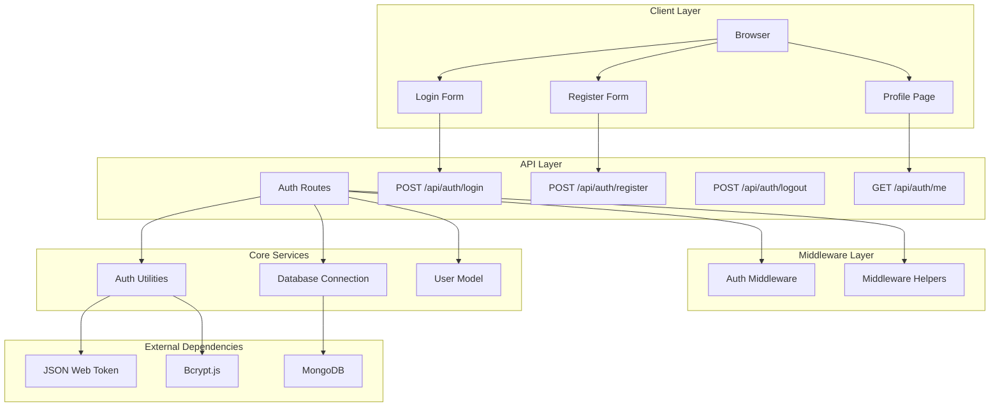

**Diagram sources**
- [app/api/auth/login/route.ts:1-101](file://app/api/auth/login/route.ts#L1-L101)
- [app/api/auth/register/route.ts:1-102](file://app/api/auth/register/route.ts#L1-L102)
- [app/api/auth/logout/route.ts:1-31](file://app/api/auth/logout/route.ts#L1-L31)
- [app/api/auth/me/route.ts:1-66](file://app/api/auth/me/route.ts#L1-L66)
- [lib/auth.ts:1-50](file://lib/auth.ts#L1-L50)
- [lib/db.ts:1-54](file://lib/db.ts#L1-L54)
- [models/User.ts:1-50](file://models/User.ts#L1-L50)

**Section sources**
- [lib/auth.ts:1-50](file://lib/auth.ts#L1-L50)
- [app/api/auth/login/route.ts:1-101](file://app/api/auth/login/route.ts#L1-L101)
- [app/api/auth/register/route.ts:1-102](file://app/api/auth/register/route.ts#L1-L102)
- [app/api/auth/logout/route.ts:1-31](file://app/api/auth/logout/route.ts#L1-L31)
- [app/api/auth/me/route.ts:1-66](file://app/api/auth/me/route.ts#L1-L66)
- [middleware.ts:1-35](file://middleware.ts#L1-L35)
- [lib/middleware-helpers.ts:1-81](file://lib/middleware-helpers.ts#L1-L81)
- [lib/db.ts:1-54](file://lib/db.ts#L1-L54)
- [models/User.ts:1-50](file://models/User.ts#L1-L50)

## Core Components
The authentication system consists of several interconnected components working together to provide secure user authentication and authorization.

### Authentication Utilities
The core authentication utilities provide password hashing, token signing, and verification capabilities using bcryptjs and jsonwebtoken libraries.

### Database Layer
The database layer manages MongoDB connections with connection pooling and caching, while the User model defines the schema for user accounts with role-based permissions.

### Middleware Protection
The middleware layer provides route protection by checking for authentication tokens and redirecting unauthenticated users to the login page.

### API Endpoints
Four primary API endpoints handle the complete authentication lifecycle: login, registration, logout, and profile retrieval.

**Section sources**
- [lib/auth.ts:1-50](file://lib/auth.ts#L1-L50)
- [lib/db.ts:1-54](file://lib/db.ts#L1-L54)
- [models/User.ts:1-50](file://models/User.ts#L1-L50)
- [middleware.ts:1-35](file://middleware.ts#L1-L35)

## Architecture Overview
The authentication system follows a layered architecture with clear separation of concerns between presentation, business logic, and data persistence layers.

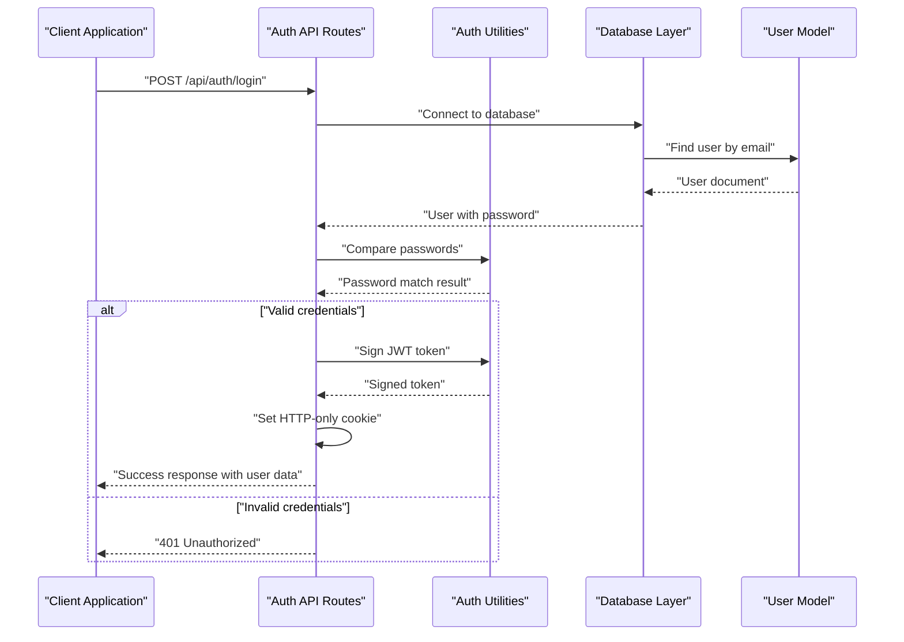

**Diagram sources**
- [app/api/auth/login/route.ts:1-101](file://app/api/auth/login/route.ts#L1-L101)
- [lib/auth.ts:1-50](file://lib/auth.ts#L1-L50)
- [lib/db.ts:1-54](file://lib/db.ts#L1-L54)
- [models/User.ts:1-50](file://models/User.ts#L1-L50)

The system implements a cookie-based authentication mechanism where JWT tokens are stored in HTTP-only cookies for enhanced security against XSS attacks. The middleware layer provides coarse-grained route protection, while individual API routes handle fine-grained authorization checks.

**Section sources**
- [middleware.ts:1-35](file://middleware.ts#L1-L35)
- [lib/middleware-helpers.ts:1-81](file://lib/middleware-helpers.ts#L1-L81)
- [app/api/auth/login/route.ts:1-101](file://app/api/auth/login/route.ts#L1-L101)

## Detailed Component Analysis

### Password Hashing Implementation
The system uses bcryptjs for secure password hashing with 12 rounds of hashing for optimal security-performance balance.

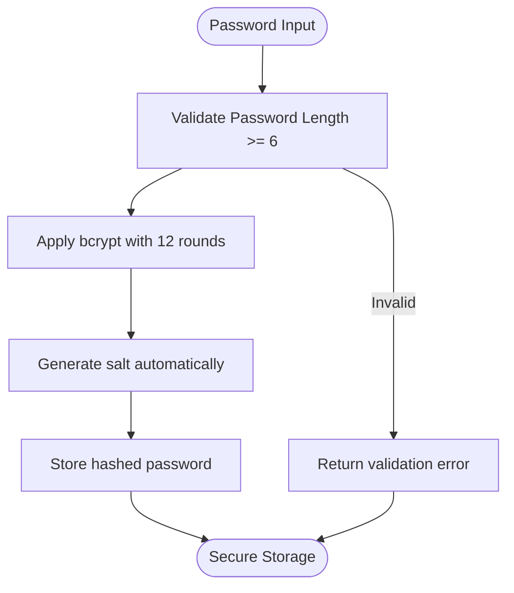

**Diagram sources**
- [lib/auth.ts:13-28](file://lib/auth.ts#L13-L28)
- [app/api/auth/register/route.ts:37-46](file://app/api/auth/register/route.ts#L37-L46)

The password hashing process ensures that plaintext passwords are never stored, only their bcrypt hashes. The 12-round configuration provides strong security against brute-force attacks while maintaining reasonable performance.

**Section sources**
- [lib/auth.ts:13-28](file://lib/auth.ts#L13-L28)
- [app/api/auth/register/route.ts:37-46](file://app/api/auth/register/route.ts#L37-L46)

### JWT Token Management
JWT tokens are signed with a 7-day expiration period and stored in HTTP-only cookies for enhanced security.

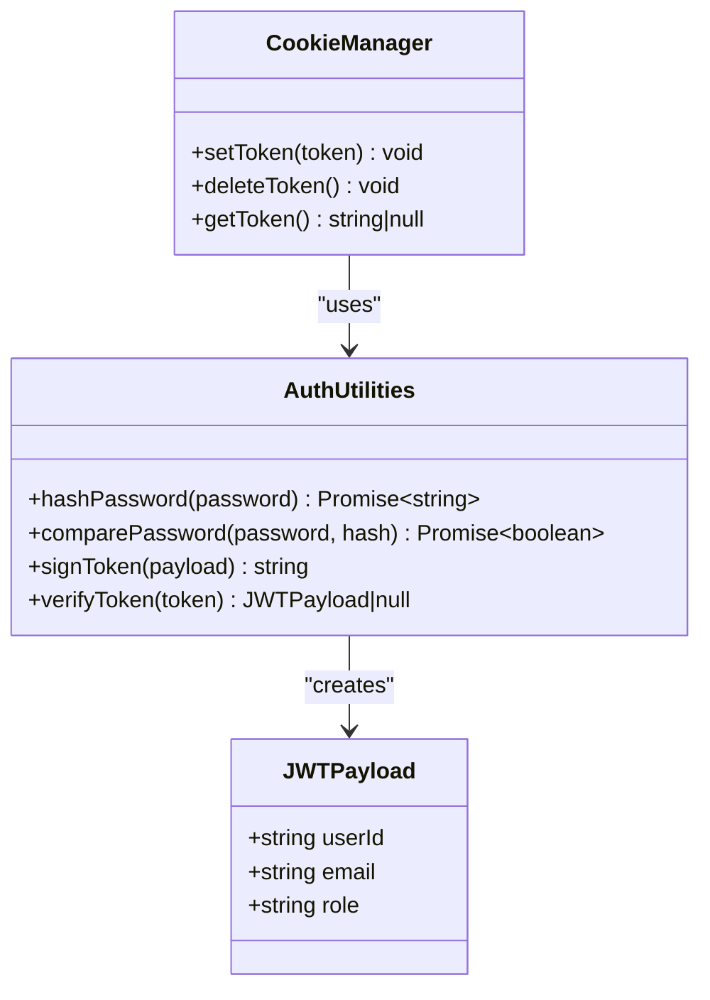

**Diagram sources**
- [lib/auth.ts:30-49](file://lib/auth.ts#L30-L49)
- [app/api/auth/login/route.ts:57-72](file://app/api/auth/login/route.ts#L57-L72)

The token structure includes essential user information: user ID, email, and role. The HTTP-only flag prevents client-side JavaScript access, mitigating XSS attack vectors.

**Section sources**
- [lib/auth.ts:30-49](file://lib/auth.ts#L30-L49)
- [app/api/auth/login/route.ts:57-72](file://app/api/auth/login/route.ts#L57-L72)

### Login Endpoint Workflow
The login endpoint handles user authentication with comprehensive validation and error handling.

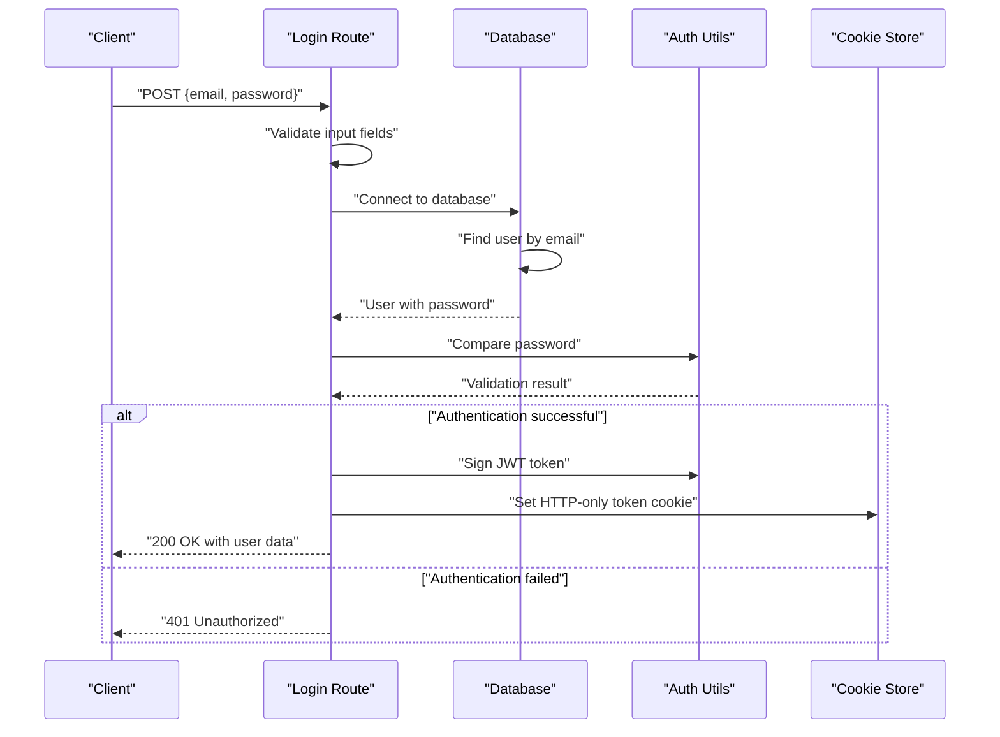

**Diagram sources**
- [app/api/auth/login/route.ts:1-101](file://app/api/auth/login/route.ts#L1-L101)

The login process includes input validation, database lookup with password inclusion for comparison, bcrypt password verification, JWT token generation, and secure cookie setting.

**Section sources**
- [app/api/auth/login/route.ts:1-101](file://app/api/auth/login/route.ts#L1-L101)

### Registration Endpoint Implementation
The registration endpoint provides user account creation with comprehensive validation and security measures.

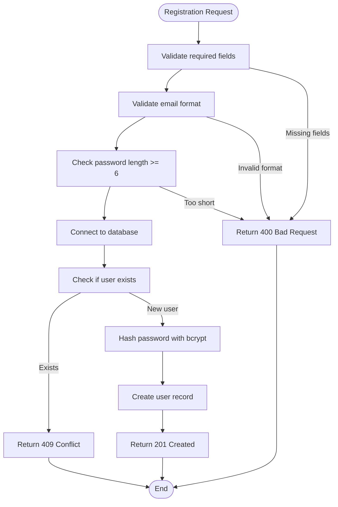

**Diagram sources**
- [app/api/auth/register/route.ts:1-102](file://app/api/auth/register/route.ts#L1-L102)

The registration process enforces input validation, prevents duplicate accounts, applies bcrypt hashing, and creates user records with default employee role assignment.

**Section sources**
- [app/api/auth/register/route.ts:1-102](file://app/api/auth/register/route.ts#L1-L102)

### Session Management and Logout
The logout functionality provides secure session termination by removing the authentication cookie.

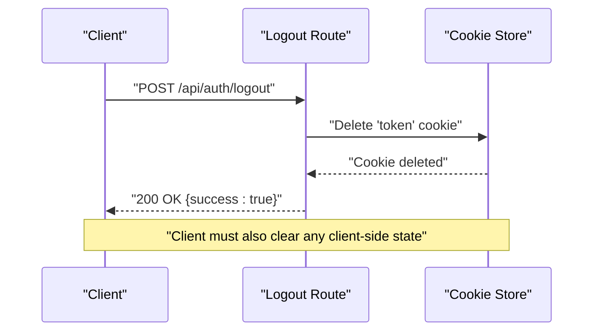

**Diagram sources**
- [app/api/auth/logout/route.ts:1-31](file://app/api/auth/logout/route.ts#L1-L31)

The logout process immediately invalidates the server-side session by removing the cookie, though client-side local storage/session storage may still contain user data that should be cleared by the frontend.

**Section sources**
- [app/api/auth/logout/route.ts:1-31](file://app/api/auth/logout/route.ts#L1-L31)

### Profile Retrieval Endpoint
The profile endpoint securely retrieves authenticated user information with proper authorization checks.

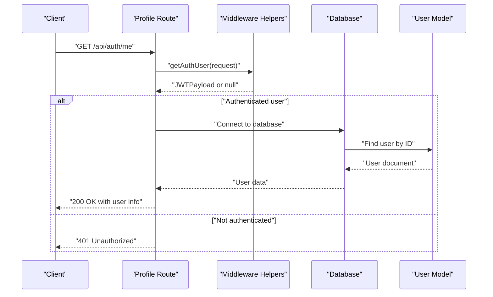

**Diagram sources**
- [app/api/auth/me/route.ts:1-66](file://app/api/auth/me/route.ts#L1-L66)
- [lib/middleware-helpers.ts:10-26](file://lib/middleware-helpers.ts#L10-L26)

The profile endpoint relies on middleware helpers to extract and verify the JWT token, then performs database lookup to return user information excluding sensitive fields.

**Section sources**
- [app/api/auth/me/route.ts:1-66](file://app/api/auth/me/route.ts#L1-L66)
- [lib/middleware-helpers.ts:10-26](file://lib/middleware-helpers.ts#L10-L26)

### Middleware Protection System
The middleware layer provides coarse-grained route protection for dashboard areas while allowing public access to authentication pages.

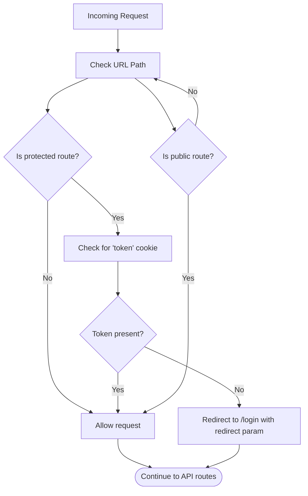

**Diagram sources**
- [middleware.ts:13-35](file://middleware.ts#L13-L35)

The middleware configuration targets `/admin/:path*` and `/employee/:path*` routes, redirecting unauthenticated users to the login page with a redirect parameter preserving the original destination.

**Section sources**
- [middleware.ts:13-35](file://middleware.ts#L13-L35)

### Role-Based Access Control
The system implements role-based access control through middleware helpers that enforce authorization requirements at the API route level.

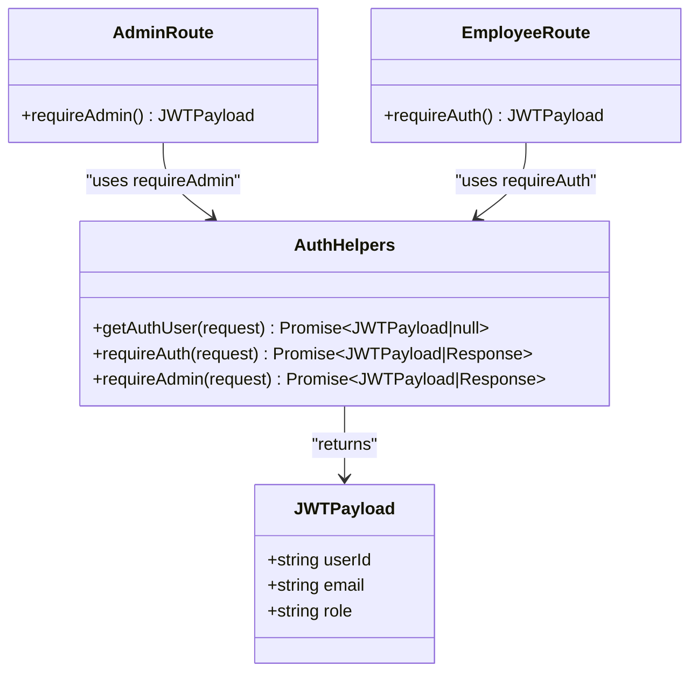

**Diagram sources**
- [lib/middleware-helpers.ts:28-81](file://lib/middleware-helpers.ts#L28-L81)

The authorization helpers provide three levels of access control: basic authentication, admin-only access, and flexible role-based access patterns that can be extended as needed.

**Section sources**
- [lib/middleware-helpers.ts:28-81](file://lib/middleware-helpers.ts#L28-L81)

## Dependency Analysis
The authentication system exhibits clear dependency relationships with well-defined interfaces between components.

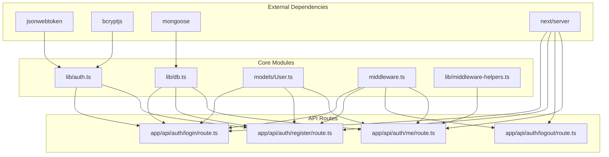

**Diagram sources**
- [lib/auth.ts:1-50](file://lib/auth.ts#L1-L50)
- [lib/db.ts:1-54](file://lib/db.ts#L1-L54)
- [models/User.ts:1-50](file://models/User.ts#L1-L50)
- [middleware.ts:1-35](file://middleware.ts#L1-L35)
- [lib/middleware-helpers.ts:1-81](file://lib/middleware-helpers.ts#L1-L81)
- [app/api/auth/login/route.ts:1-101](file://app/api/auth/login/route.ts#L1-L101)
- [app/api/auth/register/route.ts:1-102](file://app/api/auth/register/route.ts#L1-L102)
- [app/api/auth/logout/route.ts:1-31](file://app/api/auth/logout/route.ts#L1-L31)
- [app/api/auth/me/route.ts:1-66](file://app/api/auth/me/route.ts#L1-L66)

The dependency graph reveals a clean separation of concerns where external libraries are encapsulated within utility modules, and API routes depend on these utilities rather than directly on external libraries.

**Section sources**
- [lib/auth.ts:1-50](file://lib/auth.ts#L1-L50)
- [lib/db.ts:1-54](file://lib/db.ts#L1-L54)
- [models/User.ts:1-50](file://models/User.ts#L1-L50)
- [middleware.ts:1-35](file://middleware.ts#L1-L35)
- [lib/middleware-helpers.ts:1-81](file://lib/middleware-helpers.ts#L1-L81)

## Performance Considerations
The authentication system incorporates several performance optimizations and considerations:

### Database Connection Management
The database connection layer implements connection pooling and caching to minimize connection overhead and improve response times for concurrent requests.

### Password Hashing Optimization
Bcrypt with 12 rounds provides a good balance between security and performance, suitable for typical web application workloads. The hashing cost can be adjusted based on server performance characteristics.

### Token Expiration Strategy
7-day token expiration provides extended session lifetime while maintaining reasonable security boundaries. Shorter expiration periods can be configured for higher security requirements.

### Caching Considerations
The current implementation focuses on security over aggressive caching. Future enhancements could include token blacklisting mechanisms or refresh token strategies for improved scalability.

## Security Measures

### Password Encryption
All passwords are hashed using bcrypt with automatic salt generation and 12 rounds of hashing. The system never stores plaintext passwords, only their cryptographic hashes.

### Token Security
- HTTP-only cookies prevent client-side JavaScript access
- Secure flag enabled in production environments
- SameSite attribute set to "lax" for CSRF protection
- 7-day expiration period balances usability with security

### Input Validation
Comprehensive input validation prevents injection attacks and malformed requests:
- Required field validation for all authentication operations
- Email format validation using regex patterns
- Password length validation (minimum 6 characters)
- Role validation against predefined enum values

### CSRF Protection
While the system uses HTTP-only cookies which mitigate most XSS attacks, additional CSRF protection can be implemented through:
- CSRF tokens for state-changing operations
- Origin header validation
- Double-submit cookie pattern

### Error Handling
The system implements proper error handling that avoids information leakage:
- Generic error messages for authentication failures
- Specific validation errors for input problems
- Proper HTTP status codes for different error scenarios

**Section sources**
- [lib/auth.ts:13-28](file://lib/auth.ts#L13-L28)
- [app/api/auth/login/route.ts:15-24](file://app/api/auth/login/route.ts#L15-L24)
- [app/api/auth/register/route.ts:25-46](file://app/api/auth/register/route.ts#L25-L46)
- [app/api/auth/logout/route.ts:9-11](file://app/api/auth/logout/route.ts#L9-L11)

## Client Integration Guide

### Frontend Integration Patterns
Client applications should integrate with the authentication system using the following patterns:

#### Login Flow
1. Collect user credentials in the login form
2. Send POST request to `/api/auth/login` with JSON payload
3. Handle successful authentication by storing the HTTP-only cookie
4. Redirect to appropriate dashboard based on user role

#### Registration Flow
1. Validate user input on the client side
2. Send POST request to `/api/auth/register` with user data
3. Handle success/failure responses appropriately
4. Redirect to login page after successful registration

#### Protected Route Access
1. Use middleware to protect dashboard routes
2. Implement automatic redirection for unauthenticated users
3. Handle token expiration gracefully
4. Clear client-side state on logout

#### Error Handling Strategies
- Display user-friendly error messages
- Implement retry logic for transient failures
- Handle network connectivity issues
- Manage token expiration and refresh scenarios

### API Response Formats
All authentication endpoints follow a consistent response format:
- Success responses include `success: true` and optional `data` field
- Error responses include `success: false` and `error` message
- HTTP status codes indicate the nature of the response (2xx for success, 4xx for client errors, 5xx for server errors)

### Security Best Practices for Clients
- Never store sensitive user data in local storage or session storage
- Implement proper loading states during authentication operations
- Handle authentication state changes in a centralized location
- Use HTTPS in production environments
- Implement proper form validation and sanitization

## Troubleshooting Guide

### Common Authentication Issues

#### Login Failures
- Verify email and password are correctly entered
- Check that the user account exists in the database
- Ensure password meets minimum length requirements
- Confirm JWT_SECRET environment variable is properly configured

#### Registration Errors
- Validate email format compliance
- Check password strength requirements
- Ensure unique email constraint is not violated
- Verify database connectivity

#### Token Issues
- Confirm HTTP-only cookie is being set correctly
- Check browser cookie settings and privacy controls
- Verify token expiration and renewal mechanisms
- Ensure proper CORS configuration for cross-origin requests

#### Middleware Problems
- Verify middleware matcher configuration
- Check cookie extraction logic
- Ensure proper redirect handling
- Validate role-based access control implementation

### Debugging Strategies
- Enable detailed logging for authentication operations
- Monitor database connection pool usage
- Implement comprehensive error reporting
- Test authentication flows with various failure scenarios
- Validate environment variable configuration

**Section sources**
- [app/api/auth/login/route.ts:90-100](file://app/api/auth/login/route.ts#L90-L100)
- [app/api/auth/register/route.ts:91-101](file://app/api/auth/register/route.ts#L91-L101)
- [app/api/auth/logout/route.ts:20-30](file://app/api/auth/logout/route.ts#L20-L30)
- [app/api/auth/me/route.ts:55-65](file://app/api/auth/me/route.ts#L55-L65)

## Conclusion
The authentication system provides a robust, secure foundation for the attendance application with comprehensive password hashing, JWT token management, and role-based access control. The implementation follows security best practices including HTTP-only cookies, input validation, and proper error handling. The modular architecture enables easy maintenance and future enhancements while providing clear separation of concerns between authentication logic, middleware protection, and API endpoints.

Key strengths of the system include:
- Strong password security through bcrypt hashing
- Secure token storage using HTTP-only cookies
- Comprehensive input validation and error handling
- Flexible role-based access control implementation
- Clean separation of authentication concerns
- Scalable database connection management

Future enhancements could include implementing CSRF tokens, refresh token mechanisms, two-factor authentication, and enhanced audit logging for security monitoring.