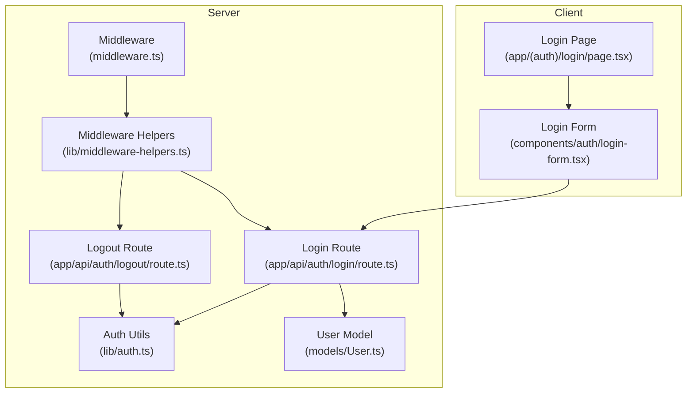
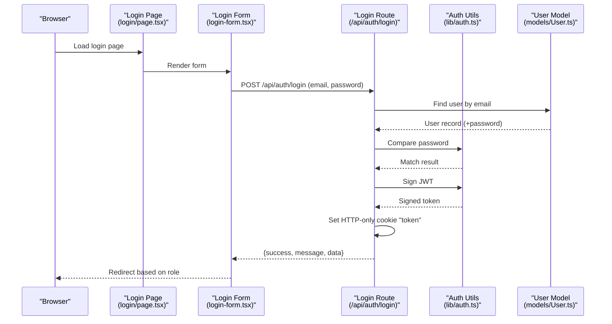
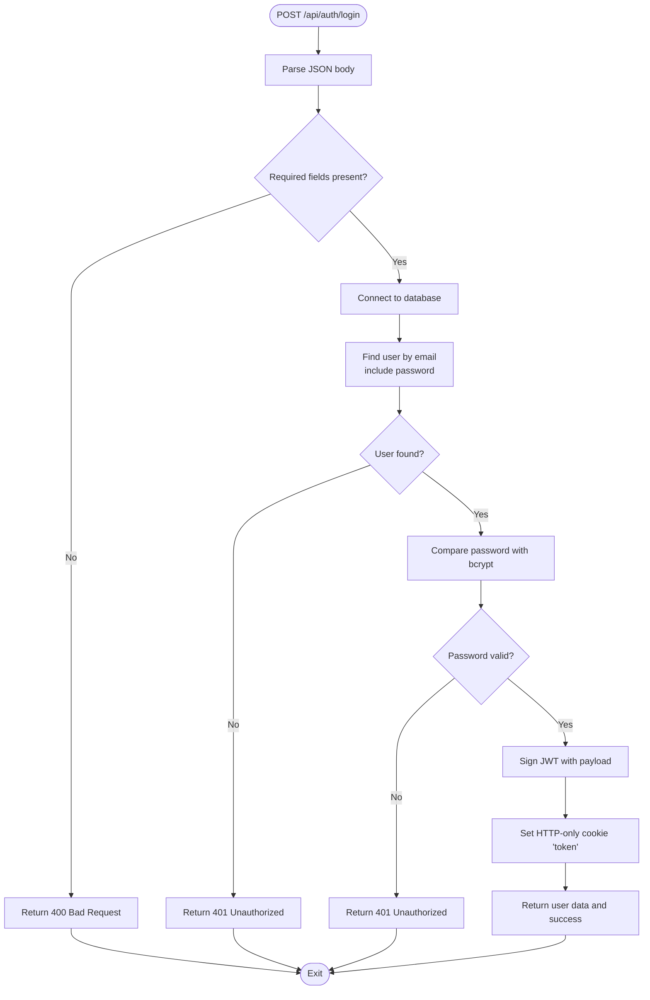
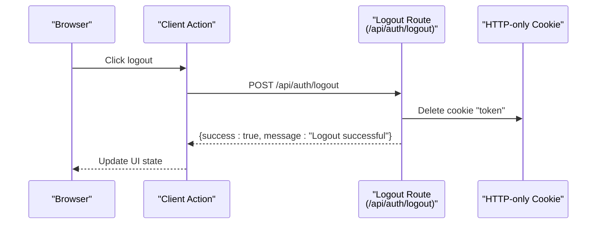
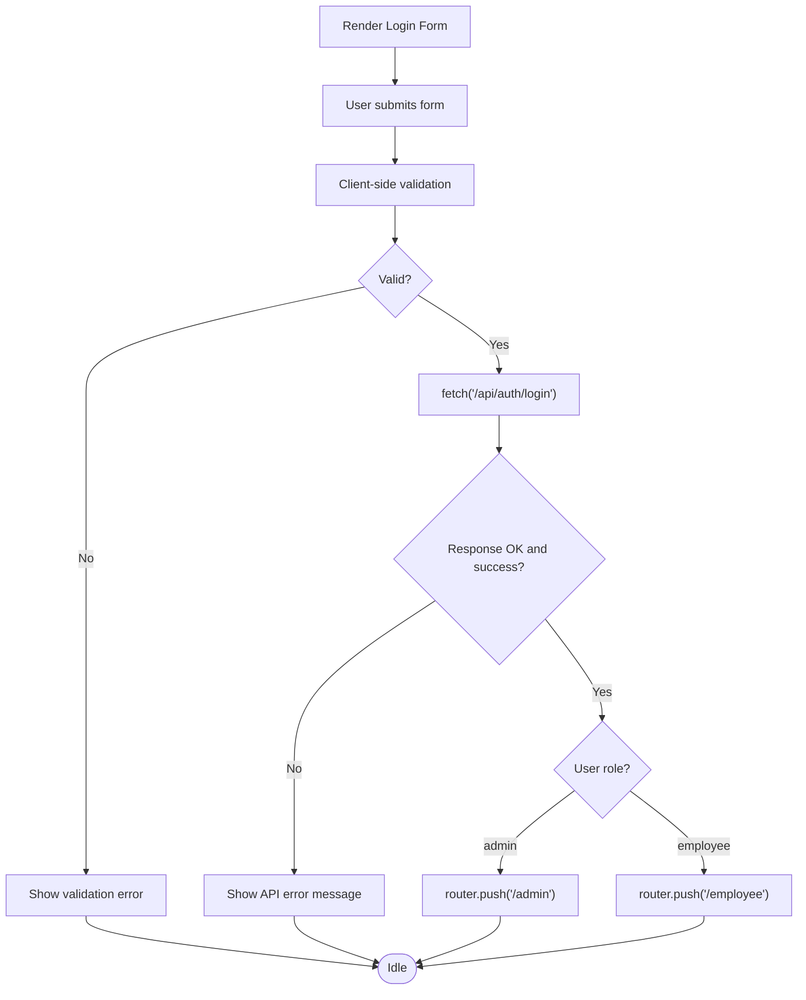
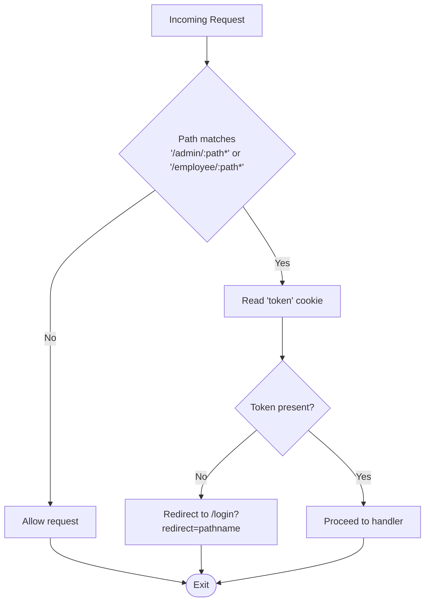
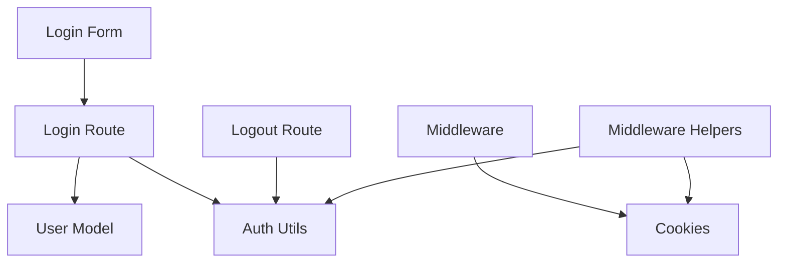

# Login and Logout Flow

<cite>
**Referenced Files in This Document**
- [login route.ts](file://app/api/auth/login/route.ts)
- [logout route.ts](file://app/api/auth/logout/route.ts)
- [auth utils.ts](file://lib/auth.ts)
- [middleware.ts](file://middleware.ts)
- [middleware helpers.ts](file://lib/middleware-helpers.ts)
- [login form.tsx](file://components/auth/login-form.tsx)
- [login page.tsx](file://app/(auth)/login/page.tsx)
- [User model.ts](file://models/User.ts)
</cite>

## Table of Contents
1. [Introduction](#introduction)
2. [Project Structure](#project-structure)
3. [Core Components](#core-components)
4. [Architecture Overview](#architecture-overview)
5. [Detailed Component Analysis](#detailed-component-analysis)
6. [Dependency Analysis](#dependency-analysis)
7. [Performance Considerations](#performance-considerations)
8. [Security Measures](#security-measures)
9. [Troubleshooting Guide](#troubleshooting-guide)
10. [Conclusion](#conclusion)

## Introduction
This document explains the complete login and logout authentication flows for the attendance system. It covers the server-side API endpoints, client-side form implementation, error handling, and security measures. The system uses HTTP-only cookies for token storage, JWT-based authentication, and role-based access control.

## Project Structure
The authentication implementation spans several layers:
- API routes handle login and logout requests
- Authentication utilities manage hashing, password comparison, and JWT signing/verification
- Middleware enforces route protection and redirects unauthenticated users
- Client-side React components implement the login form and submission logic
- The User model defines the data schema and database interactions

**Diagram sources**
- [login page.tsx:12-42](file://app/(auth)/login/page.tsx#L12-L42)
- [login form.tsx:30-96](file://components/auth/login-form.tsx#L30-L96)
- [middleware.ts:13-28](file://middleware.ts#L13-L28)
- [middleware helpers.ts:10-26](file://lib/middleware-helpers.ts#L10-L26)
- [login route.ts:8-100](file://app/api/auth/login/route.ts#L8-L100)
- [logout route.ts:5-30](file://app/api/auth/logout/route.ts#L5-L30)
- [auth utils.ts:13-49](file://lib/auth.ts#L13-L49)
- [User model.ts:4-44](file://models/User.ts#L4-L44)

**Section sources**
- [login page.tsx:12-42](file://app/(auth)/login/page.tsx#L12-L42)
- [login form.tsx:30-96](file://components/auth/login-form.tsx#L30-L96)
- [middleware.ts:13-28](file://middleware.ts#L13-L28)
- [middleware helpers.ts:10-26](file://lib/middleware-helpers.ts#L10-L26)
- [login route.ts:8-100](file://app/api/auth/login/route.ts#L8-L100)
- [logout route.ts:5-30](file://app/api/auth/logout/route.ts#L5-L30)
- [auth utils.ts:13-49](file://lib/auth.ts#L13-L49)
- [User model.ts:4-44](file://models/User.ts#L4-L44)

## Core Components
- Login API endpoint validates input, authenticates the user against the database, compares passwords, signs a JWT, and sets an HTTP-only cookie.
- Logout API endpoint clears the token cookie.
- Client-side login form handles user input, client-side validation, submission via fetch, and role-based redirection.
- Middleware protects protected routes by checking for the presence of the token cookie.
- Middleware helpers verify tokens and enforce authentication and admin access.
- Authentication utilities provide password hashing, comparison, JWT signing, and verification.
- User model defines the schema and database fields.

**Section sources**
- [login route.ts:8-100](file://app/api/auth/login/route.ts#L8-L100)
- [logout route.ts:5-30](file://app/api/auth/logout/route.ts#L5-L30)
- [login form.tsx:30-96](file://components/auth/login-form.tsx#L30-L96)
- [middleware.ts:13-28](file://middleware.ts#L13-L28)
- [middleware helpers.ts:10-26](file://lib/middleware-helpers.ts#L10-L26)
- [auth utils.ts:13-49](file://lib/auth.ts#L13-L49)
- [User model.ts:4-44](file://models/User.ts#L4-L44)

## Architecture Overview
The authentication flow integrates client and server components with middleware enforcement.

**Diagram sources**
- [login page.tsx:12-42](file://app/(auth)/login/page.tsx#L12-L42)
- [login form.tsx:59-96](file://components/auth/login-form.tsx#L59-L96)
- [login route.ts:12-89](file://app/api/auth/login/route.ts#L12-L89)
- [auth utils.ts:23-37](file://lib/auth.ts#L23-L37)
- [User model.ts:29-32](file://models/User.ts#L29-L32)

## Detailed Component Analysis

### Login API Endpoint
The login endpoint performs:
- Request parsing and validation
- Database lookup for the user with password included
- Password comparison using bcrypt
- JWT signing with a 7-day expiry
- Setting an HTTP-only cookie for secure token storage

**Diagram sources**
- [login route.ts:12-89](file://app/api/auth/login/route.ts#L12-L89)
- [auth utils.ts:23-37](file://lib/auth.ts#L23-L37)
- [User model.ts:29-32](file://models/User.ts#L29-L32)

**Section sources**
- [login route.ts:8-100](file://app/api/auth/login/route.ts#L8-L100)
- [auth utils.ts:13-49](file://lib/auth.ts#L13-L49)
- [User model.ts:4-44](file://models/User.ts#L4-L44)

### Logout API Endpoint
The logout endpoint clears the token cookie and returns a success response.

**Diagram sources**
- [logout route.ts:5-30](file://app/api/auth/logout/route.ts#L5-L30)

**Section sources**
- [logout route.ts:5-30](file://app/api/auth/logout/route.ts#L5-L30)

### Client-Side Login Form
The client-side form:
- Collects email and password
- Performs basic client-side validation
- Submits credentials to the login API
- Handles errors and displays messages
- Redirects to role-specific dashboards after successful login

**Diagram sources**
- [login form.tsx:30-96](file://components/auth/login-form.tsx#L30-L96)

**Section sources**
- [login form.tsx:30-96](file://components/auth/login-form.tsx#L30-L96)
- [login page.tsx:12-42](file://app/(auth)/login/page.tsx#L12-L42)

### Middleware and Access Control
- Middleware checks for the presence of the token cookie and redirects to the login page if missing.
- Middleware helpers verify JWT tokens and enforce authentication and admin-only access in API routes.

**Diagram sources**
- [middleware.ts:13-28](file://middleware.ts#L13-L28)

**Section sources**
- [middleware.ts:13-28](file://middleware.ts#L13-L28)
- [middleware helpers.ts:10-26](file://lib/middleware-helpers.ts#L10-L26)

## Dependency Analysis
Key dependencies and relationships:
- The login route depends on the auth utilities for password comparison and JWT signing, and on the User model for database access.
- The logout route depends on the auth utilities for token verification and on cookie management.
- The middleware relies on cookie parsing and redirects unauthenticated users.
- The middleware helpers depend on the auth utilities for token verification and on the cookie store for extracting the token.
- The client-side login form depends on Next.js routing and fetch to communicate with the login API.

**Diagram sources**
- [login route.ts:3-6](file://app/api/auth/login/route.ts#L3-L6)
- [auth utils.ts:1-3](file://lib/auth.ts#L1-L3)
- [User model.ts:1-2](file://models/User.ts#L1-L2)
- [logout route.ts:1-3](file://app/api/auth/logout/route.ts#L1-L3)
- [middleware.ts:16-17](file://middleware.ts#L16-L17)
- [middleware helpers.ts:14-15](file://lib/middleware-helpers.ts#L14-L15)
- [login form.tsx:68-74](file://components/auth/login-form.tsx#L68-L74)

**Section sources**
- [login route.ts:3-6](file://app/api/auth/login/route.ts#L3-L6)
- [auth utils.ts:1-3](file://lib/auth.ts#L1-L3)
- [User model.ts:1-2](file://models/User.ts#L1-L2)
- [logout route.ts:1-3](file://app/api/auth/logout/route.ts#L1-L3)
- [middleware.ts:16-17](file://middleware.ts#L16-L17)
- [middleware helpers.ts:14-15](file://lib/middleware-helpers.ts#L14-L15)
- [login form.tsx:68-74](file://components/auth/login-form.tsx#L68-L74)

## Performance Considerations
- Password hashing uses bcrypt with 12 rounds; adjust cost as needed for your environment.
- JWT expiry is set to 7 days; consider shorter expirations for higher security.
- Database queries use an indexed email field for efficient lookups.
- HTTP-only cookies prevent client-side script access, reducing XSS risks.

[No sources needed since this section provides general guidance]

## Security Measures
- HTTP-only, secure, and sameSite cookies for token storage mitigate XSS and CSRF risks.
- JWT secret is validated at startup; missing secrets cause immediate failure.
- Password comparison uses bcrypt; hashing occurs server-side.
- Middleware enforces token presence for protected routes.
- Role-based access control is enforced in API routes via middleware helpers.

**Section sources**
- [login route.ts:64-72](file://app/api/auth/login/route.ts#L64-L72)
- [auth utils.ts:5-11](file://lib/auth.ts#L5-L11)
- [auth utils.ts:23-28](file://lib/auth.ts#L23-L28)
- [middleware.ts:19-24](file://middleware.ts#L19-L24)
- [middleware helpers.ts:32-47](file://lib/middleware-helpers.ts#L32-L47)

## Troubleshooting Guide
Common issues and resolutions:
- Missing JWT_SECRET environment variable: The auth module throws an error at startup. Ensure the environment variable is configured.
- Invalid email or password: The login endpoint returns a 401 Unauthorized response. Verify credentials and email casing normalization.
- Internal server errors: Both login and logout endpoints return 500 on exceptions. Check server logs for stack traces.
- Redirect loops: If middleware detects no token, it redirects to the login page with a redirect query parameter. Confirm cookie presence and browser privacy settings.
- Client-side submission failures: The login form catches network errors and displays generic messages. Inspect the browser console and network tab for details.

**Section sources**
- [auth utils.ts:7-11](file://lib/auth.ts#L7-L11)
- [login route.ts:34-41](file://app/api/auth/login/route.ts#L34-L41)
- [login route.ts:90-99](file://app/api/auth/login/route.ts#L90-L99)
- [logout route.ts:20-29](file://app/api/auth/logout/route.ts#L20-L29)
- [middleware.ts:20-24](file://middleware.ts#L20-L24)
- [login form.tsx:90-95](file://components/auth/login-form.tsx#L90-L95)

## Conclusion
The authentication system combines robust server-side validation, secure token handling via HTTP-only cookies, and client-side UX with role-based redirection. Middleware and helper utilities provide layered protection and access control. While the current implementation focuses on cookie-based sessions and JWT verification in API routes, additional enhancements such as rate limiting and brute force protection can be integrated at the edge or via middleware for improved resilience.