# Middleware and Route Protection

<cite>
**Referenced Files in This Document**
- [middleware.ts](file://middleware.ts)
- [middleware-helpers.ts](file://lib/middleware-helpers.ts)
- [auth.ts](file://lib/auth.ts)
- [login.route.ts](file://app/api/auth/login/route.ts)
- [logout.route.ts](file://app/api/auth/logout/route.ts)
- [me.route.ts](file://app/api/auth/me/route.ts)
- [check-in.route.ts](file://app/api/attendance/check-in/route.ts)
- [check-out.route.ts](file://app/api/attendance/check-out/route.ts)
- [stats.route.ts](file://app/api/attendance/stats/route.ts)
</cite>

## Table of Contents
1. [Introduction](#introduction)
2. [Project Structure](#project-structure)
3. [Core Components](#core-components)
4. [Architecture Overview](#architecture-overview)
5. [Detailed Component Analysis](#detailed-component-analysis)
6. [Dependency Analysis](#dependency-analysis)
7. [Performance Considerations](#performance-considerations)
8. [Troubleshooting Guide](#troubleshooting-guide)
9. [Conclusion](#conclusion)

## Introduction
This document explains the authentication middleware and route protection mechanisms used in the application. It covers how JWT tokens are validated, how user information is extracted, and how access controls are enforced. It also details role-based access control (admin vs employee), permission checking logic, token extraction from cookies, and fallback mechanisms. Examples of protected route configuration, custom middleware functions, and error handling for unauthorized access are included, along with performance considerations and caching strategies for token validation.

## Project Structure
The authentication and protection system spans middleware, helper utilities, authentication utilities, and API routes:
- Middleware enforces route-level protection and redirects unauthenticated users.
- Helper utilities provide reusable functions for authentication and authorization checks.
- Authentication utilities handle token signing and verification.
- API routes apply granular access controls and enforce roles.

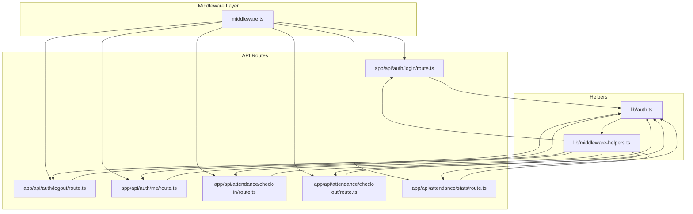

**Diagram sources**
- [middleware.ts:1-35](file://middleware.ts#L1-L35)
- [middleware-helpers.ts:1-81](file://lib/middleware-helpers.ts#L1-L81)
- [auth.ts:1-50](file://lib/auth.ts#L1-L50)
- [login.route.ts:1-101](file://app/api/auth/login/route.ts#L1-L101)
- [logout.route.ts:1-31](file://app/api/auth/logout/route.ts#L1-L31)
- [me.route.ts:1-66](file://app/api/auth/me/route.ts#L1-L66)
- [check-in.route.ts:1-79](file://app/api/attendance/check-in/route.ts#L1-L79)
- [check-out.route.ts:1-90](file://app/api/attendance/check-out/route.ts#L1-L90)
- [stats.route.ts:1-131](file://app/api/attendance/stats/route.ts#L1-L131)

**Section sources**
- [middleware.ts:1-35](file://middleware.ts#L1-L35)
- [middleware-helpers.ts:1-81](file://lib/middleware-helpers.ts#L1-L81)
- [auth.ts:1-50](file://lib/auth.ts#L1-L50)

## Core Components
- Route Protection Middleware: Redirects requests to the login page if the token cookie is missing. It runs only on protected paths.
- Authentication Helpers: Extract and verify tokens, enforce authentication, and enforce admin-only access.
- Authentication Utilities: Sign and verify JWT tokens using a secret configured via environment variables.
- API Routes: Apply granular access controls and enforce roles for specific endpoints.

Key responsibilities:
- Token extraction from cookies.
- Basic presence check in middleware and full verification in helpers.
- Role-based enforcement (admin vs employee).
- Consistent error responses for unauthorized and forbidden access.

**Section sources**
- [middleware.ts:13-29](file://middleware.ts#L13-L29)
- [middleware.ts:31-34](file://middleware.ts#L31-L34)
- [middleware-helpers.ts:10-26](file://lib/middleware-helpers.ts#L10-L26)
- [middleware-helpers.ts:32-48](file://lib/middleware-helpers.ts#L32-L48)
- [middleware-helpers.ts:54-80](file://lib/middleware-helpers.ts#L54-L80)
- [auth.ts:33-49](file://lib/auth.ts#L33-L49)

## Architecture Overview
The system separates concerns across layers:
- Middleware handles global route protection and basic token presence checks.
- Helper functions encapsulate authentication and authorization logic used by API routes.
- Authentication utilities centralize token signing and verification.
- API routes apply role-specific permissions and business logic.

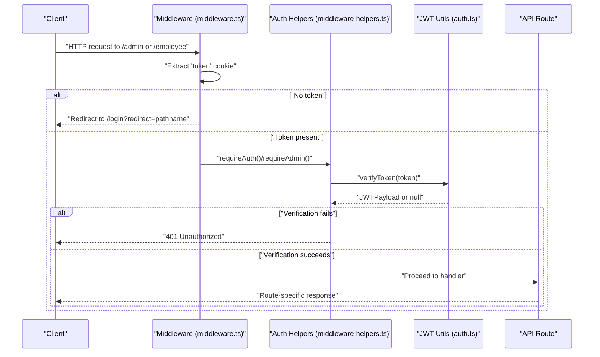

**Diagram sources**
- [middleware.ts:13-29](file://middleware.ts#L13-L29)
- [middleware-helpers.ts:10-26](file://lib/middleware-helpers.ts#L10-L26)
- [middleware-helpers.ts:32-48](file://lib/middleware-helpers.ts#L32-L48)
- [middleware-helpers.ts:54-80](file://lib/middleware-helpers.ts#L54-L80)
- [auth.ts:42-49](file://lib/auth.ts#L42-L49)

## Detailed Component Analysis

### Middleware: Route Protection
- Purpose: Enforce route-level protection for admin and employee dashboards.
- Behavior:
  - Extracts the token from the cookie jar.
  - Redirects to the login page with a redirect query parameter if the token is missing.
  - Allows requests to proceed if a token is present.
- Matcher: Runs only on paths matching /admin/:path* and /employee/:path*.

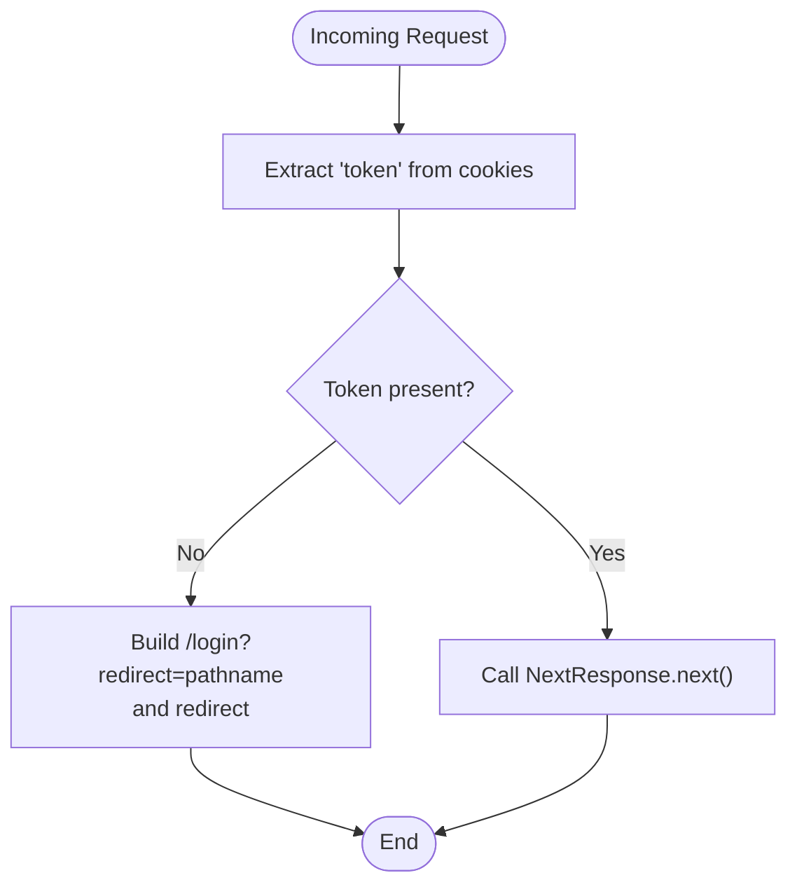

**Diagram sources**
- [middleware.ts:13-29](file://middleware.ts#L13-L29)

**Section sources**
- [middleware.ts:4-12](file://middleware.ts#L4-L12)
- [middleware.ts:13-29](file://middleware.ts#L13-L29)
- [middleware.ts:31-34](file://middleware.ts#L31-L34)

### Authentication Helpers: Token Extraction and Verification
- Purpose: Provide reusable functions for authentication and authorization checks.
- Functions:
  - getAuthUser(request): Extracts token from cookies and verifies it; returns payload or null.
  - requireAuth(request): Enforces authentication; returns user payload or a 401 response.
  - requireAdmin(request): Enforces admin-only access; returns user payload or a 401/403 response.

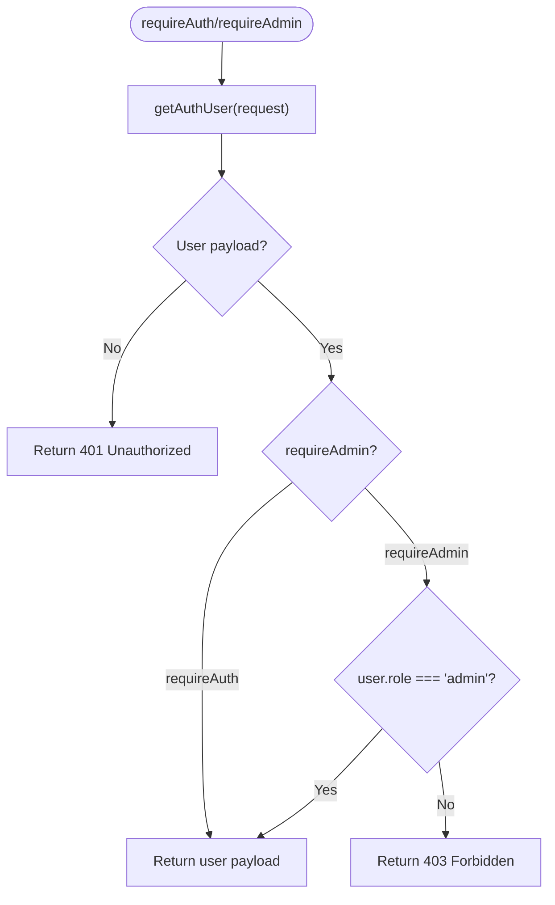

**Diagram sources**
- [middleware-helpers.ts:10-26](file://lib/middleware-helpers.ts#L10-L26)
- [middleware-helpers.ts:32-48](file://lib/middleware-helpers.ts#L32-L48)
- [middleware-helpers.ts:54-80](file://lib/middleware-helpers.ts#L54-L80)

**Section sources**
- [middleware-helpers.ts:10-26](file://lib/middleware-helpers.ts#L10-L26)
- [middleware-helpers.ts:32-48](file://lib/middleware-helpers.ts#L32-L48)
- [middleware-helpers.ts:54-80](file://lib/middleware-helpers.ts#L54-L80)

### Authentication Utilities: JWT Signing and Verification
- Purpose: Centralize token signing and verification.
- Functions:
  - signToken(payload): Creates a signed JWT with a defined expiration.
  - verifyToken(token): Verifies a token and returns the decoded payload or null.
- Security: Uses a secret from environment variables; throws if the secret is missing during module initialization.

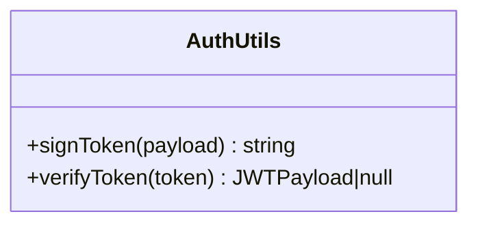

**Diagram sources**
- [auth.ts:33-49](file://lib/auth.ts#L33-L49)

**Section sources**
- [auth.ts:5-11](file://lib/auth.ts#L5-L11)
- [auth.ts:33-49](file://lib/auth.ts#L33-L49)

### Protected Route Examples

#### Example: Check-in Endpoint (Employee Access)
- Applies requireAuth to ensure the requester is authenticated.
- Prevents duplicate check-ins on the same day.
- Calculates lateness based on check-in time.

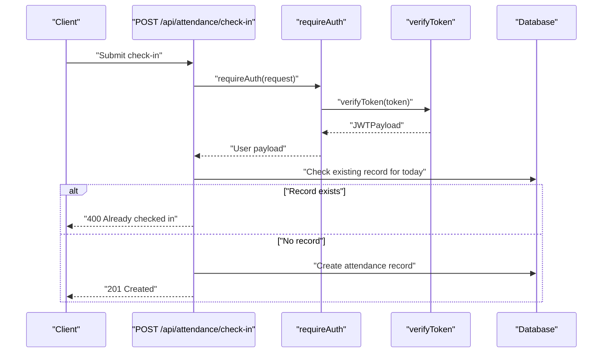

**Diagram sources**
- [check-in.route.ts:10-14](file://app/api/attendance/check-in/route.ts#L10-L14)
- [middleware-helpers.ts:32-48](file://lib/middleware-helpers.ts#L32-L48)
- [auth.ts:42-49](file://lib/auth.ts#L42-L49)

**Section sources**
- [check-in.route.ts:1-79](file://app/api/attendance/check-in/route.ts#L1-L79)

#### Example: Check-out Endpoint (Employee Access)
- Applies requireAuth to ensure the requester is authenticated.
- Requires a prior check-in for the same day.
- Computes hours worked and updates the record.

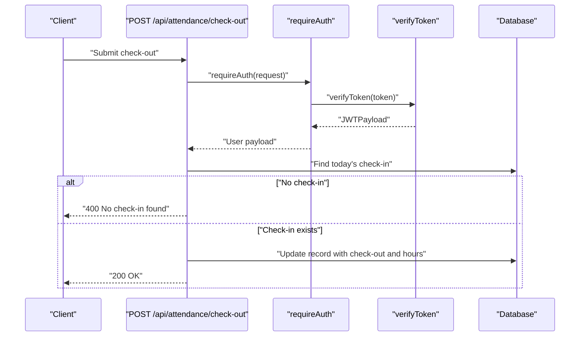

**Diagram sources**
- [check-out.route.ts:11-14](file://app/api/attendance/check-out/route.ts#L11-L14)
- [middleware-helpers.ts:32-48](file://lib/middleware-helpers.ts#L32-L48)
- [auth.ts:42-49](file://lib/auth.ts#L42-L49)

**Section sources**
- [check-out.route.ts:1-90](file://app/api/attendance/check-out/route.ts#L1-L90)

#### Example: Stats Endpoint (Admin Access)
- Applies requireAdmin to ensure the requester is authenticated and has admin role.
- Aggregates attendance statistics for reporting.

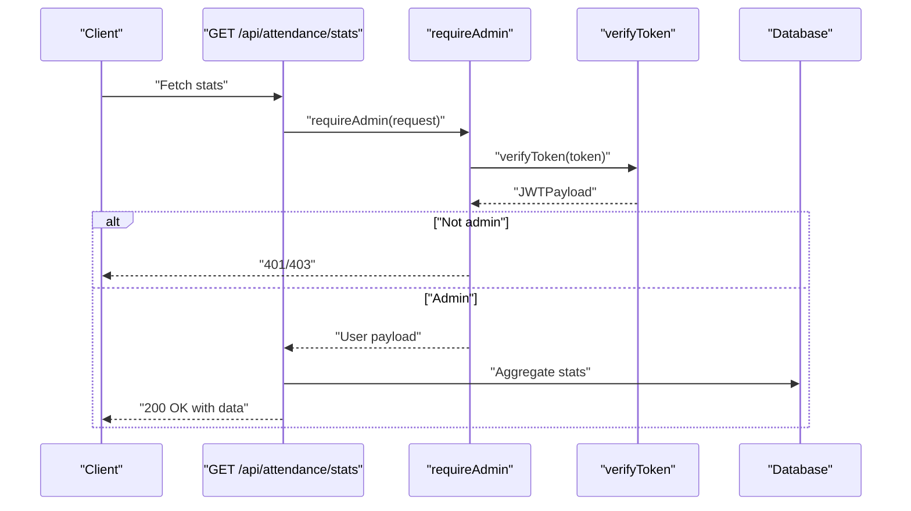

**Diagram sources**
- [stats.route.ts:12-16](file://app/api/attendance/stats/route.ts#L12-L16)
- [middleware-helpers.ts:54-80](file://lib/middleware-helpers.ts#L54-L80)
- [auth.ts:42-49](file://lib/auth.ts#L42-L49)

**Section sources**
- [stats.route.ts:1-131](file://app/api/attendance/stats/route.ts#L1-L131)

### Token Extraction, Cookie Parsing, and Fallback Mechanisms
- Token extraction: The helpers read the token from the cookie store and pass it to the verification function.
- Cookie attributes: Tokens are stored as HTTP-only cookies with secure flags and appropriate SameSite policy.
- Fallback mechanisms:
  - Middleware redirects to login when the token is missing.
  - Helper functions return null or error responses when verification fails.
  - API routes handle error responses consistently (401, 403, 400, 500).

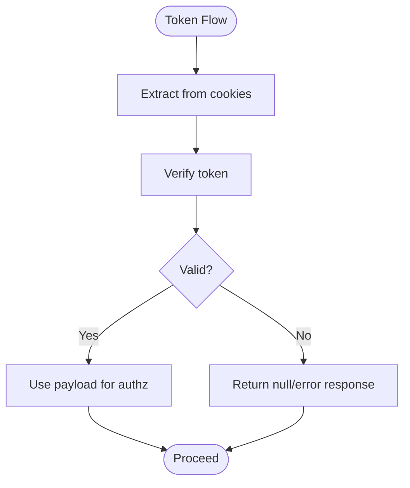

**Diagram sources**
- [middleware-helpers.ts:10-26](file://lib/middleware-helpers.ts#L10-L26)
- [auth.ts:42-49](file://lib/auth.ts#L42-L49)
- [login.route.ts:64-72](file://app/api/auth/login/route.ts#L64-L72)

**Section sources**
- [middleware-helpers.ts:10-26](file://lib/middleware-helpers.ts#L10-L26)
- [login.route.ts:57-72](file://app/api/auth/login/route.ts#L57-L72)
- [logout.route.ts:9-11](file://app/api/auth/logout/route.ts#L9-L11)

### Role-Based Access Control (RBAC)
- Admin-only endpoints: requireAdmin ensures only users with role "admin" can access.
- Employee-only endpoints: requireAuth ensures only authenticated users can access.
- Mixed access: Some endpoints differentiate behavior based on user role after authentication.

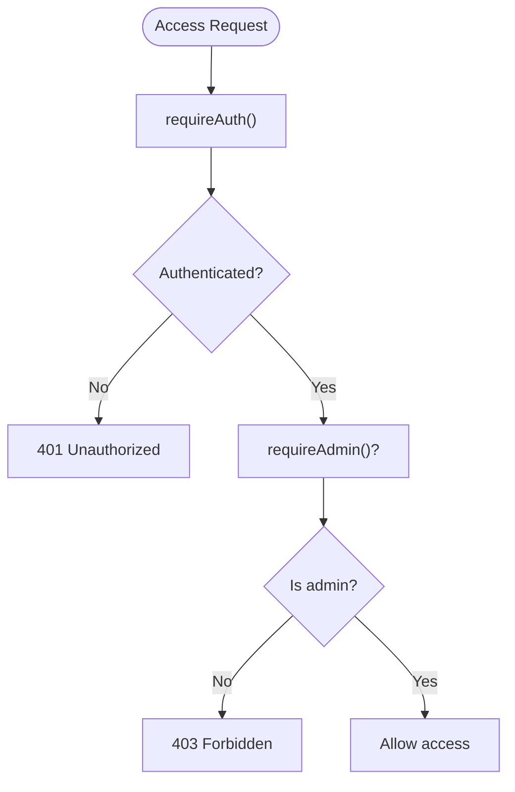

**Diagram sources**
- [middleware-helpers.ts:32-48](file://lib/middleware-helpers.ts#L32-L48)
- [middleware-helpers.ts:54-80](file://lib/middleware-helpers.ts#L54-L80)

**Section sources**
- [middleware-helpers.ts:54-80](file://lib/middleware-helpers.ts#L54-L80)
- [stats.route.ts:12-16](file://app/api/attendance/stats/route.ts#L12-L16)

### Protected Route Configuration Examples
- Middleware matcher: Restricts middleware execution to admin and employee paths.
- Public routes: Explicitly excluded from middleware protection (e.g., login, register, auth APIs, home).
- API routes: Apply requireAuth or requireAdmin depending on endpoint requirements.

**Section sources**
- [middleware.ts:31-34](file://middleware.ts#L31-L34)
- [middleware.ts:4-12](file://middleware.ts#L4-L12)

### Custom Middleware Functions
- requireAuth: Enforces authentication and returns either the user payload or a 401 response.
- requireAdmin: Enforces admin-only access and returns either the user payload or a 401/403 response.
- getAuthUser: Extracts and verifies the token, returning the payload or null.

**Section sources**
- [middleware-helpers.ts:32-48](file://lib/middleware-helpers.ts#L32-L48)
- [middleware-helpers.ts:54-80](file://lib/middleware-helpers.ts#L54-L80)
- [middleware-helpers.ts:10-26](file://lib/middleware-helpers.ts#L10-L26)

### Error Handling for Unauthorized Access
- Missing token: Middleware redirects to login with a redirect parameter.
- Invalid token: Helper functions return null; API routes return 401 Unauthorized.
- Insufficient privileges: requireAdmin returns 403 Forbidden.
- Consistent error shape: All API routes return a standardized response envelope with a success flag and error message.

**Section sources**
- [middleware.ts:20-24](file://middleware.ts#L20-L24)
- [middleware-helpers.ts:37-47](file://lib/middleware-helpers.ts#L37-L47)
- [middleware-helpers.ts:59-77](file://lib/middleware-helpers.ts#L59-L77)

## Dependency Analysis
The following diagram shows the primary dependencies among components involved in authentication and route protection:

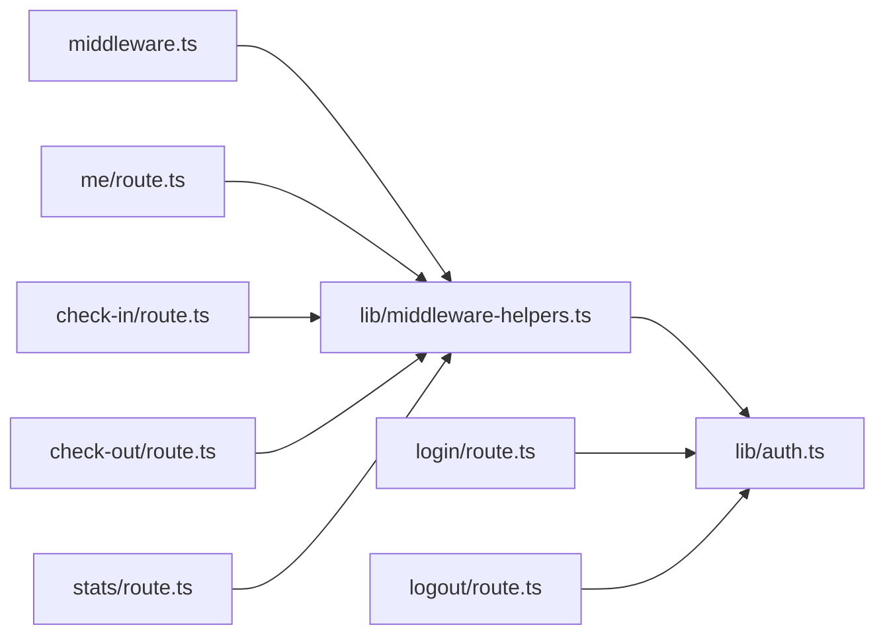

**Diagram sources**
- [middleware.ts:1-35](file://middleware.ts#L1-L35)
- [middleware-helpers.ts:1-81](file://lib/middleware-helpers.ts#L1-L81)
- [auth.ts:1-50](file://lib/auth.ts#L1-L50)
- [login.route.ts:1-101](file://app/api/auth/login/route.ts#L1-L101)
- [logout.route.ts:1-31](file://app/api/auth/logout/route.ts#L1-L31)
- [me.route.ts:1-66](file://app/api/auth/me/route.ts#L1-L66)
- [check-in.route.ts:1-79](file://app/api/attendance/check-in/route.ts#L1-L79)
- [check-out.route.ts:1-90](file://app/api/attendance/check-out/route.ts#L1-L90)
- [stats.route.ts:1-131](file://app/api/attendance/stats/route.ts#L1-L131)

**Section sources**
- [middleware.ts:1-35](file://middleware.ts#L1-L35)
- [middleware-helpers.ts:1-81](file://lib/middleware-helpers.ts#L1-L81)
- [auth.ts:1-50](file://lib/auth.ts#L1-L50)

## Performance Considerations
- Token verification cost: Each API request triggers a synchronous JWT verification. To reduce overhead:
  - Cache verified payloads per request lifecycle where feasible.
  - Consider short-lived tokens with refresh mechanisms to minimize repeated verification costs.
- Database queries: Many API routes perform database lookups. Optimize with:
  - Proper indexing on user IDs and dates.
  - Selective field retrieval to avoid unnecessary data transfer.
- Middleware efficiency: The middleware performs only cookie extraction and a redirect decision, minimizing overhead.

[No sources needed since this section provides general guidance]

## Troubleshooting Guide
Common issues and resolutions:
- Missing JWT_SECRET: The authentication module throws an error during initialization if the secret is not defined. Ensure the environment variable is set.
- Redirect loops: If middleware keeps redirecting to login, verify the cookie is being set correctly and is accessible to the client.
- 401 Unauthorized responses: Confirm the token is present in cookies and valid. Check that the token payload contains required fields.
- 403 Forbidden responses: Ensure the user has the correct role ("admin") for admin-only endpoints.
- Logout not working: Verify the cookie deletion logic removes the token cookie from the cookie store.

**Section sources**
- [auth.ts:7-11](file://lib/auth.ts#L7-L11)
- [login.route.ts:64-72](file://app/api/auth/login/route.ts#L64-L72)
- [logout.route.ts:9-11](file://app/api/auth/logout/route.ts#L9-L11)
- [middleware-helpers.ts:37-47](file://lib/middleware-helpers.ts#L37-L47)
- [middleware-helpers.ts:59-77](file://lib/middleware-helpers.ts#L59-L77)

## Conclusion
The application implements a layered authentication and authorization system:
- Middleware enforces route-level protection and redirects unauthenticated users.
- Helper functions encapsulate token verification and RBAC checks.
- Authentication utilities centralize JWT signing and verification.
- API routes apply granular access controls and consistent error handling.

This design provides clear separation of concerns, predictable error responses, and extensible mechanisms for enforcing access controls across admin and employee endpoints.