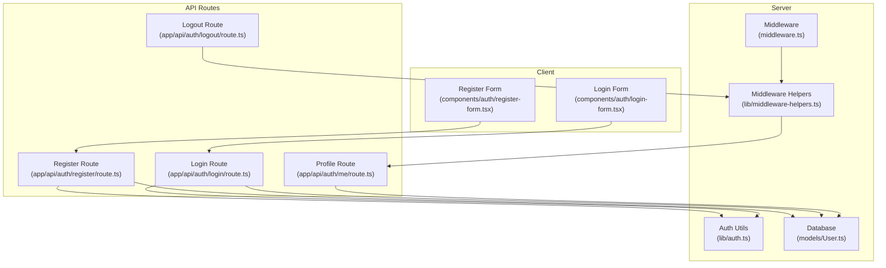
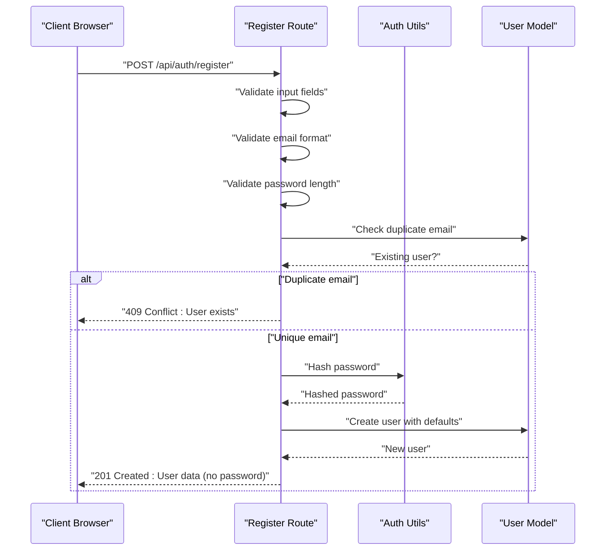
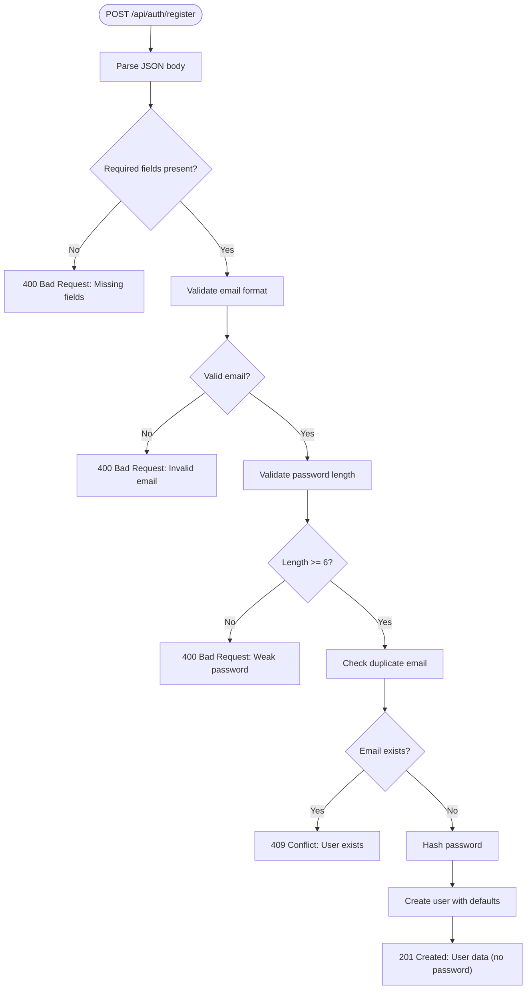
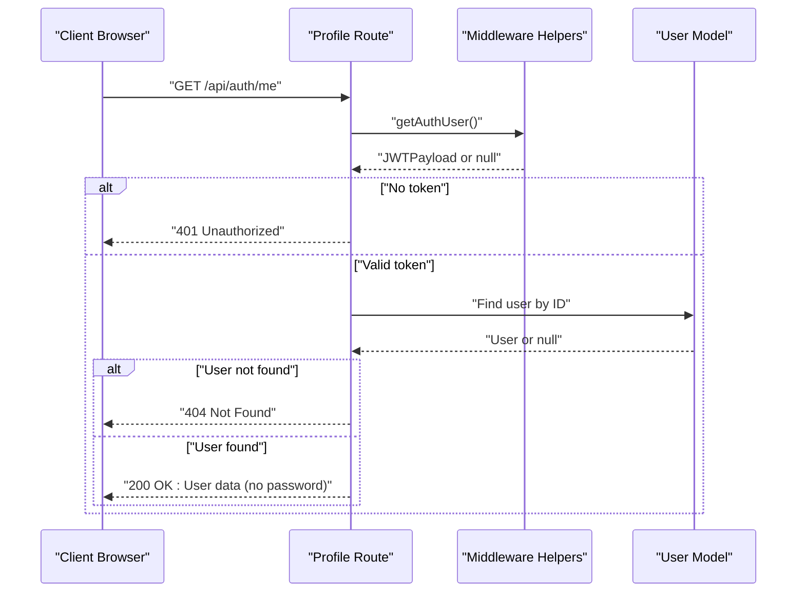
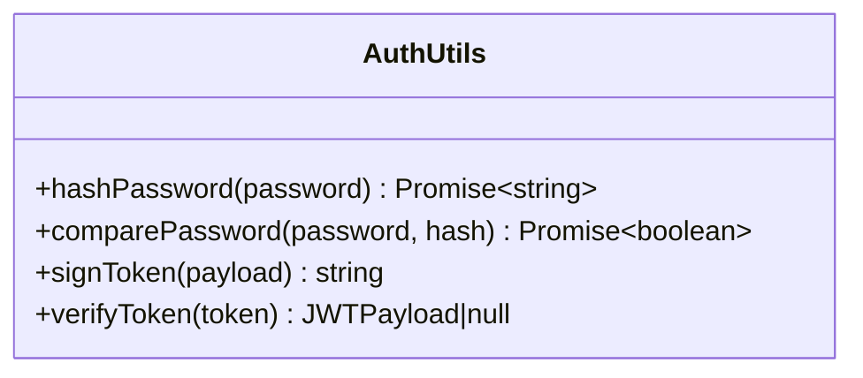
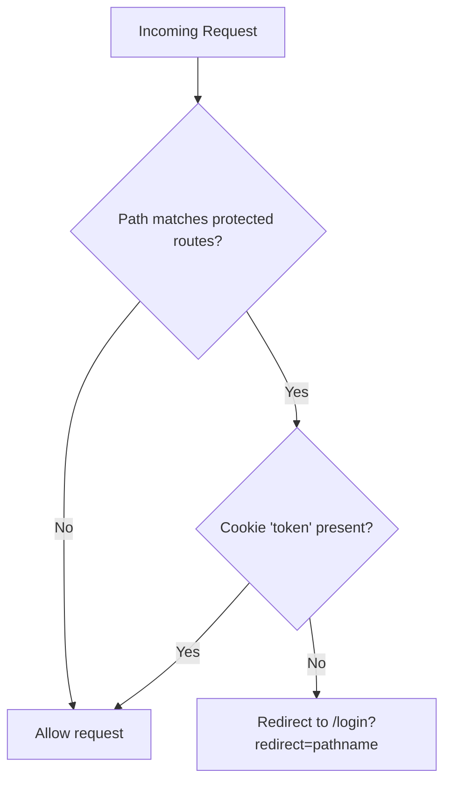
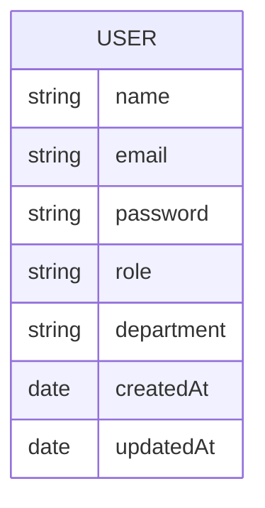
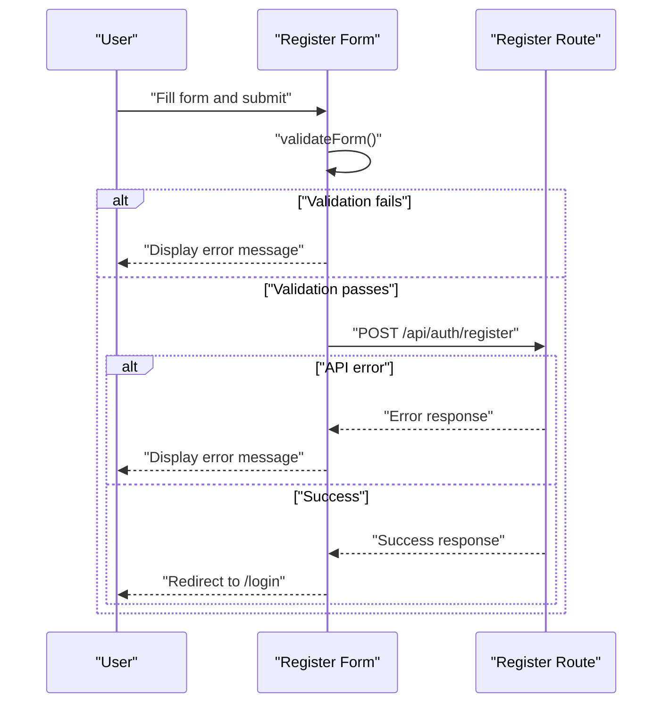
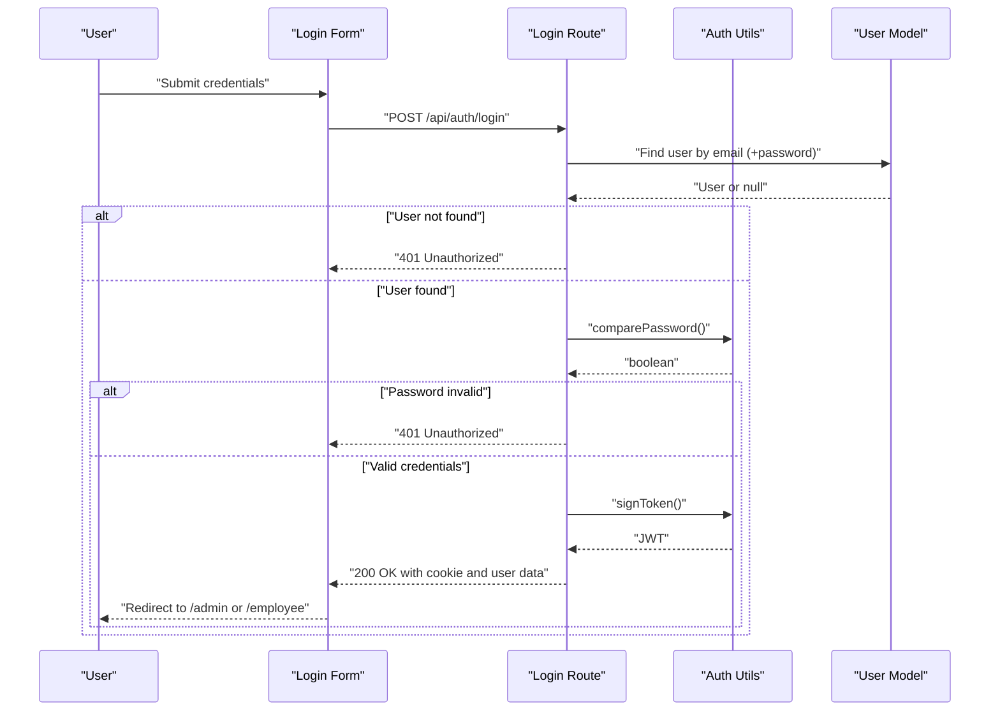
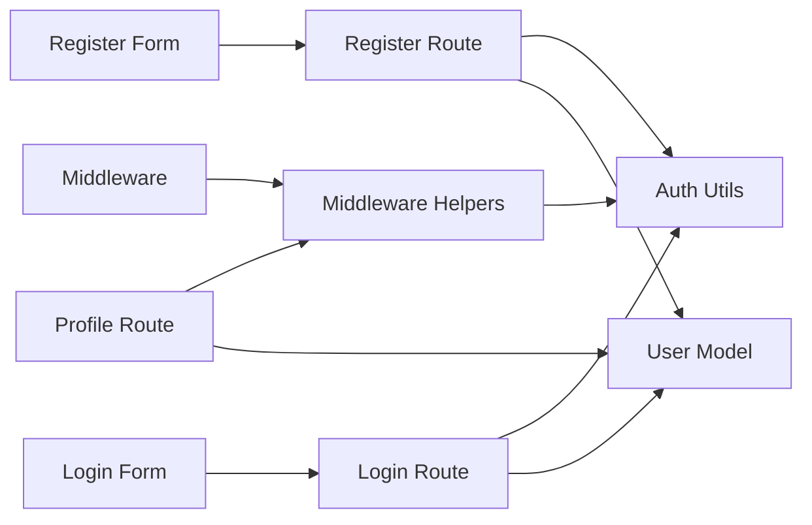

# Registration and Profile Management

<cite>
**Referenced Files in This Document**
- [app/api/auth/register/route.ts](file://app/api/auth/register/route.ts)
- [app/api/auth/me/route.ts](file://app/api/auth/me/route.ts)
- [models/User.ts](file://models/User.ts)
- [lib/auth.ts](file://lib/auth.ts)
- [lib/middleware-helpers.ts](file://lib/middleware-helpers.ts)
- [middleware.ts](file://middleware.ts)
- [components/auth/register-form.tsx](file://components/auth/register-form.tsx)
- [components/auth/login-form.tsx](file://components/auth/login-form.tsx)
- [app/api/auth/login/route.ts](file://app/api/auth/login/route.ts)
- [app/api/auth/logout/route.ts](file://app/api/auth/logout/route.ts)
</cite>

## Table of Contents
1. [Introduction](#introduction)
2. [Project Structure](#project-structure)
3. [Core Components](#core-components)
4. [Architecture Overview](#architecture-overview)
5. [Detailed Component Analysis](#detailed-component-analysis)
6. [Dependency Analysis](#dependency-analysis)
7. [Performance Considerations](#performance-considerations)
8. [Troubleshooting Guide](#troubleshooting-guide)
9. [Conclusion](#conclusion)

## Introduction
This document provides comprehensive documentation for user registration and profile management functionality. It covers the registration API endpoint, including user validation, duplicate email checking, and secure password hashing. It also explains the profile retrieval endpoint for authenticated users and data protection measures. The registration form implementation, input validation, and error handling are detailed, along with user role assignment, default permissions, and profile update capabilities. Examples of registration workflows, validation errors, and profile data structures are included to aid understanding and implementation.

## Project Structure
The registration and profile management system spans several layers:
- API routes handle HTTP requests for registration, login, logout, and profile retrieval.
- Authentication utilities manage password hashing, token signing, and verification.
- Middleware enforces session-based access control.
- Mongoose models define user data structures and constraints.
- Client-side components provide the registration and login forms.

**Diagram sources**
- [components/auth/register-form.tsx](file://components/auth/register-form.tsx)
- [components/auth/login-form.tsx](file://components/auth/login-form.tsx)
- [middleware.ts](file://middleware.ts)
- [lib/middleware-helpers.ts](file://lib/middleware-helpers.ts)
- [lib/auth.ts](file://lib/auth.ts)
- [models/User.ts](file://models/User.ts)
- [app/api/auth/register/route.ts](file://app/api/auth/register/route.ts)
- [app/api/auth/me/route.ts](file://app/api/auth/me/route.ts)
- [app/api/auth/login/route.ts](file://app/api/auth/login/route.ts)
- [app/api/auth/logout/route.ts](file://app/api/auth/logout/route.ts)

**Section sources**
- [components/auth/register-form.tsx](file://components/auth/register-form.tsx)
- [components/auth/login-form.tsx](file://components/auth/login-form.tsx)
- [middleware.ts](file://middleware.ts)
- [lib/middleware-helpers.ts](file://lib/middleware-helpers.ts)
- [lib/auth.ts](file://lib/auth.ts)
- [models/User.ts](file://models/User.ts)
- [app/api/auth/register/route.ts](file://app/api/auth/register/route.ts)
- [app/api/auth/me/route.ts](file://app/api/auth/me/route.ts)
- [app/api/auth/login/route.ts](file://app/api/auth/login/route.ts)
- [app/api/auth/logout/route.ts](file://app/api/auth/logout/route.ts)

## Core Components
- Registration API: Validates input, checks for duplicate emails, hashes passwords, creates users, and returns sanitized data.
- Profile Retrieval API: Authenticates requests via cookies, verifies tokens, and returns user data excluding sensitive fields.
- Authentication Utilities: Provides password hashing, password comparison, JWT signing, and token verification.
- Middleware: Enforces token presence for protected routes and redirects unauthenticated users.
- User Model: Defines schema, constraints, default roles, and indexes for efficient lookups.
- Registration Form: Client-side form with real-time validation and submission handling.
- Login Form: Client-side form for authentication and role-based redirection.

**Section sources**
- [app/api/auth/register/route.ts](file://app/api/auth/register/route.ts)
- [app/api/auth/me/route.ts](file://app/api/auth/me/route.ts)
- [lib/auth.ts](file://lib/auth.ts)
- [lib/middleware-helpers.ts](file://lib/middleware-helpers.ts)
- [middleware.ts](file://middleware.ts)
- [models/User.ts](file://models/User.ts)
- [components/auth/register-form.tsx](file://components/auth/register-form.tsx)
- [components/auth/login-form.tsx](file://components/auth/login-form.tsx)

## Architecture Overview
The system follows a layered architecture:
- Presentation Layer: Client-side forms submit requests to API routes.
- Application Layer: API routes orchestrate validation, persistence, and response generation.
- Domain Layer: Authentication utilities encapsulate security logic.
- Infrastructure Layer: Middleware enforces access control; Mongoose models define persistence.

**Diagram sources**
- [app/api/auth/register/route.ts](file://app/api/auth/register/route.ts)
- [lib/auth.ts](file://lib/auth.ts)
- [models/User.ts](file://models/User.ts)

**Section sources**
- [app/api/auth/register/route.ts](file://app/api/auth/register/route.ts)
- [lib/auth.ts](file://lib/auth.ts)
- [models/User.ts](file://models/User.ts)

## Detailed Component Analysis

### Registration API Endpoint
The registration endpoint performs:
- Input validation for required fields, email format, and password length.
- Duplicate email detection using database query.
- Secure password hashing using bcrypt.
- User creation with default role assignment and optional department.
- Response sanitization to exclude sensitive fields.

**Diagram sources**
- [app/api/auth/register/route.ts](file://app/api/auth/register/route.ts)

**Section sources**
- [app/api/auth/register/route.ts](file://app/api/auth/register/route.ts)

### Profile Retrieval Endpoint
The profile retrieval endpoint authenticates requests by:
- Extracting and verifying the JWT token from cookies.
- Returning user data excluding sensitive fields.
- Handling missing authentication and user-not-found scenarios.

**Diagram sources**
- [app/api/auth/me/route.ts](file://app/api/auth/me/route.ts)
- [lib/middleware-helpers.ts](file://lib/middleware-helpers.ts)
- [models/User.ts](file://models/User.ts)

**Section sources**
- [app/api/auth/me/route.ts](file://app/api/auth/me/route.ts)
- [lib/middleware-helpers.ts](file://lib/middleware-helpers.ts)
- [models/User.ts](file://models/User.ts)

### Authentication Utilities
Key responsibilities:
- Password hashing with bcrypt at 12 rounds.
- Password comparison for login verification.
- JWT signing with 7-day expiry and secure cookie attributes.
- JWT verification returning typed payload or null.

**Diagram sources**
- [lib/auth.ts](file://lib/auth.ts)

**Section sources**
- [lib/auth.ts](file://lib/auth.ts)

### Middleware and Access Control
- Middleware enforces token presence for protected routes and redirects unauthenticated users to login with a redirect parameter.
- Middleware Helpers extract and verify tokens, returning typed payloads or null.
- API routes perform role-based verification when needed.

**Diagram sources**
- [middleware.ts](file://middleware.ts)
- [lib/middleware-helpers.ts](file://lib/middleware-helpers.ts)

**Section sources**
- [middleware.ts](file://middleware.ts)
- [lib/middleware-helpers.ts](file://lib/middleware-helpers.ts)

### User Model and Schema
The User model defines:
- Required fields: name, email, password.
- Unique and indexed email field.
- Role enumeration with default "employee".
- Optional department field with trimming.
- Timestamps and hidden password selection by default.

**Diagram sources**
- [models/User.ts](file://models/User.ts)

**Section sources**
- [models/User.ts](file://models/User.ts)

### Registration Form Implementation
Client-side validation and submission:
- Real-time validation for name, email, password length, and password confirmation.
- Submission handling with error display and success redirection.
- Department selection via dropdown with optional values.

**Diagram sources**
- [components/auth/register-form.tsx](file://components/auth/register-form.tsx)
- [app/api/auth/register/route.ts](file://app/api/auth/register/route.ts)

**Section sources**
- [components/auth/register-form.tsx](file://components/auth/register-form.tsx)
- [app/api/auth/register/route.ts](file://app/api/auth/register/route.ts)

### Login Workflow and Role-Based Redirection
- Client-side form validates inputs and submits credentials.
- Server compares password with stored hash and signs a JWT.
- Cookie is set with secure attributes; response excludes sensitive data.
- Client redirects based on user role.

**Diagram sources**
- [components/auth/login-form.tsx](file://components/auth/login-form.tsx)
- [app/api/auth/login/route.ts](file://app/api/auth/login/route.ts)
- [lib/auth.ts](file://lib/auth.ts)
- [models/User.ts](file://models/User.ts)

**Section sources**
- [components/auth/login-form.tsx](file://components/auth/login-form.tsx)
- [app/api/auth/login/route.ts](file://app/api/auth/login/route.ts)
- [lib/auth.ts](file://lib/auth.ts)
- [models/User.ts](file://models/User.ts)

## Dependency Analysis
The system exhibits clear separation of concerns:
- API routes depend on authentication utilities and the User model.
- Middleware relies on cookie extraction and token verification.
- Client forms depend on API routes for submission and redirection logic.

**Diagram sources**
- [app/api/auth/register/route.ts](file://app/api/auth/register/route.ts)
- [app/api/auth/login/route.ts](file://app/api/auth/login/route.ts)
- [app/api/auth/me/route.ts](file://app/api/auth/me/route.ts)
- [lib/auth.ts](file://lib/auth.ts)
- [lib/middleware-helpers.ts](file://lib/middleware-helpers.ts)
- [middleware.ts](file://middleware.ts)
- [models/User.ts](file://models/User.ts)
- [components/auth/register-form.tsx](file://components/auth/register-form.tsx)
- [components/auth/login-form.tsx](file://components/auth/login-form.tsx)

**Section sources**
- [app/api/auth/register/route.ts](file://app/api/auth/register/route.ts)
- [app/api/auth/login/route.ts](file://app/api/auth/login/route.ts)
- [app/api/auth/me/route.ts](file://app/api/auth/me/route.ts)
- [lib/auth.ts](file://lib/auth.ts)
- [lib/middleware-helpers.ts](file://lib/middleware-helpers.ts)
- [middleware.ts](file://middleware.ts)
- [models/User.ts](file://models/User.ts)
- [components/auth/register-form.tsx](file://components/auth/register-form.tsx)
- [components/auth/login-form.tsx](file://components/auth/login-form.tsx)

## Performance Considerations
- Password hashing uses bcrypt with 12 rounds, balancing security and performance.
- Email lookups benefit from an index on the email field in the User model.
- Token verification occurs in API routes after middleware ensures token presence.
- Cookies are configured with secure attributes to minimize exposure risks.

[No sources needed since this section provides general guidance]

## Troubleshooting Guide
Common issues and resolutions:
- Authentication required: Occurs when accessing protected endpoints without a valid token cookie. Ensure login succeeds and the cookie is set.
- Admin access required: Occurs when non-admin users attempt admin-only operations. Verify user role assignment.
- Invalid email or password: Occurs on login with incorrect credentials. Confirm email casing normalization and password strength.
- User with this email already exists: Registration fails if email is duplicated. Prompt user to use another email or log in.
- Internal server error: Indicates server-side failures. Check server logs and environment variables, especially JWT secret configuration.

**Section sources**
- [lib/middleware-helpers.ts](file://lib/middleware-helpers.ts)
- [middleware.ts](file://middleware.ts)
- [app/api/auth/register/route.ts](file://app/api/auth/register/route.ts)
- [app/api/auth/login/route.ts](file://app/api/auth/login/route.ts)
- [lib/auth.ts](file://lib/auth.ts)

## Conclusion
The registration and profile management system provides a secure, layered approach to user lifecycle management. It enforces robust validation, protects sensitive data, and offers clear client-server interactions. The modular design facilitates maintainability and extensibility while ensuring consistent behavior across authentication and profile operations.