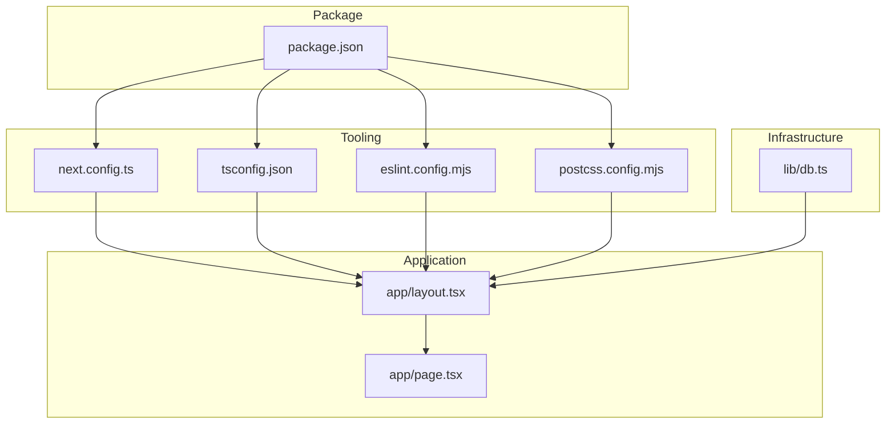
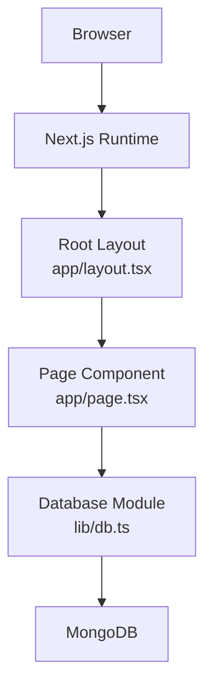
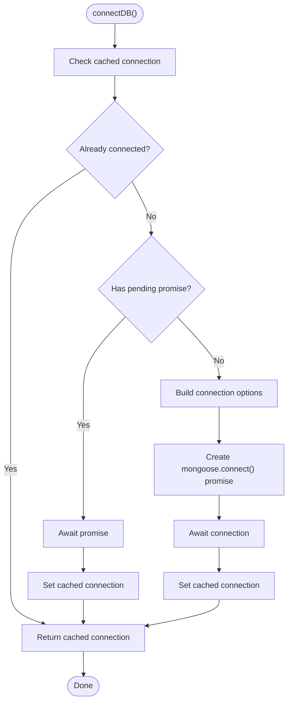
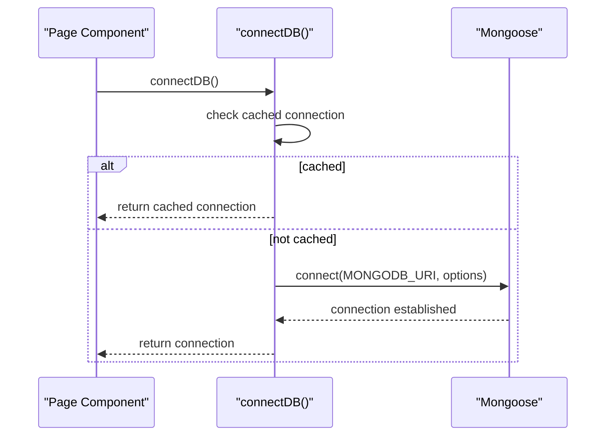
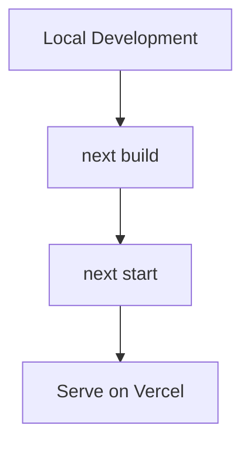
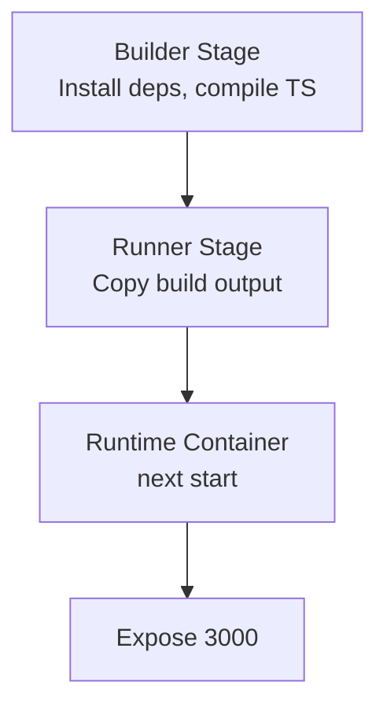

# Configuration & Deployment

<cite>
**Referenced Files in This Document**
- [package.json](file://package.json)
- [next.config.ts](file://next.config.ts)
- [tsconfig.json](file://tsconfig.json)
- [eslint.config.mjs](file://eslint.config.mjs)
- [postcss.config.mjs](file://postcss.config.mjs)
- [lib/db.ts](file://lib/db.ts)
- [app/layout.tsx](file://app/layout.tsx)
- [app/page.tsx](file://app/page.tsx)
- [README.md](file://README.md)
- [CLAUDE.md](file://CLAUDE.md)
</cite>

## Table of Contents
1. [Introduction](#introduction)
2. [Project Structure](#project-structure)
3. [Core Components](#core-components)
4. [Architecture Overview](#architecture-overview)
5. [Detailed Component Analysis](#detailed-component-analysis)
6. [Environment Variables & Security](#environment-variables--security)
7. [Database Configuration](#database-configuration)
8. [Build & Compilation Settings](#build--compilation-settings)
9. [ESLint Configuration](#eslint-configuration)
10. [Deployment Strategies](#deployment-strategies)
11. [Production Deployment Checklist](#production-deployment-checklist)
12. [Monitoring & Maintenance](#monitoring--maintenance)
13. [Scaling & Disaster Recovery](#scaling--disaster-recovery)
14. [Troubleshooting Guide](#troubleshooting-guide)
15. [Conclusion](#conclusion)

## Introduction
This document provides comprehensive configuration and deployment guidance for the Next.js attendance application. It covers environment variables, database connectivity, security configurations, build and linting settings, and deployment strategies for Vercel, Docker, and traditional servers. It also includes production checklists, monitoring setup, maintenance procedures, scaling considerations, backup strategies, and disaster recovery planning.

## Project Structure
The project follows Next.js App Router conventions with a minimal configuration baseline. Key areas:
- Application entry points: app/layout.tsx (root layout), app/page.tsx (home page)
- Build and tooling: next.config.ts, tsconfig.json, eslint.config.mjs, postcss.config.mjs
- Database connectivity: lib/db.ts (MongoDB via Mongoose)
- Scripts and dependencies: package.json

**Diagram sources**
- [app/layout.tsx:1-38](file://app/layout.tsx#L1-L38)
- [app/page.tsx:1-142](file://app/page.tsx#L1-L142)
- [next.config.ts:1-8](file://next.config.ts#L1-L8)
- [tsconfig.json:1-35](file://tsconfig.json#L1-L35)
- [eslint.config.mjs:1-19](file://eslint.config.mjs#L1-L19)
- [postcss.config.mjs:1-8](file://postcss.config.mjs#L1-L8)
- [lib/db.ts:1-54](file://lib/db.ts#L1-L54)
- [package.json:1-35](file://package.json#L1-L35)

**Section sources**
- [README.md:1-37](file://README.md#L1-L37)
- [CLAUDE.md:1-63](file://CLAUDE.md#L1-L63)

## Core Components
- Next.js configuration: Empty baseline configuration file for future extension.
- TypeScript configuration: Strict mode, ES2017 target, bundler module resolution, path aliases.
- ESLint configuration: Flat config extending Next.js core-web-vitals and TypeScript rules.
- PostCSS/Tailwind: Tailwind CSS v4 plugin configuration.
- Database connection: Centralized Mongoose connection with global caching and URI validation.

**Section sources**
- [next.config.ts:1-8](file://next.config.ts#L1-L8)
- [tsconfig.json:1-35](file://tsconfig.json#L1-L35)
- [eslint.config.mjs:1-19](file://eslint.config.mjs#L1-L19)
- [postcss.config.mjs:1-8](file://postcss.config.mjs#L1-L8)
- [lib/db.ts:1-54](file://lib/db.ts#L1-L54)

## Architecture Overview
The runtime architecture centers on Next.js App Router rendering, with database access abstracted through a dedicated connection module.

**Diagram sources**
- [app/layout.tsx:1-38](file://app/layout.tsx#L1-L38)
- [app/page.tsx:1-142](file://app/page.tsx#L1-L142)
- [lib/db.ts:1-54](file://lib/db.ts#L1-L54)

## Detailed Component Analysis

### Database Connection Module
The database module enforces environment-driven configuration and provides connection caching to prevent redundant connections.

**Diagram sources**
- [lib/db.ts:28-51](file://lib/db.ts#L28-L51)

**Section sources**
- [lib/db.ts:1-54](file://lib/db.ts#L1-L54)

### Environment Variables & Security
- Required environment variable: MONGODB_URI must be defined in the environment.
- Recommended security practices:
  - Store secrets in platform-specific secret managers (e.g., Vercel, Docker secrets).
  - Use HTTPS and secure cookies in production.
  - Enforce strong password policies and rate limiting for authentication flows.
  - Restrict network access to the database instance.

**Section sources**
- [lib/db.ts:11-17](file://lib/db.ts#L11-L17)

### Build & Compilation Settings
- TypeScript compiler options emphasize strictness and modern module resolution.
- Path aliases configured for convenient imports.
- Exclude directories for performance and clarity.

**Section sources**
- [tsconfig.json:1-35](file://tsconfig.json#L1-L35)

### ESLint Configuration
- Flat config extends Next.js recommended rules for core-web-vitals and TypeScript.
- Ignores are overridden to exclude default Next.js build artifacts.

**Section sources**
- [eslint.config.mjs:1-19](file://eslint.config.mjs#L1-L19)

## Environment Variables & Security
- Database URI: MONGODB_URI (required)
- Optional: Add JWT secret, session settings, and feature flags as environment variables.
- Security hardening:
  - Validate and sanitize inputs.
  - Use HTTPS-only cookies and CSRF protection.
  - Implement robust authentication and authorization checks.
  - Rotate secrets periodically and audit access logs.

**Section sources**
- [lib/db.ts:11-17](file://lib/db.ts#L11-L17)

## Database Configuration
- Connection method: Mongoose with global caching.
- Options: bufferCommands disabled to reduce buffering overhead.
- Error handling: Exceptions rethrown after clearing the promise cache.

**Diagram sources**
- [lib/db.ts:28-51](file://lib/db.ts#L28-L51)

**Section sources**
- [lib/db.ts:1-54](file://lib/db.ts#L1-L54)

## Build & Compilation Settings
- Target: ES2017
- Strict mode enabled
- Bundler module resolution
- Path alias @/*
- Incremental builds enabled

**Section sources**
- [tsconfig.json:1-35](file://tsconfig.json#L1-L35)

## ESLint Configuration
- Extends Next.js core-web-vitals and TypeScript rules
- Overrides default ignores to include development and build artifacts

**Section sources**
- [eslint.config.mjs:1-19](file://eslint.config.mjs#L1-L19)

## Deployment Strategies

### Vercel Deployment
- Supported by project metadata and Next.js configuration.
- Standard build and start commands apply.
- Configure environment variables in Vercel project settings.

**Section sources**
- [CLAUDE.md:60-63](file://CLAUDE.md#L60-L63)
- [README.md:32-37](file://README.md#L32-L37)

### Docker Deployment
- Use a multi-stage build to minimize image size.
- Set NODE_ENV=production and configure MONGODB_URI.
- Expose port 3000 and health check endpoint if implemented.

[No sources needed since this diagram shows conceptual workflow, not actual code structure]

### Traditional Servers
- Install Node.js LTS.
- Set environment variables and database credentials.
- Run build and start scripts.

**Section sources**
- [package.json:5-9](file://package.json#L5-L9)

## Production Deployment Checklist
- [ ] Confirm MONGODB_URI is set in production environment
- [ ] Verify build completes without errors
- [ ] Test database connectivity locally
- [ ] Configure domain and SSL termination
- [ ] Set up environment-specific secrets management
- [ ] Validate static generation and ISR if used
- [ ] Confirm health checks and readiness probes
- [ ] Back up database and application state

[No sources needed since this section provides general guidance]

## Monitoring & Maintenance
- Logging: Capture structured logs for requests, database operations, and errors.
- Metrics: Track response times, error rates, and resource utilization.
- Health checks: Implement a lightweight endpoint to verify service availability.
- Maintenance windows: Schedule updates during low-traffic periods.
- Dependency updates: Regularly review and update dependencies per security advisories.

[No sources needed since this section provides general guidance]

## Scaling & Disaster Recovery
- Horizontal scaling: Use multiple instances behind a load balancer; ensure stateless sessions if applicable.
- Database scaling: Enable replica sets and read replicas; monitor write amplification.
- Backups: Schedule regular automated backups of MongoDB; test restoration procedures.
- DR Plan: Define RTO/RPO targets; maintain offsite backups; practice failover drills.

[No sources needed since this section provides general guidance]

## Troubleshooting Guide
- Database connection failures:
  - Verify MONGODB_URI correctness and network accessibility
  - Check firewall rules and TLS settings
- Build errors:
  - Run lint checks and resolve all issues
  - Ensure TypeScript compiles without errors
- Runtime errors:
  - Review server logs for stack traces
  - Validate environment variables at startup

**Section sources**
- [lib/db.ts:11-17](file://lib/db.ts#L11-L17)
- [eslint.config.mjs:1-19](file://eslint.config.mjs#L1-L19)
- [tsconfig.json:1-35](file://tsconfig.json#L1-L35)

## Conclusion
This guide consolidates configuration and deployment practices for the Next.js attendance application. By adhering to environment-driven settings, robust database connectivity, strict build and lint configurations, and platform-specific deployment strategies, teams can reliably operate the system in production. Regular monitoring, maintenance, and disaster recovery planning further strengthen operational resilience.