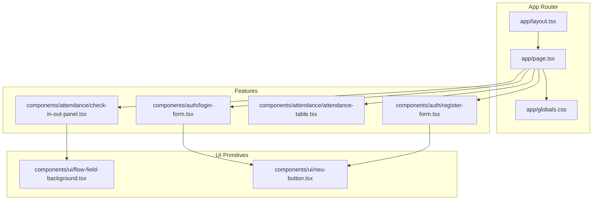
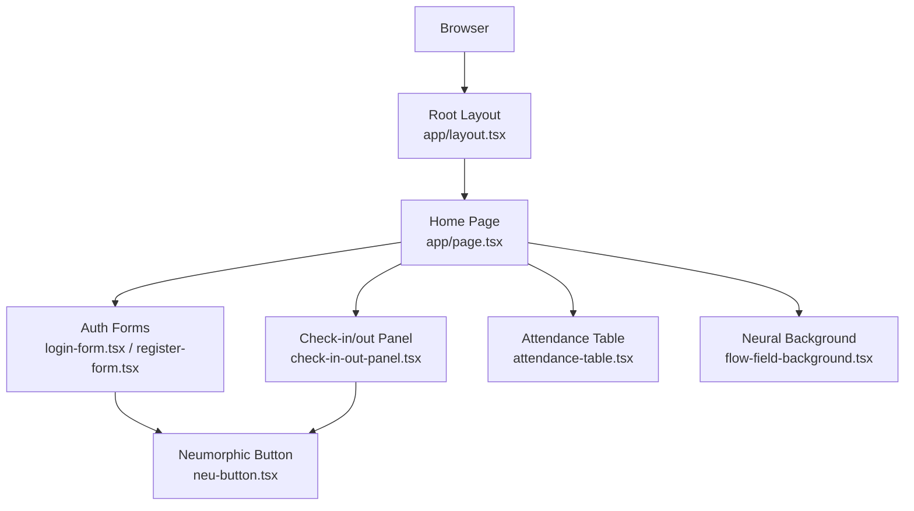
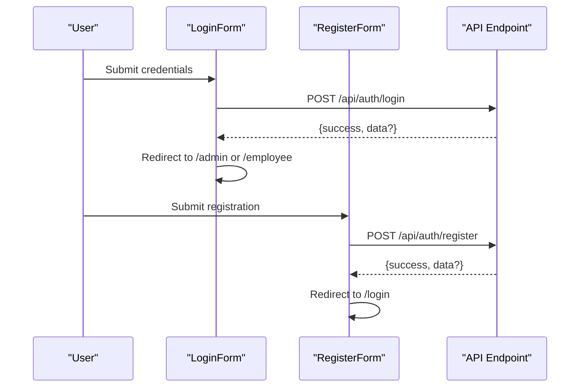
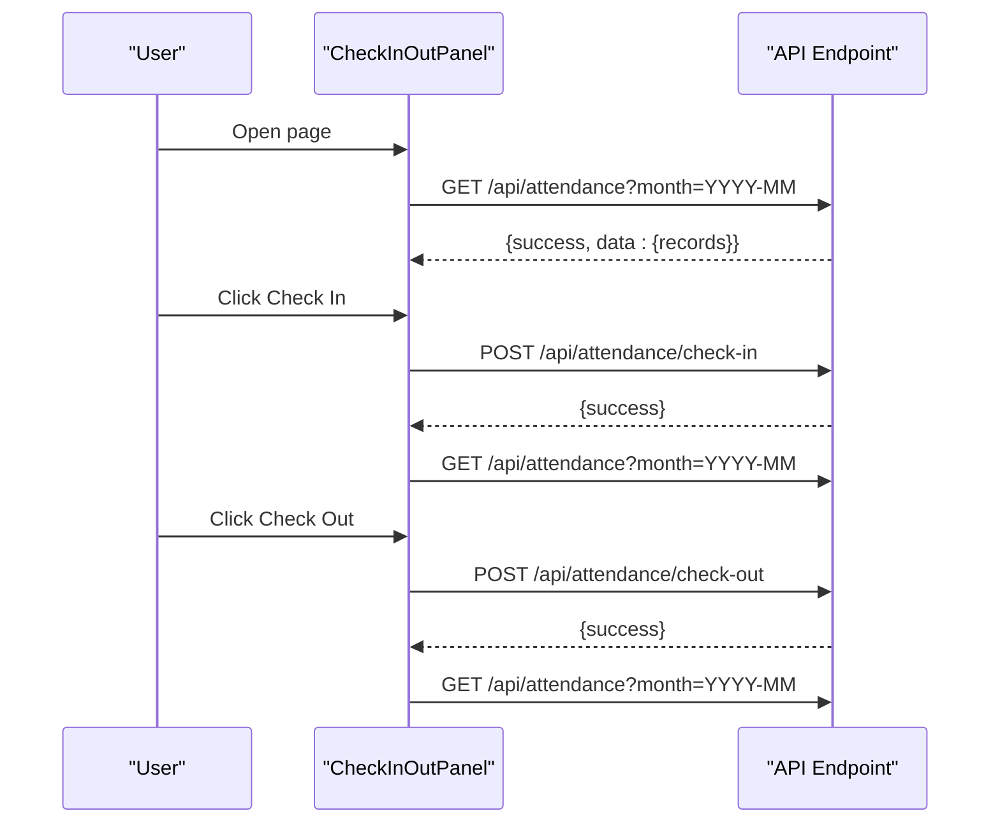
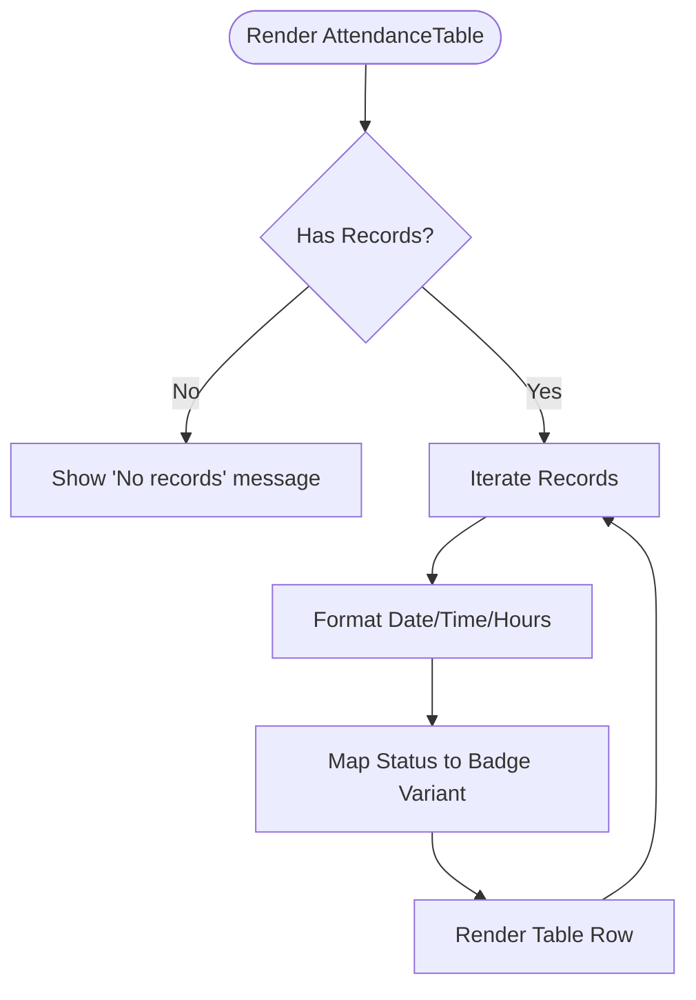
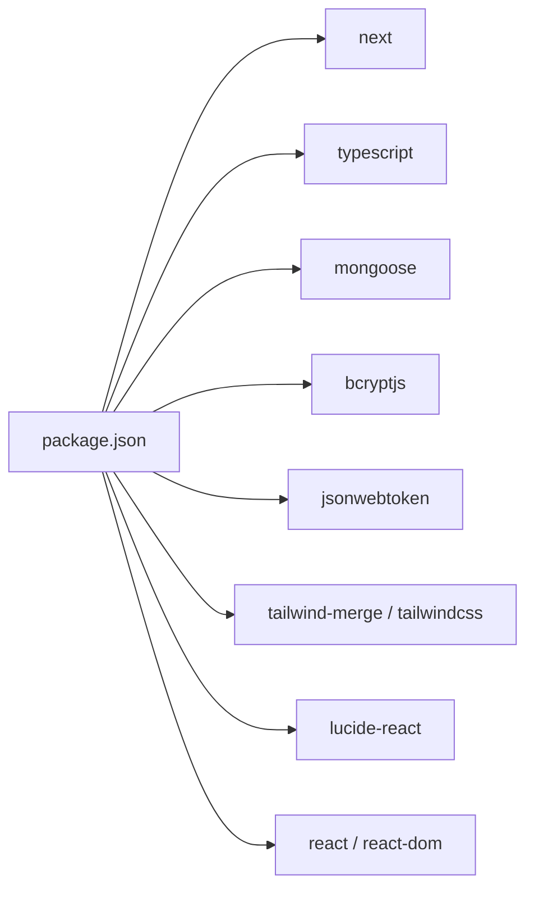

# Getting Started

<cite>
**Referenced Files in This Document**
- [package.json](file://package.json)
- [README.md](file://README.md)
- [next.config.ts](file://next.config.ts)
- [tsconfig.json](file://tsconfig.json)
- [app/layout.tsx](file://app/layout.tsx)
- [app/globals.css](file://app/globals.css)
- [app/page.tsx](file://app/page.tsx)
- [components/auth/login-form.tsx](file://components/auth/login-form.tsx)
- [components/auth/register-form.tsx](file://components/auth/register-form.tsx)
- [components/attendance/check-in-out-panel.tsx](file://components/attendance/check-in-out-panel.tsx)
- [components/attendance/attendance-table.tsx](file://components/attendance/attendance-table.tsx)
- [components/ui/flow-field-background.tsx](file://components/ui/flow-field-background.tsx)
- [components/ui/neu-button.tsx](file://components/ui/neu-button.tsx)
</cite>

## Table of Contents
1. [Introduction](#introduction)
2. [Project Structure](#project-structure)
3. [Core Components](#core-components)
4. [Architecture Overview](#architecture-overview)
5. [Detailed Component Analysis](#detailed-component-analysis)
6. [Dependency Analysis](#dependency-analysis)
7. [Performance Considerations](#performance-considerations)
8. [Troubleshooting Guide](#troubleshooting-guide)
9. [Conclusion](#conclusion)
10. [Appendices](#appendices)

## Introduction
This guide helps you quickly set up and run the Attendance Management System locally. It covers prerequisites, installation, initial configuration, and how to verify your setup. The system is built with Next.js App Router, TypeScript, and uses Mongoose for data modeling. Authentication flows are implemented via client-side forms that call API endpoints, while the UI follows a neumorphic design system.

## Project Structure
The project follows Next.js App Router conventions with a clear separation of pages, components, and styles:
- app/: Application pages and global layout
- components/: Reusable UI and feature components
- app/globals.css and app/layout.tsx: Global styles and root layout
- UI primitives under components/ui/: Neumorphic design components

**Diagram sources**
- [app/layout.tsx:1-34](file://app/layout.tsx#L1-L34)
- [app/page.tsx:1-32](file://app/page.tsx#L1-L32)
- [app/globals.css:1-61](file://app/globals.css#L1-L61)
- [components/auth/login-form.tsx:1-175](file://components/auth/login-form.tsx#L1-L175)
- [components/auth/register-form.tsx:1-257](file://components/auth/register-form.tsx#L1-L257)
- [components/attendance/attendance-table.tsx:1-126](file://components/attendance/attendance-table.tsx#L1-L126)
- [components/attendance/check-in-out-panel.tsx:1-224](file://components/attendance/check-in-out-panel.tsx#L1-L224)
- [components/ui/flow-field-background.tsx:1-211](file://components/ui/flow-field-background.tsx#L1-L211)
- [components/ui/neu-button.tsx:1-112](file://components/ui/neu-button.tsx#L1-L112)

**Section sources**
- [app/layout.tsx:1-34](file://app/layout.tsx#L1-L34)
- [app/page.tsx:1-32](file://app/page.tsx#L1-L32)
- [app/globals.css:1-61](file://app/globals.css#L1-L61)

## Core Components
- Authentication Forms: Login and Registration components submit to API endpoints and redirect based on role.
- Attendance Panel: Real-time clock and check-in/out actions integrate with attendance APIs.
- Attendance Table: Renders attendance records with status badges and formatted timestamps.
- UI Primitives: Neumorphic button and background canvas provide consistent visuals.

Key technologies:
- Next.js App Router for routing and SSR/SSG
- TypeScript for type safety
- Mongoose for data modeling (configured via connection setup)
- bcryptjs and jsonwebtoken for password hashing and JWT-based auth flows
- Tailwind-based design tokens and neumorphic styling

**Section sources**
- [components/auth/login-form.tsx:1-175](file://components/auth/login-form.tsx#L1-L175)
- [components/auth/register-form.tsx:1-257](file://components/auth/register-form.tsx#L1-L257)
- [components/attendance/check-in-out-panel.tsx:1-224](file://components/attendance/check-in-out-panel.tsx#L1-L224)
- [components/attendance/attendance-table.tsx:1-126](file://components/attendance/attendance-table.tsx#L1-L126)
- [components/ui/neu-button.tsx:1-112](file://components/ui/neu-button.tsx#L1-L112)
- [components/ui/flow-field-background.tsx:1-211](file://components/ui/flow-field-background.tsx#L1-L211)
- [package.json:11-21](file://package.json#L11-L21)

## Architecture Overview
The system uses a client-driven architecture:
- Client components call API endpoints for authentication and attendance operations.
- UI components are styled with a custom neumorphic design system.
- Global fonts and theme variables are configured at the root layout.

**Diagram sources**
- [app/layout.tsx:1-34](file://app/layout.tsx#L1-L34)
- [app/page.tsx:1-32](file://app/page.tsx#L1-L32)
- [components/auth/login-form.tsx:1-175](file://components/auth/login-form.tsx#L1-L175)
- [components/auth/register-form.tsx:1-257](file://components/auth/register-form.tsx#L1-L257)
- [components/attendance/check-in-out-panel.tsx:1-224](file://components/attendance/check-in-out-panel.tsx#L1-L224)
- [components/attendance/attendance-table.tsx:1-126](file://components/attendance/attendance-table.tsx#L1-L126)
- [components/ui/flow-field-background.tsx:1-211](file://components/ui/flow-field-background.tsx#L1-L211)
- [components/ui/neu-button.tsx:1-112](file://components/ui/neu-button.tsx#L1-L112)

## Detailed Component Analysis

### Authentication Flow
The authentication flow consists of two client components that call API endpoints and redirect based on role.

**Diagram sources**
- [components/auth/login-form.tsx:59-96](file://components/auth/login-form.tsx#L59-L96)
- [components/auth/register-form.tsx:98-135](file://components/auth/register-form.tsx#L98-L135)

**Section sources**
- [components/auth/login-form.tsx:1-175](file://components/auth/login-form.tsx#L1-L175)
- [components/auth/register-form.tsx:1-257](file://components/auth/register-form.tsx#L1-L257)

### Attendance Check-in/out Flow
The panel fetches today’s record and performs check-in/check-out actions against attendance endpoints.

**Diagram sources**
- [components/attendance/check-in-out-panel.tsx:63-128](file://components/attendance/check-in-out-panel.tsx#L63-L128)

**Section sources**
- [components/attendance/check-in-out-panel.tsx:1-224](file://components/attendance/check-in-out-panel.tsx#L1-L224)

### Attendance Table Rendering
The table component renders records with formatted dates, times, and status badges.

**Diagram sources**
- [components/attendance/attendance-table.tsx:79-125](file://components/attendance/attendance-table.tsx#L79-L125)

**Section sources**
- [components/attendance/attendance-table.tsx:1-126](file://components/attendance/attendance-table.tsx#L1-L126)

## Dependency Analysis
The project relies on Next.js, TypeScript, and UI libraries. Mongoose is declared for data modeling, but the current code does not show explicit database connection or models. Authentication uses bcryptjs and jsonwebtoken.

**Diagram sources**
- [package.json:11-33](file://package.json#L11-L33)

**Section sources**
- [package.json:1-35](file://package.json#L1-L35)

## Performance Considerations
- Client-side rendering: Keep components lightweight; avoid heavy computations in render paths.
- Canvas background: Adjust particle count and trail opacity to balance aesthetics and performance.
- Fetch frequency: Limit API polling; cache responses where appropriate.
- Fonts: Next/font is preloaded; keep the number of font variations minimal.

[No sources needed since this section provides general guidance]

## Troubleshooting Guide
Common setup and runtime issues:

- Port already in use
  - The development server runs on port 3000 by default. If it is busy, change the port in your development script or stop the conflicting process.
  - Verify the development command in your package scripts.

- Missing environment variables for authentication or database
  - Authentication and attendance endpoints expect environment variables. Ensure they are present in your environment before running the app.
  - For database connectivity, ensure the connection string is configured and reachable.

- CORS errors when calling API endpoints
  - If your API endpoints are external or on a different origin, configure CORS appropriately in your API server.

- Canvas rendering issues
  - The neural background uses a canvas. On very low-end devices, reduce particleCount or disable the background.

- TypeScript errors
  - Ensure your editor is using the project’s TypeScript configuration and that all dependencies are installed.

- Styling inconsistencies
  - Confirm Tailwind is initialized and theme tokens are applied via the root layout.

**Section sources**
- [README.md:5-15](file://README.md#L5-L15)
- [app/layout.tsx:1-34](file://app/layout.tsx#L1-L34)
- [components/ui/flow-field-background.tsx:1-211](file://components/ui/flow-field-background.tsx#L1-L211)

## Conclusion
You now have the essentials to install, configure, and run the Attendance Management System locally. Use the provided components to log in, register, check in/out, and review attendance records. Extend the system by adding API endpoints and connecting to a MongoDB instance using Mongoose.

[No sources needed since this section summarizes without analyzing specific files]

## Appendices

### Prerequisites
- Node.js and npm (or yarn/pnpm/bun)
- A terminal/shell
- A modern browser

**Section sources**
- [README.md:1-37](file://README.md#L1-L37)

### Installation Steps
1. Install dependencies
   - Run your package manager’s install command to install all dependencies declared in the project configuration.
2. Start the development server
   - Use the development script to launch the Next.js app on http://localhost:3000.

Verification
- Visit http://localhost:3000 in your browser.
- You should see the home page with the neural background and a centered title.

**Section sources**
- [README.md:5-15](file://README.md#L5-L15)
- [app/page.tsx:1-32](file://app/page.tsx#L1-L32)

### Technology Stack
- Frontend framework: Next.js App Router
- Language: TypeScript
- Styling: Tailwind CSS and custom theme tokens
- Icons: lucide-react
- UI primitives: Neumorphic components
- Authentication: bcryptjs and jsonwebtoken
- Data modeling: mongoose

**Section sources**
- [package.json:11-33](file://package.json#L11-L33)
- [app/globals.css:1-61](file://app/globals.css#L1-L61)
- [app/layout.tsx:1-34](file://app/layout.tsx#L1-L34)

### Local Development Environment Setup
- Install dependencies using your preferred package manager.
- Run the development server with the provided script.
- Open the application in your browser.

Database Configuration
- The project declares Mongoose. To connect to a MongoDB instance, configure the connection string in your environment and initialize the connection in your API route or a shared initialization module.

Authentication Mechanisms
- Client components submit to /api/auth/login and /api/auth/register.
- Use bcryptjs for password hashing and jsonwebtoken for token handling on the server.

Basic Usage Examples
- Navigate to the login page and sign in with valid credentials to be redirected to the appropriate dashboard (/admin or /employee).
- Use the check-in/out panel to record attendance for the current day.
- Review attendance records in the table component.

Verification Steps
- Confirm the home page loads with the neural background.
- Verify that clicking “Check In” updates the panel state and re-fetches records.
- Confirm that clicking “Check Out” completes the daily cycle.

**Section sources**
- [components/auth/login-form.tsx:59-96](file://components/auth/login-form.tsx#L59-L96)
- [components/auth/register-form.tsx:98-135](file://components/auth/register-form.tsx#L98-L135)
- [components/attendance/check-in-out-panel.tsx:63-128](file://components/attendance/check-in-out-panel.tsx#L63-L128)
- [components/attendance/attendance-table.tsx:79-125](file://components/attendance/attendance-table.tsx#L79-L125)