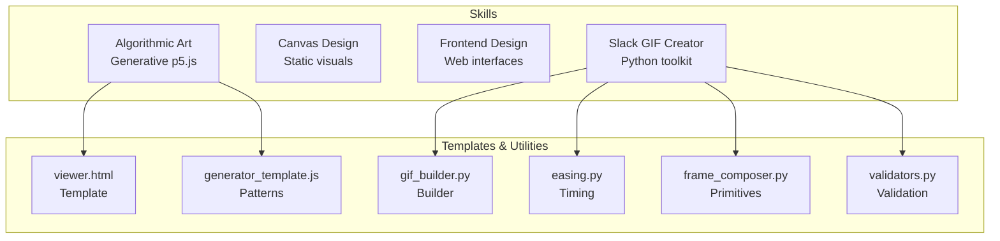
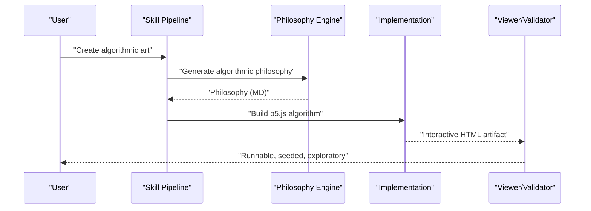
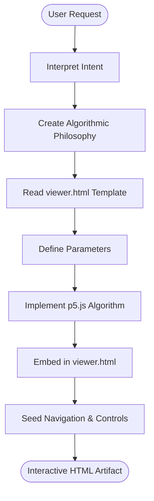
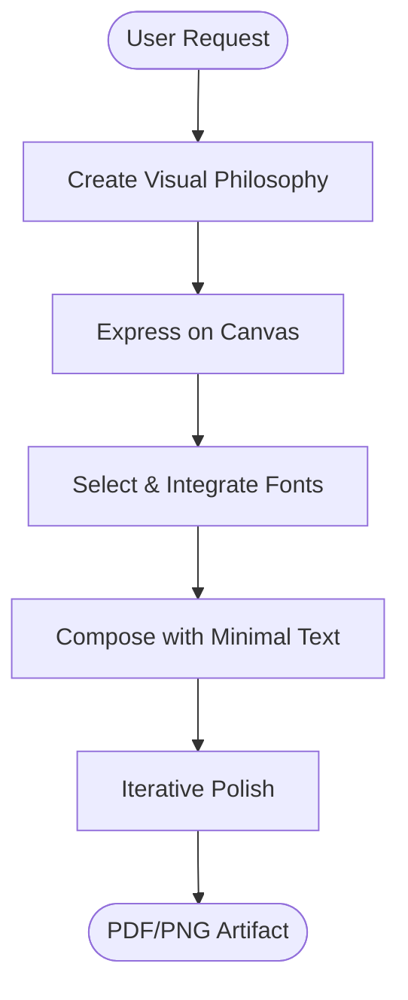
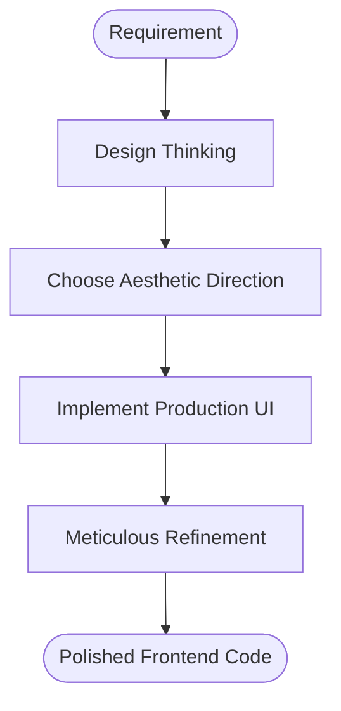
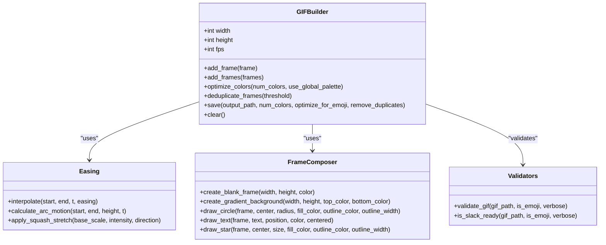
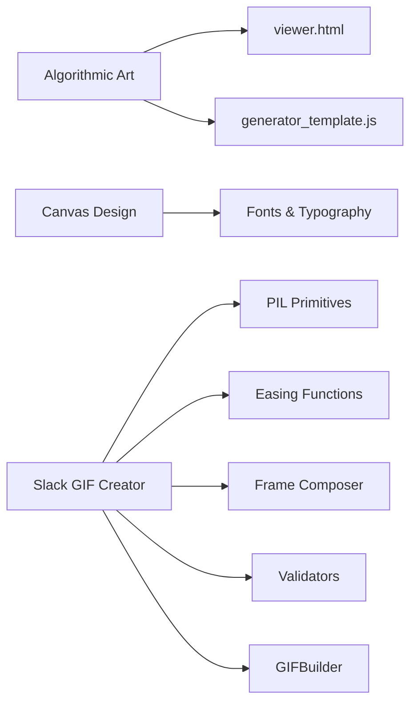

# Creative & Design Skills

<cite>
**Referenced Files in This Document**
- [SKILL.md](file://skills/skills/algorithmic-art/SKILL.md)
- [viewer.html](file://skills/skills/algorithmic-art/templates/viewer.html)
- [generator_template.js](file://skills/skills/algorithmic-art/templates/generator_template.js)
- [SKILL.md](file://skills/skills/canvas-design/SKILL.md)
- [SKILL.md](file://skills/skills/frontend-design/SKILL.md)
- [SKILL.md](file://skills/skills/slack-gif-creator/SKILL.md)
- [gif_builder.py](file://skills/skills/slack-gif-creator/core/gif_builder.py)
- [easing.py](file://skills/skills/slack-gif-creator/core/easing.py)
- [frame_composer.py](file://skills/skills/slack-gif-creator/core/frame_composer.py)
- [validators.py](file://skills/skills/slack-gif-creator/core/validators.py)
</cite>

## Table of Contents
1. [Introduction](#introduction)
2. [Project Structure](#project-structure)
3. [Core Components](#core-components)
4. [Architecture Overview](#architecture-overview)
5. [Detailed Component Analysis](#detailed-component-analysis)
6. [Dependency Analysis](#dependency-analysis)
7. [Performance Considerations](#performance-considerations)
8. [Troubleshooting Guide](#troubleshooting-guide)
9. [Conclusion](#conclusion)
10. [Appendices](#appendices)

## Introduction
This document explains the creative and design-focused skills that enable algorithmic art generation, canvas-based design, frontend design assistance, and GIF creation optimized for Slack. It covers the artistic generation algorithms, design system integration, and visual content creation workflows. It also documents creative prompt engineering patterns, style transfer techniques, design rule enforcement, collaborative design processes, iterative refinement, and quality assessment.

## Project Structure
The repository organizes creative capabilities as discrete skills, each with a dedicated specification and supporting utilities:
- Algorithmic Art: Generative p5.js experiences with seeded randomness and interactive parameter exploration.
- Canvas Design: Static visual compositions grounded in design philosophy and minimal text.
- Frontend Design: Production-grade UI and web component creation with strong aesthetic direction.
- Slack GIF Creator: Python-based toolkit for animated GIFs with constraints, validation, and animation concepts.

**Diagram sources**
- [SKILL.md](file://skills/skills/algorithmic-art/SKILL.md)
- [viewer.html](file://skills/skills/algorithmic-art/templates/viewer.html)
- [generator_template.js](file://skills/skills/algorithmic-art/templates/generator_template.js)
- [SKILL.md](file://skills/skills/canvas-design/SKILL.md)
- [SKILL.md](file://skills/skills/frontend-design/SKILL.md)
- [SKILL.md](file://skills/skills/slack-gif-creator/SKILL.md)
- [gif_builder.py](file://skills/skills/slack-gif-creator/core/gif_builder.py)
- [easing.py](file://skills/skills/slack-gif-creator/core/easing.py)
- [frame_composer.py](file://skills/skills/slack-gif-creator/core/frame_composer.py)
- [validators.py](file://skills/skills/slack-gif-creator/core/validators.py)

**Section sources**
- [SKILL.md](file://skills/skills/algorithmic-art/SKILL.md)
- [SKILL.md](file://skills/skills/canvas-design/SKILL.md)
- [SKILL.md](file://skills/skills/frontend-design/SKILL.md)
- [SKILL.md](file://skills/skills/slack-gif-creator/SKILL.md)

## Core Components
- Algorithmic Art: A two-phase process—creating an algorithmic philosophy followed by a p5.js implementation that embeds seeded randomness, parametric controls, and an interactive viewer derived from a strict template.
- Canvas Design: A two-phase process—design philosophy creation and visual expression on canvas, emphasizing minimal text, spatial composition, and expert craftsmanship.
- Frontend Design: A guided design-thinking process to define purpose, tone, constraints, and differentiation, then implement production-grade UI with attention to typography, color, motion, and composition.
- Slack GIF Creator: A Python toolkit offering a GIFBuilder, easing functions, frame composers, and validators tailored to Slack’s constraints.

**Section sources**
- [SKILL.md](file://skills/skills/algorithmic-art/SKILL.md)
- [SKILL.md](file://skills/skills/canvas-design/SKILL.md)
- [SKILL.md](file://skills/skills/frontend-design/SKILL.md)
- [SKILL.md](file://skills/skills/slack-gif-creator/SKILL.md)

## Architecture Overview
The skills operate as distinct pipelines with shared design principles:
- Prompt Engineering: Interpret user intent, derive a conceptual seed, and encode it into algorithmic or visual parameters.
- Generative Expression: Implement algorithms or designs that reflect the philosophy, ensuring reproducibility and expert-level polish.
- Interactive/Validation Layer: Provide UI controls for parameter exploration, seed navigation, and quality checks aligned with platform constraints.

**Diagram sources**
- [SKILL.md](file://skills/skills/algorithmic-art/SKILL.md)

## Detailed Component Analysis

### Algorithmic Art Generation
This skill transforms a user request into a generative aesthetic movement and then into a p5.js sketch with interactive controls and seeded reproducibility.

- Philosophy Phase
  - Define a movement name and articulate a 4–6 paragraph philosophy covering computational processes, seeded randomness, noise fields, particles/fields, temporal evolution, and parametric variation.
  - Emphasize craftsmanship and leave room for interpretive implementation.
- Implementation Phase
  - Use the viewer.html template as a strict baseline for layout, branding, and fixed UI sections.
  - Embed a self-contained p5.js algorithm with seeded randomness and parameter controls that reflect the philosophy.
  - Provide seed navigation (previous/next/random/jump) and optional gallery-mode variations.

**Diagram sources**
- [SKILL.md](file://skills/skills/algorithmic-art/SKILL.md)
- [viewer.html](file://skills/skills/algorithmic-art/templates/viewer.html)
- [generator_template.js](file://skills/skills/algorithmic-art/templates/generator_template.js)

**Section sources**
- [SKILL.md](file://skills/skills/algorithmic-art/SKILL.md)
- [viewer.html](file://skills/skills/algorithmic-art/templates/viewer.html)
- [generator_template.js](file://skills/skills/algorithmic-art/templates/generator_template.js)

### Canvas Design System
This skill emphasizes visual philosophy and minimal text, translating conceptual threads into high-quality static visuals.

- Philosophy Phase
  - Create a visual philosophy focused on form, space, color, composition, and minimal text.
  - Leave room for interpretive visual expression while maintaining expert craftsmanship.
- Canvas Phase
  - Use the design philosophy to create a single-page PDF or PNG with dense, repeated elements and systematic reference markers.
  - Treat typography as a contextual element, choosing fonts thoughtfully and ensuring no overlap or formatting issues.
  - Refine iteratively to achieve museum-quality presentation.

**Diagram sources**
- [SKILL.md](file://skills/skills/canvas-design/SKILL.md)

**Section sources**
- [SKILL.md](file://skills/skills/canvas-design/SKILL.md)

### Frontend Design Assistance
This skill guides the creation of production-grade frontend interfaces with a bold aesthetic direction and meticulous attention to detail.

- Design Thinking
  - Define purpose, tone, constraints, and differentiation.
  - Choose an extreme aesthetic direction and execute with precision.
- Implementation
  - Produce functional, visually striking code with distinctive typography, color/theme, motion, spatial composition, and background details.
  - Avoid generic AI aesthetics and tailor complexity to the aesthetic vision.

**Diagram sources**
- [SKILL.md](file://skills/skills/frontend-design/SKILL.md)

**Section sources**
- [SKILL.md](file://skills/skills/frontend-design/SKILL.md)

### Slack GIF Creation Toolkit
This skill provides a Python-based pipeline for creating animated GIFs optimized for Slack, including constraints, validation, easing, and frame composition.

- Constraints
  - Emoji GIFs: 128x128 recommended; Message GIFs: up to 480x480; FPS 10–30; Colors 48–128; Duration under 3 seconds for emoji.
- Core Workflow
  - Initialize GIFBuilder with width, height, fps.
  - Generate frames using PIL primitives and helpers.
  - Save with optimization for Slack (colors, duplicates, emoji mode).
- Utilities
  - Easing functions for smooth motion.
  - Frame composer helpers for circles, stars, gradients, text.
  - Validators to check dimensions, size, frame count.

**Diagram sources**
- [gif_builder.py](file://skills/skills/slack-gif-creator/core/gif_builder.py)
- [easing.py](file://skills/skills/slack-gif-creator/core/easing.py)
- [frame_composer.py](file://skills/skills/slack-gif-creator/core/frame_composer.py)
- [validators.py](file://skills/skills/slack-gif-creator/core/validators.py)

**Section sources**
- [SKILL.md](file://skills/skills/slack-gif-creator/SKILL.md)
- [gif_builder.py](file://skills/skills/slack-gif-creator/core/gif_builder.py)
- [easing.py](file://skills/skills/slack-gif-creator/core/easing.py)
- [frame_composer.py](file://skills/skills/slack-gif-creator/core/frame_composer.py)
- [validators.py](file://skills/skills/slack-gif-creator/core/validators.py)

## Dependency Analysis
- Algorithmic Art depends on:
  - Template fidelity (viewer.html) for UI structure and branding.
  - Seeded randomness and parameterization for reproducibility and exploration.
- Canvas Design depends on:
  - Design philosophy as the conceptual backbone.
  - Font selection and composition rules for minimal text and expert polish.
- Slack GIF Creator depends on:
  - PIL for frame primitives and compositing.
  - Easing functions for motion curves.
  - Validators for Slack readiness checks.
  - GIFBuilder orchestrating color optimization, duplicate removal, and saving.

**Diagram sources**
- [SKILL.md](file://skills/skills/algorithmic-art/SKILL.md)
- [viewer.html](file://skills/skills/algorithmic-art/templates/viewer.html)
- [generator_template.js](file://skills/skills/algorithmic-art/templates/generator_template.js)
- [SKILL.md](file://skills/skills/canvas-design/SKILL.md)
- [SKILL.md](file://skills/skills/slack-gif-creator/SKILL.md)
- [gif_builder.py](file://skills/skills/slack-gif-creator/core/gif_builder.py)
- [easing.py](file://skills/skills/slack-gif-creator/core/easing.py)
- [frame_composer.py](file://skills/skills/slack-gif-creator/core/frame_composer.py)
- [validators.py](file://skills/skills/slack-gif-creator/core/validators.py)

**Section sources**
- [SKILL.md](file://skills/skills/algorithmic-art/SKILL.md)
- [SKILL.md](file://skills/skills/canvas-design/SKILL.md)
- [SKILL.md](file://skills/skills/slack-gif-creator/SKILL.md)

## Performance Considerations
- Algorithmic Art
  - Prefer seeded randomness for reproducibility; tune parameters to balance complexity and performance.
  - Keep the HTML artifact self-contained and avoid heavy external dependencies.
- Canvas Design
  - Ensure no overlapping elements and maintain clear margins; treat typography as an integrated visual element.
- Slack GIF Creator
  - Reduce frames, colors, or dimensions to meet size constraints; leverage deduplication and emoji optimization.
  - Use easing functions to minimize abrupt motion and maintain smooth playback.

[No sources needed since this section provides general guidance]

## Troubleshooting Guide
- Algorithmic Art
  - If the viewer UI is missing expected controls, verify the Parameters section matches the implemented parameters and that the seed navigation is wired correctly.
- Canvas Design
  - If text overlaps or formatting fails, recheck margins and ensure fonts are downloaded and integrated as instructed.
- Slack GIF Creator
  - If validation fails, adjust dimensions, frame count, or color count; confirm FPS and duration align with Slack requirements.
  - For large file sizes, reduce frames, colors, or enable emoji optimization.

**Section sources**
- [SKILL.md](file://skills/skills/algorithmic-art/SKILL.md)
- [SKILL.md](file://skills/skills/canvas-design/SKILL.md)
- [SKILL.md](file://skills/skills/slack-gif-creator/SKILL.md)
- [validators.py](file://skills/skills/slack-gif-creator/core/validators.py)

## Conclusion
These skills provide structured, principled workflows for creative and design tasks. By grounding each output in a clear philosophy, enforcing design rules, and leveraging robust tooling, teams can collaboratively iterate toward expert-level results—whether generating algorithmic art, crafting static visuals, building frontend interfaces, or producing optimized GIFs.

[No sources needed since this section summarizes without analyzing specific files]

## Appendices
- Creative Prompt Engineering Patterns
  - Deduce a subtle conceptual reference from the user’s request and weave it into parameters, behaviors, and emergent patterns.
  - Emphasize process over product and maintain artistic freedom in implementation.
- Style Transfer Techniques
  - Use design philosophy to map abstract concepts into visual systems (color, typography, composition).
  - Apply easing and motion primitives to animate concepts coherently.
- Quality Assessment
  - Validate against platform constraints (Slack), review for polish and coherence, and iterate based on feedback.

[No sources needed since this section provides general guidance]