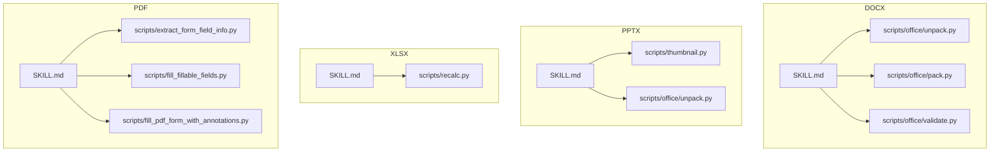
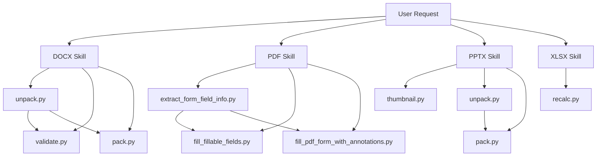
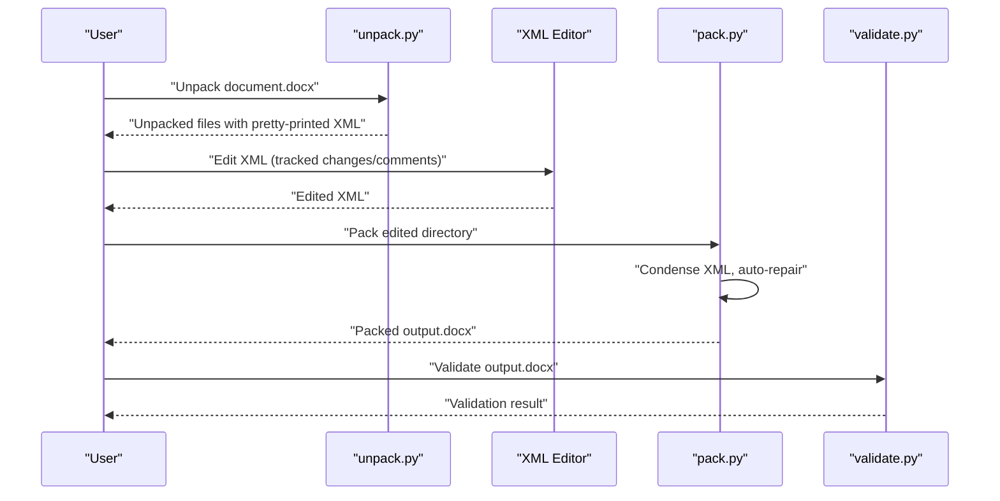
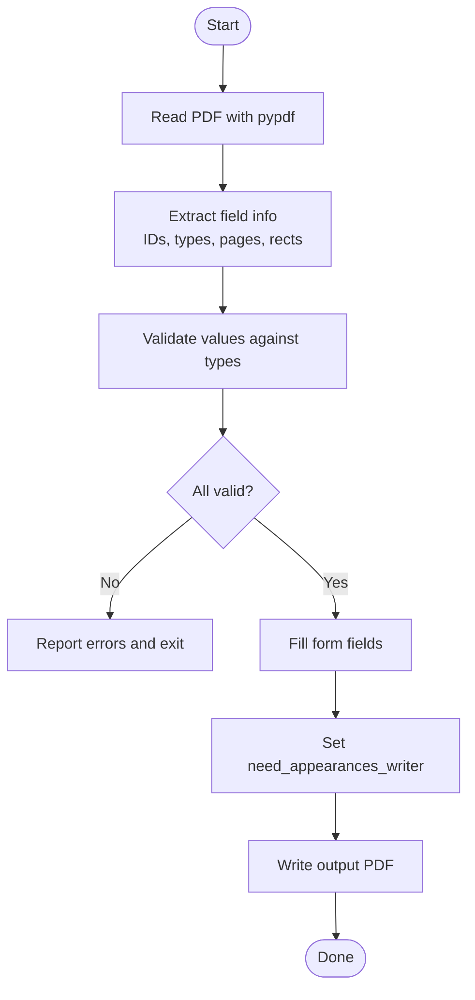
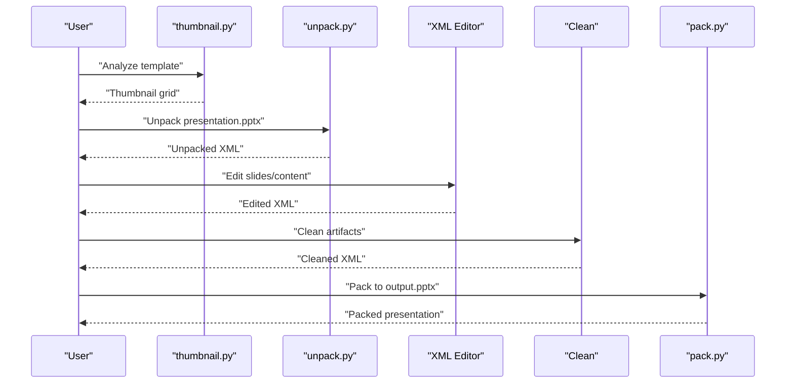
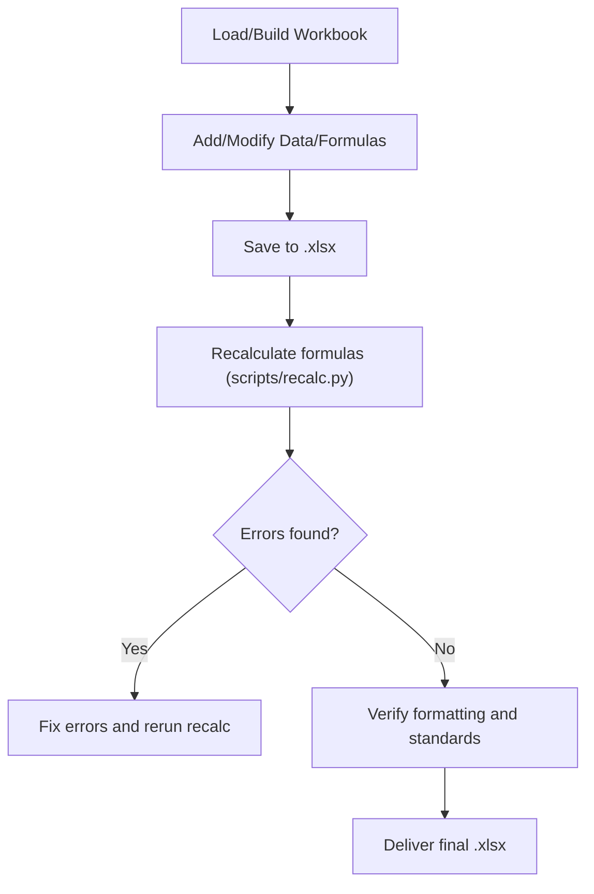
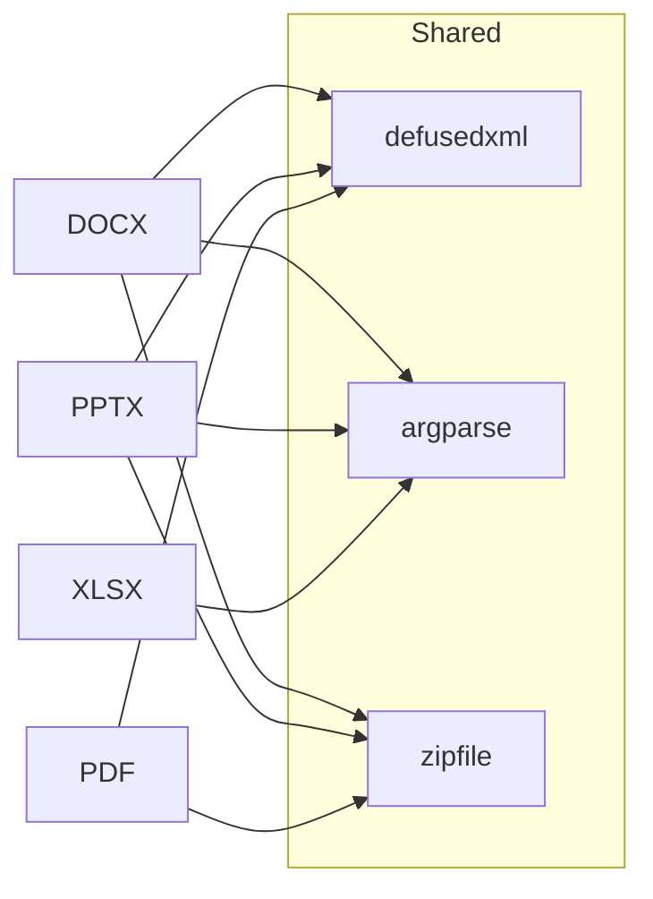

# Document Processing Skills

<cite>
**Referenced Files in This Document**
- [docx/SKILL.md](file://skills/skills/docx/SKILL.md)
- [docx/scripts/office/unpack.py](file://skills/skills/docx/scripts/office/unpack.py)
- [docx/scripts/office/pack.py](file://skills/skills/docx/scripts/office/pack.py)
- [docx/scripts/office/validate.py](file://skills/skills/docx/scripts/office/validate.py)
- [pptx/SKILL.md](file://skills/skills/pptx/SKILL.md)
- [xlsx/SKILL.md](file://skills/skills/xlsx/SKILL.md)
- [pdf/SKILL.md](file://skills/skills/pdf/SKILL.md)
- [pdf/scripts/extract_form_field_info.py](file://skills/skills/pdf/scripts/extract_form_field_info.py)
- [pdf/scripts/fill_fillable_fields.py](file://skills/skills/pdf/scripts/fill_fillable_fields.py)
- [pdf/scripts/fill_pdf_form_with_annotations.py](file://skills/skills/pdf/scripts/fill_pdf_form_with_annotations.py)
</cite>

## Table of Contents
1. [Introduction](#introduction)
2. [Project Structure](#project-structure)
3. [Core Components](#core-components)
4. [Architecture Overview](#architecture-overview)
5. [Detailed Component Analysis](#detailed-component-analysis)
6. [Dependency Analysis](#dependency-analysis)
7. [Performance Considerations](#performance-considerations)
8. [Troubleshooting Guide](#troubleshooting-guide)
9. [Conclusion](#conclusion)

## Introduction
This document describes the comprehensive document processing skills for DOCX, PDF, PPTX, and XLSX manipulation. It explains parsing, validation, and modification workflows; form field extraction, filling, and annotation systems for PDFs; office document schema validation and redlining support; and practical examples for automation, template processing, and batch operations. Security considerations, validation rules, and error recovery mechanisms are included to ensure robust and safe document handling.

## Project Structure
The skills are organized by document type, each with:
- A skill overview and usage guidance
- Scripted workflows for unpacking, editing, packing, and validating
- Dedicated scripts for PDF form extraction and filling
- Quality assurance and conversion utilities

**Diagram sources**
- [docx/SKILL.md:1-591](file://skills/skills/docx/SKILL.md#L1-L591)
- [docx/scripts/office/unpack.py:1-133](file://skills/skills/docx/scripts/office/unpack.py#L1-L133)
- [docx/scripts/office/pack.py:1-160](file://skills/skills/docx/scripts/office/pack.py#L1-L160)
- [docx/scripts/office/validate.py:1-112](file://skills/skills/docx/scripts/office/validate.py#L1-L112)
- [pptx/SKILL.md:1-233](file://skills/skills/pptx/SKILL.md#L1-L233)
- [xlsx/SKILL.md:1-292](file://skills/skills/xlsx/SKILL.md#L1-L292)
- [pdf/SKILL.md:1-315](file://skills/skills/pdf/SKILL.md#L1-L315)
- [pdf/scripts/extract_form_field_info.py:1-123](file://skills/skills/pdf/scripts/extract_form_field_info.py#L1-L123)
- [pdf/scripts/fill_fillable_fields.py:1-99](file://skills/skills/pdf/scripts/fill_fillable_fields.py#L1-L99)
- [pdf/scripts/fill_pdf_form_with_annotations.py:1-108](file://skills/skills/pdf/scripts/fill_pdf_form_with_annotations.py#L1-L108)

**Section sources**
- [docx/SKILL.md:1-591](file://skills/skills/docx/SKILL.md#L1-L591)
- [pptx/SKILL.md:1-233](file://skills/skills/pptx/SKILL.md#L1-L233)
- [xlsx/SKILL.md:1-292](file://skills/skills/xlsx/SKILL.md#L1-L292)
- [pdf/SKILL.md:1-315](file://skills/skills/pdf/SKILL.md#L1-L315)

## Core Components
- DOCX editing pipeline: Unpack → edit XML → pack → validate
- PDF form processing: extract field metadata → validate values → fill fields → add annotations
- PPTX editing pipeline: thumbnail analysis → unpack → edit → clean → pack
- XLSX editing pipeline: pandas/openpyxl → formulas → recalc → verify

Key capabilities:
- Office document ZIP/XML manipulation with schema-aware validation and auto-repair
- PDF form field extraction and type-aware filling
- Slide deck analysis and rendering via conversion to images
- Spreadsheet formula integrity and recalculation

**Section sources**
- [docx/SKILL.md:398-454](file://skills/skills/docx/SKILL.md#L398-L454)
- [pdf/SKILL.md:1-315](file://skills/skills/pdf/SKILL.md#L1-L315)
- [pptx/SKILL.md:19-41](file://skills/skills/pptx/SKILL.md#L19-L41)
- [xlsx/SKILL.md:76-150](file://skills/skills/xlsx/SKILL.md#L76-L150)

## Architecture Overview
The system follows a modular, file-centric architecture:
- Each document type has a dedicated skill guide and scripts
- DOCX/PPTX/XLSX share common ZIP/XML unpacking/packing/validation utilities
- PDF has specialized form extraction and annotation workflows
- QA and conversion utilities (e.g., LibreOffice, Poppler) integrate across formats

**Diagram sources**
- [docx/scripts/office/unpack.py:1-133](file://skills/skills/docx/scripts/office/unpack.py#L1-L133)
- [docx/scripts/office/validate.py:1-112](file://skills/skills/docx/scripts/office/validate.py#L1-L112)
- [docx/scripts/office/pack.py:1-160](file://skills/skills/docx/scripts/office/pack.py#L1-L160)
- [pdf/scripts/extract_form_field_info.py:1-123](file://skills/skills/pdf/scripts/extract_form_field_info.py#L1-L123)
- [pdf/scripts/fill_fillable_fields.py:1-99](file://skills/skills/pdf/scripts/fill_fillable_fields.py#L1-L99)
- [pdf/scripts/fill_pdf_form_with_annotations.py:1-108](file://skills/skills/pdf/scripts/fill_pdf_form_with_annotations.py#L1-L108)
- [pptx/SKILL.md:19-41](file://skills/skills/pptx/SKILL.md#L19-L41)
- [xlsx/SKILL.md:207-226](file://skills/skills/xlsx/SKILL.md#L207-L226)

## Detailed Component Analysis

### DOCX Editing Pipeline
The DOCX skill defines a three-phase workflow:
1. Unpack: Extract ZIP, pretty-print XML, merge runs, simplify redlining, escape smart quotes
2. Edit: Manually edit XML under word/ with tracked changes and comments
3. Pack: Condense XML, validate with auto-repair, repack into .docx

**Diagram sources**
- [docx/scripts/office/unpack.py:34-74](file://skills/skills/docx/scripts/office/unpack.py#L34-L74)
- [docx/scripts/office/pack.py:24-66](file://skills/skills/docx/scripts/office/pack.py#L24-L66)
- [docx/scripts/office/validate.py:25-107](file://skills/skills/docx/scripts/office/validate.py#L25-L107)

**Section sources**
- [docx/SKILL.md:398-454](file://skills/skills/docx/SKILL.md#L398-L454)
- [docx/scripts/office/unpack.py:1-133](file://skills/skills/docx/scripts/office/unpack.py#L1-L133)
- [docx/scripts/office/pack.py:1-160](file://skills/skills/docx/scripts/office/pack.py#L1-L160)
- [docx/scripts/office/validate.py:1-112](file://skills/skills/docx/scripts/office/validate.py#L1-L112)

### PDF Form Field Extraction and Filling
PDF form processing consists of:
- Extract field metadata (types, IDs, positions) from interactive forms
- Validate values against field types (checkbox, radio group, choice)
- Fill form fields programmatically
- Optionally add FreeText annotations mapped from image or PDF coordinate systems

**Diagram sources**
- [pdf/scripts/extract_form_field_info.py:47-107](file://skills/skills/pdf/scripts/extract_form_field_info.py#L47-L107)
- [pdf/scripts/fill_fillable_fields.py:11-53](file://skills/skills/pdf/scripts/fill_fillable_fields.py#L11-L53)

**Section sources**
- [pdf/SKILL.md:1-315](file://skills/skills/pdf/SKILL.md#L1-L315)
- [pdf/scripts/extract_form_field_info.py:1-123](file://skills/skills/pdf/scripts/extract_form_field_info.py#L1-L123)
- [pdf/scripts/fill_fillable_fields.py:1-99](file://skills/skills/pdf/scripts/fill_fillable_fields.py#L1-L99)
- [pdf/scripts/fill_pdf_form_with_annotations.py:1-108](file://skills/skills/pdf/scripts/fill_pdf_form_with_annotations.py#L1-L108)

### PPTX Editing Pipeline
PPTX editing emphasizes analysis-first editing:
- Thumbnail generation for layout understanding
- Unpack → edit XML → clean → pack
- QA via text extraction and image inspection

**Diagram sources**
- [pptx/SKILL.md:19-41](file://skills/skills/pptx/SKILL.md#L19-L41)
- [docx/scripts/office/unpack.py:1-133](file://skills/skills/docx/scripts/office/unpack.py#L1-L133)
- [docx/scripts/office/pack.py:1-160](file://skills/skills/docx/scripts/office/pack.py#L1-L160)

**Section sources**
- [pptx/SKILL.md:19-41](file://skills/skills/pptx/SKILL.md#L19-L41)

### XLSX Editing Pipeline
XLSX focuses on dynamic models with strict formula hygiene:
- Data analysis with pandas
- Formula-driven modeling with openpyxl
- Mandatory recalculation and verification
- Color-coded conventions and number formatting standards

**Diagram sources**
- [xlsx/SKILL.md:76-150](file://skills/skills/xlsx/SKILL.md#L76-L150)
- [xlsx/SKILL.md:207-226](file://skills/skills/xlsx/SKILL.md#L207-L226)

**Section sources**
- [xlsx/SKILL.md:76-150](file://skills/skills/xlsx/SKILL.md#L76-L150)
- [xlsx/SKILL.md:207-226](file://skills/skills/xlsx/SKILL.md#L207-L226)

## Dependency Analysis
Shared and format-specific dependencies:
- Shared: defusedxml for safe XML parsing, argparse for CLI, zipfile for ZIP handling
- DOCX/PPTX/XLSX: common unpack/pack/validation utilities
- PDF: pypdf for form extraction/filling, optional annotations
- Conversion: LibreOffice for PDF conversions, Poppler for image extraction

**Diagram sources**
- [docx/scripts/office/unpack.py:16-24](file://skills/skills/docx/scripts/office/unpack.py#L16-L24)
- [docx/scripts/office/pack.py:13-22](file://skills/skills/docx/scripts/office/pack.py#L13-L22)
- [docx/scripts/office/validate.py:16-22](file://skills/skills/docx/scripts/office/validate.py#L16-L22)
- [pdf/scripts/extract_form_field_info.py:1-7](file://skills/skills/pdf/scripts/extract_form_field_info.py#L1-L7)
- [pdf/scripts/fill_fillable_fields.py:1-6](file://skills/skills/pdf/scripts/fill_fillable_fields.py#L1-L6)

**Section sources**
- [docx/SKILL.md:585-591](file://skills/skills/docx/SKILL.md#L585-L591)
- [pptx/SKILL.md:226-233](file://skills/skills/pptx/SKILL.md#L226-L233)
- [xlsx/SKILL.md:72-75](file://skills/skills/xlsx/SKILL.md#L72-L75)
- [pdf/SKILL.md:1-315](file://skills/skills/pdf/SKILL.md#L1-L315)

## Performance Considerations
- Prefer batch operations for multiple documents (merge/split PDFs, recalculation)
- Use read-only or write-only modes for large files when appropriate
- Minimize repeated XML parsing; condense and reuse parsed DOMs
- Leverage LibreOffice headless mode for conversions to avoid GUI overhead
- Cache extracted field metadata for repeated fills

## Troubleshooting Guide
Common issues and remedies:
- DOCX validation failures: Run auto-repair and re-validate; ensure tracked changes and comments are properly marked; verify RSID and whitespace handling
- PDF form filling errors: Validate field IDs and page numbers; confirm value compatibility with field types; set need_appearances_writer
- PPTX visual QA: Convert to images and inspect for overlapping elements, misaligned columns, and low contrast
- XLSX formula errors: Check for #REF!, #DIV/0!, #VALUE!, and circular references; verify cross-sheet references and column offsets

**Section sources**
- [docx/scripts/office/validate.py:11-14](file://skills/skills/docx/scripts/office/validate.py#L11-L14)
- [docx/SKILL.md:442-448](file://skills/skills/docx/SKILL.md#L442-L448)
- [pdf/scripts/fill_fillable_fields.py:55-71](file://skills/skills/pdf/scripts/fill_fillable_fields.py#L55-L71)
- [pptx/SKILL.md:141-204](file://skills/skills/pptx/SKILL.md#L141-L204)
- [xlsx/SKILL.md:227-263](file://skills/skills/xlsx/SKILL.md#L227-L263)

## Conclusion
These skills provide a robust, script-driven toolkit for manipulating DOCX, PDF, PPTX, and XLSX documents. By following the defined workflows—unpacking, editing, packing, and validating—you can automate document creation, template processing, and batch operations while maintaining schema compliance, form integrity, and visual quality. The included QA and conversion utilities further strengthen reliability and interoperability across platforms.