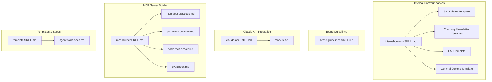
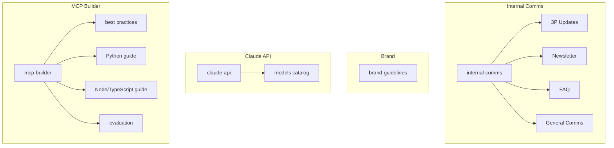
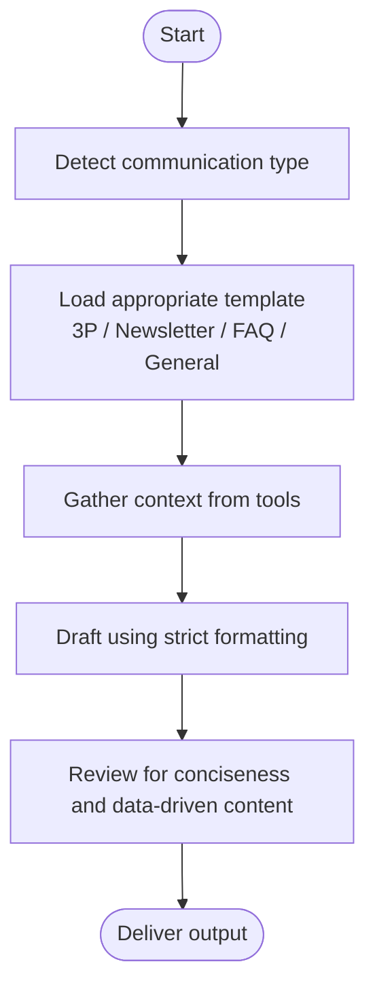
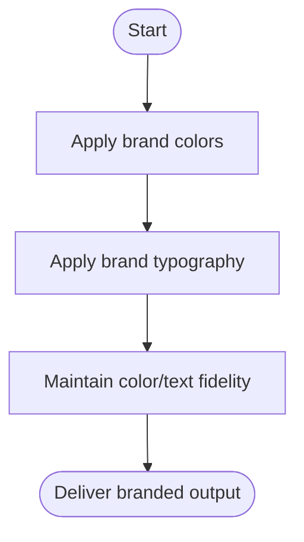
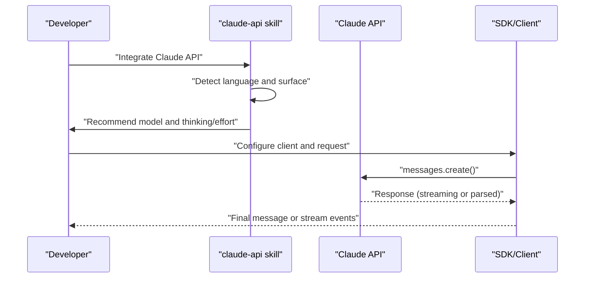
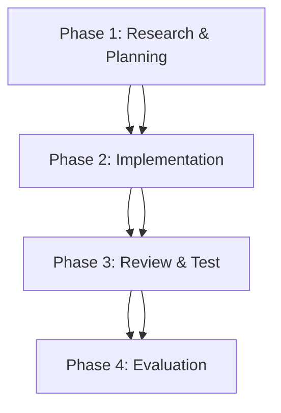
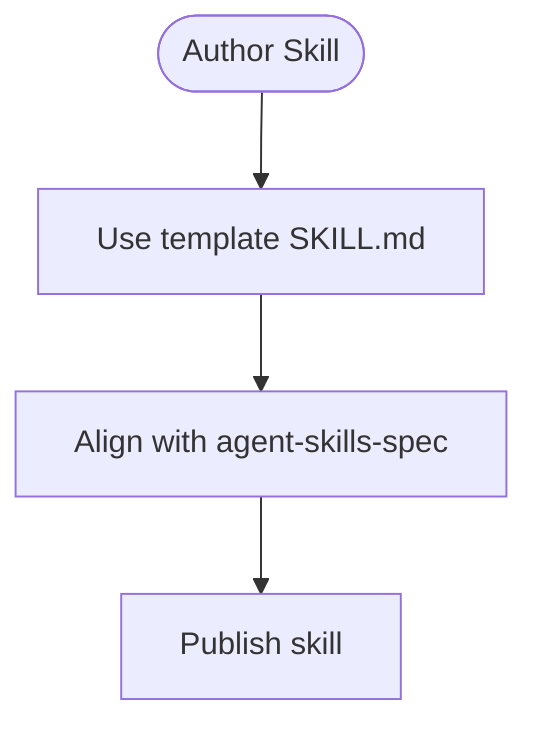
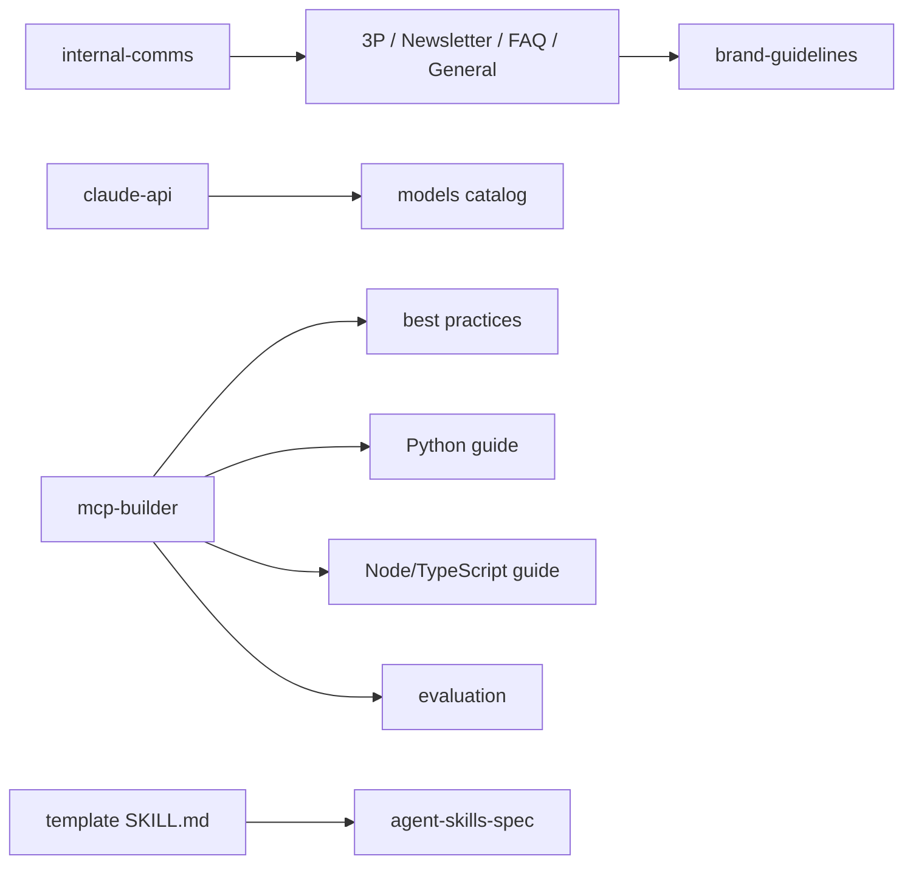

# Enterprise Communication Skills

<cite>
**Referenced Files in This Document**
- [internal-comms SKILL.md](file://skills/skills/internal-comms/SKILL.md)
- [internal-comms 3p-updates.md](file://skills/skills/internal-comms/examples/3p-updates.md)
- [internal-comms company-newsletter.md](file://skills/skills/internal-comms/examples/company-newsletter.md)
- [internal-comms faq-answers.md](file://skills/skills/internal-comms/examples/faq-answers.md)
- [internal-comms general-comms.md](file://skills/skills/internal-comms/examples/general-comms.md)
- [brand-guidelines SKILL.md](file://skills/skills/brand-guidelines/SKILL.md)
- [claude-api SKILL.md](file://skills/skills/claude-api/SKILL.md)
- [models.md](file://skills/skills/claude-api/shared/models.md)
- [mcp-builder SKILL.md](file://skills/skills/mcp-builder/SKILL.md)
- [mcp-best-practices.md](file://skills/skills/mcp-builder/reference/mcp_best_practices.md)
- [python-mcp-server.md](file://skills/skills/mcp-builder/reference/python_mcp_server.md)
- [node-mcp-server.md](file://skills/skills/mcp-builder/reference/node_mcp_server.md)
- [evaluation.md](file://skills/skills/mcp-builder/reference/evaluation.md)
- [template SKILL.md](file://skills/template/SKILL.md)
- [agent-skills-spec.md](file://skills/spec/agent-skills-spec.md)
</cite>

## Table of Contents
1. [Introduction](#introduction)
2. [Project Structure](#project-structure)
3. [Core Components](#core-components)
4. [Architecture Overview](#architecture-overview)
5. [Detailed Component Analysis](#detailed-component-analysis)
6. [Dependency Analysis](#dependency-analysis)
7. [Performance Considerations](#performance-considerations)
8. [Troubleshooting Guide](#troubleshooting-guide)
9. [Conclusion](#conclusion)
10. [Appendices](#appendices)

## Introduction
This document explains enterprise communication and integration skills centered around internal communications automation, brand guideline enforcement, and API integration patterns. It documents:
- Internal communications automation with standardized templates for 3P updates, newsletters, FAQs, and general comms
- Brand guideline enforcement for consistent visual identity
- Secure external service integration via the Claude API skill and the MCP server builder for custom protocols
- Enterprise workflow automation, compliance checking, and multi-channel communication strategies
- Practical examples of secure API integration, data validation, and enterprise security considerations

## Project Structure
The repository organizes enterprise communication and integration capabilities into discrete skills and reference materials:
- Internal communications templates and guidance
- Brand styling and typography enforcement
- Claude API integration guidance and model catalog
- MCP server builder with best practices, language-specific guides, and evaluation framework
- Template and specification references for consistent skill authoring

**Diagram sources**
- [internal-comms SKILL.md:1-33](file://skills/skills/internal-comms/SKILL.md#L1-L33)
- [brand-guidelines SKILL.md:1-74](file://skills/skills/brand-guidelines/SKILL.md#L1-L74)
- [claude-api SKILL.md:1-263](file://skills/skills/claude-api/SKILL.md#L1-L263)
- [models.md:1-120](file://skills/skills/claude-api/shared/models.md#L1-L120)
- [mcp-builder SKILL.md:1-237](file://skills/skills/mcp-builder/SKILL.md#L1-L237)
- [mcp-best-practices.md:1-250](file://skills/skills/mcp-builder/reference/mcp_best_practices.md#L1-L250)
- [python-mcp-server.md:1-719](file://skills/skills/mcp-builder/reference/python_mcp_server.md#L1-L719)
- [node-mcp-server.md:1-970](file://skills/skills/mcp-builder/reference/node_mcp_server.md#L1-L970)
- [evaluation.md:1-602](file://skills/skills/mcp-builder/reference/evaluation.md#L1-L602)
- [template SKILL.md:1-7](file://skills/template/SKILL.md#L1-L7)
- [agent-skills-spec.md:1-4](file://skills/spec/agent-skills-spec.md#L1-L4)

**Section sources**
- [internal-comms SKILL.md:1-33](file://skills/skills/internal-comms/SKILL.md#L1-L33)
- [brand-guidelines SKILL.md:1-74](file://skills/skills/brand-guidelines/SKILL.md#L1-L74)
- [claude-api SKILL.md:1-263](file://skills/skills/claude-api/SKILL.md#L1-L263)
- [mcp-builder SKILL.md:1-237](file://skills/skills/mcp-builder/SKILL.md#L1-L237)
- [template SKILL.md:1-7](file://skills/template/SKILL.md#L1-L7)
- [agent-skills-spec.md:1-4](file://skills/spec/agent-skills-spec.md#L1-L4)

## Core Components
- Internal communications automation: A skill that selects and applies communication templates for 3P updates, newsletters, FAQs, and general comms, ensuring consistency and speed.
- Brand guideline enforcement: A skill that enforces Anthropic’s brand identity (colors, typography, and styling) across artifacts.
- Claude API skill: A comprehensive integration guide for building LLM-powered applications with Claude, including model selection, thinking/effort configuration, prompt caching, batching, and structured outputs.
- MCP server builder: A framework for creating high-quality MCP servers that enable LLMs to interact with external services via well-designed tools, with best practices, language-specific guides, and evaluation.
- Communication template system: A standardized set of templates and instructions for internal comms, including tooling and prioritization guidance.

**Section sources**
- [internal-comms SKILL.md:7-33](file://skills/skills/internal-comms/SKILL.md#L7-L33)
- [brand-guidelines SKILL.md:7-74](file://skills/skills/brand-guidelines/SKILL.md#L7-L74)
- [claude-api SKILL.md:7-263](file://skills/skills/claude-api/SKILL.md#L7-L263)
- [mcp-builder SKILL.md:7-237](file://skills/skills/mcp-builder/SKILL.md#L7-L237)
- [template SKILL.md:1-7](file://skills/template/SKILL.md#L1-L7)

## Architecture Overview
The enterprise communication and integration architecture centers on:
- Internal communications templates and automation
- Brand styling enforcement
- Secure external service integration via Claude API and MCP servers
- Evaluation-driven quality assurance for MCP servers

**Diagram sources**
- [internal-comms SKILL.md:1-33](file://skills/skills/internal-comms/SKILL.md#L1-L33)
- [brand-guidelines SKILL.md:1-74](file://skills/skills/brand-guidelines/SKILL.md#L1-L74)
- [claude-api SKILL.md:1-263](file://skills/skills/claude-api/SKILL.md#L1-L263)
- [models.md:1-120](file://skills/skills/claude-api/shared/models.md#L1-L120)
- [mcp-builder SKILL.md:1-237](file://skills/skills/mcp-builder/SKILL.md#L1-L237)
- [mcp-best-practices.md:1-250](file://skills/skills/mcp-builder/reference/mcp_best_practices.md#L1-L250)
- [python-mcp-server.md:1-719](file://skills/skills/mcp-builder/reference/python_mcp_server.md#L1-L719)
- [node-mcp-server.md:1-970](file://skills/skills/mcp-builder/reference/node_mcp_server.md#L1-L970)
- [evaluation.md:1-602](file://skills/skills/mcp-builder/reference/evaluation.md#L1-L602)

## Detailed Component Analysis

### Internal Communications Automation
The internal communications skill automates the creation of succinct, consistent, and data-driven internal updates. It provides:
- A decision flow to select the appropriate template (3P updates, newsletter, FAQ, general)
- Guidance on gathering context from company tools (Slack, email, documents, calendar)
- Strict formatting rules and prioritization for audience consumption

**Diagram sources**
- [internal-comms SKILL.md:17-33](file://skills/skills/internal-comms/SKILL.md#L17-L33)
- [internal-comms 3p-updates.md:1-47](file://skills/skills/internal-comms/examples/3p-updates.md#L1-L47)
- [internal-comms company-newsletter.md:1-66](file://skills/skills/internal-comms/examples/company-newsletter.md#L1-L66)
- [internal-comms faq-answers.md:1-30](file://skills/skills/internal-comms/examples/faq-answers.md#L1-L30)
- [internal-comms general-comms.md:1-16](file://skills/skills/internal-comms/examples/general-comms.md#L1-L16)

**Section sources**
- [internal-comms SKILL.md:7-33](file://skills/skills/internal-comms/SKILL.md#L7-L33)
- [internal-comms 3p-updates.md:1-47](file://skills/skills/internal-comms/examples/3p-updates.md#L1-L47)
- [internal-comms company-newsletter.md:1-66](file://skills/skills/internal-comms/examples/company-newsletter.md#L1-L66)
- [internal-comms faq-answers.md:1-30](file://skills/skills/internal-comms/examples/faq-answers.md#L1-L30)
- [internal-comms general-comms.md:1-16](file://skills/skills/internal-comms/examples/general-comms.md#L1-L16)

### Brand Guideline Enforcement
The brand guidelines skill enforces Anthropic’s visual identity:
- Colors: dark/light/neutral palette and accent colors
- Typography: headings/body fonts with fallbacks
- Smart font and color application for readability and brand fidelity
- Technical details for font management and color application

**Diagram sources**
- [brand-guidelines SKILL.md:15-74](file://skills/skills/brand-guidelines/SKILL.md#L15-L74)

**Section sources**
- [brand-guidelines SKILL.md:7-74](file://skills/skills/brand-guidelines/SKILL.md#L7-L74)

### Claude API Integration Patterns
The Claude API skill provides:
- Language detection and surface selection (single call, workflow, agent)
- Model defaults and capabilities (thinking, effort, structured outputs)
- Prompt caching and compaction guidance
- Reading guide for language-specific documentation and shared concepts
- Common pitfalls and best practices for secure, robust integrations

**Diagram sources**
- [claude-api SKILL.md:11-263](file://skills/skills/claude-api/SKILL.md#L11-L263)
- [models.md:1-120](file://skills/skills/claude-api/shared/models.md#L1-L120)

**Section sources**
- [claude-api SKILL.md:7-263](file://skills/skills/claude-api/SKILL.md#L7-L263)
- [models.md:1-120](file://skills/skills/claude-api/shared/models.md#L1-L120)

### MCP Server Builder for Custom Protocols
The MCP server builder enables LLMs to interact with external services through well-designed tools:
- Four-phase process: research, implementation, review/test, evaluation
- Best practices for naming, response formats, pagination, transport, and security
- Language-specific guides for Python (FastMCP) and Node/TypeScript (MCP SDK)
- Comprehensive evaluation framework to validate tool effectiveness

**Diagram sources**
- [mcp-builder SKILL.md:15-237](file://skills/skills/mcp-builder/SKILL.md#L15-L237)
- [mcp-best-practices.md:1-250](file://skills/skills/mcp-builder/reference/mcp_best-practices.md#L1-L250)
- [python-mcp-server.md:1-719](file://skills/skills/mcp-builder/reference/python_mcp_server.md#L1-L719)
- [node-mcp-server.md:1-970](file://skills/skills/mcp-builder/reference/node_mcp_server.md#L1-L970)
- [evaluation.md:1-602](file://skills/skills/mcp-builder/reference/evaluation.md#L1-L602)

**Section sources**
- [mcp-builder SKILL.md:7-237](file://skills/skills/mcp-builder/SKILL.md#L7-L237)
- [mcp-best-practices.md:1-250](file://skills/skills/mcp-builder/reference/mcp_best_practices.md#L1-L250)
- [python-mcp-server.md:1-719](file://skills/skills/mcp-builder/reference/python_mcp_server.md#L1-L719)
- [node-mcp-server.md:1-970](file://skills/skills/mcp-builder/reference/node_mcp_server.md#L1-L970)
- [evaluation.md:1-602](file://skills/skills/mcp-builder/reference/evaluation.md#L1-L602)

### Communication Template Systems
The template system standardizes skill authoring and ensures consistent structure across skills:
- A minimal template for skill descriptions and usage
- Alignment with agent skills specification for interoperability

**Diagram sources**
- [template SKILL.md:1-7](file://skills/template/SKILL.md#L1-L7)
- [agent-skills-spec.md:1-4](file://skills/spec/agent-skills-spec.md#L1-L4)

**Section sources**
- [template SKILL.md:1-7](file://skills/template/SKILL.md#L1-L7)
- [agent-skills-spec.md:1-4](file://skills/spec/agent-skills-spec.md#L1-L4)

## Dependency Analysis
The skills and references interrelate as follows:
- Internal communications depends on templates and examples for content creation
- Brand guidelines provides styling primitives for outputs
- Claude API skill references model catalogs and shared concepts
- MCP builder references best practices, language guides, and evaluation frameworks
- Templates and specs ensure consistent skill structure and interoperability

**Diagram sources**
- [internal-comms SKILL.md:1-33](file://skills/skills/internal-comms/SKILL.md#L1-L33)
- [brand-guidelines SKILL.md:1-74](file://skills/skills/brand-guidelines/SKILL.md#L1-L74)
- [claude-api SKILL.md:1-263](file://skills/skills/claude-api/SKILL.md#L1-L263)
- [models.md:1-120](file://skills/skills/claude-api/shared/models.md#L1-L120)
- [mcp-builder SKILL.md:1-237](file://skills/skills/mcp-builder/SKILL.md#L1-L237)
- [mcp-best-practices.md:1-250](file://skills/skills/mcp-builder/reference/mcp_best_practices.md#L1-L250)
- [python-mcp-server.md:1-719](file://skills/skills/mcp-builder/reference/python_mcp_server.md#L1-L719)
- [node-mcp-server.md:1-970](file://skills/skills/mcp-builder/reference/node_mcp_server.md#L1-L970)
- [evaluation.md:1-602](file://skills/skills/mcp-builder/reference/evaluation.md#L1-L602)
- [template SKILL.md:1-7](file://skills/template/SKILL.md#L1-L7)
- [agent-skills-spec.md:1-4](file://skills/spec/agent-skills-spec.md#L1-L4)

**Section sources**
- [internal-comms SKILL.md:1-33](file://skills/skills/internal-comms/SKILL.md#L1-L33)
- [brand-guidelines SKILL.md:1-74](file://skills/skills/brand-guidelines/SKILL.md#L1-L74)
- [claude-api SKILL.md:1-263](file://skills/skills/claude-api/SKILL.md#L1-L263)
- [models.md:1-120](file://skills/skills/claude-api/shared/models.md#L1-L120)
- [mcp-builder SKILL.md:1-237](file://skills/skills/mcp-builder/SKILL.md#L1-L237)
- [mcp-best-practices.md:1-250](file://skills/skills/mcp-builder/reference/mcp_best_practices.md#L1-L250)
- [python-mcp-server.md:1-719](file://skills/skills/mcp-builder/reference/python_mcp_server.md#L1-L719)
- [node-mcp-server.md:1-970](file://skills/skills/mcp-builder/reference/node_mcp_server.md#L1-L970)
- [evaluation.md:1-602](file://skills/skills/mcp-builder/reference/evaluation.md#L1-L602)
- [template SKILL.md:1-7](file://skills/template/SKILL.md#L1-L7)
- [agent-skills-spec.md:1-4](file://skills/spec/agent-skills-spec.md#L1-L4)

## Performance Considerations
- Internal communications templates emphasize concise, data-driven content to reduce cognitive load and improve throughput.
- Claude API recommends adaptive thinking and structured outputs to balance quality and cost, with streaming for large outputs to avoid timeouts.
- MCP servers should implement pagination, character limits, and transport selection (streamable HTTP for remote scalability) to manage performance and reliability.

[No sources needed since this section provides general guidance]

## Troubleshooting Guide
Common pitfalls and remedies:
- Internal communications
  - Ensure strict formatting adherence and prioritize company-wide impact for newsletters
  - Use tools to gather context and avoid duplication
- Brand guidelines
  - Apply correct color and typography values; preserve readability across systems
- Claude API
  - Use exact model IDs from the model catalog; avoid deprecated parameters
  - Prefer structured outputs and streaming for long responses
  - Respect prompt caching rules and verify cache hits
- MCP servers
  - Implement robust error handling, input validation, and pagination
  - Follow transport and security best practices; validate authentication and protect against DNS rebinding

**Section sources**
- [internal-comms SKILL.md:17-33](file://skills/skills/internal-comms/SKILL.md#L17-L33)
- [brand-guidelines SKILL.md:60-74](file://skills/skills/brand-guidelines/SKILL.md#L60-L74)
- [claude-api SKILL.md:241-263](file://skills/skills/claude-api/SKILL.md#L241-L263)
- [models.md:1-120](file://skills/skills/claude-api/shared/models.md#L1-L120)
- [mcp-best-practices.md:152-250](file://skills/skills/mcp-builder/reference/mcp_best_practices.md#L152-L250)

## Conclusion
These skills and references provide a comprehensive foundation for enterprise communication automation, brand consistency, and secure external integration. By leveraging standardized templates, brand enforcement, Claude API patterns, and MCP server best practices, organizations can achieve reliable, scalable, and compliant multi-channel communication workflows.

[No sources needed since this section summarizes without analyzing specific files]

## Appendices
- Secure API integration checklist
  - Use exact model IDs and capabilities from the model catalog
  - Implement structured outputs and streaming for large responses
  - Enforce input validation and error handling
  - Apply prompt caching and compaction where appropriate
- MCP server quality checklist
  - Tool naming and discoverability
  - Response formats (JSON/markdown)
  - Pagination and transport selection
  - Security and error handling
  - Comprehensive evaluation with 10 realistic questions

[No sources needed since this section provides general guidance]