# Skill Creator Tools

<cite>
**Referenced Files in This Document**
- [SKILL.md](file://skills/skills/skill-creator/SKILL.md)
- [analyzer.md](file://skills/skills/skill-creator/agents/analyzer.md)
- [comparator.md](file://skills/skills/skill-creator/agents/comparator.md)
- [grader.md](file://skills/skills/skill-creator/agents/grader.md)
- [run_eval.py](file://skills/skills/skill-creator/scripts/run_eval.py)
- [package_skill.py](file://skills/skills/skill-creator/scripts/package_skill.py)
- [generate_report.py](file://skills/skills/skill-creator/scripts/generate_report.py)
- [aggregate_benchmark.py](file://skills/skills/skill-creator/scripts/aggregate_benchmark.py)
</cite>

## Table of Contents
1. [Introduction](#introduction)
2. [Project Structure](#project-structure)
3. [Core Components](#core-components)
4. [Architecture Overview](#architecture-overview)
5. [Detailed Component Analysis](#detailed-component-analysis)
6. [Dependency Analysis](#dependency-analysis)
7. [Performance Considerations](#performance-considerations)
8. [Troubleshooting Guide](#troubleshooting-guide)
9. [Conclusion](#conclusion)
10. [Appendices](#appendices)

## Introduction
This document describes the Skill Creator tools and evaluation framework for building, testing, and distributing Claude skills. It explains the automated agents for analysis, comparison, and grading; the evaluation pipeline for benchmark aggregation and quality assessment; packaging and distribution utilities; and the evaluation viewer/report generation. It also provides step-by-step guides for validation, testing, and iterative improvement workflows, and details the agent collaboration patterns and decision-making processes used in skill evaluation.

## Project Structure
The Skill Creator ecosystem centers on a skill directory with a SKILL.md specification, bundled resources, and a scripts/ directory containing evaluation and packaging utilities. Specialized agents guide subagents for blind comparison, post-hoc analysis, and grading.

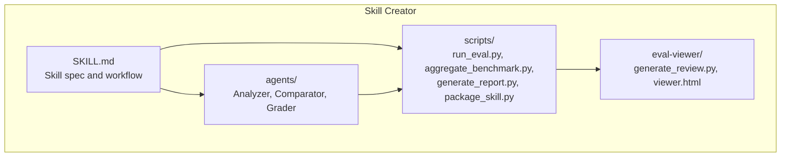

**Diagram sources**
- [SKILL.md](file://skills/skills/skill-creator/SKILL.md)
- [analyzer.md](file://skills/skills/skill-creator/agents/analyzer.md)
- [comparator.md](file://skills/skills/skill-creator/agents/comparator.md)
- [grader.md](file://skills/skills/skill-creator/agents/grader.md)
- [run_eval.py](file://skills/skills/skill-creator/scripts/run_eval.py)
- [aggregate_benchmark.py](file://skills/skills/skill-creator/scripts/aggregate_benchmark.py)
- [generate_report.py](file://skills/skills/skill-creator/scripts/generate_report.py)
- [package_skill.py](file://skills/skills/skill-creator/scripts/package_skill.py)

**Section sources**
- [SKILL.md](file://skills/skills/skill-creator/SKILL.md)

## Core Components
- Automated agents
  - Analyzer: post-hoc analysis of benchmark results and blind comparisons to extract actionable insights and improvement suggestions.
  - Comparator: blind A/B comparison of outputs to determine winners based on objective rubrics and assertion pass rates.
  - Grader: evaluates expectations against transcripts and outputs, extracts claims, and critiques evaluation design.
- Evaluation pipeline
  - Trigger evaluation for skill descriptions using run_eval.py and run_loop.py (via claude -p).
  - Benchmark aggregation using aggregate_benchmark.py to compute pass rates, timing, and token usage with deltas.
  - Report generation using generate_report.py for description optimization.
- Packaging and distribution
  - package_skill.py validates and packages a skill folder into a .skill archive for sharing and installation.
- Viewer and reporting
  - eval-viewer/generate_review.py renders an interactive HTML review for qualitative outputs and quantitative metrics.

**Section sources**
- [analyzer.md](file://skills/skills/skill-creator/agents/analyzer.md)
- [comparator.md](file://skills/skills/skill-creator/agents/comparator.md)
- [grader.md](file://skills/skills/skill-creator/agents/grader.md)
- [run_eval.py](file://skills/skills/skill-creator/scripts/run_eval.py)
- [aggregate_benchmark.py](file://skills/skills/skill-creator/scripts/aggregate_benchmark.py)
- [generate_report.py](file://skills/skills/skill-creator/scripts/generate_report.py)
- [package_skill.py](file://skills/skills/skill-creator/scripts/package_skill.py)
- [SKILL.md](file://skills/skills/skill-creator/SKILL.md)

## Architecture Overview
The evaluation workflow orchestrates subagents and scripts to run test cases, grade outputs, aggregate metrics, and present results for human review and iteration.

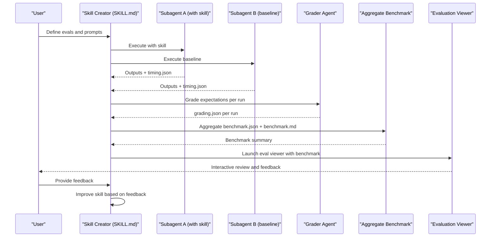

**Diagram sources**
- [SKILL.md](file://skills/skills/skill-creator/SKILL.md)
- [grader.md](file://skills/skills/skill-creator/agents/grader.md)
- [aggregate_benchmark.py](file://skills/skills/skill-creator/scripts/aggregate_benchmark.py)

## Detailed Component Analysis

### Automated Agents

#### Analyzer Agent
The Analyzer inspects blind comparison results and execution transcripts to identify strengths of the winner and weaknesses of the loser, and to generate prioritized improvement suggestions for the loser’s skill.

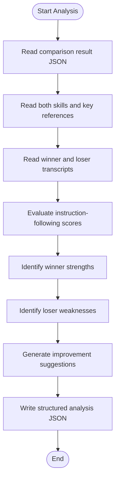

**Diagram sources**
- [analyzer.md](file://skills/skills/skill-creator/agents/analyzer.md)

**Section sources**
- [analyzer.md](file://skills/skills/skill-creator/agents/analyzer.md)

#### Comparator Agent
The Comparator performs a blind A/B comparison of two outputs, scoring them on a rubric and optionally on assertion pass rates, then determines a winner or tie.

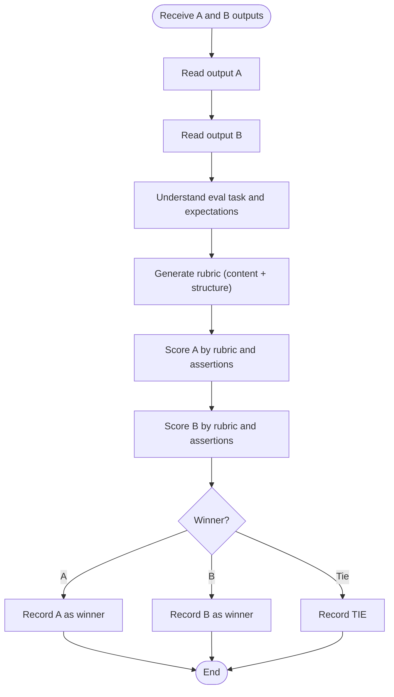

**Diagram sources**
- [comparator.md](file://skills/skills/skill-creator/agents/comparator.md)

**Section sources**
- [comparator.md](file://skills/skills/skill-creator/agents/comparator.md)

#### Grader Agent
The Grader evaluates expectations against transcripts and outputs, extracts and verifies claims, and critiques evaluation design to improve discriminating power.

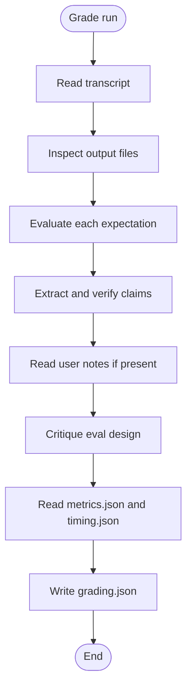

**Diagram sources**
- [grader.md](file://skills/skills/skill-creator/agents/grader.md)

**Section sources**
- [grader.md](file://skills/skills/skill-creator/agents/grader.md)

### Evaluation Pipeline

#### Trigger Evaluation and Optimization
The run_eval.py script tests whether a skill’s description triggers Claude for a set of queries, enabling optimization loops and reporting.

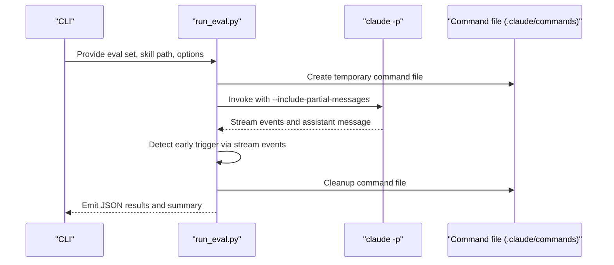

**Diagram sources**
- [run_eval.py](file://skills/skills/skill-creator/scripts/run_eval.py)

**Section sources**
- [run_eval.py](file://skills/skills/skill-creator/scripts/run_eval.py)

#### Benchmark Aggregation
The aggregate_benchmark.py script loads grading.json files from runs, computes per-metric statistics, and produces benchmark.json and benchmark.md summaries with deltas.

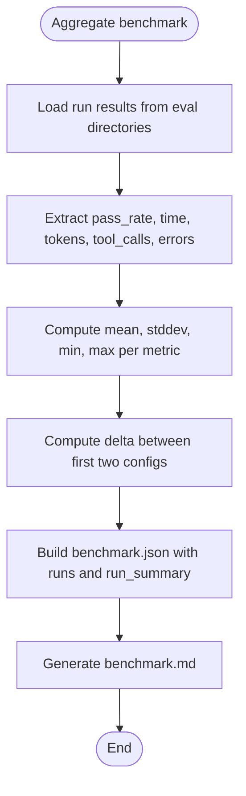

**Diagram sources**
- [aggregate_benchmark.py](file://skills/skills/skill-creator/scripts/aggregate_benchmark.py)

**Section sources**
- [aggregate_benchmark.py](file://skills/skills/skill-creator/scripts/aggregate_benchmark.py)

#### Report Generation for Description Optimization
The generate_report.py script renders an HTML report from run_loop.py output, showing train/test scores and per-query results for each iteration.

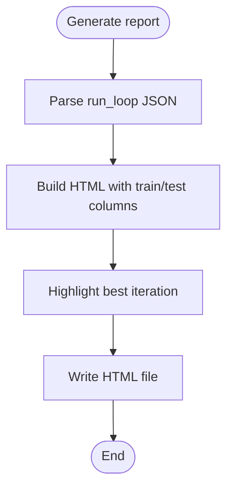

**Diagram sources**
- [generate_report.py](file://skills/skills/skill-creator/scripts/generate_report.py)

**Section sources**
- [generate_report.py](file://skills/skills/skill-creator/scripts/generate_report.py)

### Packaging and Distribution Utilities
The package_skill.py script validates a skill and packages it into a .skill archive, excluding build artifacts and evaluation directories.

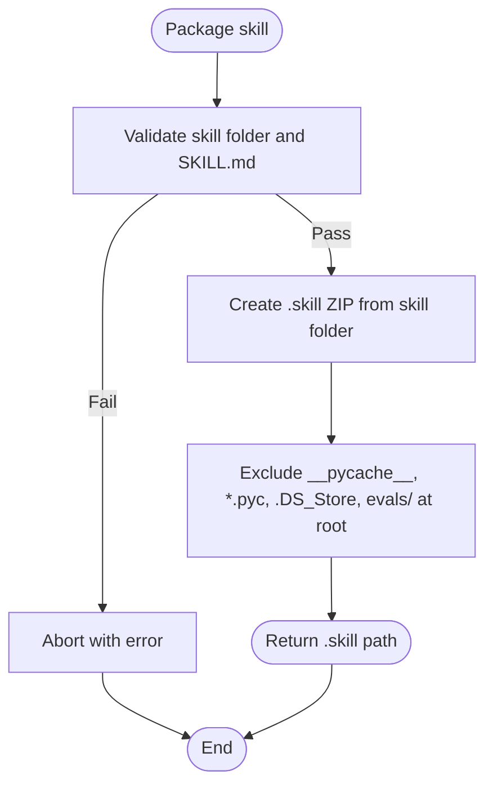

**Diagram sources**
- [package_skill.py](file://skills/skills/skill-creator/scripts/package_skill.py)

**Section sources**
- [package_skill.py](file://skills/skills/skill-creator/scripts/package_skill.py)

### Evaluation Viewer and Report Generation
The evaluation viewer integrates with the benchmark data to present:
- Outputs tab: prompts, rendered outputs, previous outputs (for iterations ≥ 2), formal grades, and feedback.
- Benchmark tab: pass rates, timing, tokens, per-eval breakdowns, and analyst observations.
- Static mode for headless environments and cowork setups.

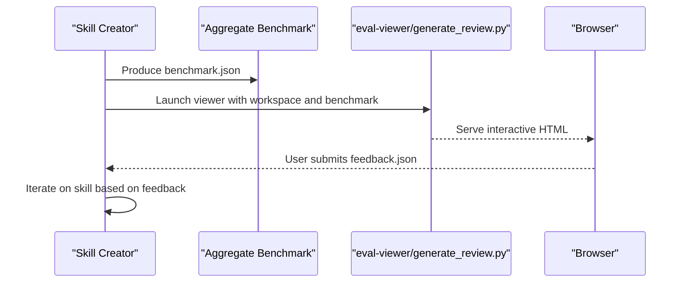

**Diagram sources**
- [SKILL.md](file://skills/skills/skill-creator/SKILL.md)
- [aggregate_benchmark.py](file://skills/skills/skill-creator/scripts/aggregate_benchmark.py)

**Section sources**
- [SKILL.md](file://skills/skills/skill-creator/SKILL.md)

## Dependency Analysis
The components collaborate as follows:
- SKILL.md defines the end-to-end workflow and references agent instructions and schemas.
- Analyzer and Comparator depend on agent instructions and transcripts/outputs.
- Grader depends on transcripts and outputs; it also influences evaluator design.
- aggregate_benchmark.py depends on grading.json and timing.json outputs.
- generate_report.py depends on run_loop.py output.
- package_skill.py depends on a valid skill folder and SKILL.md.

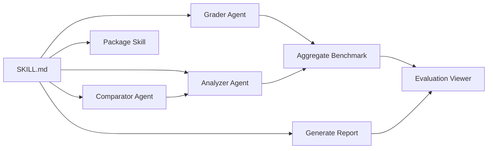

**Diagram sources**
- [SKILL.md](file://skills/skills/skill-creator/SKILL.md)
- [analyzer.md](file://skills/skills/skill-creator/agents/analyzer.md)
- [comparator.md](file://skills/skills/skill-creator/agents/comparator.md)
- [grader.md](file://skills/skills/skill-creator/agents/grader.md)
- [aggregate_benchmark.py](file://skills/skills/skill-creator/scripts/aggregate_benchmark.py)
- [generate_report.py](file://skills/skills/skill-creator/scripts/generate_report.py)
- [package_skill.py](file://skills/skills/skill-creator/scripts/package_skill.py)

**Section sources**
- [SKILL.md](file://skills/skills/skill-creator/SKILL.md)

## Performance Considerations
- Parallelism: The workflow encourages launching with-skill and baseline runs concurrently to finish around the same time, reducing total wall-clock time.
- Resource tracking: Capture timing and tokens immediately upon task completion notifications to avoid losing transient metrics.
- Determinism: Prefer deterministic scripts and controlled inputs to minimize variance; monitor per-eval variance and outliers.
- Scalability: Use aggregate_benchmark.py to summarize many runs efficiently; leverage deltas to compare configurations meaningfully.
- Headless environments: Use static viewer mode for non-graphical setups; ensure feedback collection via downloadable feedback.json.

[No sources needed since this section provides general guidance]

## Troubleshooting Guide
Common issues and remedies:
- Missing SKILL.md: Packaging fails if SKILL.md is absent; ensure the skill root contains a valid specification.
- Missing grading.json or timing.json: Aggregation will warn and skip runs; ensure grading and timing data are generated and persisted.
- Viewer not opening: In headless or no-display environments, use static mode to generate a standalone HTML file and open it externally.
- Trigger evaluation instability: Increase runs-per-query and adjust thresholds; ensure eval queries are realistic and representative.
- Assertion design: Weak or trivial assertions can mask failures; use grader feedback to refine expectations for discriminating power.

**Section sources**
- [package_skill.py](file://skills/skills/skill-creator/scripts/package_skill.py)
- [aggregate_benchmark.py](file://skills/skills/skill-creator/scripts/aggregate_benchmark.py)
- [SKILL.md](file://skills/skills/skill-creator/SKILL.md)
- [grader.md](file://skills/skills/skill-creator/agents/grader.md)

## Conclusion
The Skill Creator tools provide a robust, automated framework for skill development: designing clear specifications, validating with targeted evals, grading outputs rigorously, aggregating performance across runs, and presenting results for human review. Agents collaborate to ensure objective comparisons and actionable insights, while packaging and distribution utilities streamline sharing. Iterative improvement cycles—guided by quantitative metrics and qualitative feedback—yield high-quality, reliable skills.

[No sources needed since this section summarizes without analyzing specific files]

## Appendices

### Step-by-Step Guides

#### Skill Validation and Testing
- Draft or edit SKILL.md with clear intent, triggers, and outputs.
- Create evals.json with realistic prompts and initial assertions.
- Run with-skill and baseline subagents concurrently; capture timing.json immediately upon completion.
- Grade outputs with the Grader Agent; review grading.json and user notes.
- Aggregate benchmark.json and benchmark.md; review deltas and per-eval variance.
- Launch the evaluation viewer for interactive review and collect feedback.json.

**Section sources**
- [SKILL.md](file://skills/skills/skill-creator/SKILL.md)
- [grader.md](file://skills/skills/skill-creator/agents/grader.md)
- [aggregate_benchmark.py](file://skills/skills/skill-creator/scripts/aggregate_benchmark.py)

#### Improvement Workflow
- Use analyzer notes to identify patterns and anomalies across runs.
- Apply Comparator insights to understand why one version outperformed another.
- Refactor SKILL.md instructions, add missing tools/scripts/examples, and strengthen error handling.
- Re-run evals into a new iteration directory; keep baseline consistent (without_skill or previous iteration).
- Repeat until feedback is minimal and pass rates stabilize.

**Section sources**
- [analyzer.md](file://skills/skills/skill-creator/agents/analyzer.md)
- [comparator.md](file://skills/skills/skill-creator/agents/comparator.md)
- [SKILL.md](file://skills/skills/skill-creator/SKILL.md)

#### Description Optimization
- Generate trigger eval queries mixing should-trigger and should-not-trigger.
- Review and iterate on the eval set using the HTML template.
- Run the optimization loop with run_eval.py; monitor progress and scores.
- Apply the best description and regenerate the HTML report for final review.

**Section sources**
- [SKILL.md](file://skills/skills/skill-creator/SKILL.md)
- [run_eval.py](file://skills/skills/skill-creator/scripts/run_eval.py)
- [generate_report.py](file://skills/skills/skill-creator/scripts/generate_report.py)

#### Packaging and Distribution
- Validate the skill folder and SKILL.md.
- Package into a .skill archive; verify exclusions and artifact handling.
- Distribute the .skill file for installation and sharing.

**Section sources**
- [package_skill.py](file://skills/skills/skill-creator/scripts/package_skill.py)

### Agent Collaboration Patterns and Decision-Making
- Blind comparison: Comparator operates without knowledge of which skill produced outputs, ensuring unbiased evaluation.
- Post-hoc analysis: Analyzer unblinds results to extract actionable insights and prioritize improvements.
- Grading: Grader focuses on evidence-based pass/fail decisions and identifies gaps in eval design.
- Benchmarking: Aggregator computes robust statistics and deltas to highlight meaningful differences between configurations.

**Section sources**
- [comparator.md](file://skills/skills/skill-creator/agents/comparator.md)
- [analyzer.md](file://skills/skills/skill-creator/agents/analyzer.md)
- [grader.md](file://skills/skills/skill-creator/agents/grader.md)
- [aggregate_benchmark.py](file://skills/skills/skill-creator/scripts/aggregate_benchmark.py)