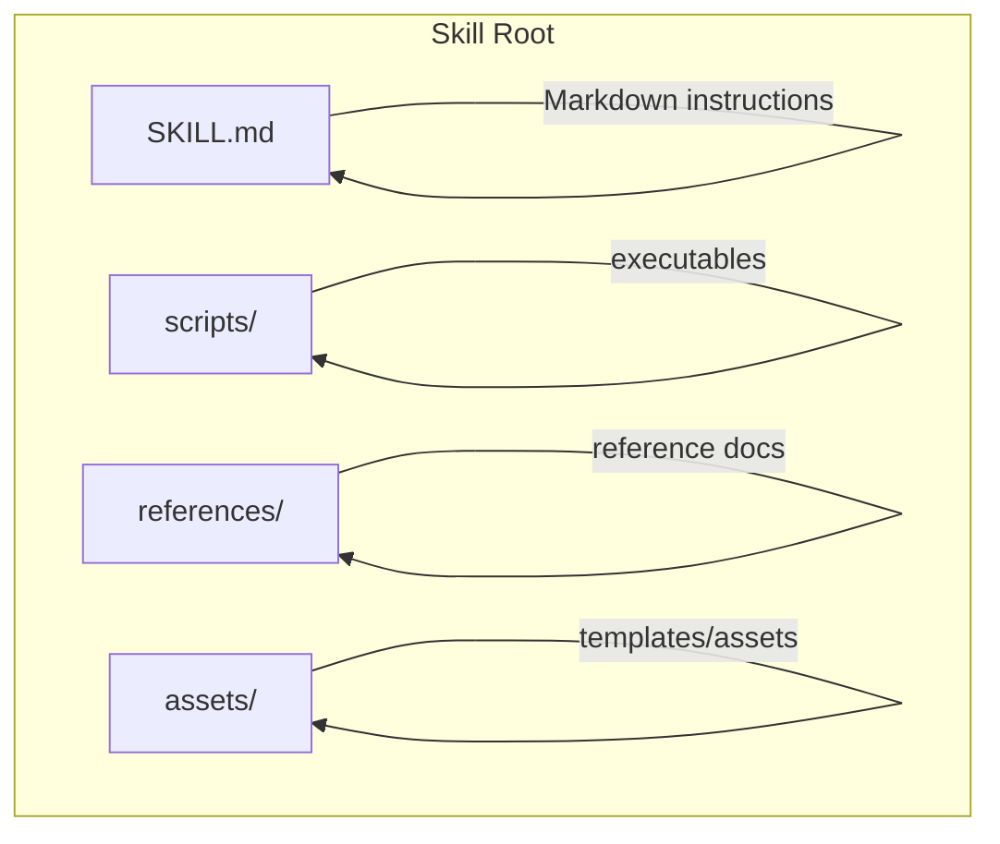
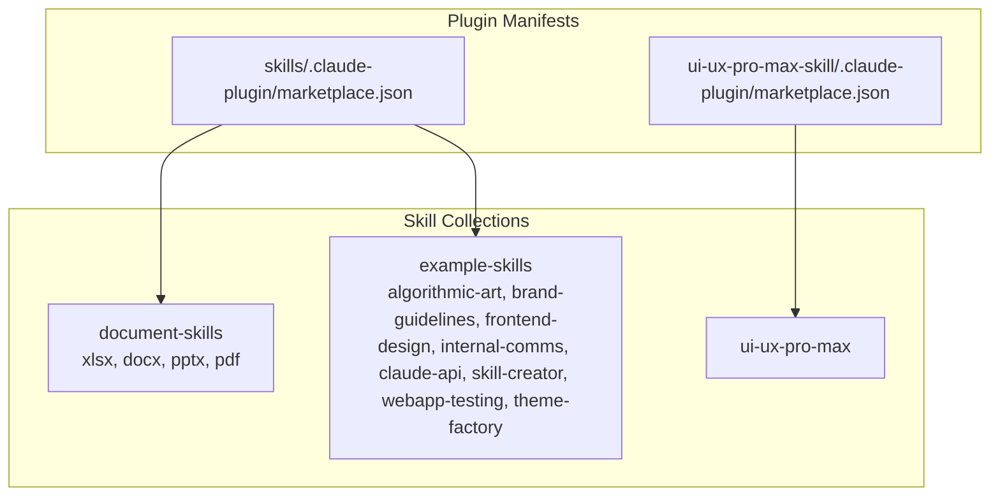
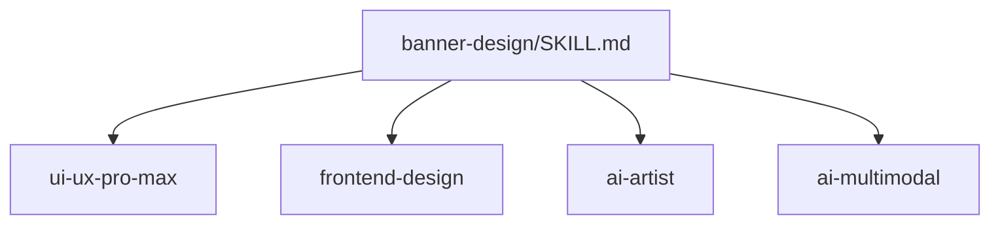

# Skill Specification

<cite>
**Referenced Files in This Document**
- [agent-skills-spec.md](file://skills/spec/agent-skills-spec.md)
- [SKILL.md](file://SKILL.md)
- [SKILL.md](file://skills/template/SKILL.md)
- [SKILL.md](file://skills/skills/algorithmic-art/SKILL.md)
- [SKILL.md](file://skills/skills/brand-guidelines/SKILL.md)
- [SKILL.md](file://skills/skills/claude-api/SKILL.md)
- [SKILL.md](file://skills/skills/frontend-design/SKILL.md)
- [SKILL.md](file://skills/skills/internal-comms/SKILL.md)
- [SKILL.md](file://skills/skills/pdf/SKILL.md)
- [SKILL.md](file://skills/skills/xlsx/SKILL.md)
- [SKILL.md](file://skills/skills/skill-creator/SKILL.md)
- [SKILL.md](file://skills/skills/webapp-testing/SKILL.md)
- [SKILL.md](file://skills/skills/theme-factory/SKILL.md)
- [marketplace.json](file://skills/.claude-plugin/marketplace.json)
- [marketplace.json](file://ui-ux-pro-max-skill/.claude-plugin/marketplace.json)
- [SKILL.md](file://ui-ux-pro-max-skill/.claude/skills/banner-design/SKILL.md)
</cite>

## Table of Contents
1. [Introduction](#introduction)
2. [Project Structure](#project-structure)
3. [Core Components](#core-components)
4. [Architecture Overview](#architecture-overview)
5. [Detailed Component Analysis](#detailed-component-analysis)
6. [Dependency Analysis](#dependency-analysis)
7. [Performance Considerations](#performance-considerations)
8. [Troubleshooting Guide](#troubleshooting-guide)
9. [Conclusion](#conclusion)
10. [Appendices](#appendices)

## Introduction
This document specifies the Agent Skills format and authoring guidelines used across the repository. It explains the SKILL.md file structure, YAML frontmatter requirements, instruction formatting standards, and metadata schema. It also documents skill discovery mechanisms, activation conditions, and integration patterns with the Claude skill system. The goal is to provide a consistent, accessible reference for authors to create, publish, and integrate skills effectively.

## Project Structure
The skills ecosystem is organized around a consistent per-skill directory structure. Each skill is a folder containing:
- SKILL.md: The primary instruction and metadata file
- Optional bundled resources:
  - scripts/: executable code for deterministic or repetitive tasks
  - references/: documentation loaded into context as needed
  - assets/: files used in outputs (templates, icons, fonts)

**Diagram sources**
- [SKILL.md:73-84](file://skills/skills/skill-creator/SKILL.md#L73-L84)

**Section sources**
- [SKILL.md:73-84](file://skills/skills/skill-creator/SKILL.md#L73-L84)

## Core Components
This section defines the canonical SKILL.md structure and metadata schema.

- File format: Markdown with a YAML frontmatter block delimited by ---
- Required frontmatter fields:
  - name: Unique skill identifier
  - description: Primary activation trigger and purpose; includes when to use and what the skill does
- Optional frontmatter fields (commonly used):
  - license: License reference or notice
  - metadata: Arbitrary metadata object (e.g., author, version)
  - argument-hint: Short hint for expected arguments
- Body content:
  - Clear headings and sections for activation guidance, instructions, examples, and references
  - Prefer imperative instructions and progressive disclosure
  - Keep SKILL.md concise; use references for extended content

Best practices:
- Activation-first language in description to maximize triggering accuracy
- Use progressive disclosure: metadata + short body + optional bundled resources
- Organize domain-specific variants under references/ with clear pointers
- Include examples and decision trees where helpful

**Section sources**
- [SKILL.md:1-19](file://SKILL.md#L1-L19)
- [SKILL.md:1-7](file://skills/template/SKILL.md#L1-L7)
- [SKILL.md:66-70](file://skills/skills/skill-creator/SKILL.md#L66-L70)
- [SKILL.md:95-98](file://skills/skills/skill-creator/SKILL.md#L95-L98)
- [SKILL.md:1-5](file://skills/skills/claude-api/SKILL.md#L1-L5)

## Architecture Overview
Skills are integrated into the Claude skill system via plugin manifests. The marketplace.json files declare collections of skills and their relationships to the host environment.

**Diagram sources**
- [marketplace.json:11-53](file://skills/.claude-plugin/marketplace.json#L11-L53)
- [marketplace.json:11-33](file://ui-ux-pro-max-skill/.claude-plugin/marketplace.json#L11-L33)

## Detailed Component Analysis

### SKILL.md Structure and Instruction Language
- YAML frontmatter: name, description (required), optional license, metadata, argument-hint
- Body sections:
  - When to use: explicit activation conditions and contexts
  - Instructions: step-by-step, imperative, with examples and decision trees
  - References: pointers to scripts/, references/, assets/
  - Keywords: optional list to aid discovery
- Instruction formatting standards:
  - Use headings and bullet lists for clarity
  - Include examples and pitfalls where appropriate
  - Prefer progressive disclosure to keep metadata + body small

Examples from the repository demonstrate:
- Activation-focused descriptions and structured instructions
- Decision trees for choosing approaches
- Bundled resource references for scripts and examples

**Section sources**
- [SKILL.md:1-5](file://skills/skills/claude-api/SKILL.md#L1-L5)
- [SKILL.md:84-104](file://skills/skills/claude-api/SKILL.md#L84-L104)
- [SKILL.md:16-33](file://skills/skills/webapp-testing/SKILL.md#L16-L33)
- [SKILL.md:11-26](file://skills/skills/frontend-design/SKILL.md#L11-L26)
- [SKILL.md:7-16](file://skills/skills/internal-comms/SKILL.md#L7-L16)
- [SKILL.md:13-27](file://skills/skills/pdf/SKILL.md#L13-L27)
- [SKILL.md:7-22](file://skills/skills/xlsx/SKILL.md#L7-L22)

### Metadata Schema
- name: Unique skill identifier
- description: Primary activation trigger; must include both purpose and when to use
- license: Optional license reference
- metadata: Optional arbitrary object (e.g., author, version)
- argument-hint: Optional hint for expected arguments

Notes:
- The description is the primary mechanism for triggering; make it pushy and specific
- metadata is supported in practice and can be used for author/versioning

**Section sources**
- [SKILL.md:1-5](file://SKILL.md#L1-L5)
- [SKILL.md:1-7](file://skills/template/SKILL.md#L1-L7)
- [SKILL.md:6-9](file://ui-ux-pro-max-skill/.claude/skills/banner-design/SKILL.md#L6-L9)

### Instruction Language Patterns and Organization
Common patterns observed across skills:
- Imperative instructions
- Progressive disclosure: metadata + short body + references
- Domain organization under references/ for multi-domain skills
- Decision trees for selecting approaches
- Examples and pitfalls
- Keywords for discovery

**Section sources**
- [SKILL.md:95-98](file://skills/skills/skill-creator/SKILL.md#L95-L98)
- [SKILL.md:16-33](file://skills/skills/webapp-testing/SKILL.md#L16-L33)
- [SKILL.md:11-26](file://skills/skills/frontend-design/SKILL.md#L11-L26)
- [SKILL.md:13-27](file://skills/skills/pdf/SKILL.md#L13-L27)

### Skill Template Structure and Best Practices
- Directory layout:
  - SKILL.md (required)
  - scripts/ (optional)
  - references/ (optional)
  - assets/ (optional)
- Best practices:
  - Keep SKILL.md under 500 lines; add hierarchy and pointers for longer content
  - Reference files clearly from SKILL.md
  - For large references (>300 lines), include a table of contents
  - Use domain organization for multi-domain skills
  - Principle of lack of surprise: no malicious or compromising content
  - Writing style: prefer imperative form; explain why, not just what

**Section sources**
- [SKILL.md:73-84](file://skills/skills/skill-creator/SKILL.md#L73-L84)
- [SKILL.md:95-98](file://skills/skills/skill-creator/SKILL.md#L95-L98)
- [SKILL.md:111-114](file://skills/skills/skill-creator/SKILL.md#L111-L114)
- [SKILL.md:137-139](file://skills/skills/skill-creator/SKILL.md#L137-L139)

### Skill Discovery Mechanisms and Activation Conditions
- Discovery:
  - Skills are declared in plugin manifests (marketplace.json)
  - Collections group related skills (e.g., document-skills, example-skills)
- Activation:
  - The description field is the primary trigger mechanism
  - Complex, multi-step, or specialized queries reliably trigger skills
  - Simple one-step queries may not trigger even if the description matches
- Optimization:
  - Trigger eval queries should be substantive enough to benefit from a skill
  - Optimize description for triggering accuracy using eval sets

**Section sources**
- [marketplace.json:11-53](file://skills/.claude-plugin/marketplace.json#L11-L53)
- [SKILL.md:396-401](file://skills/skills/skill-creator/SKILL.md#L396-L401)
- [SKILL.md:333-348](file://skills/skills/skill-creator/SKILL.md#L333-L348)

### Integration Patterns with Claude’s Skill System
- Plugin manifests:
  - Define plugins and their associated skills
  - Support metadata, keywords, category, and strict mode
- Skill collections:
  - Group related skills for discoverability
- Cross-skill references:
  - Skills reference other skills (e.g., banner-design references ui-ux-pro-max, frontend-design, ai-artist, ai-multimodal)
- Output conventions:
  - Consistent file naming and asset organization (e.g., banner design output path conventions)

**Section sources**
- [marketplace.json:11-33](file://ui-ux-pro-max-skill/.claude-plugin/marketplace.json#L11-L33)
- [SKILL.md:51-57](file://ui-ux-pro-max-skill/.claude/skills/banner-design/SKILL.md#L51-L57)
- [SKILL.md:120-132](file://ui-ux-pro-max-skill/.claude/skills/banner-design/SKILL.md#L120-L132)

## Dependency Analysis
Skills depend on each other and on external tools. The banner design skill illustrates cross-skill dependencies and tool usage.

**Diagram sources**
- [SKILL.md:38-57](file://ui-ux-pro-max-skill/.claude/skills/banner-design/SKILL.md#L38-L57)

**Section sources**
- [SKILL.md:38-57](file://ui-ux-pro-max-skill/.claude/skills/banner-design/SKILL.md#L38-L57)

## Performance Considerations
- Keep SKILL.md concise to minimize context load
- Use references for extended content
- Bundle deterministic scripts under scripts/ to avoid re-inventing the wheel
- Prefer black-box scripts for complex workflows to avoid polluting context windows

**Section sources**
- [SKILL.md:95-98](file://skills/skills/skill-creator/SKILL.md#L95-L98)
- [SKILL.md:11-14](file://skills/skills/webapp-testing/SKILL.md#L11-L14)

## Troubleshooting Guide
Common issues and resolutions:
- Overly generic descriptions: Optimize for triggering accuracy using eval sets
- Missing activation: Ensure description includes both purpose and when to use
- Long SKILL.md: Move content to references/ and use progressive disclosure
- Poor cross-skill integration: Clearly reference dependent skills and resources
- Script usage: Always run scripts with --help first to understand usage

**Section sources**
- [SKILL.md:333-348](file://skills/skills/skill-creator/SKILL.md#L333-L348)
- [SKILL.md:11-14](file://skills/skills/webapp-testing/SKILL.md#L11-L14)

## Conclusion
The Agent Skills specification provides a consistent, extensible format for authoring skills that integrate seamlessly with the Claude skill system. By adhering to the SKILL.md structure, frontmatter schema, instruction patterns, and integration guidelines, authors can create robust, discoverable, and maintainable skills that enhance agent capabilities across diverse domains.

## Appendices

### Appendix A: Canonical SKILL.md Template
- Frontmatter:
  - name: <unique-skill-id>
  - description: <primary activation trigger and purpose>
  - license: <optional>
  - metadata: <optional>
  - argument-hint: <optional>
- Body:
  - When to use
  - Instructions
  - References
  - Keywords (optional)

**Section sources**
- [SKILL.md:1-5](file://SKILL.md#L1-L5)
- [SKILL.md:1-7](file://skills/template/SKILL.md#L1-L7)

### Appendix B: Representative Skill Bodies
- Algorithmic art: Multi-phase workflow with templates and examples
- Brand guidelines: Color and typography standards
- Claude API: Language detection, surfaces, architecture, and best practices
- Frontend design: Aesthetic guidelines and implementation focus
- Internal communications: Formats and examples
- PDF: Quick start, libraries, and common tasks
- XLSX: Requirements, workflows, and formula best practices
- Webapp testing: Decision trees and Playwright usage
- Theme factory: Theme application and customization

**Section sources**
- [SKILL.md:1-405](file://skills/skills/algorithmic-art/SKILL.md#L1-L405)
- [SKILL.md:1-74](file://skills/skills/brand-guidelines/SKILL.md#L1-L74)
- [SKILL.md:1-263](file://skills/skills/claude-api/SKILL.md#L1-L263)
- [SKILL.md:1-43](file://skills/skills/frontend-design/SKILL.md#L1-L43)
- [SKILL.md:1-33](file://skills/skills/internal-comms/SKILL.md#L1-L33)
- [SKILL.md:1-315](file://skills/skills/pdf/SKILL.md#L1-L315)
- [SKILL.md:1-292](file://skills/skills/xlsx/SKILL.md#L1-L292)
- [SKILL.md:1-96](file://skills/skills/webapp-testing/SKILL.md#L1-L96)
- [SKILL.md:1-60](file://skills/skills/theme-factory/SKILL.md#L1-L60)

### Appendix C: Skill Discovery and Manifests
- Plugin manifests declare skills and collections
- Example collections: document-skills, example-skills, ui-ux-pro-max
- Cross-skill references enable modular composition

**Section sources**
- [marketplace.json:11-53](file://skills/.claude-plugin/marketplace.json#L11-L53)
- [marketplace.json:11-33](file://ui-ux-pro-max-skill/.claude-plugin/marketplace.json#L11-L33)