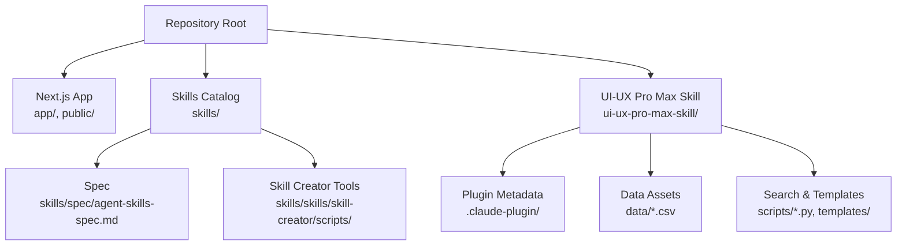
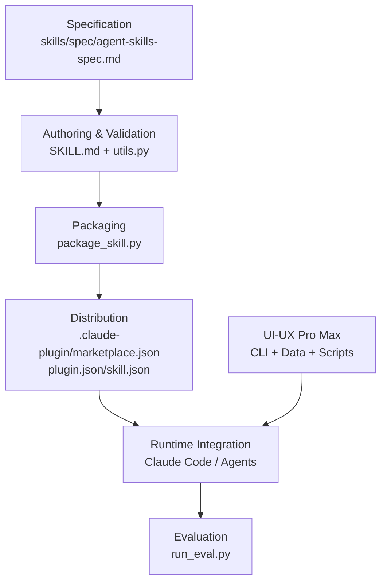
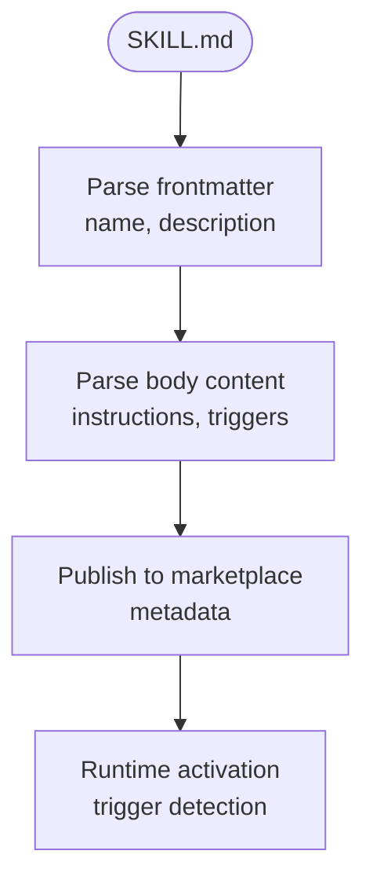
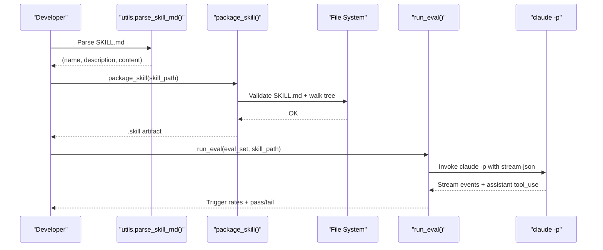
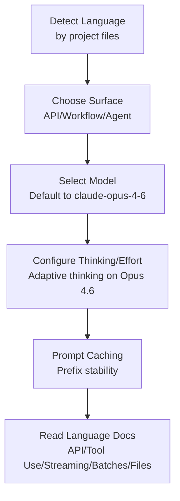
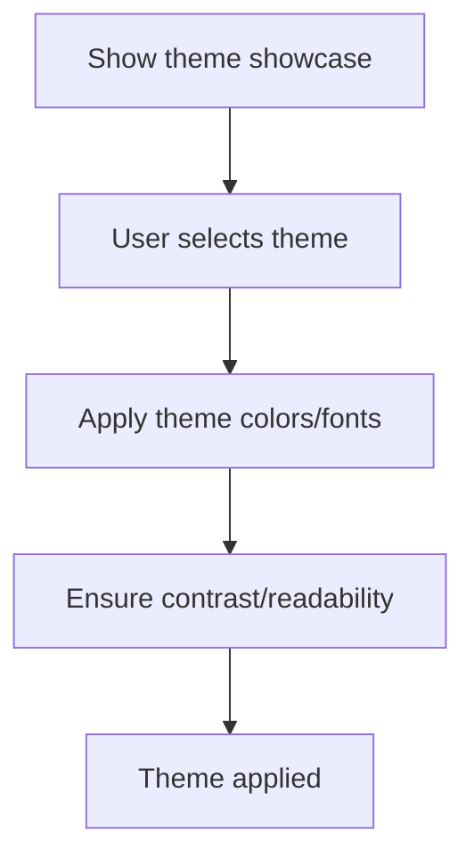
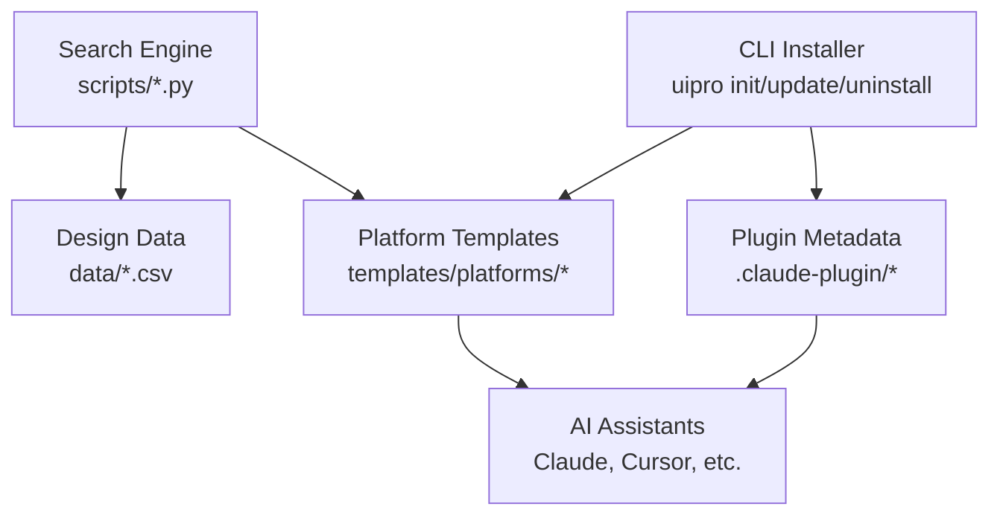
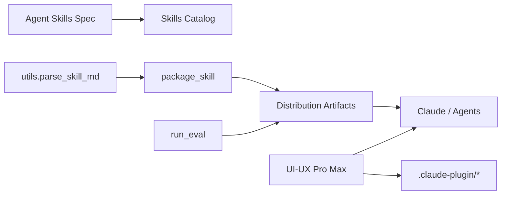

# Skill System

<cite>
**Referenced Files in This Document**
- [README.md](file://README.md)
- [SKILL.md](file://SKILL.md)
- [agent-skills-spec.md](file://skills/spec/agent-skills-spec.md)
- [SKILL.md (UI-UX Pro Max)](file://ui-ux-pro-max-skill/README.md)
- [SKILL.md (Claude API)](file://skills/skills/claude-api/SKILL.md)
- [SKILL.md (Theme Factory)](file://skills/skills/theme-factory/SKILL.md)
- [package_skill.py](file://skills/skills/skill-creator/scripts/package_skill.py)
- [run_eval.py](file://skills/skills/skill-creator/scripts/run_eval.py)
- [utils.py](file://skills/skills/skill-creator/scripts/utils.py)
- [plugin.json](file://ui-ux-pro-max-skill/.claude-plugin/plugin.json)
- [marketplace.json](file://ui-ux-pro-max-skill/.claude-plugin/marketplace.json)
- [skill.json](file://ui-ux-pro-max-skill/skill.json)
</cite>

## Table of Contents
1. [Introduction](#introduction)
2. [Project Structure](#project-structure)
3. [Core Components](#core-components)
4. [Architecture Overview](#architecture-overview)
5. [Detailed Component Analysis](#detailed-component-analysis)
6. [Dependency Analysis](#dependency-analysis)
7. [Performance Considerations](#performance-considerations)
8. [Troubleshooting Guide](#troubleshooting-guide)
9. [Conclusion](#conclusion)
10. [Appendices](#appendices)

## Introduction
This document describes the Skill System architecture and implementation across two ecosystems:
- The general skill-based plugin framework used by Claude and compatible agents, including the skill specification format, packaging, distribution, and evaluation mechanisms.
- The UI-UX Pro Max skill ecosystem, which provides a comprehensive design intelligence system with CLI installation, dynamic template generation, and a large dataset of design rules and styles.

It explains how skills are authored, validated, packaged, evaluated, and distributed, and how the UI-UX Pro Max skill integrates with Claude’s marketplace and CLI to deliver a scalable, templated skill experience.

## Project Structure
The repository is organized around:
- A root Next.js application scaffold (used here as a development host).
- A skills catalog containing multiple skills, each with a standardized SKILL.md specification and optional assets.
- A UI-UX Pro Max skill ecosystem with its own CLI, data assets, scripts, and platform-specific templates.

**Diagram sources**
- [README.md](file://README.md)
- [agent-skills-spec.md](file://skills/spec/agent-skills-spec.md)
- [SKILL.md (UI-UX Pro Max)](file://ui-ux-pro-max-skill/README.md)

**Section sources**
- [README.md](file://README.md)
- [agent-skills-spec.md](file://skills/spec/agent-skills-spec.md)

## Core Components
- Skill specification format: Each skill defines metadata and instructions in a SKILL.md file with frontmatter and structured content. The spec is maintained externally and skills reference it.
- Skill creator tools: Utilities for validating, packaging, and evaluating skills.
- Claude API skill: A skill that guides Claude users to integrate with the Claude API and Agent SDKs, with language-specific guidance and best practices.
- Theme Factory skill: A skill that applies curated themes to presentation artifacts.
- UI-UX Pro Max skill: A large-scale skill with CLI, data assets, and platform-specific templates, integrated with Claude marketplace and plugin metadata.

**Section sources**
- [SKILL.md](file://SKILL.md)
- [agent-skills-spec.md](file://skills/spec/agent-skills-spec.md)
- [SKILL.md (Claude API)](file://skills/skills/claude-api/SKILL.md)
- [SKILL.md (Theme Factory)](file://skills/skills/theme-factory/SKILL.md)
- [SKILL.md (UI-UX Pro Max)](file://ui-ux-pro-max-skill/README.md)

## Architecture Overview
The Skill System follows a layered architecture:
- Specification layer: Defines the skill contract and metadata schema.
- Authoring and validation layer: Ensures skills meet quality and completeness standards.
- Packaging and distribution layer: Produces portable skill artifacts and registers them with marketplace metadata.
- Execution and evaluation layer: Tests skill trigger behavior and performance characteristics.
- UI-UX Pro Max extension: Adds a CLI, data-driven design reasoning, and platform-specific template generation.

**Diagram sources**
- [agent-skills-spec.md](file://skills/spec/agent-skills-spec.md)
- [utils.py](file://skills/skills/skill-creator/scripts/utils.py)
- [package_skill.py](file://skills/skills/skill-creator/scripts/package_skill.py)
- [run_eval.py](file://skills/skills/skill-creator/scripts/run_eval.py)
- [marketplace.json](file://ui-ux-pro-max-skill/.claude-plugin/marketplace.json)
- [plugin.json](file://ui-ux-pro-max-skill/.claude-plugin/plugin.json)
- [skill.json](file://ui-ux-pro-max-skill/skill.json)
- [SKILL.md (UI-UX Pro Max)](file://ui-ux-pro-max-skill/README.md)

## Detailed Component Analysis

### Skill Specification Format
- Each skill includes a SKILL.md with YAML frontmatter specifying name and description, followed by usage instructions and decision logic for when the skill should trigger.
- The external specification document points to the authoritative spec location.

**Diagram sources**
- [SKILL.md](file://SKILL.md)
- [agent-skills-spec.md](file://skills/spec/agent-skills-spec.md)

**Section sources**
- [SKILL.md](file://SKILL.md)
- [agent-skills-spec.md](file://skills/spec/agent-skills-spec.md)

### Skill Creator Tools
- Parsing utilities: Extract name, description, and full content from SKILL.md.
- Packaging: Validates a skill directory, excludes build artifacts, and produces a .skill archive.
- Evaluation: Triggers a skill via a temporary command file and measures whether Claude reads or invokes the skill for a given query set.

**Diagram sources**
- [utils.py](file://skills/skills/skill-creator/scripts/utils.py)
- [package_skill.py](file://skills/skills/skill-creator/scripts/package_skill.py)
- [run_eval.py](file://skills/skills/skill-creator/scripts/run_eval.py)

**Section sources**
- [utils.py](file://skills/skills/skill-creator/scripts/utils.py)
- [package_skill.py](file://skills/skills/skill-creator/scripts/package_skill.py)
- [run_eval.py](file://skills/skills/skill-creator/scripts/run_eval.py)

### Claude API Skill
- Provides language detection heuristics and guidance for choosing the right surface (single API call, workflow, agent).
- Includes model selection guidance, thinking/effort configuration, prompt caching, and compaction notes.
- Guides reading of language-specific documentation and shared concepts.

**Diagram sources**
- [SKILL.md (Claude API)](file://skills/skills/claude-api/SKILL.md)

**Section sources**
- [SKILL.md (Claude API)](file://skills/skills/claude-api/SKILL.md)

### Theme Factory Skill
- Offers a curated set of 10 professional themes with color palettes and font pairings.
- Guides applying themes to artifacts and supports creating custom themes.

**Diagram sources**
- [SKILL.md (Theme Factory)](file://skills/skills/theme-factory/SKILL.md)

**Section sources**
- [SKILL.md (Theme Factory)](file://skills/skills/theme-factory/SKILL.md)

### UI-UX Pro Max Skill Ecosystem
- CLI-driven installation across multiple AI assistants with platform-specific templates.
- Data-driven design reasoning engine with 161 industry rules, 67 UI styles, 161 color palettes, and 57 font pairings.
- Persistent design system storage with master and page-specific overrides.
- Plugin metadata for marketplace integration.

**Diagram sources**
- [SKILL.md (UI-UX Pro Max)](file://ui-ux-pro-max-skill/README.md)
- [plugin.json](file://ui-ux-pro-max-skill/.claude-plugin/plugin.json)
- [marketplace.json](file://ui-ux-pro-max-skill/.claude-plugin/marketplace.json)
- [skill.json](file://ui-ux-pro-max-skill/skill.json)

**Section sources**
- [SKILL.md (UI-UX Pro Max)](file://ui-ux-pro-max-skill/README.md)
- [plugin.json](file://ui-ux-pro-max-skill/.claude-plugin/plugin.json)
- [marketplace.json](file://ui-ux-pro-max-skill/.claude-plugin/marketplace.json)
- [skill.json](file://ui-ux-pro-max-skill/skill.json)

## Dependency Analysis
- Specification dependency: Skills depend on the external agent skills specification for format and semantics.
- Creator tool dependencies: Packaging and evaluation rely on the presence of SKILL.md and a minimal set of exclusion rules for build artifacts.
- UI-UX Pro Max depends on CLI assets, CSV datasets, and platform templates; plugin metadata ties it to marketplace and runtime environments.

**Diagram sources**
- [agent-skills-spec.md](file://skills/spec/agent-skills-spec.md)
- [utils.py](file://skills/skills/skill-creator/scripts/utils.py)
- [package_skill.py](file://skills/skills/skill-creator/scripts/package_skill.py)
- [run_eval.py](file://skills/skills/skill-creator/scripts/run_eval.py)
- [SKILL.md (UI-UX Pro Max)](file://ui-ux-pro-max-skill/README.md)
- [plugin.json](file://ui-ux-pro-max-skill/.claude-plugin/plugin.json)

**Section sources**
- [agent-skills-spec.md](file://skills/spec/agent-skills-spec.md)
- [utils.py](file://skills/skills/skill-creator/scripts/utils.py)
- [package_skill.py](file://skills/skills/skill-creator/scripts/package_skill.py)
- [run_eval.py](file://skills/skills/skill-creator/scripts/run_eval.py)
- [SKILL.md (UI-UX Pro Max)](file://ui-ux-pro-max-skill/README.md)
- [plugin.json](file://ui-ux-pro-max-skill/.claude-plugin/plugin.json)

## Performance Considerations
- Packaging excludes build artifacts and temporary files to minimize artifact size and speed up distribution.
- Evaluation uses streaming JSON and partial message detection to reduce latency and improve responsiveness during trigger testing.
- UI-UX Pro Max leverages CSV datasets and parallelized search to quickly retrieve relevant design rules and styles.

[No sources needed since this section provides general guidance]

## Troubleshooting Guide
- Missing SKILL.md: Packaging and evaluation scripts require a valid SKILL.md; ensure frontmatter is present and properly formatted.
- Validation failures: Fix reported validation errors before packaging.
- Trigger evaluation timeouts: Increase timeout or adjust worker count depending on environment constraints.
- CLI installation issues: Confirm Python availability and use supported AI assistant identifiers for installation.

**Section sources**
- [package_skill.py](file://skills/skills/skill-creator/scripts/package_skill.py)
- [run_eval.py](file://skills/skills/skill-creator/scripts/run_eval.py)
- [SKILL.md (UI-UX Pro Max)](file://ui-ux-pro-max-skill/README.md)

## Conclusion
The Skill System provides a robust, extensible framework for authoring, validating, packaging, distributing, and evaluating skills. The UI-UX Pro Max skill demonstrates advanced capabilities through a CLI, data-driven design reasoning, and platform-specific template generation, integrating seamlessly with Claude’s marketplace and runtime environments.

[No sources needed since this section summarizes without analyzing specific files]

## Appendices

### Appendix A: Skill Development Workflow
- Author: Write SKILL.md with frontmatter and instructions.
- Validate: Use parsing utilities to confirm format.
- Package: Produce a .skill artifact for distribution.
- Evaluate: Run trigger evaluation against representative queries.
- Distribute: Publish to marketplace with plugin metadata.

**Section sources**
- [utils.py](file://skills/skills/skill-creator/scripts/utils.py)
- [package_skill.py](file://skills/skills/skill-creator/scripts/package_skill.py)
- [run_eval.py](file://skills/skills/skill-creator/scripts/run_eval.py)
- [marketplace.json](file://ui-ux-pro-max-skill/.claude-plugin/marketplace.json)
- [plugin.json](file://ui-ux-pro-max-skill/.claude-plugin/plugin.json)

### Appendix B: UI-UX Pro Max Deployment
- Install CLI globally and initialize for target AI assistants.
- Use design system commands to generate and persist design systems.
- Leverage platform templates for consistent skill behavior across assistants.

**Section sources**
- [SKILL.md (UI-UX Pro Max)](file://ui-ux-pro-max-skill/README.md)
- [skill.json](file://ui-ux-pro-max-skill/skill.json)