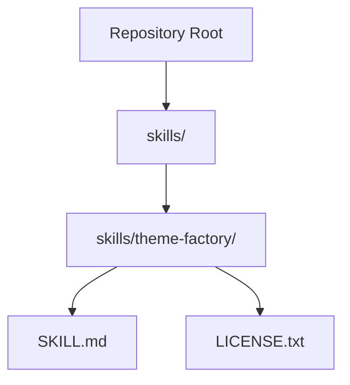
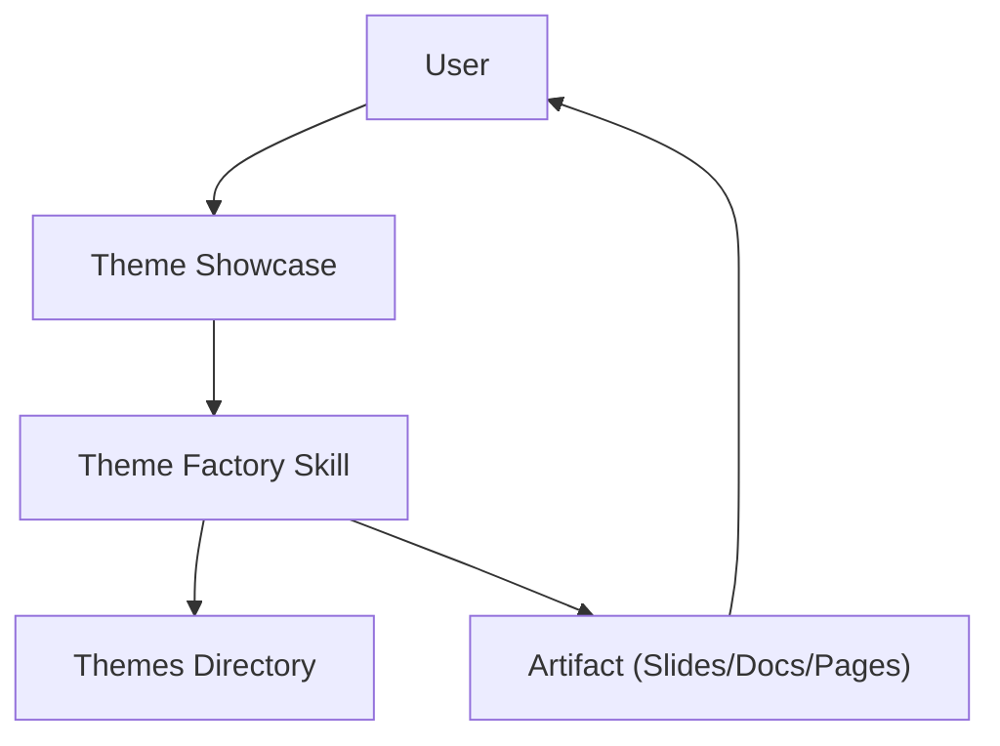
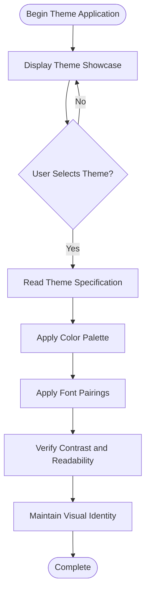
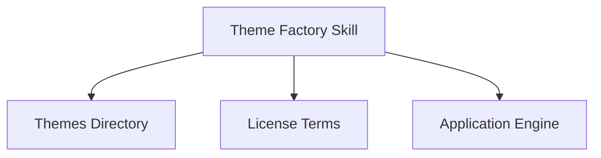

# Theme Factory System

<cite>
**Referenced Files in This Document**
- [SKILL.md](file://skills/skills/theme-factory/SKILL.md)
- [LICENSE.txt](file://skills/skills/theme-factory/LICENSE.txt)
</cite>

## Table of Contents
1. [Introduction](#introduction)
2. [Project Structure](#project-structure)
3. [Core Components](#core-components)
4. [Architecture Overview](#architecture-overview)
5. [Detailed Component Analysis](#detailed-component-analysis)
6. [Dependency Analysis](#dependency-analysis)
7. [Performance Considerations](#performance-considerations)
8. [Troubleshooting Guide](#troubleshooting-guide)
9. [Conclusion](#conclusion)

## Introduction
The Theme Factory system is a curated toolkit designed to apply consistent, professional styling to presentation slide decks and other visual artifacts. It provides a collection of ten pre-defined themes, each featuring a cohesive color palette and complementary font pairings. Users can select a theme from the showcase, apply it to their content, and maintain visual consistency across all slides. The system also supports creating custom themes tailored to specific branding needs.

## Project Structure
The Theme Factory skill resides under the skills directory and includes a concise skill definition and licensing information. The primary documentation outlines the available themes, application process, and guidelines for creating custom themes.

**Diagram sources**
- [SKILL.md:1-60](file://skills/skills/theme-factory/SKILL.md#L1-L60)
- [LICENSE.txt](file://skills/skills/theme-factory/LICENSE.txt)

**Section sources**
- [SKILL.md:1-60](file://skills/skills/theme-factory/SKILL.md#L1-L60)

## Core Components
The Theme Factory skill defines a set of professional themes and provides usage instructions for applying them to artifacts. The core components include:

- Pre-defined themes: Ten distinct themes covering diverse aesthetics such as maritime, sunset, forest, minimalism, autumn, winter, desert, technology, botanical, and cosmic.
- Theme specification: Each theme includes a cohesive color palette with hex codes and complementary font pairings for headers and body text.
- Application process: A four-step workflow for selecting, reading, applying, and verifying theme consistency across an artifact.
- Custom theme creation: Guidance for generating new themes based on provided inputs while maintaining visual coherence.

Key usage instructions emphasize displaying the theme showcase, obtaining explicit user selection, and applying colors and fonts consistently with proper contrast and readability.

**Section sources**
- [SKILL.md:10-60](file://skills/skills/theme-factory/SKILL.md#L10-L60)

## Architecture Overview
The Theme Factory skill operates as a standalone module within the broader skills ecosystem. Its architecture focuses on theme definition, user interaction, and artifact application. The system does not define internal implementation details for theme generation or application logic; instead, it provides a clear specification for how themes should be structured and applied.

[No sources needed since this diagram shows conceptual workflow, not actual code structure]

## Detailed Component Analysis

### Theme Collection and Specification
The Theme Factory skill enumerates ten themes, each with a descriptive name and brief context. While the skill documentation lists the themes, the actual theme specifications (color palettes and fonts) are referenced from the themes directory. The skill emphasizes that each theme includes:
- A cohesive color palette with hex codes
- Complementary font pairings for headers and body text
- A distinct visual identity suitable for different contexts and audiences

These specifications guide consistent application across artifacts.

**Section sources**
- [SKILL.md:28-48](file://skills/skills/theme-factory/SKILL.md#L28-L48)

### Application Workflow
The application process is structured into four steps:
1. Display the theme showcase for visual selection.
2. Obtain explicit confirmation of the chosen theme.
3. Read the corresponding theme file from the themes directory.
4. Apply the specified colors and fonts consistently throughout the artifact, ensuring proper contrast and readability, and maintaining the theme's visual identity across all slides.

This workflow ensures predictable and professional results.

**Section sources**
- [SKILL.md:50-56](file://skills/skills/theme-factory/SKILL.md#L50-L56)

### Custom Theme Creation
When existing themes do not meet specific requirements, the skill supports creating custom themes. The process involves:
- Generating a new theme similar to existing ones based on provided inputs.
- Selecting appropriate colors and fonts that reflect the theme’s concept.
- Reviewing and verifying the generated theme before application.

This capability enables brand adaptation and tailored design systems.

**Section sources**
- [SKILL.md:58-60](file://skills/skills/theme-factory/SKILL.md#L58-L60)

### Conceptual Overview
The Theme Factory skill provides a framework for consistent visual styling. It does not implement specific theme generation algorithms or application engines; rather, it defines the structure and process for theme usage. This separation allows flexibility in implementation while preserving design system integrity.

[No sources needed since this diagram shows conceptual workflow, not actual code structure]

## Dependency Analysis
The Theme Factory skill depends on external theme specifications stored in the themes directory. The skill itself does not define the implementation for theme generation or application; it relies on the presence of properly formatted theme files and a clear application process. Licensing terms are defined in the accompanying license file.

[No sources needed since this diagram shows conceptual relationships, not specific code structure]

**Section sources**
- [SKILL.md:1-60](file://skills/skills/theme-factory/SKILL.md#L1-L60)
- [LICENSE.txt](file://skills/skills/theme-factory/LICENSE.txt)

## Performance Considerations
- Theme selection and application should be efficient to avoid delays in user workflows.
- Consistent color and font application across artifacts helps maintain readability and reduces rework.
- Proper contrast and readability checks prevent accessibility issues and reduce the need for revisions.

[No sources needed since this section provides general guidance]

## Troubleshooting Guide
Common issues and resolutions:
- Incorrect theme application: Ensure the selected theme file is read and applied consistently across all slides.
- Poor contrast or readability: Verify that color choices meet accessibility standards and that font pairings are legible.
- Inconsistent visual identity: Maintain the theme’s intended aesthetic across all artifact elements.

**Section sources**
- [SKILL.md:50-56](file://skills/skills/theme-factory/SKILL.md#L50-L56)

## Conclusion
The Theme Factory skill offers a streamlined approach to applying professional themes to visual artifacts. By providing a curated set of ten themes, clear application instructions, and support for custom theme creation, it enables consistent, accessible, and contextually appropriate design systems. The modular structure allows teams to adapt themes to brand guidelines while maintaining visual coherence across presentations and documents.