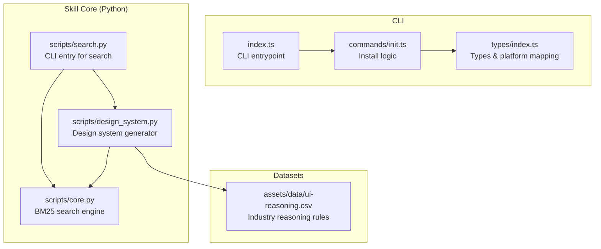
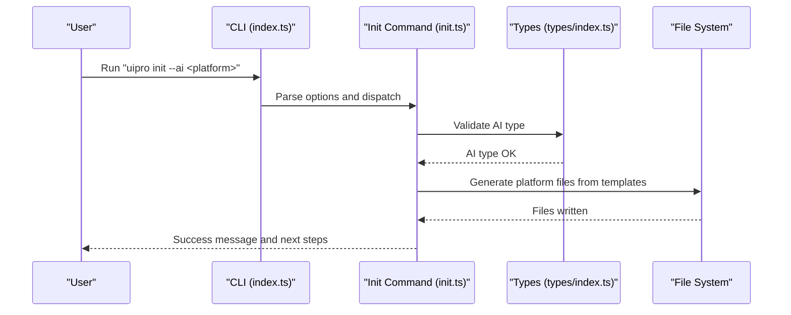
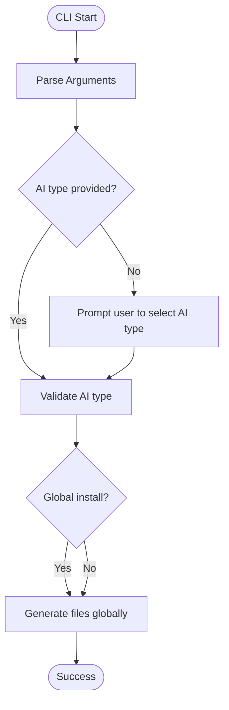
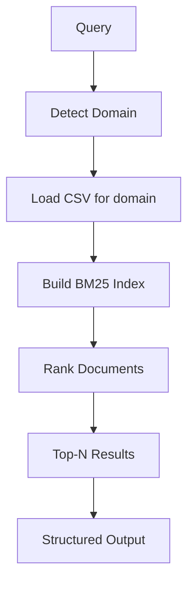
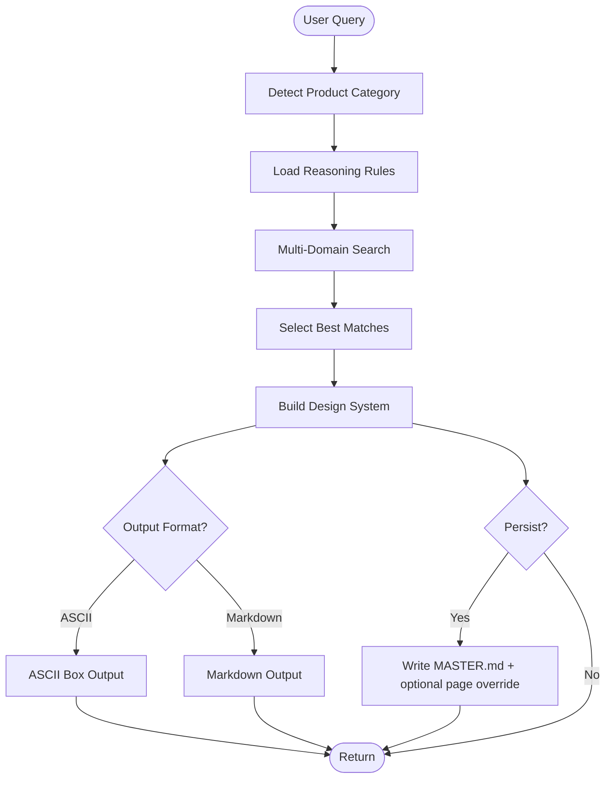
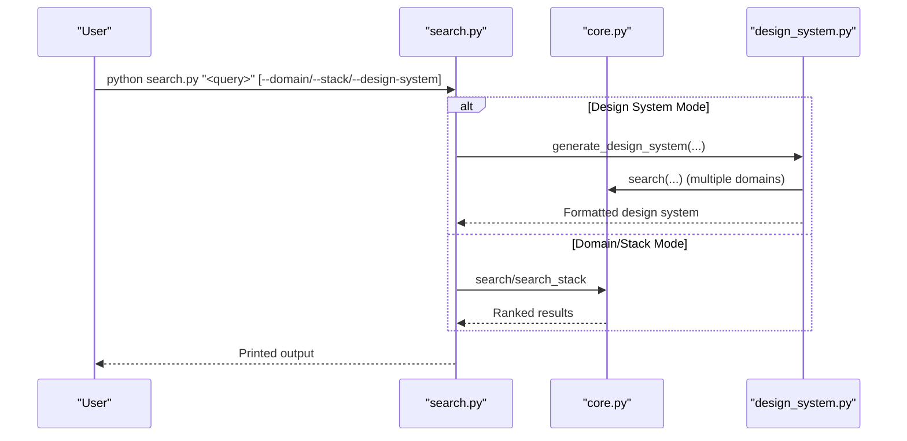
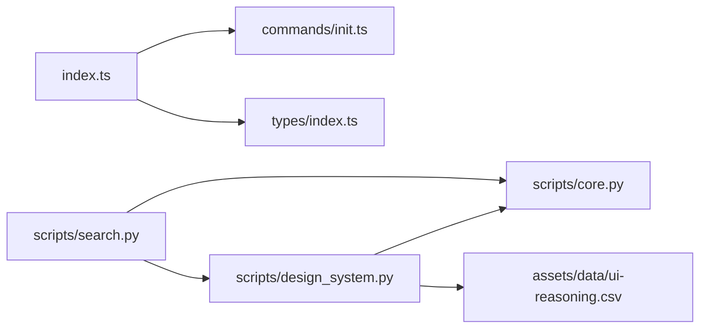

# UI-UX Pro Max Skill

<cite>
**Referenced Files in This Document**
- [README.md](file://ui-ux-pro-max-skill/README.md)
- [skill.json](file://ui-ux-pro-max-skill/skill.json)
- [index.ts](file://ui-ux-pro-max-skill/cli/src/index.ts)
- [types/index.ts](file://ui-ux-pro-max-skill/cli/src/types/index.ts)
- [commands/init.ts](file://ui-ux-pro-max-skill/cli/src/commands/init.ts)
- [scripts/core.py](file://ui-ux-pro-max-skill/src/ui-ux-pro-max/scripts/core.py)
- [scripts/design_system.py](file://ui-ux-pro-max-skill/src/ui-ux-pro-max/scripts/design_system.py)
- [scripts/search.py](file://ui-ux-pro-max-skill/src/ui-ux-pro-max/scripts/search.py)
- [assets/data/ui-reasoning.csv](file://ui-ux-pro-max-skill/cli/assets/data/ui-reasoning.csv)
</cite>

## Table of Contents
1. [Introduction](#introduction)
2. [Project Structure](#project-structure)
3. [Core Components](#core-components)
4. [Architecture Overview](#architecture-overview)
5. [Detailed Component Analysis](#detailed-component-analysis)
6. [Dependency Analysis](#dependency-analysis)
7. [Performance Considerations](#performance-considerations)
8. [Troubleshooting Guide](#troubleshooting-guide)
9. [Conclusion](#conclusion)
10. [Appendices](#appendices)

## Introduction
UI/UX Pro Max is an AI-powered design intelligence skill that accelerates building professional user interfaces across multiple platforms and frameworks. It provides:
- A comprehensive design system generator powered by a reasoning engine
- A multi-domain BM25 search engine over curated UI/UX datasets
- A CLI installer that generates platform-specific skill files dynamically
- Hierarchical design token management (Master + Overrides pattern)
- Stack-specific guidelines for modern web and mobile ecosystems

It supports numerous AI coding assistants and integrates with popular design tools and frameworks to streamline design-to-code workflows.

## Project Structure
The repository is organized into:
- cli/: The CLI installer with commands, types, and utilities
- src/ui-ux-pro-max/: The core Python scripts implementing the search and design system generator
- data/: CSV datasets backing the search engine and reasoning rules
- assets/: Bundled assets mirrored from src/ui-ux-pro-max for CLI distribution
- Root documentation and skill metadata

**Diagram sources**
- [index.ts:1-84](file://ui-ux-pro-max-skill/cli/src/index.ts#L1-L84)
- [commands/init.ts:1-217](file://ui-ux-pro-max-skill/cli/src/commands/init.ts#L1-L217)
- [types/index.ts:1-69](file://ui-ux-pro-max-skill/cli/src/types/index.ts#L1-L69)
- [scripts/core.py:1-263](file://ui-ux-pro-max-skill/src/ui-ux-pro-max/scripts/core.py#L1-L263)
- [scripts/design_system.py:1-1068](file://ui-ux-pro-max-skill/src/ui-ux-pro-max/scripts/design_system.py#L1-L1068)
- [scripts/search.py:1-115](file://ui-ux-pro-max-skill/src/ui-ux-pro-max/scripts/search.py#L1-L115)
- [assets/data/ui-reasoning.csv:1-163](file://ui-ux-pro-max-skill/cli/assets/data/ui-reasoning.csv#L1-L163)

**Section sources**
- [README.md:254-331](file://ui-ux-pro-max-skill/README.md#L254-L331)
- [skill.json:1-42](file://ui-ux-pro-max-skill/skill.json#L1-L42)

## Core Components
- CLI Installer: Provides commands to initialize, update, uninstall, and list versions for supported AI assistants. It detects AI type, generates platform-specific files from templates, and handles fallbacks to bundled assets or GitHub releases.
- Search Engine: Implements BM25 ranking over CSV datasets covering styles, colors, typography, charts, UX guidelines, and framework-specific advice. It auto-detects domains and supports stack-specific queries.
- Design System Generator: Applies industry reasoning rules to produce a complete design system including pattern, style, colors, typography, effects, anti-patterns, and a pre-delivery checklist. Supports persistence in a hierarchical Master + Overrides pattern.
- Datasets: CSV-backed knowledge bases for product categories, UI styles, color palettes, typography pairings, chart types, UX guidelines, and stack-specific best practices.

**Section sources**
- [index.ts:18-84](file://ui-ux-pro-max-skill/cli/src/index.ts#L18-L84)
- [commands/init.ts:117-217](file://ui-ux-pro-max-skill/cli/src/commands/init.ts#L117-L217)
- [scripts/core.py:166-263](file://ui-ux-pro-max-skill/src/ui-ux-pro-max/scripts/core.py#L166-L263)
- [scripts/design_system.py:36-236](file://ui-ux-pro-max-skill/src/ui-ux-pro-max/scripts/design_system.py#L36-L236)
- [scripts/search.py:56-115](file://ui-ux-pro-max-skill/src/ui-ux-pro-max/scripts/search.py#L56-L115)
- [assets/data/ui-reasoning.csv:1-163](file://ui-ux-pro-max-skill/cli/assets/data/ui-reasoning.csv#L1-L163)

## Architecture Overview
The system follows a modular architecture:
- CLI orchestrates installation and exposes a search interface
- Python scripts implement the search and reasoning engines
- Datasets provide structured knowledge for recommendations
- Templates generate platform-specific skill files dynamically

**Diagram sources**
- [index.ts:18-84](file://ui-ux-pro-max-skill/cli/src/index.ts#L18-L84)
- [commands/init.ts:117-217](file://ui-ux-pro-max-skill/cli/src/commands/init.ts#L117-L217)
- [types/index.ts:1-69](file://ui-ux-pro-max-skill/cli/src/types/index.ts#L1-L69)

## Detailed Component Analysis

### CLI Installer
The CLI provides:
- init: Installs the skill for a selected or auto-detected AI assistant, with support for global installation and offline mode
- versions: Lists available versions
- update: Updates to the latest version for a specific AI assistant
- uninstall: Removes the skill from the current project or globally

**Diagram sources**
- [index.ts:18-84](file://ui-ux-pro-max-skill/cli/src/index.ts#L18-L84)
- [commands/init.ts:117-217](file://ui-ux-pro-max-skill/cli/src/commands/init.ts#L117-L217)
- [types/index.ts:1-69](file://ui-ux-pro-max-skill/cli/src/types/index.ts#L1-L69)

**Section sources**
- [index.ts:18-84](file://ui-ux-pro-max-skill/cli/src/index.ts#L18-L84)
- [commands/init.ts:117-217](file://ui-ux-pro-max-skill/cli/src/commands/init.ts#L117-L217)
- [types/index.ts:1-69](file://ui-ux-pro-max-skill/cli/src/types/index.ts#L1-L69)

### Search Engine (BM25)
The search engine:
- Loads CSV datasets for domains (styles, colors, typography, charts, UX, etc.)
- Builds BM25 indices per dataset
- Ranks results by relevance and returns top matches
- Supports stack-specific queries (React, Next.js, Vue, etc.)

**Diagram sources**
- [scripts/core.py:166-263](file://ui-ux-pro-max-skill/src/ui-ux-pro-max/scripts/core.py#L166-L263)

**Section sources**
- [scripts/core.py:166-263](file://ui-ux-pro-max-skill/src/ui-ux-pro-max/scripts/core.py#L166-L263)

### Design System Generator
The generator:
- Identifies product category via search
- Applies reasoning rules from ui-reasoning.csv to derive style priorities, patterns, and guidelines
- Aggregates best matches across style, color, typography, and landing page domains
- Produces ASCII or Markdown outputs and persists to design-system/ with Master + Overrides pattern

**Diagram sources**
- [scripts/design_system.py:36-236](file://ui-ux-pro-max-skill/src/ui-ux-pro-max/scripts/design_system.py#L36-L236)
- [assets/data/ui-reasoning.csv:1-163](file://ui-ux-pro-max-skill/cli/assets/data/ui-reasoning.csv#L1-L163)

**Section sources**
- [scripts/design_system.py:36-236](file://ui-ux-pro-max-skill/src/ui-ux-pro-max/scripts/design_system.py#L36-L236)
- [scripts/search.py:56-115](file://ui-ux-pro-max-skill/src/ui-ux-pro-max/scripts/search.py#L56-L115)
- [assets/data/ui-reasoning.csv:1-163](file://ui-ux-pro-max-skill/cli/assets/data/ui-reasoning.csv#L1-L163)

### CLI Search Entry Point
The search CLI wraps the core search and design system generation:
- Accepts domain or stack-specific queries
- Outputs formatted results or a complete design system
- Supports persistence to a hierarchical design-system/ structure

**Diagram sources**
- [scripts/search.py:56-115](file://ui-ux-pro-max-skill/src/ui-ux-pro-max/scripts/search.py#L56-L115)
- [scripts/core.py:221-263](file://ui-ux-pro-max-skill/src/ui-ux-pro-max/scripts/core.py#L221-L263)
- [scripts/design_system.py:462-488](file://ui-ux-pro-max-skill/src/ui-ux-pro-max/scripts/design_system.py#L462-L488)

**Section sources**
- [scripts/search.py:56-115](file://ui-ux-pro-max-skill/src/ui-ux-pro-max/scripts/search.py#L56-L115)

## Dependency Analysis
- CLI depends on types for AI platform validation and commands for installation logic
- Search CLI depends on core search and design system modules
- Design system module depends on core search and reasoning CSV
- Reasoning CSV encodes 161 industry-specific rules guiding style, pattern, color, typography, and anti-patterns

**Diagram sources**
- [index.ts:18-84](file://ui-ux-pro-max-skill/cli/src/index.ts#L18-L84)
- [commands/init.ts:117-217](file://ui-ux-pro-max-skill/cli/src/commands/init.ts#L117-L217)
- [types/index.ts:1-69](file://ui-ux-pro-max-skill/cli/src/types/index.ts#L1-L69)
- [scripts/search.py:56-115](file://ui-ux-pro-max-skill/src/ui-ux-pro-max/scripts/search.py#L56-L115)
- [scripts/core.py:166-263](file://ui-ux-pro-max-skill/src/ui-ux-pro-max/scripts/core.py#L166-L263)
- [scripts/design_system.py:36-236](file://ui-ux-pro-max-skill/src/ui-ux-pro-max/scripts/design_system.py#L36-L236)
- [assets/data/ui-reasoning.csv:1-163](file://ui-ux-pro-max-skill/cli/assets/data/ui-reasoning.csv#L1-L163)

**Section sources**
- [index.ts:18-84](file://ui-ux-pro-max-skill/cli/src/index.ts#L18-L84)
- [commands/init.ts:117-217](file://ui-ux-pro-max-skill/cli/src/commands/init.ts#L117-L217)
- [scripts/search.py:56-115](file://ui-ux-pro-max-skill/src/ui-ux-pro-max/scripts/search.py#L56-L115)
- [scripts/core.py:166-263](file://ui-ux-pro-max-skill/src/ui-ux-pro-max/scripts/core.py#L166-L263)
- [scripts/design_system.py:36-236](file://ui-ux-pro-max-skill/src/ui-ux-pro-max/scripts/design_system.py#L36-L236)
- [assets/data/ui-reasoning.csv:1-163](file://ui-ux-pro-max-skill/cli/assets/data/ui-reasoning.csv#L1-L163)

## Performance Considerations
- BM25 scoring scales with corpus size; keep datasets optimized and avoid excessive max_results for large queries
- Use domain auto-detection to reduce unnecessary cross-domain searches
- Prefer stack-specific queries to narrow results and reduce downstream processing
- For large-scale deployments, cache frequently accessed design systems and leverage the Master + Overrides pattern to minimize recomputation

## Troubleshooting Guide
Common issues and resolutions:
- Installation fails due to network errors or rate limits: Use offline mode or bundled assets; retry after rate limit resets
- Invalid AI type: Ensure the AI type is one of the supported values; the CLI validates against a predefined list
- Missing Python runtime: Install Python 3.x as required by the search scripts
- Persistence conflicts: When using the Master + Overrides pattern, ensure page-specific overrides only capture deviations from the Master

**Section sources**
- [commands/init.ts:36-95](file://ui-ux-pro-max-skill/cli/src/commands/init.ts#L36-L95)
- [README.md:314-331](file://ui-ux-pro-max-skill/README.md#L314-L331)
- [scripts/design_system.py:490-540](file://ui-ux-pro-max-skill/src/ui-ux-pro-max/scripts/design_system.py#L490-L540)

## Conclusion
UI/UX Pro Max delivers a robust, extensible design intelligence ecosystem:
- A powerful CLI for seamless installation across AI assistants
- A BM25-backed search engine with curated datasets spanning styles, colors, typography, and UX guidelines
- An intelligent design system generator guided by 161 industry reasoning rules
- A hierarchical design token management system enabling scalable, maintainable design systems

By combining these capabilities, teams can rapidly bootstrap consistent, accessible, and performant UIs across diverse technologies and platforms.

## Appendices

### CLI Commands Reference
- Initialize: Install for a specific AI assistant or all assistants, with optional global installation and offline mode
- Versions: List available versions
- Update: Update to the latest version for a given AI assistant
- Uninstall: Remove the skill from the current project or globally

**Section sources**
- [index.ts:25-81](file://ui-ux-pro-max-skill/cli/src/index.ts#L25-L81)
- [README.md:254-313](file://ui-ux-pro-max-skill/README.md#L254-L313)

### Design System Generation Workflow
- Provide a product/service query
- Optionally specify output format (ASCII or Markdown)
- Persist to design-system/ using Master + Overrides pattern for scalable maintenance

**Section sources**
- [scripts/search.py:74-98](file://ui-ux-pro-max-skill/src/ui-ux-pro-max/scripts/search.py#L74-L98)
- [scripts/design_system.py:462-540](file://ui-ux-pro-max-skill/src/ui-ux-pro-max/scripts/design_system.py#L462-L540)
- [assets/data/ui-reasoning.csv:1-163](file://ui-ux-pro-max-skill/cli/assets/data/ui-reasoning.csv#L1-L163)