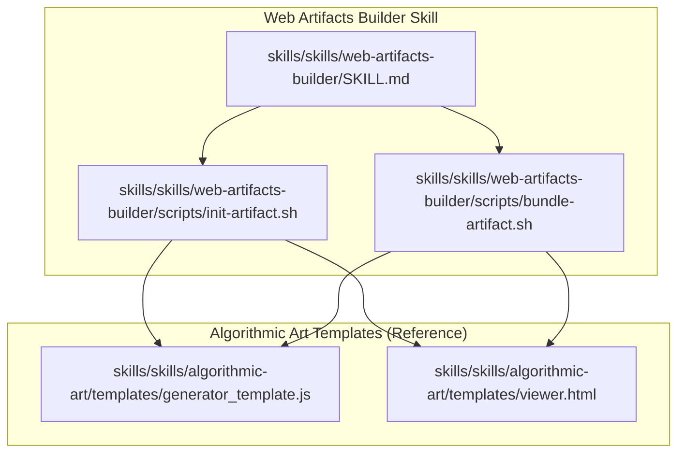
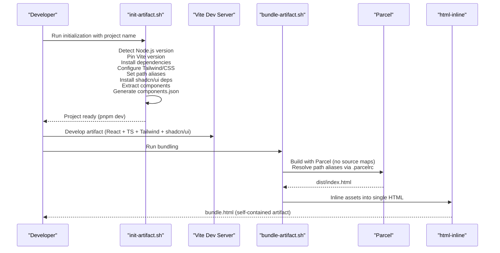
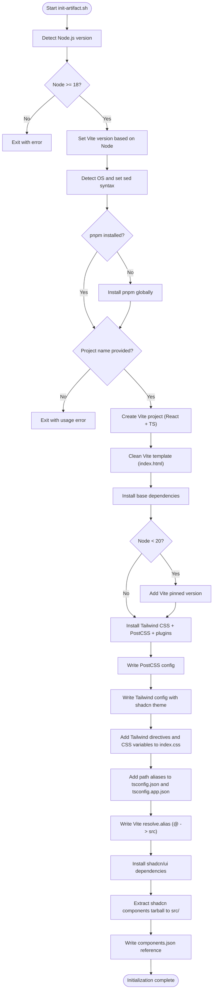
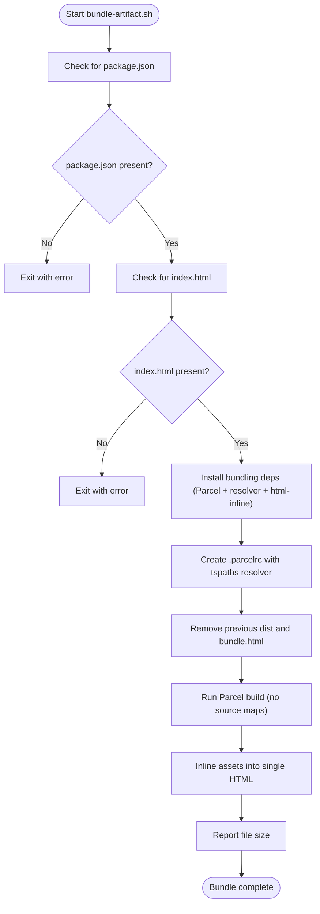
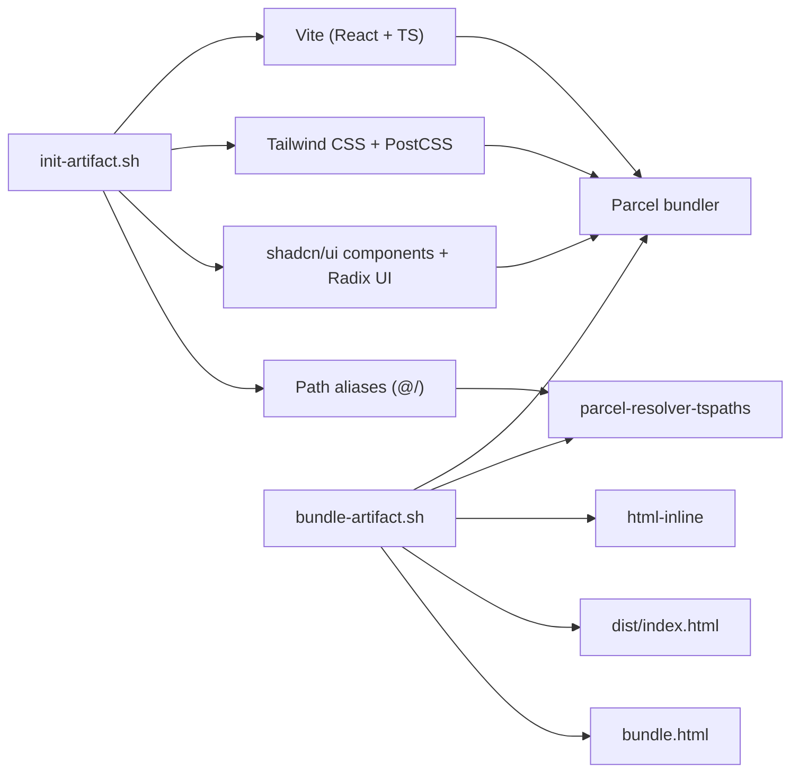

# Web Artifacts Builder

<cite>
**Referenced Files in This Document**
- [web-artifacts-builder SKILL.md](file://skills/skills/web-artifacts-builder/SKILL.md)
- [bundle-artifact.sh](file://skills/skills/web-artifacts-builder/scripts/bundle-artifact.sh)
- [init-artifact.sh](file://skills/skills/web-artifacts-builder/scripts/init-artifact.sh)
- [generator_template.js](file://skills/skills/algorithmic-art/templates/generator_template.js)
- [viewer.html](file://skills/skills/algorithmic-art/templates/viewer.html)
</cite>

## Table of Contents
1. [Introduction](#introduction)
2. [Project Structure](#project-structure)
3. [Core Components](#core-components)
4. [Architecture Overview](#architecture-overview)
5. [Detailed Component Analysis](#detailed-component-analysis)
6. [Dependency Analysis](#dependency-analysis)
7. [Performance Considerations](#performance-considerations)
8. [Troubleshooting Guide](#troubleshooting-guide)
9. [Conclusion](#conclusion)
10. [Appendices](#appendices)

## Introduction
The Web Artifacts Builder skill enables rapid creation of rich, interactive HTML artifacts for Claude conversations using modern frontend technologies. It provides two core scripts:
- Initialization script to scaffold a React + TypeScript + Vite + Tailwind CSS + shadcn/ui project with path aliases and pre-configured tooling
- Bundling script to compile the project into a single HTML file with all assets inlined for easy sharing and artifact display

This document explains the artifact bundling process, initialization scripts, and web resource compilation workflows. It also covers the build pipeline, asset optimization, deployment preparation, artifact structure, dependency management, and cross-platform compatibility considerations, with practical examples and integration guidance.

## Project Structure
The Web Artifacts Builder skill is organized around a skill specification and two Bash scripts that orchestrate project initialization and artifact bundling.

**Diagram sources**
- [web-artifacts-builder SKILL.md](file://skills/skills/web-artifacts-builder/SKILL.md)
- [init-artifact.sh](file://skills/skills/web-artifacts-builder/scripts/init-artifact.sh)
- [bundle-artifact.sh](file://skills/skills/web-artifacts-builder/scripts/bundle-artifact.sh)
- [generator_template.js](file://skills/skills/algorithmic-art/templates/generator_template.js)
- [viewer.html](file://skills/skills/algorithmic-art/templates/viewer.html)

**Section sources**
- [web-artifacts-builder SKILL.md](file://skills/skills/web-artifacts-builder/SKILL.md)

## Core Components
- Initialization script: Creates a React + TypeScript project via Vite, configures Tailwind CSS and PostCSS, sets up path aliases, pins a compatible Vite version based on Node.js version, installs shadcn/ui dependencies, extracts a tarball of prebuilt components, and generates a components.json reference.
- Bundling script: Validates prerequisites (package.json and index.html), installs bundling dependencies (Parcel and related resolvers), writes a .parcelrc configuration with path alias support, builds the project with Parcel (no source maps), and inlines all assets into a single HTML file using html-inline.

Key capabilities:
- Cross-platform shell scripting with OS-aware sed syntax
- Automatic Node.js version detection and Vite version pinning
- Path alias support during bundling via a custom resolver
- Self-contained artifact generation for Claude conversations

**Section sources**
- [init-artifact.sh](file://skills/skills/web-artifacts-builder/scripts/init-artifact.sh)
- [bundle-artifact.sh](file://skills/skills/web-artifacts-builder/scripts/bundle-artifact.sh)

## Architecture Overview
The system follows a two-phase workflow: project scaffolding followed by artifact bundling.

**Diagram sources**
- [init-artifact.sh](file://skills/skills/web-artifacts-builder/scripts/init-artifact.sh)
- [bundle-artifact.sh](file://skills/skills/web-artifacts-builder/scripts/bundle-artifact.sh)

## Detailed Component Analysis

### Initialization Script Workflow
The initialization script performs a series of tasks to bootstrap a production-ready frontend project with modern tooling and design system integration.

**Diagram sources**
- [init-artifact.sh](file://skills/skills/web-artifacts-builder/scripts/init-artifact.sh)

**Section sources**
- [init-artifact.sh](file://skills/skills/web-artifacts-builder/scripts/init-artifact.sh)

### Bundling Script Workflow
The bundling script compiles the artifact into a single HTML file suitable for sharing in Claude conversations.

**Diagram sources**
- [bundle-artifact.sh](file://skills/skills/web-artifacts-builder/scripts/bundle-artifact.sh)

**Section sources**
- [bundle-artifact.sh](file://skills/skills/web-artifacts-builder/scripts/bundle-artifact.sh)

### Build Pipeline and Asset Compilation
- Toolchain: Vite for development and asset resolution; Parcel for production bundling with a TypeScript path resolver; html-inline for single-file output.
- Path aliases: Resolved during bundling via a custom Parcel resolver to ensure imports using @/ resolve correctly in the final artifact.
- Source maps: Disabled in the bundling step to reduce artifact size and simplify distribution.
- Output: A single HTML file containing all JavaScript, CSS, and assets, suitable for direct sharing in Claude conversations.

**Section sources**
- [bundle-artifact.sh](file://skills/skills/web-artifacts-builder/scripts/bundle-artifact.sh)
- [init-artifact.sh](file://skills/skills/web-artifacts-builder/scripts/init-artifact.sh)

### Artifact Structure and Content
- Entry point: index.html in the project root is required for bundling.
- Generated artifact: bundle.html is the final self-contained artifact.
- Inlining: All assets are inlined into the HTML to ensure portability and fast loading.

Practical guidance:
- Place all static assets under the Vite-managed structure so they are resolved and inlined correctly.
- Keep the project’s index.html as the canonical entry point for the bundler.

**Section sources**
- [bundle-artifact.sh](file://skills/skills/web-artifacts-builder/scripts/bundle-artifact.sh)

### Dependency Management
- Node.js: Minimum requirement is Node.js 18; the script detects the version and pins a compatible Vite version accordingly.
- Package manager: pnpm is used throughout for deterministic installs and faster operations.
- Frontend stack: React 18, TypeScript, Vite, Tailwind CSS 3.4.1, shadcn/ui components, and related Radix UI dependencies.
- Bundling: Parcel with a TypeScript path resolver and html-inline for asset inlining.

Cross-platform considerations:
- OS detection adjusts sed in-place syntax for macOS vs Linux/Windows.
- The script checks for pnpm and installs it if missing.

**Section sources**
- [init-artifact.sh](file://skills/skills/web-artifacts-builder/scripts/init-artifact.sh)
- [bundle-artifact.sh](file://skills/skills/web-artifacts-builder/scripts/bundle-artifact.sh)

### Integration with Web Development Pipelines
- Local development: Use pnpm dev after initialization to run the Vite dev server.
- CI/CD: The bundling script can be invoked in automated pipelines to produce a deployable artifact.
- Sharing in Claude: The generated bundle.html can be uploaded directly to Claude conversations as an artifact.

**Section sources**
- [web-artifacts-builder SKILL.md](file://skills/skills/web-artifacts-builder/SKILL.md)

## Dependency Analysis
The Web Artifacts Builder skill orchestrates a clear dependency chain between initialization and bundling.

**Diagram sources**
- [init-artifact.sh](file://skills/skills/web-artifacts-builder/scripts/init-artifact.sh)
- [bundle-artifact.sh](file://skills/skills/web-artifacts-builder/scripts/bundle-artifact.sh)

**Section sources**
- [init-artifact.sh](file://skills/skills/web-artifacts-builder/scripts/init-artifact.sh)
- [bundle-artifact.sh](file://skills/skills/web-artifacts-builder/scripts/bundle-artifact.sh)

## Performance Considerations
- Disable source maps during bundling to minimize artifact size.
- Prefer inlining for small artifacts to reduce network requests.
- Keep the number of large assets manageable; consider lazy-loading patterns if the artifact grows large.
- Use the provided templates and component library to maintain consistent performance characteristics.

[No sources needed since this section provides general guidance]

## Troubleshooting Guide
Common issues and resolutions:
- Missing package.json or index.html: The bundling script exits early if these files are not found. Ensure you run the bundling script from the project root.
- Node.js version too low: The initialization script requires Node.js 18 or higher and will exit if the requirement is not met.
- pnpm not found: The initialization script installs pnpm globally if it is not present.
- Path alias resolution failures: Ensure .parcelrc is created and contains the tspaths resolver; the bundling script writes this automatically.
- Large artifact size: Verify that the project structure and assets are minimal and that unnecessary dependencies are not included.

**Section sources**
- [bundle-artifact.sh](file://skills/skills/web-artifacts-builder/scripts/bundle-artifact.sh)
- [init-artifact.sh](file://skills/skills/web-artifacts-builder/scripts/init-artifact.sh)

## Conclusion
The Web Artifacts Builder skill streamlines the creation of rich, interactive HTML artifacts using modern frontend tooling. The initialization script sets up a robust development environment with Tailwind CSS and shadcn/ui, while the bundling script produces a self-contained artifact optimized for sharing in Claude conversations. By following the documented workflow and leveraging the provided scripts, developers can rapidly prototype and ship sophisticated web artifacts with minimal friction.

[No sources needed since this section summarizes without analyzing specific files]

## Appendices

### Example Workflows
- Create a new artifact project:
  - Run the initialization script with a project name to scaffold the environment.
  - Develop using React, TypeScript, Tailwind CSS, and shadcn/ui components.
- Produce a shareable artifact:
  - Ensure index.html exists in the project root.
  - Run the bundling script to generate bundle.html.
  - Share bundle.html directly in Claude conversations.

**Section sources**
- [web-artifacts-builder SKILL.md](file://skills/skills/web-artifacts-builder/SKILL.md)
- [bundle-artifact.sh](file://skills/skills/web-artifacts-builder/scripts/bundle-artifact.sh)
- [init-artifact.sh](file://skills/skills/web-artifacts-builder/scripts/init-artifact.sh)

### Related Templates and References
- Generative art templates demonstrate best practices for structuring interactive p5.js experiences, including parameterization, seeded randomness, and UI controls. These patterns can inspire artifact interactivity and user-driven customization.

**Section sources**
- [generator_template.js](file://skills/skills/algorithmic-art/templates/generator_template.js)
- [viewer.html](file://skills/skills/algorithmic-art/templates/viewer.html)