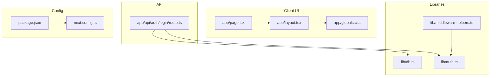
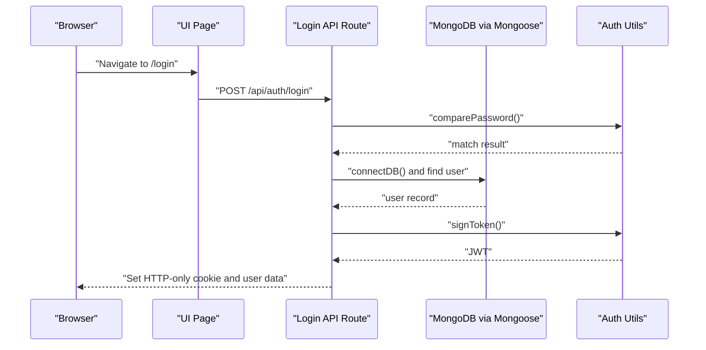
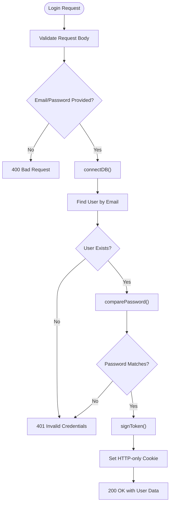
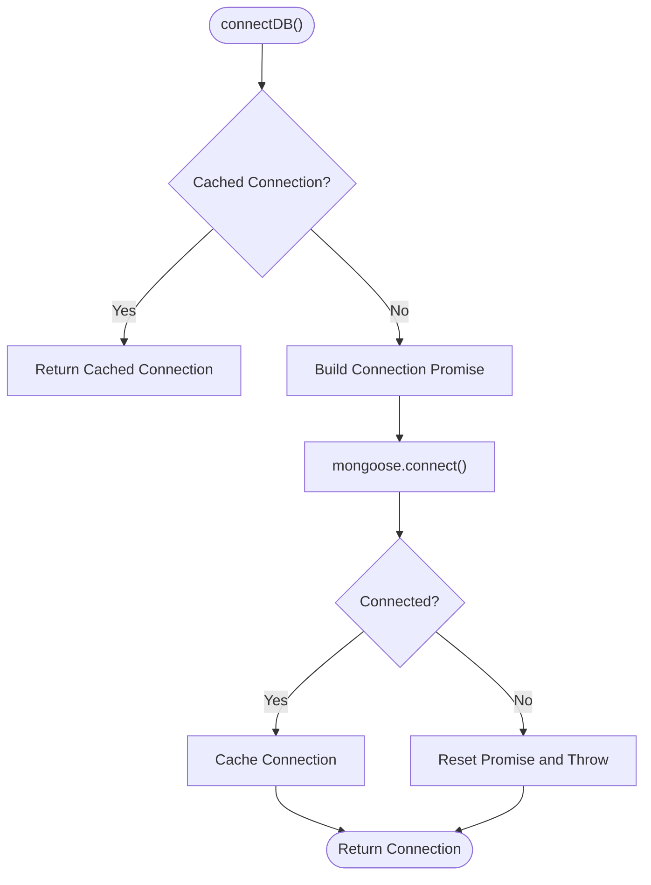
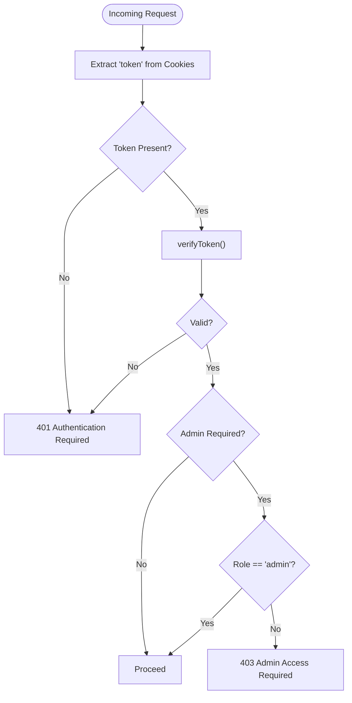
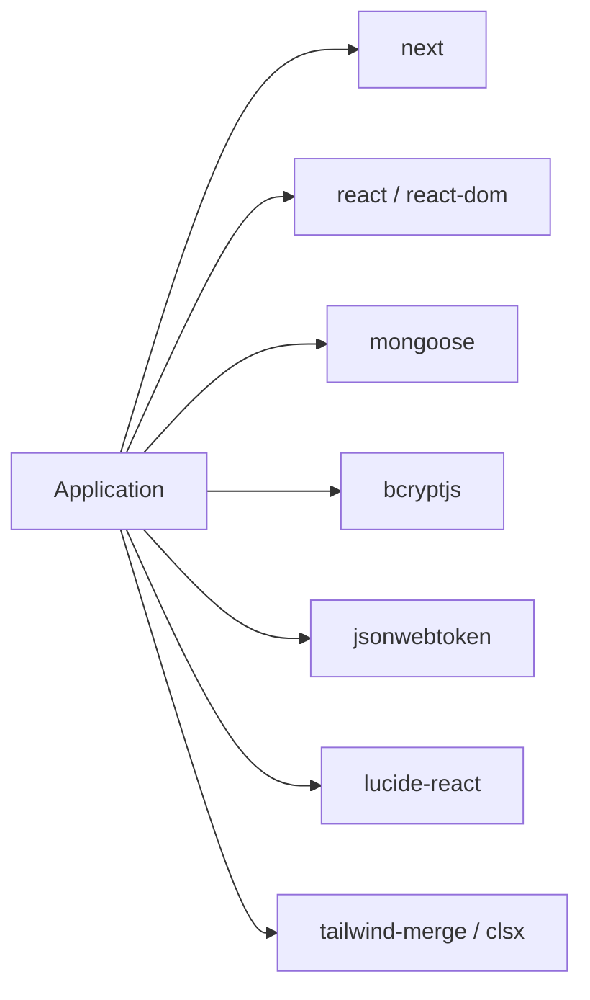

# Troubleshooting & FAQ

<cite>
**Referenced Files in This Document**
- [package.json](file://package.json)
- [next.config.ts](file://next.config.ts)
- [app/layout.tsx](file://app/layout.tsx)
- [app/page.tsx](file://app/page.tsx)
- [app/globals.css](file://app/globals.css)
- [lib/db.ts](file://lib/db.ts)
- [lib/auth.ts](file://lib/auth.ts)
- [lib/middleware-helpers.ts](file://lib/middleware-helpers.ts)
- [app/api/auth/login/route.ts](file://app/api/auth/login/route.ts)
- [README.md](file://README.md)
</cite>

## Table of Contents
1. [Introduction](#introduction)
2. [Project Structure](#project-structure)
3. [Core Components](#core-components)
4. [Architecture Overview](#architecture-overview)
5. [Detailed Component Analysis](#detailed-component-analysis)
6. [Dependency Analysis](#dependency-analysis)
7. [Performance Considerations](#performance-considerations)
8. [Troubleshooting Guide](#troubleshooting-guide)
9. [FAQ](#faq)
10. [Conclusion](#conclusion)

## Introduction
This document provides comprehensive troubleshooting guidance and a focused FAQ for the Employee Attendance System built with Next.js. It covers common authentication issues, database connectivity problems, API endpoint failures, UI rendering anomalies, environment setup pitfalls, dependency conflicts, deployment challenges, security-related concerns, permission problems, and data validation errors. The goal is to help developers and operators quickly diagnose and resolve issues while maintaining system stability and security.

## Project Structure
The application follows a standard Next.js App Router layout with a small set of core modules supporting authentication, database connectivity, and UI. Key areas relevant to troubleshooting include:
- Authentication and middleware helpers
- Database connection caching and error handling
- API routes for login and token verification
- UI layout and global styling

**Diagram sources**
- [app/layout.tsx](file://app/layout.tsx)
- [app/page.tsx](file://app/page.tsx)
- [app/globals.css](file://app/globals.css)
- [lib/auth.ts](file://lib/auth.ts)
- [lib/db.ts](file://lib/db.ts)
- [lib/middleware-helpers.ts](file://lib/middleware-helpers.ts)
- [app/api/auth/login/route.ts](file://app/api/auth/login/route.ts)
- [package.json](file://package.json)
- [next.config.ts](file://next.config.ts)

**Section sources**
- [app/layout.tsx](file://app/layout.tsx)
- [app/page.tsx](file://app/page.tsx)
- [app/globals.css](file://app/globals.css)
- [lib/auth.ts](file://lib/auth.ts)
- [lib/db.ts](file://lib/db.ts)
- [lib/middleware-helpers.ts](file://lib/middleware-helpers.ts)
- [app/api/auth/login/route.ts](file://app/api/auth/login/route.ts)
- [package.json](file://package.json)
- [next.config.ts](file://next.config.ts)

## Core Components
- Authentication utilities: password hashing, token signing/verification, and environment validation for secrets.
- Database connection: MongoDB connection with caching and error propagation.
- Middleware helpers: cookie extraction, token verification, and role-based access checks.
- API route: login endpoint validating credentials, connecting to the database, and issuing secure tokens.
- UI layout: global theming, fonts, and toast provider for user feedback.

Key implementation references:
- Authentication secret validation and token operations
  - [lib/auth.ts](file://lib/auth.ts)
- Database connection caching and error handling
  - [lib/db.ts](file://lib/db.ts)
- Authentication middleware helpers
  - [lib/middleware-helpers.ts](file://lib/middleware-helpers.ts)
- Login API endpoint
  - [app/api/auth/login/route.ts](file://app/api/auth/login/route.ts)
- UI layout and global styles
  - [app/layout.tsx](file://app/layout.tsx)
  - [app/globals.css](file://app/globals.css)

**Section sources**
- [lib/auth.ts](file://lib/auth.ts)
- [lib/db.ts](file://lib/db.ts)
- [lib/middleware-helpers.ts](file://lib/middleware-helpers.ts)
- [app/api/auth/login/route.ts](file://app/api/auth/login/route.ts)
- [app/layout.tsx](file://app/layout.tsx)
- [app/globals.css](file://app/globals.css)

## Architecture Overview
The system integrates UI, authentication, and persistence as follows:
- UI renders the home page and applies global theming.
- Login API validates credentials, connects to the database, and sets a secure HTTP-only cookie.
- Authentication utilities enforce secret presence and sign/verify tokens.
- Middleware helpers extract and verify tokens for protected routes.

**Diagram sources**
- [app/api/auth/login/route.ts](file://app/api/auth/login/route.ts)
- [lib/auth.ts](file://lib/auth.ts)
- [lib/db.ts](file://lib/db.ts)

## Detailed Component Analysis

### Authentication and Token Flow
Common issues:
- Missing JWT secret environment variable
- Token verification failures
- Password comparison mismatches
- Cookie not being set or expired

**Diagram sources**
- [app/api/auth/login/route.ts](file://app/api/auth/login/route.ts)
- [lib/auth.ts](file://lib/auth.ts)
- [lib/db.ts](file://lib/db.ts)

**Section sources**
- [app/api/auth/login/route.ts](file://app/api/auth/login/route.ts)
- [lib/auth.ts](file://lib/auth.ts)
- [lib/db.ts](file://lib/db.ts)

### Database Connectivity
Common issues:
- Missing MONGODB_URI environment variable
- Connection timeouts or network errors
- Driver compatibility with Node.js version

**Diagram sources**
- [lib/db.ts](file://lib/db.ts)

**Section sources**
- [lib/db.ts](file://lib/db.ts)

### Middleware Helpers
Common issues:
- Missing token cookie
- Malformed or expired token
- Role-based access denials

**Diagram sources**
- [lib/middleware-helpers.ts](file://lib/middleware-helpers.ts)
- [lib/auth.ts](file://lib/auth.ts)

**Section sources**
- [lib/middleware-helpers.ts](file://lib/middleware-helpers.ts)
- [lib/auth.ts](file://lib/auth.ts)

## Dependency Analysis
External libraries and their roles:
- next: framework runtime and routing
- react/react-dom: UI rendering
- mongoose: MongoDB ODM with driver
- bcryptjs: password hashing
- jsonwebtoken: JWT signing/verification
- lucide-react: UI icons
- tailwind-merge/clsx: utility class composition

**Diagram sources**
- [package.json](file://package.json)

**Section sources**
- [package.json](file://package.json)

## Performance Considerations
- Database connection reuse: The connection cache avoids repeated reconnects and reduces latency.
- Token operations: Keep JWT secret secure and avoid excessive re-signing.
- UI rendering: Minimize heavy computations in client components; leverage Next.js rendering modes.
- Network: Ensure MongoDB is reachable with appropriate timeouts and retry policies.

[No sources needed since this section provides general guidance]

## Troubleshooting Guide

### Environment Setup Problems
Symptoms:
- Application fails to start with missing environment variables
- Login endpoint returns generic server errors

Resolutions:
- Define JWT_SECRET and MONGODB_URI in your environment
  - Reference: [lib/auth.ts](file://lib/auth.ts), [lib/db.ts](file://lib/db.ts)
- Verify environment loading in your runtime (development vs production)
  - Reference: [README.md](file://README.md)

**Section sources**
- [lib/auth.ts](file://lib/auth.ts)
- [lib/db.ts](file://lib/db.ts)
- [README.md](file://README.md)

### Authentication Problems
Symptoms:
- 401 Unauthorized on protected routes
- 403 Forbidden when admin access is required
- Login succeeds but user remains unauthenticated

Resolutions:
- Confirm token cookie is present and not expired
  - Reference: [lib/middleware-helpers.ts](file://lib/middleware-helpers.ts)
- Verify JWT_SECRET correctness and token validity
  - Reference: [lib/auth.ts](file://lib/auth.ts)
- Ensure login endpoint sets HTTP-only cookie with correct domain/path
  - Reference: [app/api/auth/login/route.ts](file://app/api/auth/login/route.ts)

**Section sources**
- [lib/middleware-helpers.ts](file://lib/middleware-helpers.ts)
- [lib/auth.ts](file://lib/auth.ts)
- [app/api/auth/login/route.ts](file://app/api/auth/login/route.ts)

### Database Connection Errors
Symptoms:
- Application startup fails with connection errors
- Login endpoint throws connection exceptions

Resolutions:
- Check MONGODB_URI format and accessibility
  - Reference: [lib/db.ts](file://lib/db.ts)
- Validate MongoDB server availability and firewall rules
- Review Node.js version compatibility with the MongoDB driver
  - Reference: [package.json](file://package.json)

**Section sources**
- [lib/db.ts](file://lib/db.ts)
- [package.json](file://package.json)

### API Endpoint Failures
Symptoms:
- Login returns 400 for missing fields
- Login returns 401 for invalid credentials
- Login returns 500 for internal errors

Resolutions:
- Ensure request body includes email and password
  - Reference: [app/api/auth/login/route.ts](file://app/api/auth/login/route.ts)
- Verify user exists and password matches
  - Reference: [app/api/auth/login/route.ts](file://app/api/auth/login/route.ts)
- Inspect server logs for thrown exceptions during connection or token signing
  - Reference: [app/api/auth/login/route.ts](file://app/api/auth/login/route.ts)

**Section sources**
- [app/api/auth/login/route.ts](file://app/api/auth/login/route.ts)

### UI Rendering Issues
Symptoms:
- Fonts not loading or layout shifts
- Theme variables not applied
- Components not visible on initial load

Resolutions:
- Confirm Next.js font configuration and CSS variables
  - Reference: [app/layout.tsx](file://app/layout.tsx), [app/globals.css](file://app/globals.css)
- Ensure client-side hydration completes before rendering dynamic content
  - Reference: [app/page.tsx](file://app/page.tsx)

**Section sources**
- [app/layout.tsx](file://app/layout.tsx)
- [app/globals.css](file://app/globals.css)
- [app/page.tsx](file://app/page.tsx)

### Security-Related Troubleshooting
Symptoms:
- Tokens exposed in localStorage or insecure cookies
- Missing CSRF protection
- Excessive logging of sensitive data

Resolutions:
- Use HTTP-only cookies for tokens
  - Reference: [app/api/auth/login/route.ts](file://app/api/auth/login/route.ts)
- Enforce secure flags in production
  - Reference: [app/api/auth/login/route.ts](file://app/api/auth/login/route.ts)
- Avoid logging raw passwords or tokens
- Validate JWT_SECRET presence at startup
  - Reference: [lib/auth.ts](file://lib/auth.ts)

**Section sources**
- [app/api/auth/login/route.ts](file://app/api/auth/login/route.ts)
- [lib/auth.ts](file://lib/auth.ts)

### Permission Problems
Symptoms:
- Non-admin users blocked from admin routes
- Role-based access denied

Resolutions:
- Implement requireAdmin middleware for admin-only endpoints
  - Reference: [lib/middleware-helpers.ts](file://lib/middleware-helpers.ts)
- Ensure user role is persisted and validated consistently
  - Reference: [app/api/auth/login/route.ts](file://app/api/auth/login/route.ts)

**Section sources**
- [lib/middleware-helpers.ts](file://lib/middleware-helpers.ts)
- [app/api/auth/login/route.ts](file://app/api/auth/login/route.ts)

### Data Validation Errors
Symptoms:
- Login rejects valid credentials due to field validation
- Database queries fail due to malformed filters

Resolutions:
- Validate request body fields before processing
  - Reference: [app/api/auth/login/route.ts](file://app/api/auth/login/route.ts)
- Use strict schema validation for incoming data (recommended)
- Ensure email normalization (lowercase) is applied consistently
  - Reference: [app/api/auth/login/route.ts](file://app/api/auth/login/route.ts)

**Section sources**
- [app/api/auth/login/route.ts](file://app/api/auth/login/route.ts)

### Debugging Techniques and Log Analysis
- Enable verbose logging around authentication and database operations
  - Reference: [app/api/auth/login/route.ts](file://app/api/auth/login/route.ts), [lib/db.ts](file://lib/db.ts)
- Capture request IDs and correlate with backend logs
- Use browser developer tools to inspect cookies and network responses
  - Reference: [app/api/auth/login/route.ts](file://app/api/auth/login/route.ts)
- Validate environment variables at startup
  - Reference: [lib/auth.ts](file://lib/auth.ts), [lib/db.ts](file://lib/db.ts)

**Section sources**
- [app/api/auth/login/route.ts](file://app/api/auth/login/route.ts)
- [lib/db.ts](file://lib/db.ts)
- [lib/auth.ts](file://lib/auth.ts)

### Deployment Issues
Symptoms:
- Application runs locally but fails in production
- Environment variables not loaded in containerized deployments

Resolutions:
- Ensure environment variables are configured in CI/CD and runtime environments
  - Reference: [README.md](file://README.md)
- Verify MongoDB URI accessibility from deployment environment
  - Reference: [lib/db.ts](file://lib/db.ts)
- Confirm Node.js version compatibility with dependencies
  - Reference: [package.json](file://package.json)

**Section sources**
- [README.md](file://README.md)
- [lib/db.ts](file://lib/db.ts)
- [package.json](file://package.json)

## FAQ
- Why does the login fail with “invalid email or password”?
  - Ensure the email exists and the password matches after hashing. Check request payload and database connectivity.
  - Reference: [app/api/auth/login/route.ts](file://app/api/auth/login/route.ts)

- Why am I getting “authentication required” on protected pages?
  - Verify the token cookie is present and valid. Confirm JWT_SECRET is set and correct.
  - Reference: [lib/middleware-helpers.ts](file://lib/middleware-helpers.ts), [lib/auth.ts](file://lib/auth.ts)

- How do I fix “database connection failed” errors?
  - Confirm MONGODB_URI is correct and reachable. Check for driver compatibility with your Node.js version.
  - Reference: [lib/db.ts](file://lib/db.ts), [package.json](file://package.json)

- Why is my theme not applying?
  - Ensure global CSS defines theme variables and Next.js font configuration is active.
  - Reference: [app/globals.css](file://app/globals.css), [app/layout.tsx](file://app/layout.tsx)

- How can I prevent token theft?
  - Use HTTP-only cookies and secure flags. Never store tokens in localStorage.
  - Reference: [app/api/auth/login/route.ts](file://app/api/auth/login/route.ts)

- What should I check if the app crashes on startup?
  - Validate JWT_SECRET and MONGODB_URI presence. Review dependency versions and Node.js compatibility.
  - Reference: [lib/auth.ts](file://lib/auth.ts), [lib/db.ts](file://lib/db.ts), [package.json](file://package.json)

**Section sources**
- [app/api/auth/login/route.ts](file://app/api/auth/login/route.ts)
- [lib/middleware-helpers.ts](file://lib/middleware-helpers.ts)
- [lib/auth.ts](file://lib/auth.ts)
- [lib/db.ts](file://lib/db.ts)
- [app/globals.css](file://app/globals.css)
- [app/layout.tsx](file://app/layout.tsx)
- [package.json](file://package.json)

## Conclusion
This guide consolidates the most common issues and their solutions for the Employee Attendance System. By validating environment variables, ensuring secure token handling, maintaining robust database connectivity, and following the recommended debugging practices, most problems can be resolved quickly. Regular monitoring of logs, adherence to security best practices, and careful validation of inputs will keep the system stable and reliable.