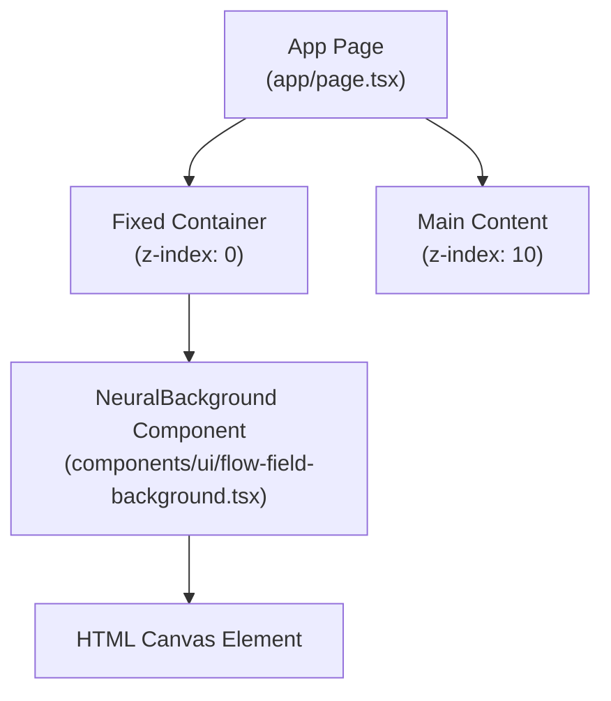
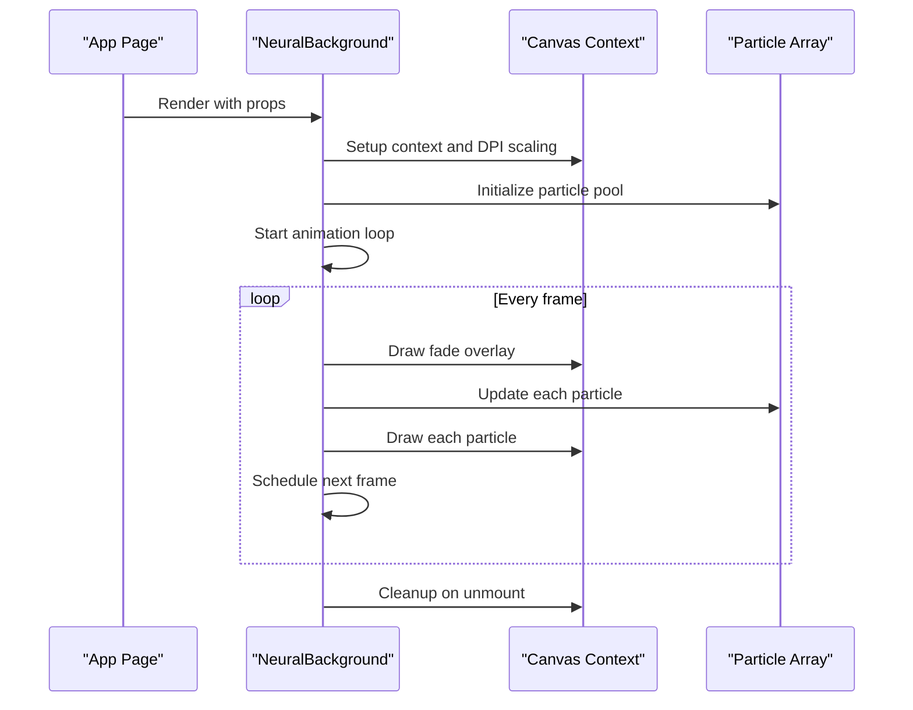
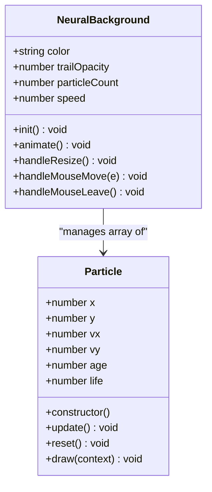
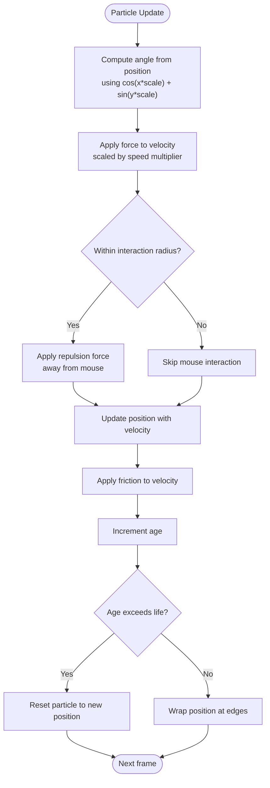
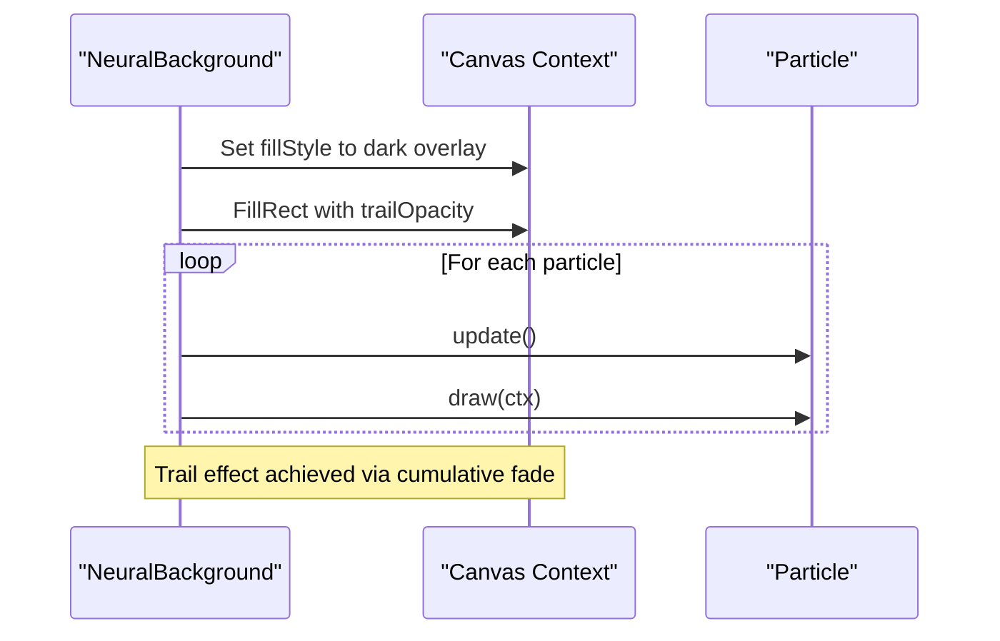
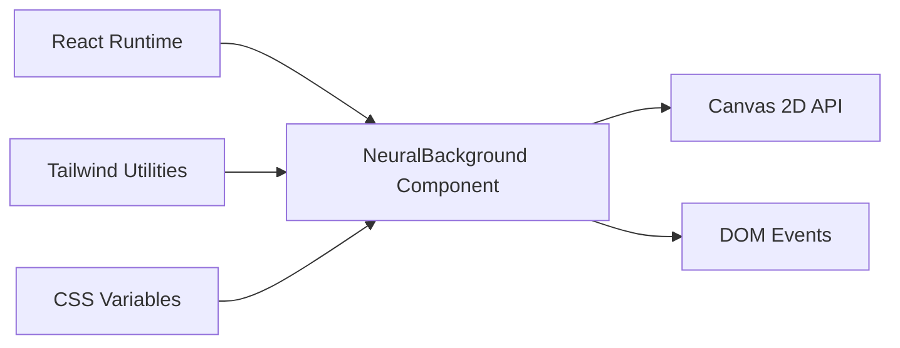

# Flow Field Background

<cite>
**Referenced Files in This Document**
- [flow-field-background.tsx](file://components/ui/flow-field-background.tsx)
- [page.tsx](file://app/page.tsx)
- [globals.css](file://app/globals.css)
- [utils.ts](file://lib/utils.ts)
- [package.json](file://package.json)
- [viewer.html](file://skills/skills/algorithmic-art/templates/viewer.html)
</cite>

## Table of Contents
1. [Introduction](#introduction)
2. [Project Structure](#project-structure)
3. [Core Components](#core-components)
4. [Architecture Overview](#architecture-overview)
5. [Detailed Component Analysis](#detailed-component-analysis)
6. [Dependency Analysis](#dependency-analysis)
7. [Performance Considerations](#performance-considerations)
8. [Troubleshooting Guide](#troubleshooting-guide)
9. [Conclusion](#conclusion)

## Introduction
This document provides comprehensive technical documentation for the Flow Field Background component, a canvas-based animated particle system designed to create immersive, flowing visual effects. The component renders thousands of tiny particles that move according to a mathematically derived flow field, responding to mouse proximity for interactive behavior. It is optimized for performance using requestAnimationFrame, device pixel ratio scaling, and efficient rendering techniques. The documentation covers configuration options, animation parameters, customization settings, visual effects, color schemes, interaction patterns, responsive behavior, and browser compatibility considerations.

## Project Structure
The Flow Field Background component is implemented as a React client component using HTML5 Canvas. It integrates with a Next.js application and is positioned as a fixed background layer beneath page content. The surrounding UI leverages a neumorphic design system with Tailwind CSS and custom CSS variables.

**Diagram sources**
- [page.tsx:38-48](file://app/page.tsx#L38-L48)
- [flow-field-background.tsx:200-210](file://components/ui/flow-field-background.tsx#L200-L210)

**Section sources**
- [page.tsx:38-48](file://app/page.tsx#L38-L48)
- [flow-field-background.tsx:200-210](file://components/ui/flow-field-background.tsx#L200-L210)

## Core Components
The Flow Field Background component consists of:
- A React functional component that manages lifecycle, event listeners, and animation loop
- A particle system with physics-based movement and aging
- A flow field calculation engine using trigonometric functions
- Mouse interaction for repulsion/attraction forces
- Canvas rendering with configurable color, trails, and speed

Key configuration options exposed by the component:
- color: Base color for particles (CSS-compatible string)
- trailOpacity: Opacity of the fade trail effect (0.0 to 1.0)
- particleCount: Number of particles to simulate
- speed: Global speed multiplier for flow field forces

Animation parameters and physics:
- Flow field angle derived from cosine and sine functions of particle positions
- Velocity accumulation with friction to prevent unbounded acceleration
- Age-based alpha fading for natural birth/death cycles
- Screen wrapping for continuous motion

Interaction patterns:
- Mouse proximity triggers repulsion forces within a defined radius
- Off-screen mouse coordinates disable interaction forces

Customization settings:
- Device pixel ratio scaling for crisp rendering on high-DPI displays
- Dynamic resizing to match container dimensions
- Configurable particle size and trail length via canvas drawing primitives

**Section sources**
- [flow-field-background.tsx:6-35](file://components/ui/flow-field-background.tsx#L6-L35)
- [flow-field-background.tsx:55-130](file://components/ui/flow-field-background.tsx#L55-L130)
- [flow-field-background.tsx:132-163](file://components/ui/flow-field-background.tsx#L132-L163)
- [flow-field-background.tsx:165-197](file://components/ui/flow-field-background.tsx#L165-L197)

## Architecture Overview
The component follows a modular architecture:
- Initialization phase sets up canvas dimensions, DPI scaling, and particle array
- Animation loop performs per-frame updates and rendering
- Event handlers manage resize and mouse interaction
- Cleanup ensures proper resource deallocation

**Diagram sources**
- [page.tsx:41-47](file://app/page.tsx#L41-L47)
- [flow-field-background.tsx:132-197](file://components/ui/flow-field-background.tsx#L132-L197)

## Detailed Component Analysis

### Particle System and Physics
The particle system implements a simple yet effective physics model:
- Position and velocity vectors track movement
- Flow field forces are computed using trigonometric functions of particle coordinates
- Mouse interaction applies repulsion forces within a threshold distance
- Friction gradually reduces velocity to maintain stability
- Aging determines particle lifespan and triggers recycling

**Diagram sources**
- [flow-field-background.tsx:55-130](file://components/ui/flow-field-background.tsx#L55-L130)
- [flow-field-background.tsx:29-35](file://components/ui/flow-field-background.tsx#L29-L35)

**Section sources**
- [flow-field-background.tsx:55-130](file://components/ui/flow-field-background.tsx#L55-L130)

### Vector Field Calculations
The flow field is computed per particle using a combination of cosine and sine functions applied to the particle's x and y coordinates. This produces a wave-like directional field that guides particle movement, creating organic, fluid motion patterns.

**Diagram sources**
- [flow-field-background.tsx:73-112](file://components/ui/flow-field-background.tsx#L73-L112)

**Section sources**
- [flow-field-background.tsx:73-112](file://components/ui/flow-field-background.tsx#L73-L112)

### Rendering Pipeline and Trail Effects
The rendering pipeline employs a fade-based trail technique:
- A semi-transparent black overlay is drawn each frame to create motion trails
- Particle alpha values are dynamically adjusted based on age for smooth fades
- High-DPI canvases are scaled appropriately to avoid blurry rendering

**Diagram sources**
- [flow-field-background.tsx:149-163](file://components/ui/flow-field-background.tsx#L149-L163)
- [flow-field-background.tsx:123-129](file://components/ui/flow-field-background.tsx#L123-L129)

**Section sources**
- [flow-field-background.tsx:149-163](file://components/ui/flow-field-background.tsx#L149-L163)
- [flow-field-background.tsx:123-129](file://components/ui/flow-field-background.tsx#L123-L129)

### Configuration Options and Customization
The component exposes four primary configuration options:
- color: Sets the base color for all particles
- trailOpacity: Controls the persistence of motion trails
- particleCount: Adjusts simulation density
- speed: Modulates the strength of flow field forces

These options are passed as props and influence runtime behavior without requiring reinitialization.

**Section sources**
- [flow-field-background.tsx:6-35](file://components/ui/flow-field-background.tsx#L6-L35)
- [page.tsx:42-47](file://app/page.tsx#L42-L47)

### Visual Effects and Color Schemes
Visual effects are primarily controlled through:
- Base particle color for unified appearance
- Trail opacity for varying trail lengths
- Particle count for density and performance trade-offs
- Speed multiplier for dynamic pacing

Example configurations (descriptive):
- Calming oceanic theme: low trail opacity, moderate particle count, soft blue color
- Energetic digital theme: higher speed, vibrant color, shorter trails
- Minimalist aesthetic: low particle count, subtle color, long trails

**Section sources**
- [page.tsx:42-47](file://app/page.tsx#L42-L47)
- [flow-field-background.tsx:31-34](file://components/ui/flow-field-background.tsx#L31-L34)

### Interaction Patterns
Mouse interaction enables dynamic responsiveness:
- Proximity-based repulsion within a fixed radius
- Real-time force application proportional to distance
- Automatic deactivation when mouse leaves the container

This creates intuitive, playful behavior where users can steer the flow field with their cursor.

**Section sources**
- [flow-field-background.tsx:82-93](file://components/ui/flow-field-background.tsx#L82-L93)
- [flow-field-background.tsx:172-181](file://components/ui/flow-field-background.tsx#L172-L181)

### Responsive Behavior
Responsive behavior is handled through:
- Container-based sizing using clientWidth/clientHeight
- Dynamic initialization on resize events
- High-DPI scaling via devicePixelRatio and canvas scaling
- CSS containment to prevent layout thrashing

The component adapts seamlessly to viewport changes and maintains crisp rendering on Retina displays.

**Section sources**
- [flow-field-background.tsx:166-170](file://components/ui/flow-field-background.tsx#L166-L170)
- [flow-field-background.tsx:134-140](file://components/ui/flow-field-background.tsx#L134-L140)

### Browser Compatibility Considerations
Compatibility is ensured through:
- Standard HTML5 Canvas APIs
- Modern JavaScript features with broad support
- No external dependencies beyond React and DOM APIs
- Graceful degradation for older browsers

The component relies on widely supported features and avoids experimental APIs.

**Section sources**
- [package.json:11-21](file://package.json#L11-L21)
- [flow-field-background.tsx:1-5](file://components/ui/flow-field-background.tsx#L1-L5)

## Dependency Analysis
The component has minimal external dependencies and integrates cleanly with the Next.js ecosystem:
- React for component lifecycle and hooks
- HTML5 Canvas for rendering
- Tailwind CSS utility classes for layout
- Custom CSS variables for theming

**Diagram sources**
- [flow-field-background.tsx:3-4](file://components/ui/flow-field-background.tsx#L3-L4)
- [page.tsx:6](file://app/page.tsx#L6)
- [globals.css:1-23](file://app/globals.css#L1-L23)

**Section sources**
- [flow-field-background.tsx:3-4](file://components/ui/flow-field-background.tsx#L3-L4)
- [page.tsx:6](file://app/page.tsx#L6)
- [globals.css:1-23](file://app/globals.css#L1-L23)

## Performance Considerations
Performance characteristics and optimization techniques:
- Efficient rendering using tiny rectangles instead of arcs
- Single pass per frame with O(n) particle updates
- RequestAnimationFrame scheduling for smooth 60fps animation
- Friction-based damping prevents numerical instability
- High-DPI scaling avoids unnecessary memory overhead
- Cleanup of event listeners and animation frames on unmount

Recommendations:
- Adjust particleCount based on target device capabilities
- Tune trailOpacity for desired visual quality vs. performance balance
- Monitor speed values to avoid excessive CPU usage on lower-end devices
- Consider reducing particleCount during animations or transitions

**Section sources**
- [flow-field-background.tsx:128](file://components/ui/flow-field-background.tsx#L128)
- [flow-field-background.tsx:149-163](file://components/ui/flow-field-background.tsx#L149-L163)
- [flow-field-background.tsx:191-197](file://components/ui/flow-field-background.tsx#L191-L197)

## Troubleshooting Guide
Common issues and resolutions:
- Particles not visible: Verify color prop is a valid CSS color string and trailOpacity is not zero
- Poor performance: Reduce particleCount or adjust speed; ensure cleanup runs on unmount
- Blurry rendering on Retina displays: Confirm devicePixelRatio scaling is active
- Mouse interaction not working: Check mouse event listener attachment and container positioning
- Canvas not filling container: Ensure container has explicit dimensions and overflow is managed

Debugging steps:
- Inspect canvas dimensions and DPI scaling
- Verify animation loop is scheduled and not blocked by heavy synchronous work
- Test with reduced particleCount to isolate performance bottlenecks
- Validate event handler registration and removal

**Section sources**
- [flow-field-background.tsx:134-140](file://components/ui/flow-field-background.tsx#L134-L140)
- [flow-field-background.tsx:165-197](file://components/ui/flow-field-background.tsx#L165-L197)

## Conclusion
The Flow Field Background component delivers a visually engaging, interactive particle system with robust performance characteristics. Its modular design, minimal dependencies, and responsive behavior make it suitable for modern web applications. By tuning configuration options and understanding the underlying physics, developers can achieve a wide range of visual effects while maintaining smooth performance across diverse devices and browsers.