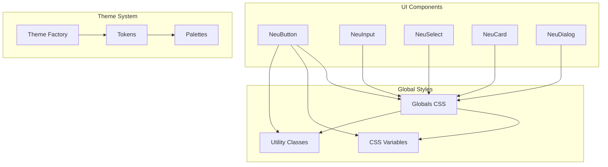
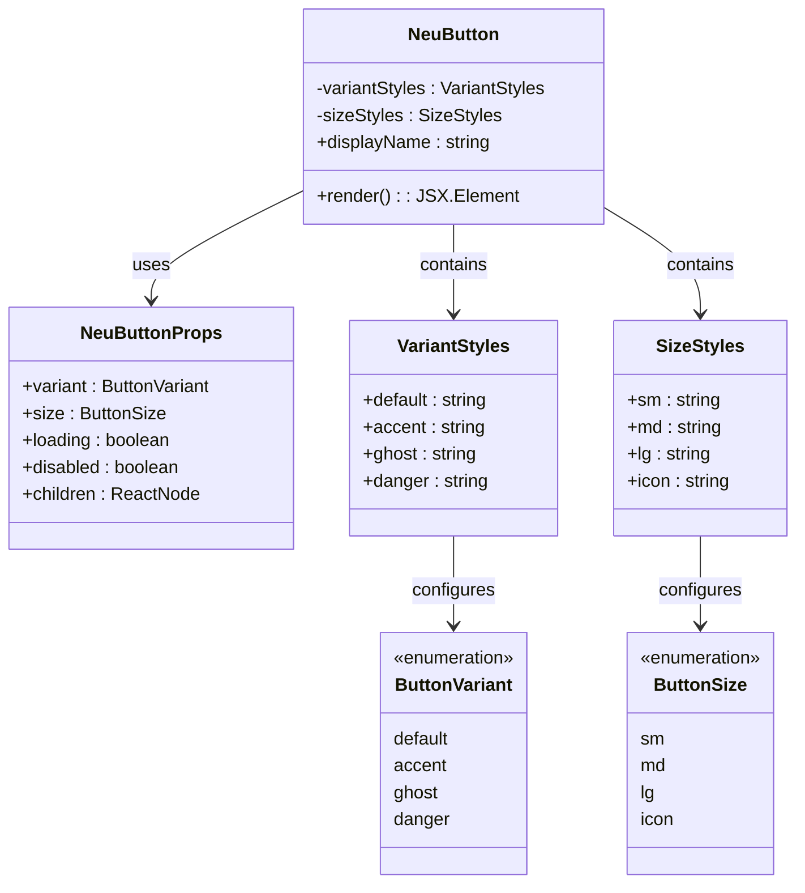
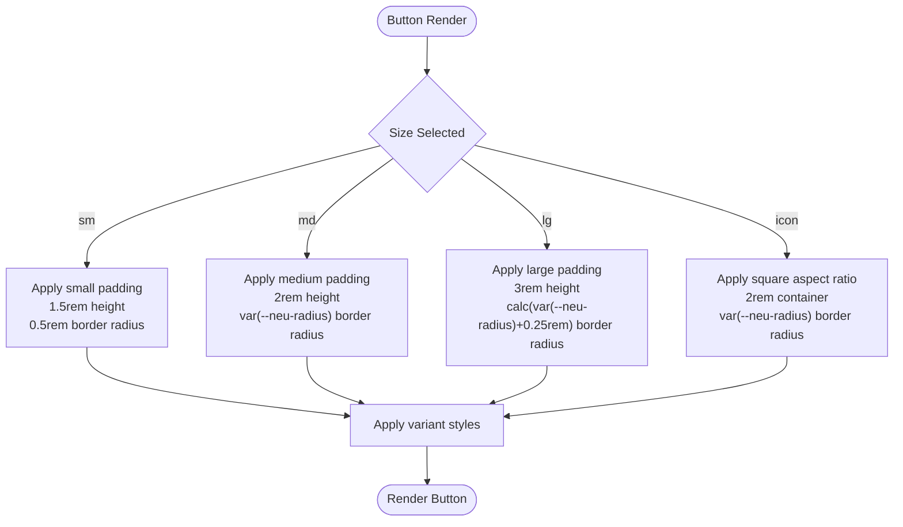
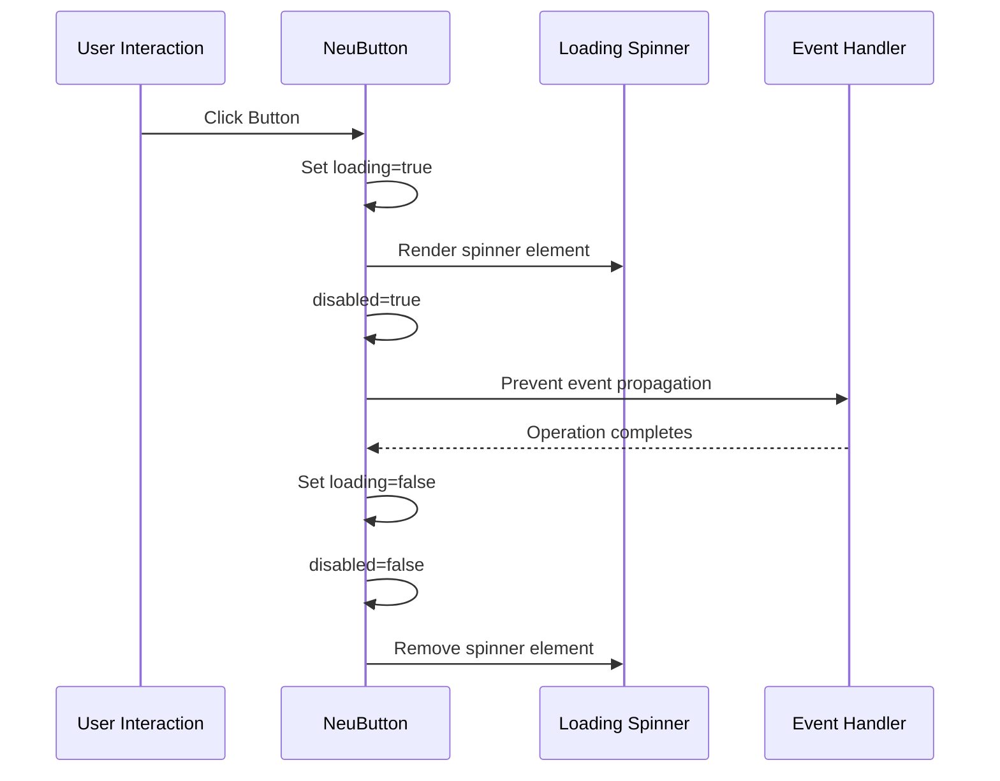
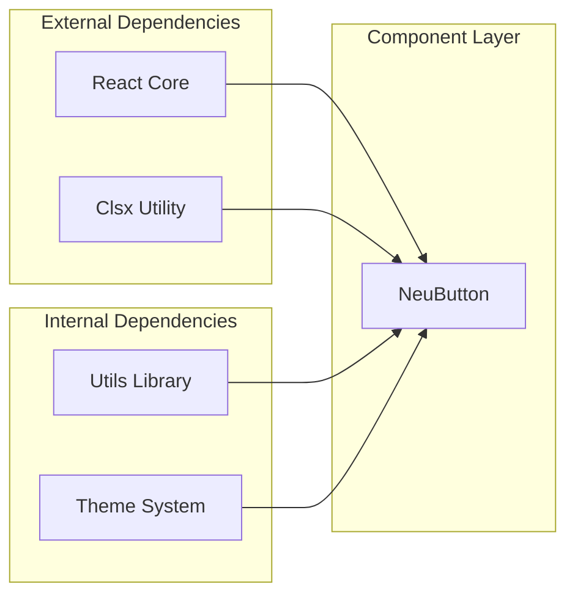

# NeuButton Component

<cite>
**Referenced Files in This Document**
- [neu-button.tsx](file://components/ui/neu-button.tsx)
- [globals.css](file://app/globals.css)
- [neu-input.tsx](file://components/ui/neu-input.tsx)
- [neu-select.tsx](file://components/ui/neu-select.tsx)
- [neu-card.tsx](file://components/ui/neu-card.tsx)
- [neu-dialog.tsx](file://components/ui/neu-dialog.tsx)
</cite>

## Table of Contents
1. [Introduction](#introduction)
2. [Project Structure](#project-structure)
3. [Core Components](#core-components)
4. [Architecture Overview](#architecture-overview)
5. [Detailed Component Analysis](#detailed-component-analysis)
6. [Dependency Analysis](#dependency-analysis)
7. [Performance Considerations](#performance-considerations)
8. [Troubleshooting Guide](#troubleshooting-guide)
9. [Conclusion](#conclusion)

## Introduction
NeuButton is a neumorphic design button component that implements soft UI styling with elevated and depressed shadow effects. It provides four distinct variants (default, accent, ghost, danger), four sizing options (sm, md, lg, icon), and comprehensive loading and disabled states. The component leverages CSS custom properties for theming, enabling easy customization of colors, shadows, and spacing while maintaining consistent neumorphic aesthetics across the application.

## Project Structure
The NeuButton component is part of a cohesive neumorphic design system within the UI components directory. It integrates with global CSS variables and follows a consistent pattern with other UI primitives in the system.

**Diagram sources**
- [neu-button.tsx:1-112](file://components/ui/neu-button.tsx#L1-L112)
- [globals.css:1-61](file://app/globals.css#L1-L61)

**Section sources**
- [neu-button.tsx:1-112](file://components/ui/neu-button.tsx#L1-L112)
- [globals.css:1-61](file://app/globals.css#L1-L61)

## Core Components
The NeuButton component consists of several key elements that work together to create the neumorphic effect:

### Props Interface
The component accepts standard HTML button attributes plus specialized neumorphic props:
- `variant`: Controls visual appearance (default, accent, ghost, danger)
- `size`: Manages dimensions and spacing (sm, md, lg, icon)
- `loading`: Enables spinner animation during async operations
- `disabled`: Prevents user interaction and applies visual disabled state

### Variant System
Each variant defines specific color treatments, borders, and shadow configurations that maintain the neumorphic aesthetic while serving different functional purposes.

### Size Configuration
Sizes control padding, font size, and border radius with responsive scaling that adapts to the theme's base radius variable.

**Section sources**
- [neu-button.tsx:9-14](file://components/ui/neu-button.tsx#L9-L14)
- [neu-button.tsx:6-7](file://components/ui/neu-button.tsx#L6-L7)

## Architecture Overview
The component architecture follows a modular design pattern that separates concerns between styling, behavior, and accessibility.

**Diagram sources**
- [neu-button.tsx:6-14](file://components/ui/neu-button.tsx#L6-L14)
- [neu-button.tsx:16-59](file://components/ui/neu-button.tsx#L16-L59)

## Detailed Component Analysis

### Variant Implementation
Each variant maintains consistent neumorphic behavior while providing distinct visual treatments:

#### Default Variant
The default variant uses surface colors with subtle borders and layered shadows that create the characteristic pressed-in appearance. Hover states reduce shadow depth and lift the button slightly, while active states invert to pressed-out shadows.

#### Accent Variant
Designed for primary actions, the accent variant uses prominent accent colors with white text contrast. Hover states adjust brightness and maintain the lifting animation for tactile feedback.

#### Ghost Variant
The ghost variant provides transparent backgrounds with hover effects that reveal surface colors. This creates subtle interactive feedback without overwhelming the interface.

#### Danger Variant
Built for destructive actions, the danger variant uses warning colors with hover effects that enhance visibility. The variant maintains the same motion patterns as other variants for consistency.

### Size Configuration
The size system provides proportional scaling that respects the theme's base radius variable:

**Diagram sources**
- [neu-button.tsx:54-59](file://components/ui/neu-button.tsx#L54-L59)
- [neu-button.tsx:16-52](file://components/ui/neu-button.tsx#L16-L52)

### Loading State Implementation
The loading mechanism combines visual feedback with functional protection:

**Diagram sources**
- [neu-button.tsx:81-102](file://components/ui/neu-button.tsx#L81-L102)
- [neu-button.tsx:78](file://components/ui/neu-button.tsx#L78)

### Accessibility Features
The component implements comprehensive accessibility standards:

- **Focus Management**: Visible ring highlighting with theme-aware colors
- **Keyboard Navigation**: Full keyboard support for activation and focus
- **Screen Reader Support**: Proper ARIA attributes and semantic markup
- **Motion Preferences**: Respects reduced motion user preferences
- **Color Contrast**: Maintains sufficient contrast ratios across all variants

**Section sources**
- [neu-button.tsx:72](file://components/ui/neu-button.tsx#L72)
- [neu-button.tsx:78](file://components/ui/neu-button.tsx#L78)

## Dependency Analysis
The component has minimal external dependencies and integrates seamlessly with the existing design system:

**Diagram sources**
- [neu-button.tsx:3-4](file://components/ui/neu-button.tsx#L3-L4)

### Theme Integration
The component relies on CSS custom properties defined in the global stylesheet:

| Variable | Purpose | Default Value |
|----------|---------|---------------|
| `--neu-bg` | Background color | #1a1a2e |
| `--neu-surface` | Surface color | #16213e |
| `--neu-accent` | Accent color | #818cf8 |
| `--neu-text` | Text color | #e2e8f0 |
| `--neu-shadow-dark` | Dark shadow | #0d0d1a |
| `--neu-shadow-light` | Light shadow | #272742 |
| `--neu-radius` | Border radius | 0.75rem |

**Section sources**
- [globals.css:7-23](file://app/globals.css#L7-L23)
- [neu-button.tsx:18](file://components/ui/neu-button.tsx#L18)

## Performance Considerations
The component is optimized for performance through several mechanisms:

- **CSS Custom Properties**: Enable runtime theme switching without JavaScript
- **Minimal Re-renders**: Uses forwardRef to avoid unnecessary re-renders
- **Efficient Styling**: Leverages Tailwind utility classes for optimal CSS generation
- **Lazy Loading**: Spinner renders only when needed
- **Memory Management**: Proper cleanup of event handlers and timeouts

## Troubleshooting Guide

### Common Issues and Solutions

#### Shadow Effects Not Appearing
**Problem**: Buttons appear flat without neumorphic shadows
**Solution**: Ensure CSS custom properties are properly defined in the global stylesheet

#### Hover States Not Working
**Problem**: Interactive states don't respond to user input
**Solution**: Verify Tailwind CSS is properly configured with the required variants

#### Color Contrast Issues
**Problem**: Text or icons are difficult to see against backgrounds
**Solution**: Adjust theme variables to meet WCAG contrast guidelines

#### Responsive Behavior Problems
**Problem**: Buttons don't scale properly on different screen sizes
**Solution**: Check media query configuration and ensure viewport meta tag is present

### Debugging Tips
- Use browser developer tools to inspect computed CSS properties
- Verify CSS custom property values in the Elements panel
- Test component behavior across different browsers and devices
- Monitor for console errors related to missing dependencies

**Section sources**
- [globals.css:40-54](file://app/globals.css#L40-L54)
- [neu-button.tsx:70-77](file://components/ui/neu-button.tsx#L70-L77)

## Conclusion
The NeuButton component successfully implements a comprehensive neumorphic design system with thoughtful attention to accessibility, performance, and customization. Its modular architecture allows for easy extension and theming while maintaining consistent user experience across different contexts. The component serves as a foundation for building cohesive neumorphic interfaces that balance visual appeal with functional usability.