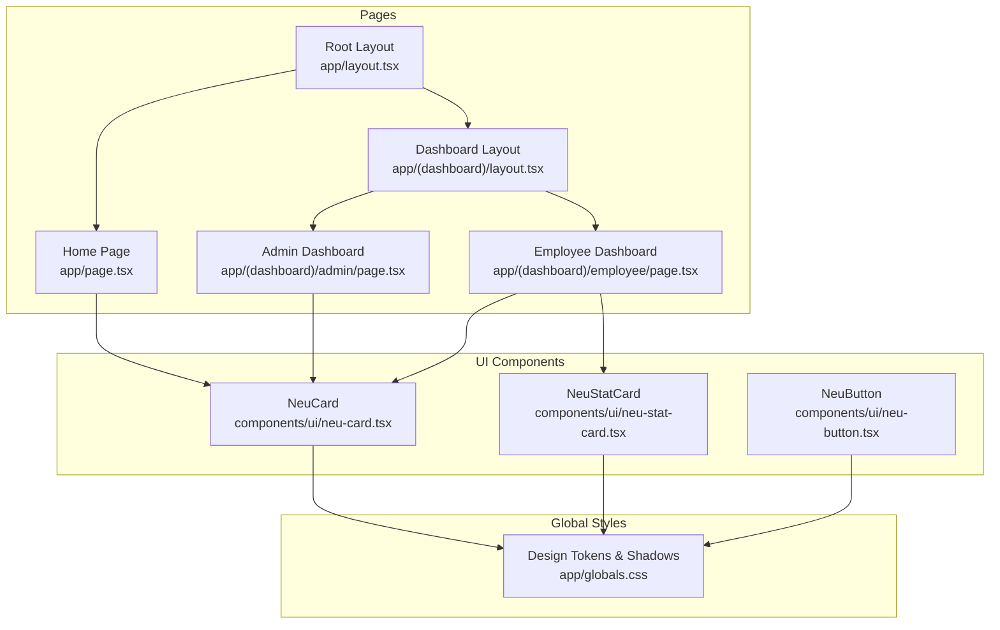
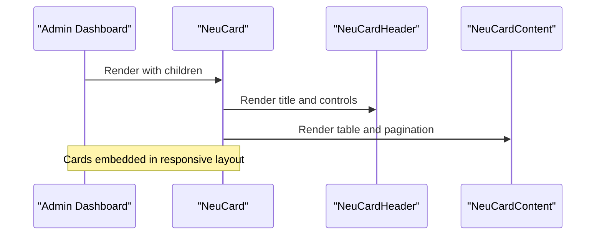
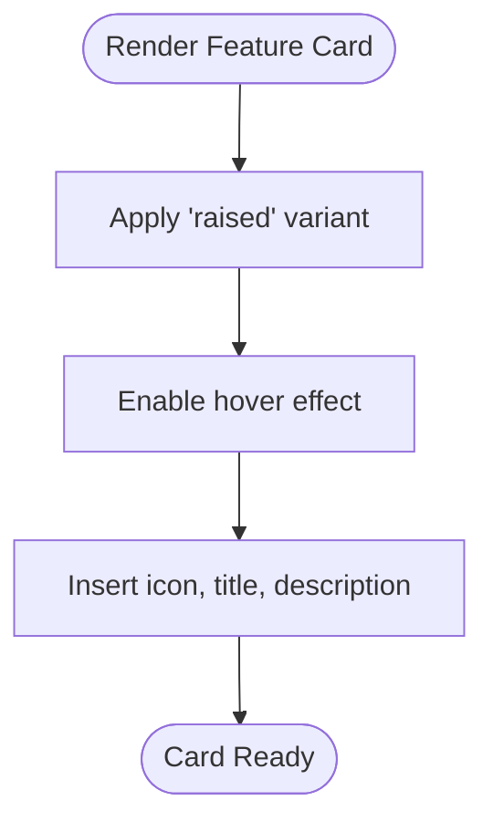
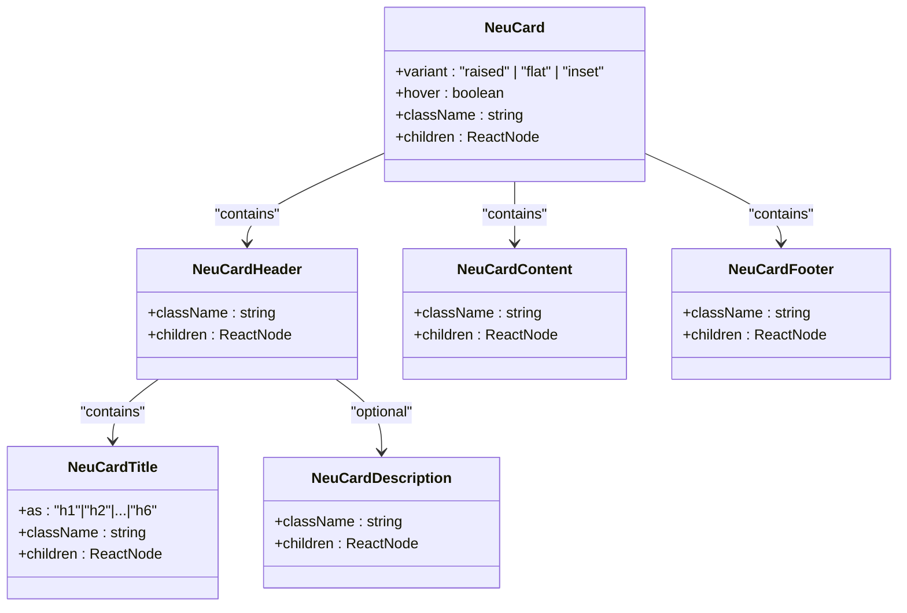
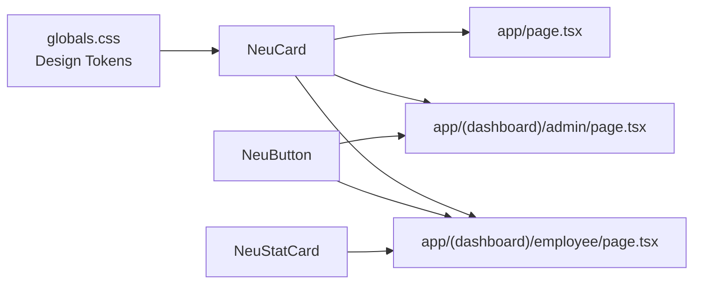

# NeuCard Component

<cite>
**Referenced Files in This Document**
- [neu-card.tsx](file://components/ui/neu-card.tsx)
- [neu-stat-card.tsx](file://components/ui/neu-stat-card.tsx)
- [globals.css](file://app/globals.css)
- [page.tsx](file://app/page.tsx)
- [layout.tsx](file://app/layout.tsx)
- [dashboard-admin-page.tsx](file://app/(dashboard)/admin/page.tsx)
- [dashboard-employee-page.tsx](file://app/(dashboard)/employee/page.tsx)
- [dashboard-layout.tsx](file://app/(dashboard)/layout.tsx)
- [neu-button.tsx](file://components/ui/neu-button.tsx)
</cite>

## Table of Contents
1. [Introduction](#introduction)
2. [Project Structure](#project-structure)
3. [Core Components](#core-components)
4. [Architecture Overview](#architecture-overview)
5. [Detailed Component Analysis](#detailed-component-analysis)
6. [Dependency Analysis](#dependency-analysis)
7. [Performance Considerations](#performance-considerations)
8. [Troubleshooting Guide](#troubleshooting-guide)
9. [Conclusion](#conclusion)
10. [Appendices](#appendices)

## Introduction
This document provides comprehensive documentation for the NeuCard component, focusing on its neumorphic styling, surface elevation effects, and shadow implementations. It explains the component's props, content structure, styling options, responsive behavior, and integration patterns with other UI elements. Examples demonstrate usage in dashboard layouts, data displays, and interactive containers.

## Project Structure
The NeuCard component resides in the UI components module alongside related neumorphic components such as NeuStatCard and supporting design tokens defined in global CSS. Usage spans the marketing landing page and both admin and employee dashboards.



**Diagram sources**
- [neu-card.tsx:1-180](file://components/ui/neu-card.tsx#L1-L180)
- [neu-stat-card.tsx:1-133](file://components/ui/neu-stat-card.tsx#L1-L133)
- [globals.css:1-60](file://app/globals.css#L1-L60)
- [page.tsx:1-142](file://app/page.tsx#L1-L142)
- [dashboard-admin-page.tsx](file://app/(dashboard)/admin/page.tsx#L1-L274)
- [dashboard-employee-page.tsx](file://app/(dashboard)/employee/page.tsx#L1-L254)
- [dashboard-layout.tsx](file://app/(dashboard)/layout.tsx#L1-L34)
- [layout.tsx:1-38](file://app/layout.tsx#L1-L38)

**Section sources**
- [neu-card.tsx:1-180](file://components/ui/neu-card.tsx#L1-L180)
- [globals.css:1-60](file://app/globals.css#L1-L60)
- [page.tsx:1-142](file://app/page.tsx#L1-L142)
- [dashboard-admin-page.tsx](file://app/(dashboard)/admin/page.tsx#L1-L274)
- [dashboard-employee-page.tsx](file://app/(dashboard)/employee/page.tsx#L1-L254)
- [dashboard-layout.tsx](file://app/(dashboard)/layout.tsx#L1-L34)
- [layout.tsx:1-38](file://app/layout.tsx#L1-L38)

## Core Components
NeuCard is a composite UI component that renders a neumorphic card with optional header, title, description, content, and footer slots. It supports three variants (raised, flat, inset) and optional hover elevation. Related components include NeuCardHeader, NeuCardTitle, NeuCardDescription, NeuCardContent, and NeuCardFooter. A companion NeuStatCard provides a specialized card for displaying metrics with trend indicators.

Key capabilities:
- Variant-driven styling with CSS custom properties for surface, borders, shadows, and text
- Hover elevation with subtle lift and enhanced shadow
- Semantic sub-components for structured content
- Integration with global design tokens for consistent theming

**Section sources**
- [neu-card.tsx:6-179](file://components/ui/neu-card.tsx#L6-L179)
- [neu-stat-card.tsx:8-132](file://components/ui/neu-stat-card.tsx#L8-L132)

## Architecture Overview
NeuCard leverages a context to propagate its variant to child sub-components. Global CSS defines neumorphic design tokens and reusable shadow utilities. Pages integrate NeuCard within responsive layouts and combine it with other UI elements like buttons and tables.

```mermaid
sequenceDiagram
participant Page as "Page Component"
participant Card as "NeuCard"
participant Header as "NeuCardHeader"
participant Title as "NeuCardTitle"
participant Content as "NeuCardContent"
participant Footer as "NeuCardFooter"
Page->>Card : Render with variant and hover props
Card->>Card : Provide variant via context
Card->>Header : Render header slot
Header->>Title : Render title inside header
Card->>Content : Render content slot
Card->>Footer : Render footer slot
Note over Card : Uses variantStyles and hover effects
```

**Diagram sources**
- [neu-card.tsx:37-57](file://components/ui/neu-card.tsx#L37-L57)
- [neu-card.tsx:65-80](file://components/ui/neu-card.tsx#L65-L80)
- [neu-card.tsx:89-104](file://components/ui/neu-card.tsx#L89-L104)
- [neu-card.tsx:135-143](file://components/ui/neu-card.tsx#L135-L143)
- [neu-card.tsx:151-166](file://components/ui/neu-card.tsx#L151-L166)

**Section sources**
- [neu-card.tsx:8-57](file://components/ui/neu-card.tsx#L8-L57)
- [globals.css:7-23](file://app/globals.css#L7-L23)

## Detailed Component Analysis

### NeuCard Props and Behavior
- variant: Selects from raised, flat, or inset styling modes
- hover: Enables lift and enhanced shadow on hover
- className: Extends default styling
- children: Accepts structured content using sub-components

Styling characteristics:
- Rounded corners via CSS custom property
- Transition effects for smooth state changes
- Variant-specific shadows and borders
- Hover elevation with increased shadow depth

Integration patterns:
- Used as a wrapper for data tables and interactive panels
- Combined with buttons and badges for cohesive UI composition
- Embedded within responsive grids and flex layouts

**Section sources**
- [neu-card.tsx:14-57](file://components/ui/neu-card.tsx#L14-L57)
- [globals.css:40-54](file://app/globals.css#L40-L54)

### Sub-components and Content Structure
- NeuCardHeader: Provides a bordered header area for titles
- NeuCardTitle: Renders headings with consistent typography and color
- NeuCardDescription: Offers secondary text with muted color
- NeuCardContent: Hosts primary content blocks
- NeuCardFooter: Adds a bordered footer area for actions or metadata

These sub-components inherit and align with the parent card's variant and color scheme, ensuring visual consistency.

**Section sources**
- [neu-card.tsx:61-82](file://components/ui/neu-card.tsx#L61-L82)
- [neu-card.tsx:84-104](file://components/ui/neu-card.tsx#L84-L104)
- [neu-card.tsx:108-127](file://components/ui/neu-card.tsx#L108-L127)
- [neu-card.tsx:131-143](file://components/ui/neu-card.tsx#L131-L143)
- [neu-card.tsx:147-166](file://components/ui/neu-card.tsx#L147-L166)

### Shadow and Elevation Implementation
NeuCard applies layered box-shadows to simulate light and dark embossing, creating a soft, three-dimensional appearance. The raised variant uses outward shadows, while the inset variant uses inward shadows. Hover mode increases shadow depth and lifts the card slightly.

Shadow utilities:
- Predefined utility classes for common shadow patterns
- Pressed state for button-like interactions

**Section sources**
- [neu-card.tsx:20-35](file://components/ui/neu-card.tsx#L20-L35)
- [neu-card.tsx:47-47](file://components/ui/neu-card.tsx#L47-L47)
- [globals.css:40-54](file://app/globals.css#L40-L54)

### Responsive Behavior and Layout Integration
NeuCard adapts to various screen sizes through Tailwind’s responsive utilities. In the home page, cards are arranged in a responsive grid. In dashboards, cards wrap content and integrate with pagination controls and tables.

Responsive patterns observed:
- Grid layouts scaling from single to multiple columns
- Flexible spacing and padding adapting to viewport
- Interactive elements (buttons) integrated within card footers

**Section sources**
- [page.tsx:103-130](file://app/page.tsx#L103-L130)
- [dashboard-admin-page.tsx](file://app/(dashboard)/admin/page.tsx#L224-L270)
- [dashboard-employee-page.tsx](file://app/(dashboard)/employee/page.tsx#L185-L250)

### Usage Examples Across Contexts

#### Dashboard Layouts
- Admin dashboard: A card wraps an attendance table with a header, title, and content area, including pagination controls in the footer.
- Employee dashboard: A card displays recent attendance history with a flexible header containing navigation controls.



**Diagram sources**
- [dashboard-admin-page.tsx](file://app/(dashboard)/admin/page.tsx#L224-L270)

**Section sources**
- [dashboard-admin-page.tsx](file://app/(dashboard)/admin/page.tsx#L224-L270)
- [dashboard-employee-page.tsx](file://app/(dashboard)/employee/page.tsx#L185-L250)

#### Data Displays
- Feature cards on the home page showcase raised cards with hover effects, each containing an icon, title, and description.
- Statistic cards (NeuStatCard) complement regular cards for KPI presentation.



**Diagram sources**
- [page.tsx:111-128](file://app/page.tsx#L111-L128)
- [neu-stat-card.tsx:74-128](file://components/ui/neu-stat-card.tsx#L74-L128)

**Section sources**
- [page.tsx:111-128](file://app/page.tsx#L111-L128)
- [neu-stat-card.tsx:8-132](file://components/ui/neu-stat-card.tsx#L8-L132)

#### Interactive Containers
- Cards host interactive elements such as buttons and navigation controls, maintaining consistent styling and spacing.
- Integration with form components and action buttons ensures cohesive user experience.

**Section sources**
- [dashboard-admin-page.tsx](file://app/(dashboard)/admin/page.tsx#L246-L265)
- [dashboard-employee-page.tsx](file://app/(dashboard)/employee/page.tsx#L190-L198)

### Class and Composition Diagram


**Diagram sources**
- [neu-card.tsx:14-179](file://components/ui/neu-card.tsx#L14-L179)

**Section sources**
- [neu-card.tsx:14-179](file://components/ui/neu-card.tsx#L14-L179)

## Dependency Analysis
NeuCard depends on:
- Global design tokens for colors, shadows, and radii
- React context for variant propagation
- Tailwind utility classes for responsive layout and transitions

Integration points:
- Pages import and compose NeuCard with other UI elements
- Dashboard layouts provide container context and responsive constraints
- Related components (NeuButton, NeuStatCard) share the same design system



**Diagram sources**
- [globals.css:7-23](file://app/globals.css#L7-L23)
- [neu-card.tsx:3-4](file://components/ui/neu-card.tsx#L3-L4)
- [page.tsx:8-8](file://app/page.tsx#L8-L8)
- [dashboard-admin-page.tsx](file://app/(dashboard)/admin/page.tsx#L9-L10)
- [dashboard-employee-page.tsx](file://app/(dashboard)/employee/page.tsx#L5-L6)
- [neu-button.tsx:61-71](file://components/ui/neu-button.tsx#L61-L71)

**Section sources**
- [globals.css:7-23](file://app/globals.css#L7-L23)
- [neu-card.tsx:3-4](file://components/ui/neu-card.tsx#L3-L4)
- [page.tsx:8-8](file://app/page.tsx#L8-L8)
- [dashboard-admin-page.tsx](file://app/(dashboard)/admin/page.tsx#L9-L10)
- [dashboard-employee-page.tsx](file://app/(dashboard)/employee/page.tsx#L5-L6)
- [neu-button.tsx:61-71](file://components/ui/neu-button.tsx#L61-L71)

## Performance Considerations
- Keep hover animations subtle to avoid heavy repaints on low-end devices
- Prefer variant-specific shadow values over complex layered shadows when possible
- Use responsive utilities judiciously to minimize layout thrashing
- Consolidate repeated shadow patterns into utility classes for maintainability

## Troubleshooting Guide
Common issues and resolutions:
- Missing design tokens: Ensure global CSS is imported and variables are defined
- Inconsistent variant rendering: Verify the parent card provides the intended variant via context
- Hover not triggering: Confirm hover prop is enabled and CSS transitions are applied
- Layout overflow: Adjust padding and margin classes for smaller screens

**Section sources**
- [globals.css:1-60](file://app/globals.css#L1-L60)
- [neu-card.tsx:37-57](file://components/ui/neu-card.tsx#L37-L57)

## Conclusion
NeuCard delivers a cohesive neumorphic experience through variant-driven styling, layered shadows, and responsive composition. Its sub-components enable structured content, while integration with global design tokens and layout patterns ensures consistency across dashboards and pages. By leveraging hover effects and utility classes, developers can build visually appealing and accessible interfaces.

## Appendices

### Props Reference
- NeuCard
  - variant: "raised" | "flat" | "inset"
  - hover: boolean
  - className: string
  - children: ReactNode

- NeuCardHeader
  - className: string
  - children: ReactNode

- NeuCardTitle
  - as: "h1" | "h2" | "h3" | "h4" | "h5" | "h6"
  - className: string
  - children: ReactNode

- NeuCardDescription
  - className: string
  - children: ReactNode

- NeuCardContent
  - className: string
  - children: ReactNode

- NeuCardFooter
  - className: string
  - children: ReactNode

**Section sources**
- [neu-card.tsx:14-179](file://components/ui/neu-card.tsx#L14-L179)