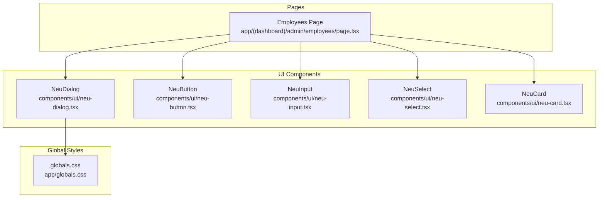
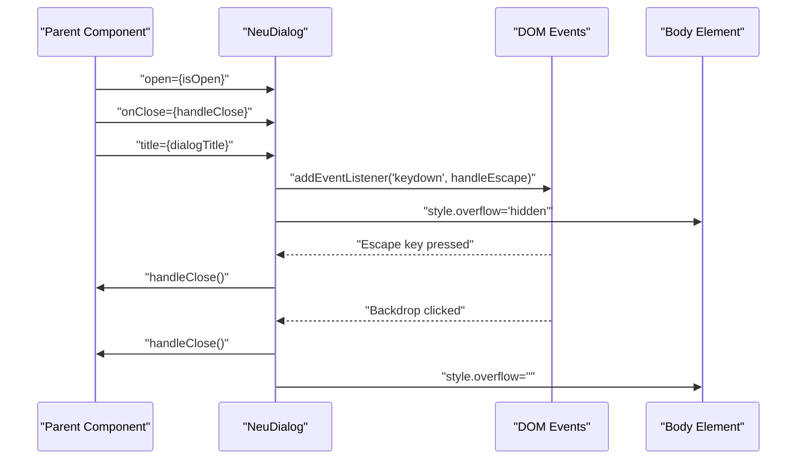
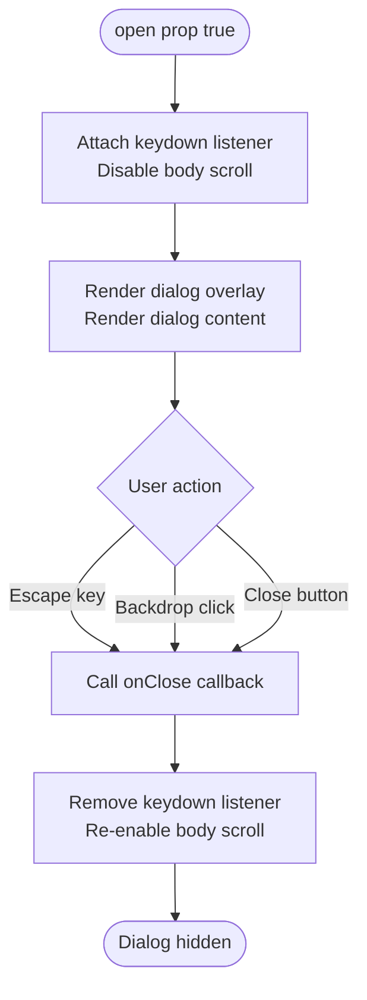
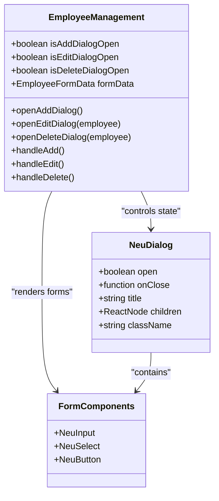
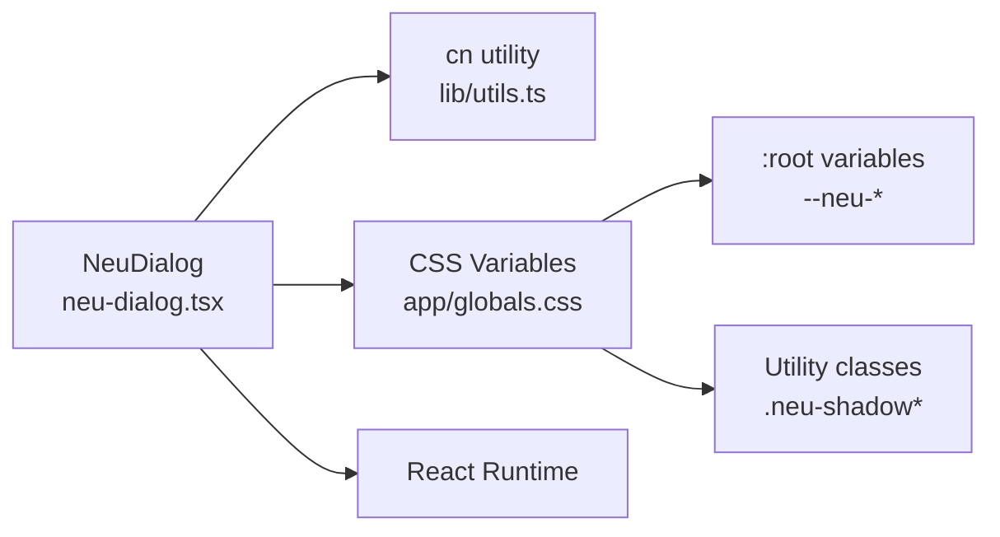

# NeuDialog Component

<cite>
**Referenced Files in This Document**
- [neu-dialog.tsx](file://components/ui/neu-dialog.tsx)
- [globals.css](file://app/globals.css)
- [employees/page.tsx](file://app/(dashboard)/admin/employees/page.tsx)
</cite>

## Table of Contents
1. [Introduction](#introduction)
2. [Project Structure](#project-structure)
3. [Core Components](#core-components)
4. [Architecture Overview](#architecture-overview)
5. [Detailed Component Analysis](#detailed-component-analysis)
6. [Dependency Analysis](#dependency-analysis)
7. [Performance Considerations](#performance-considerations)
8. [Troubleshooting Guide](#troubleshooting-guide)
9. [Conclusion](#conclusion)

## Introduction
NeuDialog is a neumorphic-styled modal dialog component designed for Next.js applications. It provides a visually cohesive dialog experience with backdrop handling, keyboard shortcuts, focus management, and accessibility features. The component integrates seamlessly with form submission workflows and supports confirmation dialogs, making it suitable for administrative interfaces such as employee management.

## Project Structure
NeuDialog resides in the UI components directory alongside other design system primitives. It leverages global CSS variables for consistent theming and is consumed by page-level components for interactive workflows.

**Diagram sources**
- [neu-dialog.tsx:1-116](file://components/ui/neu-dialog.tsx#L1-L116)
- [globals.css:1-61](file://app/globals.css#L1-L61)
- [employees/page.tsx](file://app/(dashboard)/admin/employees/page.tsx#L1-L560)

**Section sources**
- [neu-dialog.tsx:1-116](file://components/ui/neu-dialog.tsx#L1-L116)
- [globals.css:1-61](file://app/globals.css#L1-L61)
- [employees/page.tsx](file://app/(dashboard)/admin/employees/page.tsx#L1-L560)

## Core Components
NeuDialog implements a focused set of capabilities centered around modal presentation and user interaction:

- Modal lifecycle: controlled via props, with automatic cleanup on unmount
- Backdrop behavior: click-to-close with blur effect and smooth animations
- Keyboard handling: Escape key closes the dialog
- Accessibility: ARIA roles and labels for screen reader support
- Focus management: Body overflow control and focus-visible ring styling
- Responsive design: Flexible width with max-width constraints
- Integration points: Works with form components and action buttons

Key implementation patterns:
- Effect hooks for keyboard event listeners and body overflow management
- Conditional rendering based on open state
- CSS variable-based theming for neumorphic appearance
- Semantic HTML structure with proper ARIA attributes

**Section sources**
- [neu-dialog.tsx:14-115](file://components/ui/neu-dialog.tsx#L14-L115)

## Architecture Overview
NeuDialog follows a straightforward composition pattern where the parent component manages state and passes callbacks down as props. The dialog encapsulates its own event handling while delegating content rendering to children.

**Diagram sources**
- [neu-dialog.tsx:21-38](file://components/ui/neu-dialog.tsx#L21-L38)

**Section sources**
- [neu-dialog.tsx:14-115](file://components/ui/neu-dialog.tsx#L14-L115)

## Detailed Component Analysis

### Modal Functionality and Lifecycle
NeuDialog manages its visibility through a simple boolean prop and cleans up resources when hidden. The component attaches keyboard listeners only when open and removes them on unmount to prevent memory leaks.

**Diagram sources**
- [neu-dialog.tsx:21-38](file://components/ui/neu-dialog.tsx#L21-L38)

### Backdrop Handling and Click Interactions
The backdrop serves as both a visual cue and an interaction target. Clicking anywhere outside the dialog content triggers closure, ensuring consistent dismissal behavior.

Implementation characteristics:
- Full viewport coverage with absolute positioning
- Semi-transparent black background with blur effect
- Smooth fade-in animation on mount
- aria-hidden attribute to prevent screen reader traversal

**Section sources**
- [neu-dialog.tsx:49-54](file://components/ui/neu-dialog.tsx#L49-L54)

### Focus Management and Keyboard Shortcuts
NeuDialog implements essential focus management patterns:
- Automatic focus trapping within the dialog boundaries
- Escape key handling for programmatic dismissal
- Body overflow control to prevent background scrolling
- Focus-visible ring styling for keyboard navigation

Keyboard shortcuts:
- Escape: Closes the dialog immediately
- Tab/Shift+Tab: Navigates within the dialog content
- Enter/Space: Activates focused interactive elements

Focus behavior:
- Dialog gains focus when opened
- Focus returns to trigger element on close (handled by parent)
- Interactive elements receive visible focus indicators

**Section sources**
- [neu-dialog.tsx:21-38](file://components/ui/neu-dialog.tsx#L21-L38)
- [neu-dialog.tsx:78-87](file://components/ui/neu-dialog.tsx#L78-L87)

### Accessibility Features and Screen Reader Support
NeuDialog incorporates comprehensive accessibility features:
- ARIA role="dialog" for proper semantic labeling
- aria-modal="true" indicating modal behavior
- aria-labelledby linking to the dialog title
- Proper heading hierarchy with title element
- aria-label on close button for assistive technologies
- Hidden backdrop element with aria-hidden="true"

Screen reader considerations:
- Clear title identification through aria-labelledby
- Logical tab order within dialog content
- Sufficient color contrast for text and interactive elements
- Focus indicators visible to keyboard users

**Section sources**
- [neu-dialog.tsx:43-48](file://components/ui/neu-dialog.tsx#L43-L48)
- [neu-dialog.tsx:78-87](file://components/ui/neu-dialog.tsx#L78-L87)

### Integration with Form Submission and Confirmation Workflows
The component demonstrates practical integration patterns in the employee management interface:

**Diagram sources**
- [employees/page.tsx](file://app/(dashboard)/admin/employees/page.tsx#L61-L560)

Integration patterns demonstrated:
- Add Employee dialog with form validation and submission
- Edit Employee dialog with optional password field
- Delete Confirmation dialog with warning messaging
- Consistent button styling and loading states
- Error handling and user feedback mechanisms

**Section sources**
- [employees/page.tsx](file://app/(dashboard)/admin/employees/page.tsx#L382-L556)

### Different Dialog Types and Content Layouts
The component supports various dialog configurations:

1. **Form Dialogs**: Multi-field forms with validation
   - Example: Add/Edit Employee dialogs
   - Structure: Input fields, select dropdowns, action buttons
   - Behavior: Loading states, error messaging, form persistence

2. **Confirmation Dialogs**: Single-purpose confirmation
   - Example: Delete Employee dialog
   - Structure: Warning icon, confirmation message, destructive action
   - Behavior: Immediate action execution, user acknowledgment

3. **Information Dialogs**: Read-only content display
   - Structure: Static content, minimal actions
   - Behavior: Non-blocking, informational purpose

Content layout patterns:
- Vertical stacking of form controls
- Grid-based layouts for complex forms
- Card-based sections for grouped information
- Responsive padding and spacing

**Section sources**
- [employees/page.tsx](file://app/(dashboard)/admin/employees/page.tsx#L382-L556)

### Animation Effects and Visual Transitions
NeuDialog employs subtle animations for enhanced user experience:
- Fade-in transition for backdrop appearance
- Zoom-in animation for dialog entrance
- Smooth duration settings for natural feel
- Backdrop blur effect for depth perception

Animation characteristics:
- Duration: 200ms for both fade and zoom transitions
- Easing: Natural cubic-bezier curves
- Stacking context: Proper z-index management
- Performance: Hardware-accelerated transforms

**Section sources**
- [neu-dialog.tsx:51-66](file://components/ui/neu-dialog.tsx#L51-L66)

### Responsive Behavior Across Device Sizes
The component adapts to various screen sizes:
- Mobile-first design with flexible padding
- Max-width constraint for larger screens
- Centered positioning with full viewport coverage
- Adaptive touch targets for mobile interaction

Responsive considerations:
- Minimum touch target sizes for accessibility
- Appropriate spacing for mobile gestures
- Typography scaling for readability
- Content wrapping for narrow viewports

**Section sources**
- [neu-dialog.tsx:58-59](file://components/ui/neu-dialog.tsx#L58-L59)

## Dependency Analysis
NeuDialog has minimal external dependencies and relies on the global design system:

**Diagram sources**
- [neu-dialog.tsx](file://components/ui/neu-dialog.tsx#L4)
- [globals.css:3-23](file://app/globals.css#L3-L23)

Dependency characteristics:
- Internal dependency on cn utility for conditional class merging
- External dependency on React for component functionality
- Global dependency on CSS variables for theming
- No third-party library dependencies

**Section sources**
- [neu-dialog.tsx:3-4](file://components/ui/neu-dialog.tsx#L3-L4)
- [globals.css:3-23](file://app/globals.css#L3-L23)

## Performance Considerations
NeuDialog is optimized for performance through several design choices:
- Lightweight implementation with minimal re-renders
- CSS-based animations for hardware acceleration
- Conditional rendering prevents unnecessary DOM nodes
- Event listeners are properly cleaned up on unmount
- CSS variables enable efficient theme switching

Optimization opportunities:
- Consider React.memo for parent components managing dialog state
- Lazy load heavy content within dialog bodies
- Debounce resize handlers if custom responsive logic is added
- Monitor animation performance on lower-end devices

## Troubleshooting Guide
Common issues and solutions:

**Dialog does not close on Escape key**
- Verify that the open prop is properly managed by the parent component
- Ensure no other elements are intercepting the keydown event
- Check that the component is mounted when open is true

**Backdrop click does not close dialog**
- Confirm that the onClose callback is passed correctly
- Verify that the click handler is attached to the backdrop element
- Check for event propagation issues in child components

**Focus issues after closing**
- Ensure the parent component returns focus to the trigger element
- Verify that no other elements are stealing focus unexpectedly
- Check for focus traps in nested components

**Styling inconsistencies**
- Verify that CSS variables are defined in :root
- Ensure Tailwind utilities are properly configured
- Check for conflicting styles from other components

**Accessibility concerns**
- Confirm ARIA attributes are present and correct
- Test with screen readers to verify proper announcements
- Validate keyboard navigation flow

**Section sources**
- [neu-dialog.tsx:21-38](file://components/ui/neu-dialog.tsx#L21-L38)
- [globals.css:3-23](file://app/globals.css#L3-L23)

## Conclusion
NeuDialog provides a robust, accessible, and visually consistent modal solution for Next.js applications. Its neumorphic design system integration, comprehensive accessibility features, and seamless form integration make it well-suited for administrative interfaces. The component's lightweight implementation and performance-conscious design ensure reliable operation across various devices and use cases.

The demonstrated integration patterns in the employee management interface showcase practical applications for form workflows, confirmation dialogs, and data management scenarios. With proper state management and accessibility considerations, NeuDialog can serve as a foundational component for building comprehensive user interfaces.