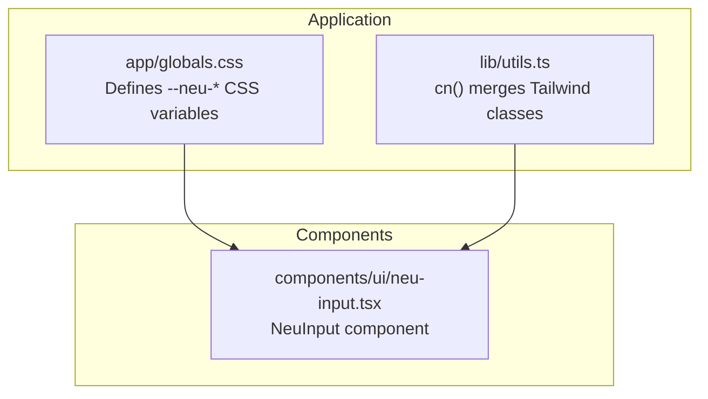
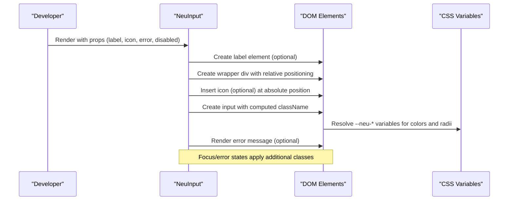
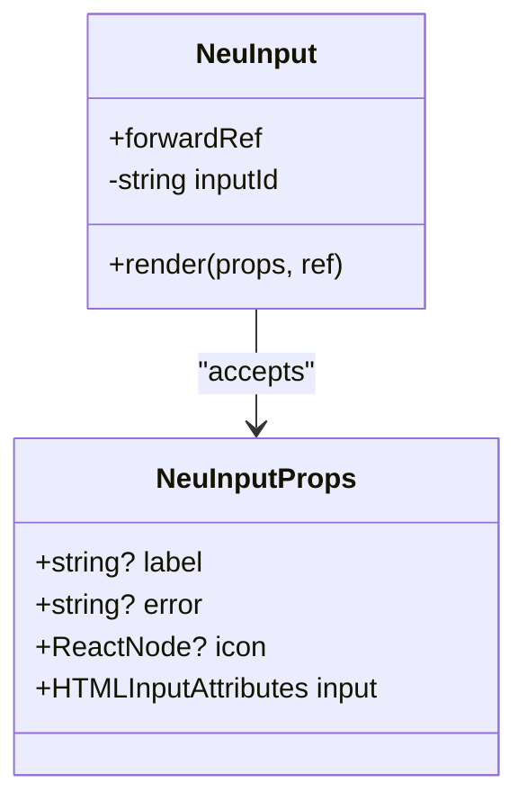
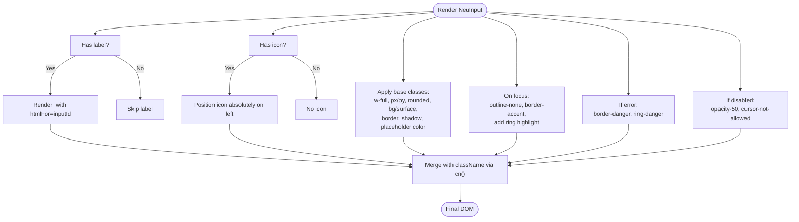
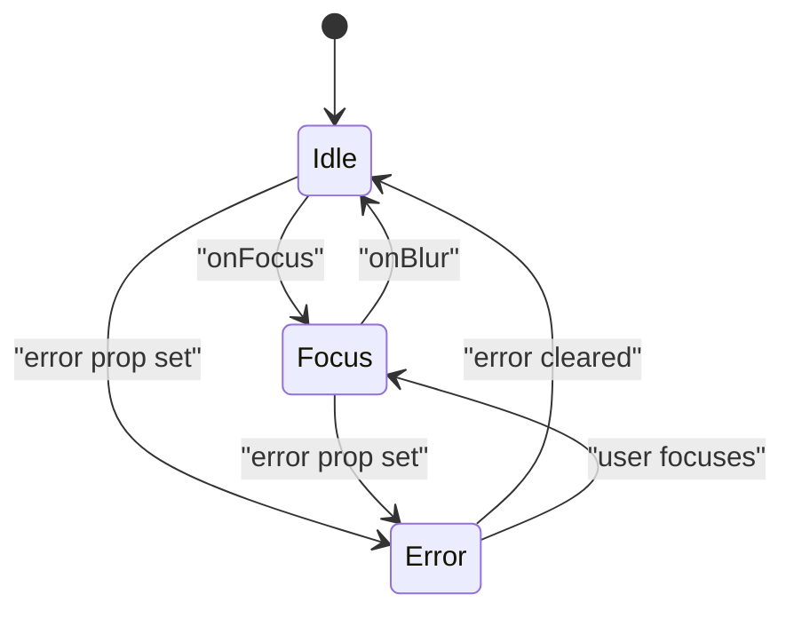
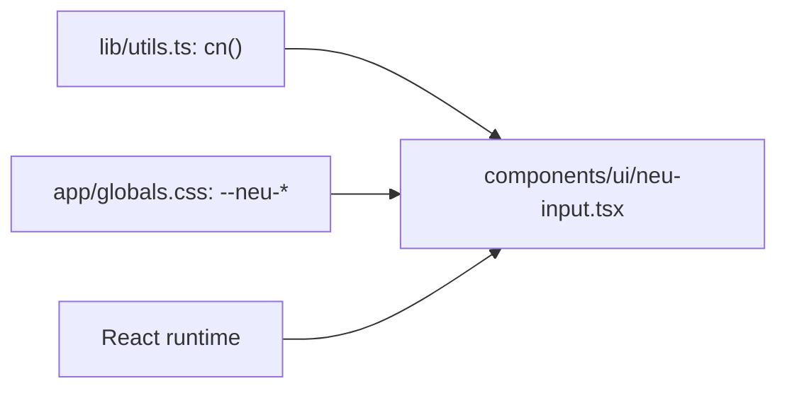

# NeuInput Component

<cite>
**Referenced Files in This Document**
- [neu-input.tsx](file://components/ui/neu-input.tsx)
- [globals.css](file://app/globals.css)
- [utils.ts](file://lib/utils.ts)
- [shadcn-accessibility.md](file://ui-ux-pro-max-skill/.claude/skills/ui-styling/references/shadcn-accessibility.md)
- [states-and-variants.md](file://ui-ux-pro-max-skill/.claude/skills/design-system/references/states-and-variants.md)
- [app-interface.csv](file://ui-ux-pro-max-skill/src/ui-ux-pro-max/data/app-interface.csv)
</cite>

## Table of Contents
1. [Introduction](#introduction)
2. [Project Structure](#project-structure)
3. [Core Components](#core-components)
4. [Architecture Overview](#architecture-overview)
5. [Detailed Component Analysis](#detailed-component-analysis)
6. [Dependency Analysis](#dependency-analysis)
7. [Performance Considerations](#performance-considerations)
8. [Troubleshooting Guide](#troubleshooting-guide)
9. [Conclusion](#conclusion)

## Introduction
NeuInput is a custom input field component designed with a neumorphic aesthetic. It provides a modern, soft-ui inspired appearance with subtle inner and outer shadows, smooth transitions, and a cohesive design system. The component supports optional labels, icons, error states, and integrates seamlessly with form libraries through standard React props. It also follows accessibility best practices for labeling, focus management, and error communication.

## Project Structure
The NeuInput component resides in the UI components directory and is styled using CSS custom properties defined in the global stylesheet. Utility functions handle class merging, ensuring consistent styling across variants.

**Diagram sources**
- [globals.css:1-61](file://app/globals.css#L1-L61)
- [utils.ts:1-7](file://lib/utils.ts#L1-L7)
- [neu-input.tsx:1-64](file://components/ui/neu-input.tsx#L1-L64)

**Section sources**
- [globals.css:1-61](file://app/globals.css#L1-L61)
- [utils.ts:1-7](file://lib/utils.ts#L1-L7)
- [neu-input.tsx:1-64](file://components/ui/neu-input.tsx#L1-L64)

## Core Components
NeuInput is a forwardRef component that composes a label, an optional icon, an input field, and an optional error message. It leverages CSS custom properties for theming and Tailwind-like utility classes merged via a helper function.

Key capabilities:
- Optional label with accessible association
- Optional leading icon with proper spacing
- Focus states with accent color and ring highlight
- Error state with danger color and ring highlight
- Disabled state with reduced opacity
- Placeholder text color aligned with the design system
- Smooth transitions for interactive states

**Section sources**
- [neu-input.tsx:6-10](file://components/ui/neu-input.tsx#L6-L10)
- [neu-input.tsx:12-59](file://components/ui/neu-input.tsx#L12-L59)
- [globals.css:3-23](file://app/globals.css#L3-L23)

## Architecture Overview
The component architecture centers on composition and CSS custom properties. The input inherits standard HTML input attributes while adding neumorphic styling and optional UX enhancements.

**Diagram sources**
- [neu-input.tsx:16-57](file://components/ui/neu-input.tsx#L16-L57)
- [globals.css:3-23](file://app/globals.css#L3-L23)

## Detailed Component Analysis

### Props and Composition
NeuInput accepts standard input attributes plus extension props for label, error message, and an optional leading icon. It generates an ID if none is provided and associates the label accordingly.

**Diagram sources**
- [neu-input.tsx:6-10](file://components/ui/neu-input.tsx#L6-L10)
- [neu-input.tsx:12-14](file://components/ui/neu-input.tsx#L12-L14)

**Section sources**
- [neu-input.tsx:6-10](file://components/ui/neu-input.tsx#L6-L10)
- [neu-input.tsx:12-14](file://components/ui/neu-input.tsx#L12-L14)

### Styling System and Tokens
NeuInput relies on CSS custom properties for colors, borders, shadows, and radii. These variables define the neumorphic palette and ensure consistent theming across the application.

**Diagram sources**
- [neu-input.tsx:18-55](file://components/ui/neu-input.tsx#L18-L55)
- [globals.css:3-23](file://app/globals.css#L3-L23)
- [utils.ts:4-6](file://lib/utils.ts#L4-L6)

**Section sources**
- [globals.css:3-23](file://app/globals.css#L3-L23)
- [utils.ts:4-6](file://lib/utils.ts#L4-L6)
- [neu-input.tsx:35-47](file://components/ui/neu-input.tsx#L35-L47)

### Focus States and Validation Indicators
Focus and error states are implemented through conditional class application. Focus applies accent border and a translucent ring highlight, while error switches to danger colors and ring.

**Diagram sources**
- [neu-input.tsx:42-44](file://components/ui/neu-input.tsx#L42-L44)

**Section sources**
- [neu-input.tsx:42-44](file://components/ui/neu-input.tsx#L42-L44)

### Accessibility and Keyboard Navigation
NeuInput supports accessibility through:
- Label association via htmlFor and generated IDs
- Proper focus management with outline removal and explicit ring highlights
- Error communication via aria-invalid and describedby patterns
- Semantic HTML structure

Integration patterns for form libraries:
- Pass control props directly to the input
- Use fieldState to derive aria-invalid and aria-describedby
- Ensure error messages have unique IDs and are associated with the input

**Section sources**
- [neu-input.tsx:18-24](file://components/ui/neu-input.tsx#L18-L24)
- [neu-input.tsx:32-49](file://components/ui/neu-input.tsx#L32-L49)
- [shadcn-accessibility.md:222-244](file://ui-ux-pro-max-skill/.claude/skills/ui-styling/references/shadcn-accessibility.md#L222-L244)
- [states-and-variants.md:227-241](file://ui-ux-pro-max-skill/.claude/skills/design-system/references/states-and-variants.md#L227-L241)
- [app-interface.csv:1-6](file://ui-ux-pro-max-skill/src/ui-ux-pro-max/data/app-interface.csv#L1-L6)

### Responsive Behavior and Placeholder Handling
- Width: The component uses a full-width utility to adapt to container widths.
- Icon spacing: When an icon is present, left padding is increased to accommodate the icon.
- Placeholder: Placeholder text color aligns with the muted text token for consistent readability.

**Section sources**
- [neu-input.tsx:17](file://components/ui/neu-input.tsx#L17)
- [neu-input.tsx:27-31](file://components/ui/neu-input.tsx#L27-L31)
- [neu-input.tsx:45](file://components/ui/neu-input.tsx#L45)
- [globals.css:15](file://app/globals.css#L15)

### Examples and Usage Patterns
Below are conceptual examples of how to use NeuInput across different scenarios. Replace the placeholder code snippets with your own implementation details.

- Basic text input with label and icon
  - Reference: [neu-input.tsx:18-31](file://components/ui/neu-input.tsx#L18-L31)
- Input with validation error
  - Reference: [neu-input.tsx:51-55](file://components/ui/neu-input.tsx#L51-L55)
- Disabled input
  - Reference: [neu-input.tsx:43](file://components/ui/neu-input.tsx#L43)
- Form library integration (pattern)
  - Reference: [shadcn-accessibility.md:222-244](file://ui-ux-pro-max-skill/.claude/skills/ui-styling/references/shadcn-accessibility.md#L222-L244)

## Dependency Analysis
NeuInput depends on:
- CSS custom properties for theming
- A utility function for merging classes
- React for component composition and refs

**Diagram sources**
- [utils.ts:4-6](file://lib/utils.ts#L4-L6)
- [globals.css:3-23](file://app/globals.css#L3-L23)
- [neu-input.tsx:3-4](file://components/ui/neu-input.tsx#L3-L4)

**Section sources**
- [utils.ts:4-6](file://lib/utils.ts#L4-L6)
- [globals.css:3-23](file://app/globals.css#L3-L23)
- [neu-input.tsx:3-4](file://components/ui/neu-input.tsx#L3-L4)

## Performance Considerations
- CSS custom properties are resolved efficiently and avoid expensive reflows when toggling states.
- Conditional classes are applied minimally; avoid excessive re-renders by controlling when error props change.
- Icon rendering is lightweight; ensure the icon component itself is optimized.

## Troubleshooting Guide
Common issues and resolutions:
- Label not associated with input
  - Ensure an id is passed or rely on the generated ID; associate the label via htmlFor.
  - Reference: [neu-input.tsx:18-24](file://components/ui/neu-input.tsx#L18-L24)
- Error message not announced to assistive technologies
  - Use aria-invalid and aria-describedby to connect the input to the error message.
  - Reference: [shadcn-accessibility.md:222-244](file://ui-ux-pro-max-skill/.claude/skills/ui-styling/references/shadcn-accessibility.md#L222-L244)
- Focus ring not visible
  - Verify focus styles are not overridden by global styles; ensure focus classes are applied.
  - Reference: [neu-input.tsx:42](file://components/ui/neu-input.tsx#L42)
- Disabled state not clearly indicated
  - Confirm disabled classes are applied and that the cursor reflects non-interactive state.
  - Reference: [neu-input.tsx:43](file://components/ui/neu-input.tsx#L43)

**Section sources**
- [neu-input.tsx:18-24](file://components/ui/neu-input.tsx#L18-L24)
- [shadcn-accessibility.md:222-244](file://ui-ux-pro-max-skill/.claude/skills/ui-styling/references/shadcn-accessibility.md#L222-L244)
- [neu-input.tsx:42-43](file://components/ui/neu-input.tsx#L42-L43)

## Conclusion
NeuInput delivers a cohesive neumorphic input experience with strong accessibility and integration patterns. By leveraging CSS custom properties and a utility-based class merging strategy, it remains flexible and maintainable. Following the documented patterns ensures consistent focus states, validation indicators, and error handling across applications.