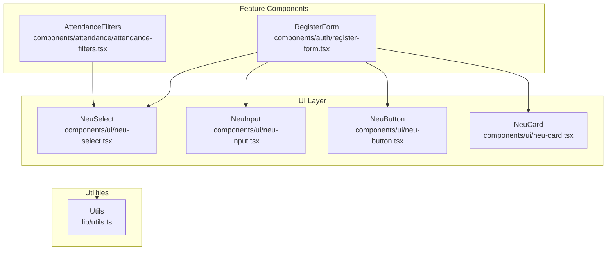
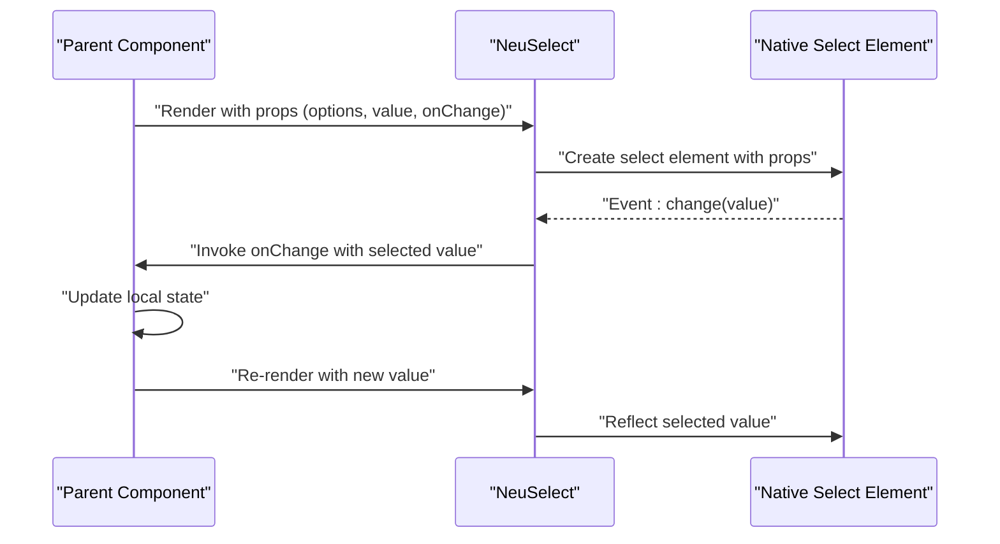
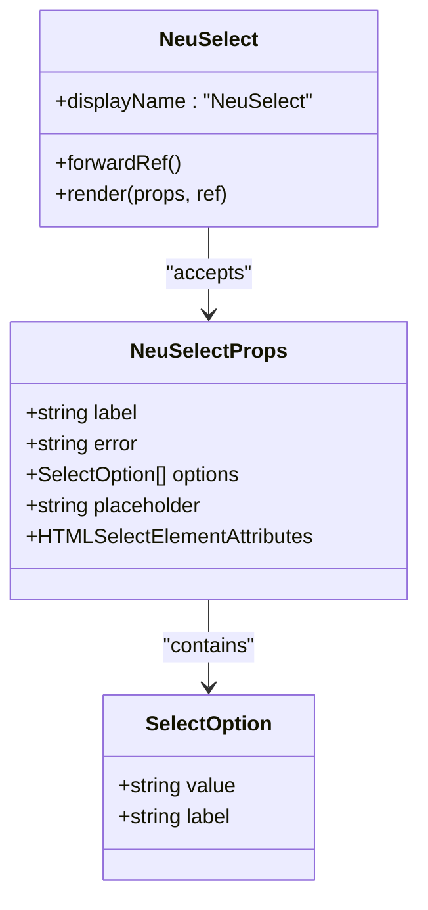
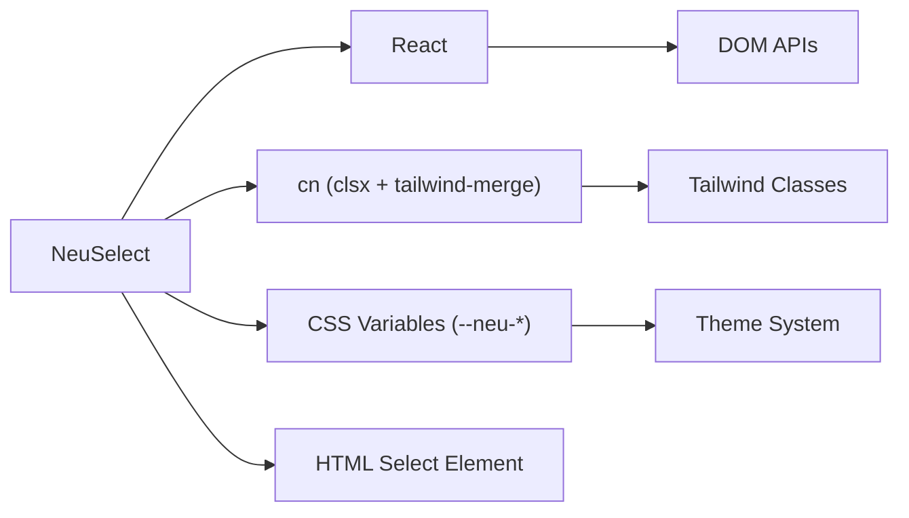

# NeuSelect Component

<cite>
**Referenced Files in This Document**
- [neu-select.tsx](file://components/ui/neu-select.tsx)
- [register-form.tsx](file://components/auth/register-form.tsx)
- [attendance-filters.tsx](file://components/attendance/attendance-filters.tsx)
- [utils.ts](file://lib/utils.ts)
</cite>

## Table of Contents
1. [Introduction](#introduction)
2. [Project Structure](#project-structure)
3. [Core Components](#core-components)
4. [Architecture Overview](#architecture-overview)
5. [Detailed Component Analysis](#detailed-component-analysis)
6. [Dependency Analysis](#dependency-analysis)
7. [Performance Considerations](#performance-considerations)
8. [Troubleshooting Guide](#troubleshooting-guide)
9. [Conclusion](#conclusion)

## Introduction
NeuSelect is a custom React component designed to provide a modern, accessible, and visually consistent dropdown/select interface within the AttendEase application. Built with TypeScript and styled using CSS variables for theming, it integrates seamlessly with form validation and supports both single and multi-select patterns. The component emphasizes accessibility compliance, responsive behavior, and extensibility through props and styling hooks.

## Project Structure
NeuSelect resides in the UI components layer alongside other primitives such as NeuInput, NeuButton, and NeuCard. It is consumed by higher-level components like RegisterForm and AttendanceFilters, which demonstrate real-world usage patterns including form integration, dynamic option loading, and filter management.

**Diagram sources**
- [neu-select.tsx:1-91](file://components/ui/neu-select.tsx#L1-L91)
- [register-form.tsx:1-257](file://components/auth/register-form.tsx#L1-L257)
- [attendance-filters.tsx:1-145](file://components/attendance/attendance-filters.tsx#L1-L145)
- [utils.ts:1-7](file://lib/utils.ts#L1-L7)

**Section sources**
- [neu-select.tsx:1-91](file://components/ui/neu-select.tsx#L1-L91)
- [register-form.tsx:1-257](file://components/auth/register-form.tsx#L1-L257)
- [attendance-filters.tsx:1-145](file://components/attendance/attendance-filters.tsx#L1-L145)
- [utils.ts:1-7](file://lib/utils.ts#L1-L7)

## Core Components
NeuSelect is a forwardRef component that wraps a native HTML select element. It accepts a strongly typed options array and exposes props for label, error state, placeholder, and standard select attributes. The component renders a custom chevron indicator and applies theme-aware styling via CSS variables.

Key characteristics:
- Strongly typed option model with value and label fields
- Accessible labeling with automatic ID generation
- Error state styling with dedicated danger palette
- Placeholder option support
- Theme integration through CSS variables (--neu-* tokens)
- Utility class merging for flexible customization

**Section sources**
- [neu-select.tsx:6-16](file://components/ui/neu-select.tsx#L6-L16)
- [neu-select.tsx:18-88](file://components/ui/neu-select.tsx#L18-L88)

## Architecture Overview
NeuSelect follows a unidirectional data flow pattern typical of controlled components. Parent components manage state and pass down options, selected values, and handlers. The component renders a native select element with enhanced styling and accessibility attributes.

**Diagram sources**
- [neu-select.tsx:18-88](file://components/ui/neu-select.tsx#L18-L88)
- [register-form.tsx:61-66](file://components/auth/register-form.tsx#L61-L66)
- [attendance-filters.tsx:104-120](file://components/attendance/attendance-filters.tsx#L104-L120)

## Detailed Component Analysis

### Component Structure and Props
NeuSelect defines a minimal yet powerful API surface:
- Options: Array of SelectOption objects with value and label
- Label: Optional field label for accessibility
- Error: Error message display with visual feedback
- Placeholder: Initial disabled option for empty selection
- Standard select attributes: All HTMLSelectElement attributes except size

Implementation highlights:
- Uses React.forwardRef for DOM access
- Generates unique IDs when none provided
- Applies theme-aware CSS classes via cn utility
- Renders custom chevron indicator positioned absolutely

**Diagram sources**
- [neu-select.tsx:6-16](file://components/ui/neu-select.tsx#L6-L16)
- [neu-select.tsx:18-88](file://components/ui/neu-select.tsx#L18-L88)

**Section sources**
- [neu-select.tsx:6-16](file://components/ui/neu-select.tsx#L6-L16)
- [neu-select.tsx:18-88](file://components/ui/neu-select.tsx#L18-L88)

### Option Rendering and Selection Handling
NeuSelect maps the provided options array to option elements. The component supports:
- Static option arrays (as seen in RegisterForm)
- Dynamic option arrays built from API responses (as seen in AttendanceFilters)
- Controlled selection via value prop
- Change event propagation through onChange handler

Selection patterns demonstrated:
- Single select with string values
- Controlled state management in parent components
- Placeholder option for optional selections

**Section sources**
- [neu-select.tsx:55-59](file://components/ui/neu-select.tsx#L55-L59)
- [register-form.tsx:34-45](file://components/auth/register-form.tsx#L34-L45)
- [attendance-filters.tsx:69-75](file://components/attendance/attendance-filters.tsx#L69-L75)

### Form Validation Integration
NeuSelect integrates with form validation through several mechanisms:
- Controlled component pattern enabling validation on change
- Error prop for displaying validation messages
- Visual feedback through error state styling
- Native form submission compatibility

Validation examples:
- Real-time validation clearing on user input
- Email format validation with select field integration
- Multi-field form validation with select participation

**Section sources**
- [register-form.tsx:61-66](file://components/auth/register-form.tsx#L61-L66)
- [register-form.tsx:68-96](file://components/auth/register-form.tsx#L68-L96)

### Accessibility Compliance
NeuSelect implements several accessibility best practices:
- Automatic ID generation for proper label association
- Proper label htmlFor attribute linking
- Focus management and keyboard navigation support
- Semantic HTML structure with native select element
- Color contrast compliant with theme variables

Accessibility features:
- Unique ID generation when not provided
- Label element with proper association
- Focus-visible indicators through theme styling
- Disabled state handling for screen readers

**Section sources**
- [neu-select.tsx:20-30](file://components/ui/neu-select.tsx#L20-L30)
- [neu-select.tsx:33-35](file://components/ui/neu-select.tsx#L33-L35)

### Keyboard Navigation
The component inherits standard keyboard navigation from the native select element:
- Tab navigation to focus the control
- Arrow keys for option selection
- Enter/Space to confirm selection
- Escape to close dropdown (browser default behavior)

Enhanced keyboard behavior:
- Focus ring integration with theme accent colors
- Smooth transitions for focus states
- Consistent sizing and spacing for touch targets

**Section sources**
- [neu-select.tsx:41-47](file://components/ui/neu-select.tsx#L41-L47)

### Custom Option Rendering
While the current implementation renders standard option elements, the component's architecture supports extension for custom rendering:
- Wrapper div for additional content
- Custom chevron indicator replacement
- Alternative styling approaches
- Integration with virtualized lists for large datasets

Current implementation limitations:
- Uses native option elements for simplicity
- No custom renderer prop for individual options
- Limited customization of option presentation

**Section sources**
- [neu-select.tsx:55-59](file://components/ui/neu-select.tsx#L55-L59)
- [neu-select.tsx:62-76](file://components/ui/neu-select.tsx#L62-L76)

### Filtering Capabilities
NeuSelect itself does not implement client-side filtering. However, it works effectively with filtered option sets:
- Parent components can pre-filter options
- Dynamic option updates trigger re-rendering
- Loading states can be managed externally
- Debounced search patterns can be implemented in parent components

Integration patterns:
- API-driven option loading with loading states
- Client-side filtering in parent components
- Debounced search with option regeneration

**Section sources**
- [attendance-filters.tsx:51-67](file://components/attendance/attendance-filters.tsx#L51-L67)
- [attendance-filters.tsx:104-120](file://components/attendance/attendance-filters.tsx#L104-L120)

### Dynamic Option Loading
The component supports dynamic option loading through external data sources:
- API integration for option population
- Loading state management
- Error handling for failed requests
- Empty state representation

Example implementation:
- Employee dropdown with lazy loading
- Status options with predefined values
- Department options with optional selection

**Section sources**
- [attendance-filters.tsx:51-75](file://components/attendance/attendance-filters.tsx#L51-L75)
- [register-form.tsx:34-45](file://components/auth/register-form.tsx#L34-L45)

### Styling Customization
NeuSelect leverages a comprehensive theming system:
- CSS variable-based theming (--neu-* tokens)
- Tailwind-like utility classes via cn function
- Responsive design through container classes
- Focus states with accent color integration
- Error states with danger palette

Styling categories:
- Surface and background colors
- Text and border colors
- Shadow effects for neumorphic design
- Transition effects for interactive states
- Disabled state handling

**Section sources**
- [neu-select.tsx:36-47](file://components/ui/neu-select.tsx#L36-L47)
- [utils.ts:4-6](file://lib/utils.ts#L4-L6)

### Responsive Behavior
The component exhibits responsive behavior through:
- Full-width container by default
- Flexible padding and spacing scales
- Adaptive focus rings and shadows
- Mobile-friendly touch targets
- Container queries for advanced layouts

Responsive features:
- 100% width container
- Consistent padding across breakpoints
- Focus ring scaling for accessibility
- Icon sizing for different contexts

**Section sources**
- [neu-select.tsx:22-23](file://components/ui/neu-select.tsx#L22-L23)
- [neu-select.tsx:36-47](file://components/ui/neu-select.tsx#L36-L47)

## Dependency Analysis
NeuSelect maintains loose coupling with minimal external dependencies:
- React for component functionality
- cn utility for class merging
- CSS variables for theming
- Native HTML select element for behavior

**Diagram sources**
- [neu-select.tsx:3-4](file://components/ui/neu-select.tsx#L3-L4)
- [utils.ts:4-6](file://lib/utils.ts#L4-L6)

**Section sources**
- [neu-select.tsx:3-4](file://components/ui/neu-select.tsx#L3-L4)
- [utils.ts:4-6](file://lib/utils.ts#L4-L6)

## Performance Considerations
NeuSelect is optimized for performance through:
- Minimal re-renders via controlled component pattern
- Lightweight wrapper around native select element
- Efficient CSS variable usage
- No unnecessary DOM manipulation
- Lazy option rendering through mapping

Performance best practices:
- Keep option arrays reasonably sized
- Use controlled components to avoid unnecessary updates
- Leverage CSS variables for smooth transitions
- Consider virtualization for very large option sets

## Troubleshooting Guide
Common issues and solutions:

### Selection Not Updating
- Verify controlled component pattern is used
- Ensure onChange handler updates parent state
- Check that value prop reflects current selection
- Confirm event handler signature matches expectations

### Styling Issues
- Verify CSS variables are properly defined
- Check that cn utility merges classes correctly
- Ensure theme provider is configured
- Validate Tailwind configuration includes required plugins

### Accessibility Problems
- Confirm label htmlFor attribute matches select ID
- Verify unique ID generation when not provided
- Test keyboard navigation thoroughly
- Validate focus management across states

**Section sources**
- [neu-select.tsx:20-30](file://components/ui/neu-select.tsx#L20-L30)
- [neu-select.tsx:36-47](file://components/ui/neu-select.tsx#L36-L47)

## Conclusion
NeuSelect provides a robust, accessible, and customizable dropdown solution tailored for the AttendEase application. Its design balances simplicity with extensibility, offering strong integration with form validation while maintaining excellent accessibility compliance. The component's theming system and responsive behavior make it suitable for diverse UI contexts, and its controlled component pattern ensures predictable behavior in complex applications.