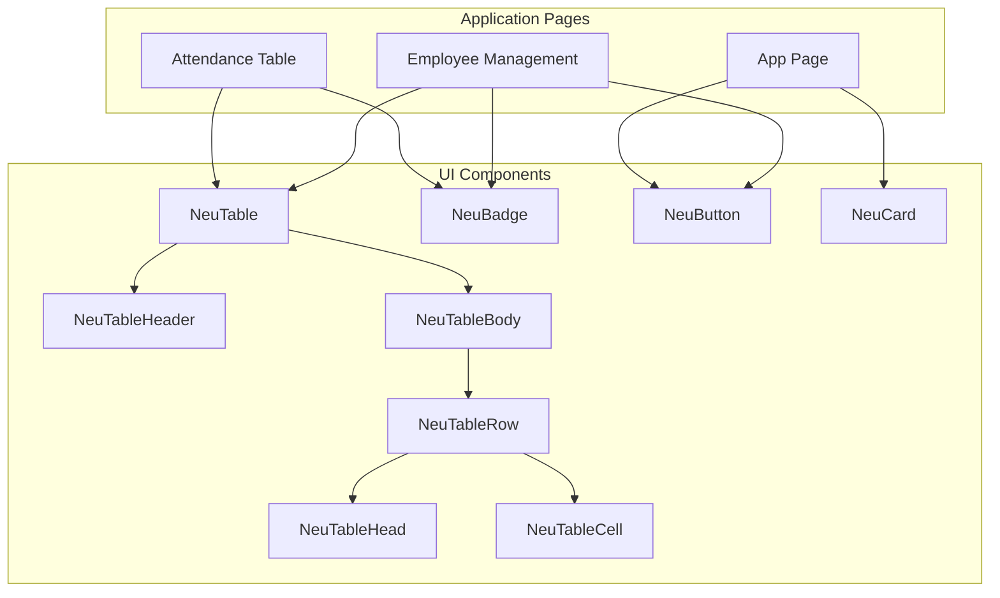
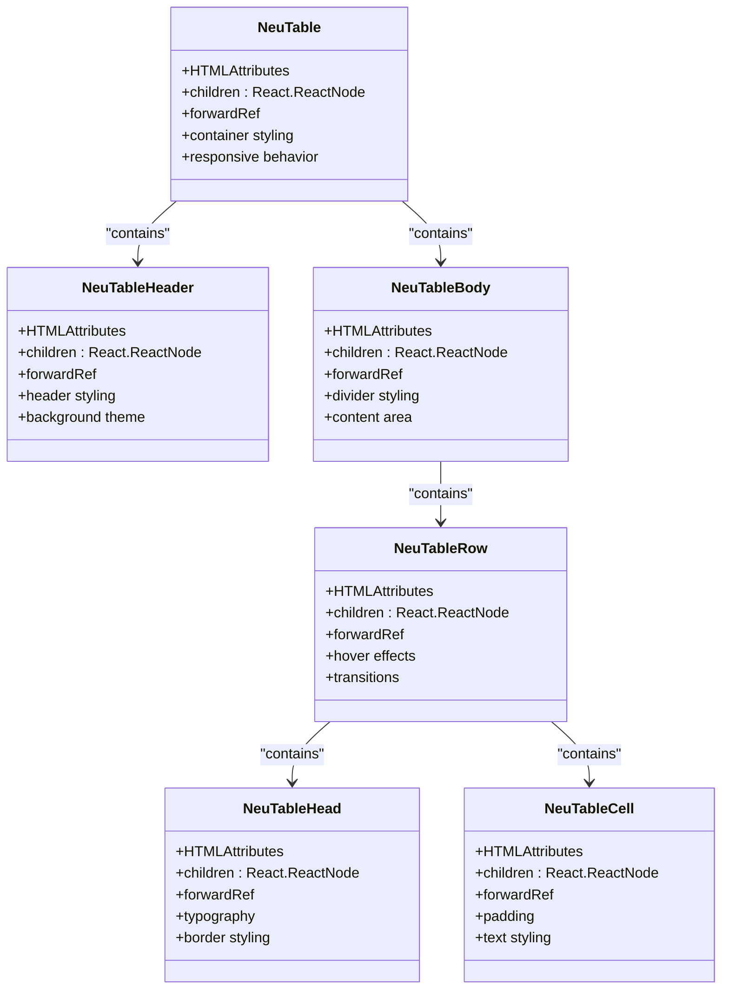
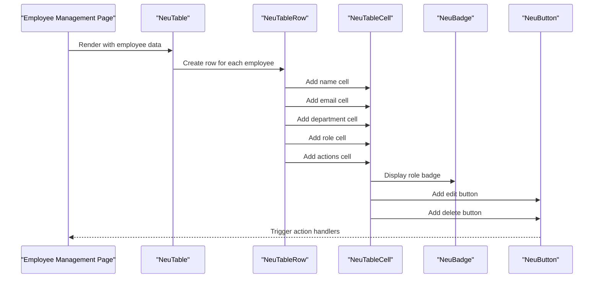
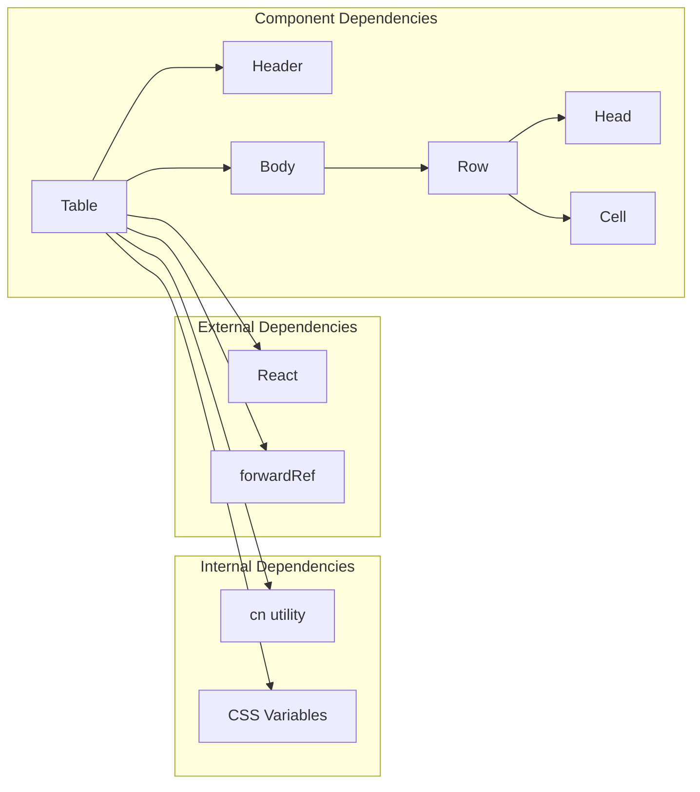

# NeuTable Component

<cite>
**Referenced Files in This Document**
- [neu-table.tsx](file://components/ui/neu-table.tsx)
- [neu-badge.tsx](file://components/ui/neu-badge.tsx)
- [neu-button.tsx](file://components/ui/neu-button.tsx)
- [neu-card.tsx](file://components/ui/neu-card.tsx)
- [attendance-table.tsx](file://components/attendance/attendance-table.tsx)
- [page.tsx](file://app/page.tsx)
- [employee-management-page.tsx](file://app/(dashboard)/admin/employees/page.tsx)
</cite>

## Table of Contents
1. [Introduction](#introduction)
2. [Project Structure](#project-structure)
3. [Core Components](#core-components)
4. [Architecture Overview](#architecture-overview)
5. [Detailed Component Analysis](#detailed-component-analysis)
6. [Dependency Analysis](#dependency-analysis)
7. [Performance Considerations](#performance-considerations)
8. [Troubleshooting Guide](#troubleshooting-guide)
9. [Conclusion](#conclusion)

## Introduction
NeuTable is a customizable table component designed for the AttendEase application. It provides a consistent, visually appealing table structure with built-in styling tokens and responsive behavior. The component supports nested table elements (header, body, rows, cells) and integrates seamlessly with other Neu UI components like badges and buttons for enhanced data visualization and interactivity.

## Project Structure
The NeuTable component is part of the unified UI system under the components/ui directory. It is consumed by various pages and components throughout the application, including the attendance dashboard and employee management interface.

**Diagram sources**
- [neu-table.tsx:1-164](file://components/ui/neu-table.tsx#L1-L164)
- [neu-badge.tsx:1-73](file://components/ui/neu-badge.tsx#L1-L73)
- [neu-button.tsx:1-112](file://components/ui/neu-button.tsx#L1-L112)
- [neu-card.tsx:1-180](file://components/ui/neu-card.tsx#L1-L180)
- [attendance-table.tsx:1-126](file://components/attendance/attendance-table.tsx#L1-L126)
- [employee-management-page.tsx:1-560](file://app/(dashboard)/admin/employees/page.tsx#L1-L560)

**Section sources**
- [neu-table.tsx:1-164](file://components/ui/neu-table.tsx#L1-L164)
- [attendance-table.tsx:1-126](file://components/attendance/attendance-table.tsx#L1-L126)
- [employee-management-page.tsx:1-560](file://app/(dashboard)/admin/employees/page.tsx#L1-L560)

## Core Components
The NeuTable system consists of six primary components that work together to create a cohesive table structure:

### Table Container
The main NeuTable component serves as the container for the entire table structure. It provides the foundational styling and responsive behavior through CSS variables and shadow effects.

### Structural Elements
- **NeuTableHeader**: Defines the table header section with distinct styling
- **NeuTableBody**: Contains the main table content with divider styling
- **NeuTableRow**: Individual table rows with hover effects and transitions
- **NeuTableHead**: Header cells with typography and border styling
- **NeuTableCell**: Standard data cells with consistent padding and text styling

### Integration Components
- **NeuBadge**: Used for status indicators and visual data representation
- **NeuButton**: Provides interactive elements within table cells
- **NeuCard**: Wraps tables for better presentation in dashboard contexts

**Section sources**
- [neu-table.tsx:6-164](file://components/ui/neu-table.tsx#L6-L164)
- [neu-badge.tsx:6-73](file://components/ui/neu-badge.tsx#L6-L73)
- [neu-button.tsx:6-112](file://components/ui/neu-button.tsx#L6-L112)
- [neu-card.tsx:6-180](file://components/ui/neu-card.tsx#L6-L180)

## Architecture Overview
The NeuTable component follows a composition pattern where individual elements nest within each other to form a complete table structure. The component leverages CSS custom properties for theming and provides consistent styling across the application.

**Diagram sources**
- [neu-table.tsx:10-149](file://components/ui/neu-table.tsx#L10-L149)

## Detailed Component Analysis

### NeuTable Implementation
The main table component provides the foundational structure with responsive design and theme integration.

Key features:
- **Responsive Design**: Automatic horizontal scrolling for small screens
- **Theme Integration**: Uses CSS custom properties for consistent theming
- **Shadow Effects**: 3D-like appearance with light and dark shadow layers
- **Border System**: Consistent border styling with theme-aware colors

### Table Structure Elements
Each structural element maintains consistent spacing and typography while supporting customization through props and CSS classes.

#### Header Section
The header component establishes the top section of the table with elevated styling and proper contrast against the main content area.

#### Body Section
The body component manages the main content area with divider lines and hover interactions for improved user experience.

#### Row and Cell Components
Individual rows and cells provide consistent padding, typography, and interaction states that align with the overall design system.

### Data Visualization Patterns
The component integrates with other UI elements to create effective data presentations:

**Diagram sources**
- [employee-management-page.tsx:314-377](file://app/(dashboard)/admin/employees/page.tsx#L314-L377)
- [neu-badge.tsx:41-67](file://components/ui/neu-badge.tsx#L41-L67)
- [neu-button.tsx:61-106](file://components/ui/neu-button.tsx#L61-L106)

### Column Configuration Examples
The table supports flexible column configurations through its structural components:

#### Basic Employee Table
- Name (text)
- Email (text)
- Department (text)
- Role (badge indicator)
- Actions (interactive buttons)

#### Attendance Records Table
- Employee Name (text)
- Department (text)
- Date (formatted date)
- Check In/Check Out (formatted time)
- Hours Worked (formatted numeric)
- Status (badge with color coding)

### Interactive Features
The component supports various interactive elements through integration with other Neu UI components:

- **Action Buttons**: Edit and delete functionality with appropriate styling
- **Status Badges**: Color-coded indicators for different states
- **Hover Effects**: Smooth transitions and visual feedback
- **Focus States**: Accessible keyboard navigation support

**Section sources**
- [neu-table.tsx:10-149](file://components/ui/neu-table.tsx#L10-L149)
- [attendance-table.tsx:79-125](file://components/attendance/attendance-table.tsx#L79-L125)
- [employee-management-page.tsx:314-377](file://app/(dashboard)/admin/employees/page.tsx#L314-L377)

## Dependency Analysis
The NeuTable component has minimal external dependencies and integrates well with the broader UI ecosystem.

**Diagram sources**
- [neu-table.tsx:1-32](file://components/ui/neu-table.tsx#L1-L32)

### Component Relationships
The table components maintain loose coupling while providing strong structural relationships:
- Parent-child relationships are explicit through component composition
- Shared styling through CSS custom properties ensures consistency
- Type safety through TypeScript interfaces prevents runtime errors

**Section sources**
- [neu-table.tsx:1-164](file://components/ui/neu-table.tsx#L1-L164)

## Performance Considerations
For large datasets, consider these optimization strategies:

### Virtualization
- Implement row virtualization for datasets exceeding 1000+ entries
- Use windowing techniques to render only visible rows
- Debounce scroll events for smooth performance

### Data Formatting
- Cache formatted values to avoid repeated computations
- Use memoization for expensive formatting operations
- Implement lazy loading for images and heavy content

### Rendering Optimization
- Use React.memo for stable child components
- Implement key-based rendering for efficient DOM updates
- Minimize re-renders through proper state management

### Memory Management
- Clean up event listeners and subscriptions
- Use weak references for large object references
- Implement pagination for better memory footprint

## Troubleshooting Guide

### Common Issues and Solutions

#### Styling Problems
- **Issue**: Table appears unstyled or inconsistent
- **Solution**: Verify CSS custom properties are properly defined in the theme
- **Check**: Ensure parent containers have proper theme context

#### Responsive Behavior
- **Issue**: Horizontal overflow on desktop
- **Solution**: Confirm the outer container has `overflow-x-auto` class
- **Check**: Verify viewport meta tags are properly configured

#### Interaction Problems
- **Issue**: Hover effects not working
- **Solution**: Check for CSS conflicts with global styles
- **Verify**: Ensure transition utilities are available

#### Accessibility Concerns
- **Issue**: Screen reader compatibility issues
- **Solution**: Add proper ARIA attributes for interactive elements
- **Check**: Implement keyboard navigation support

**Section sources**
- [neu-table.tsx:10-28](file://components/ui/neu-table.tsx#L10-L28)
- [neu-badge.tsx:41-67](file://components/ui/neu-badge.tsx#L41-L67)

## Conclusion
NeuTable provides a robust, theme-consistent table solution for the AttendEase application. Its modular architecture allows for flexible column configurations while maintaining visual coherence across the application. The component's integration with other Neu UI elements creates a unified design system that enhances both functionality and user experience.

The component's responsive design ensures usability across different screen sizes, while its theme integration provides consistent visual identity. For production deployments with large datasets, consider implementing virtualization and performance optimizations to maintain optimal user experience.