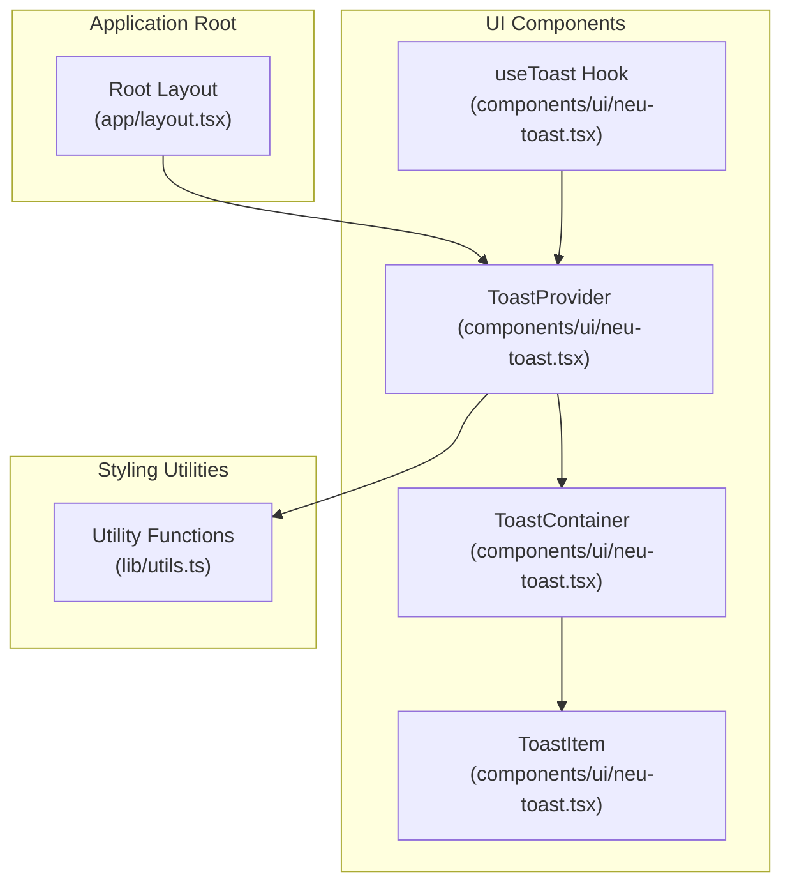
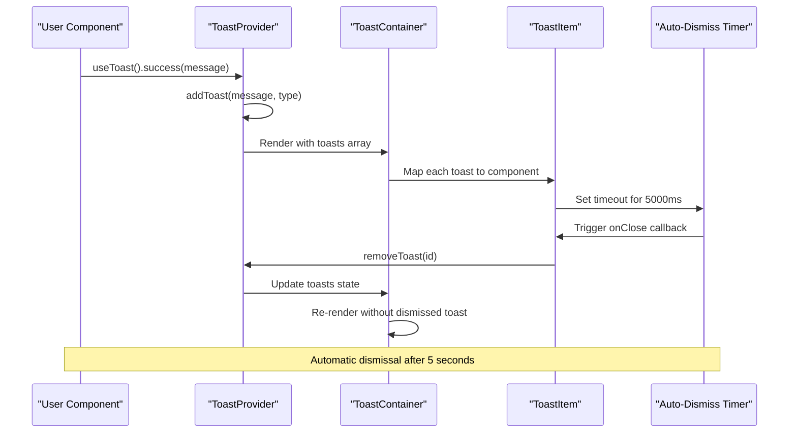
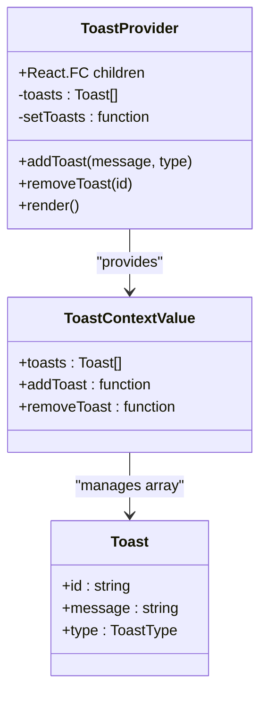
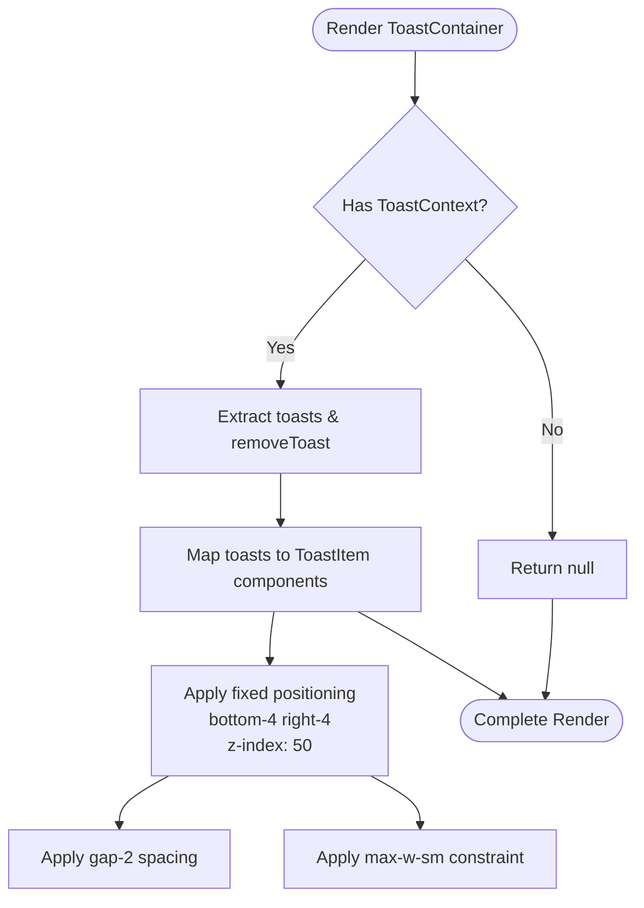
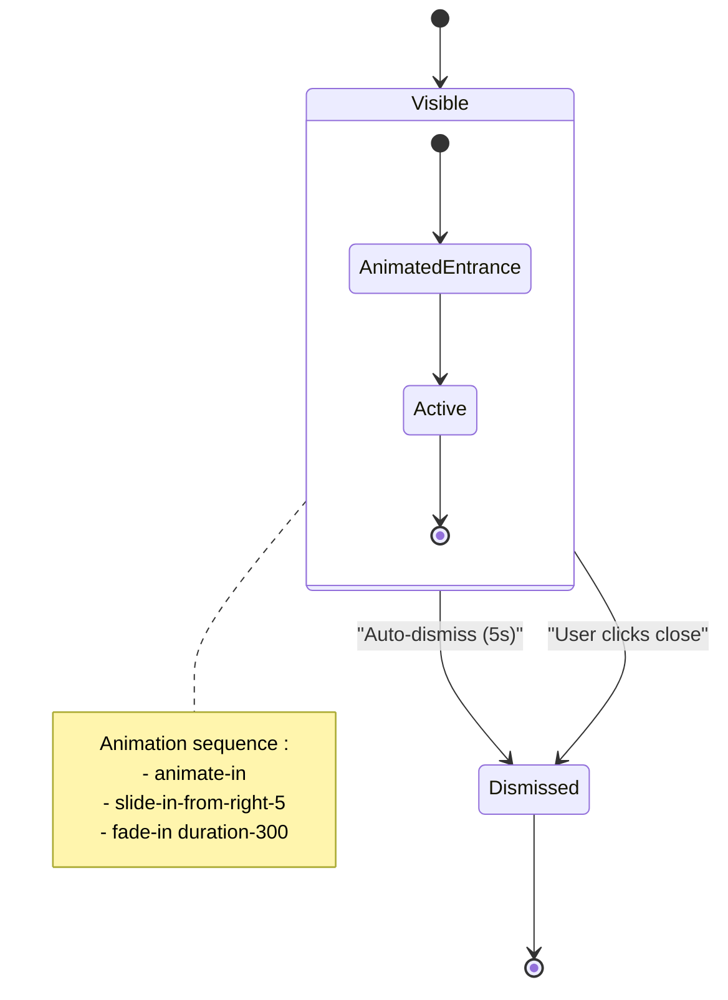
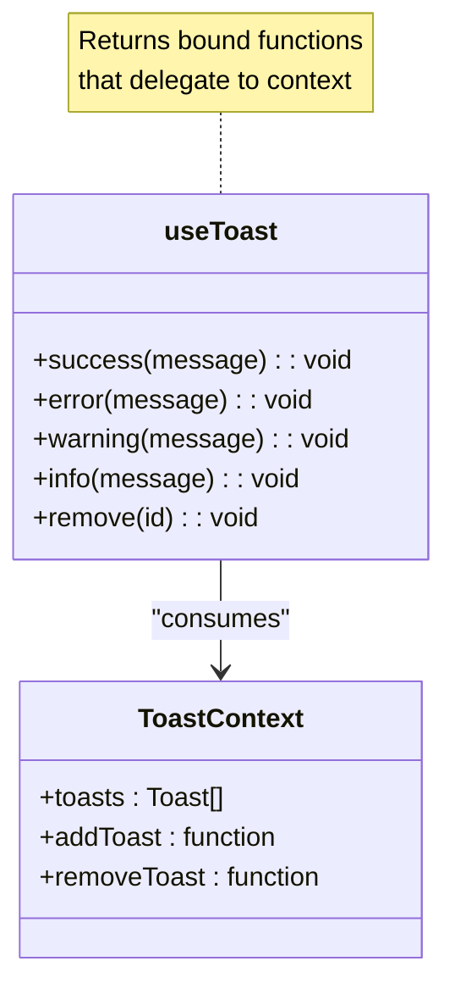
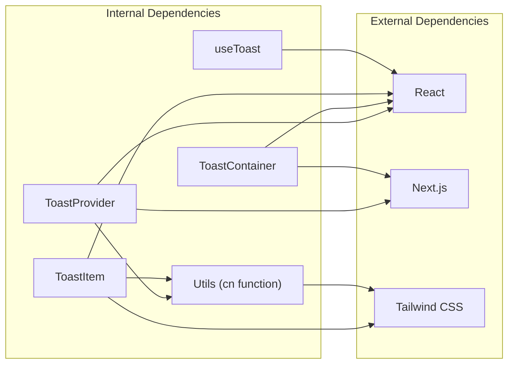

# NeuToast Component

<cite>
**Referenced Files in This Document**
- [neu-toast.tsx](file://components/ui/neu-toast.tsx)
- [layout.tsx](file://app/layout.tsx)
- [utils.ts](file://lib/utils.ts)
</cite>

## Table of Contents
1. [Introduction](#introduction)
2. [Project Structure](#project-structure)
3. [Core Components](#core-components)
4. [Architecture Overview](#architecture-overview)
5. [Detailed Component Analysis](#detailed-component-analysis)
6. [Dependency Analysis](#dependency-analysis)
7. [Performance Considerations](#performance-considerations)
8. [Troubleshooting Guide](#troubleshooting-guide)
9. [Conclusion](#conclusion)

## Introduction
NeuToast is a lightweight, theme-aware notification system built with React and Next.js. It provides contextual feedback through four distinct toast types (success, error, warning, info) with automatic dismissal, customizable positioning, and full accessibility support. The component integrates seamlessly with Next.js app router architecture and follows modern React patterns using context for state management and hooks for consumption.

The system features a neuomorphic design language with CSS custom properties for theming, smooth animations using Tailwind CSS utilities, and responsive behavior optimized for desktop experiences. Notifications appear in the bottom-right corner by default but can be easily customized to any viewport position.

## Project Structure
The NeuToast component is organized within the UI components directory and integrates with the application's root layout. The structure demonstrates clear separation of concerns with dedicated files for component implementation, styling utilities, and application integration.

**Diagram sources**
- [neu-toast.tsx:107-125](file://components/ui/neu-toast.tsx#L107-L125)
- [neu-toast.tsx:127-140](file://components/ui/neu-toast.tsx#L127-L140)
- [neu-toast.tsx:147-198](file://components/ui/neu-toast.tsx#L147-L198)
- [layout.tsx:4](file://app/layout.tsx#L4)

**Section sources**
- [neu-toast.tsx:1-215](file://components/ui/neu-toast.tsx#L1-L215)
- [layout.tsx:1-38](file://app/layout.tsx#L1-L38)
- [utils.ts:1-7](file://lib/utils.ts#L1-L7)

## Core Components
The NeuToast system consists of five primary building blocks that work together to provide comprehensive notification functionality:

### Toast Types and Styling
The component supports four distinct toast types, each with unique visual styling and semantic meaning:

- **Success**: Green accent color with checkmark icon, indicates successful operations
- **Error**: Red danger color with X icon, signals failure or critical issues  
- **Warning**: Yellow warning color with exclamation icon, alerts about potential problems
- **Info**: Blue accent color with informational icon, provides general guidance

Each type maintains consistent spacing, typography, and interactive states while preserving the neuomorphic design aesthetic.

### State Management Architecture
The system uses React Context to manage toast state globally, enabling notifications to be triggered from anywhere in the component tree. The context provides three essential functions:
- `addToast`: Creates new notifications with specified message and type
- `removeToast`: Removes individual notifications programmatically
- `toasts`: Current queue of active notifications

### Auto-Dismiss Functionality
Notifications automatically dismiss after 5 seconds using a timeout mechanism. This ensures users aren't overwhelmed by persistent notifications while maintaining sufficient time for message comprehension.

**Section sources**
- [neu-toast.tsx:6](file://components/ui/neu-toast.tsx#L6)
- [neu-toast.tsx:22-105](file://components/ui/neu-toast.tsx#L22-L105)
- [neu-toast.tsx:107-125](file://components/ui/neu-toast.tsx#L107-L125)
- [neu-toast.tsx:150-153](file://components/ui/neu-toast.tsx#L150-L153)

## Architecture Overview
The NeuToast architecture follows React best practices with a provider pattern for state management and a hook-based consumption model. The system integrates deeply with Next.js routing and maintains performance through efficient re-rendering strategies.

**Diagram sources**
- [neu-toast.tsx:107-125](file://components/ui/neu-toast.tsx#L107-L125)
- [neu-toast.tsx:127-140](file://components/ui/neu-toast.tsx#L127-L140)
- [neu-toast.tsx:147-198](file://components/ui/neu-toast.tsx#L147-L198)
- [neu-toast.tsx:150-153](file://components/ui/neu-toast.tsx#L150-L153)

The architecture ensures thread-safe state updates and prevents memory leaks through proper cleanup of timers and event listeners.

**Section sources**
- [neu-toast.tsx:107-198](file://components/ui/neu-toast.tsx#L107-L198)
- [layout.tsx:32-33](file://app/layout.tsx#L32-L33)

## Detailed Component Analysis

### ToastProvider Component
The ToastProvider serves as the central state manager for all notifications. It maintains an array of toast objects and exposes three essential methods through React Context.

**Diagram sources**
- [neu-toast.tsx:107-125](file://components/ui/neu-toast.tsx#L107-L125)
- [neu-toast.tsx:8](file://components/ui/neu-toast.tsx#L8)
- [neu-toast.tsx:14](file://components/ui/neu-toast.tsx#L14)

The provider generates unique identifiers for each toast using cryptographic randomness, ensuring collision resistance even under high-frequency usage. The state management leverages React's built-in memoization through useCallback hooks to prevent unnecessary re-renders.

### ToastContainer Implementation
The ToastContainer handles positioning and layout of all active notifications. It renders notifications in a fixed-position column with controlled spacing and maximum width constraints.

**Diagram sources**
- [neu-toast.tsx:127-140](file://components/ui/neu-toast.tsx#L127-L140)

The container uses Tailwind CSS utility classes for responsive design and ensures notifications don't interfere with page content through appropriate z-index stacking.

### ToastItem Component
Each individual notification displays message content, type-specific styling, and interactive controls. The component implements sophisticated animation sequences and accessibility features.

**Diagram sources**
- [neu-toast.tsx:147-198](file://components/ui/neu-toast.tsx#L147-L198)
- [neu-toast.tsx:150-153](file://components/ui/neu-toast.tsx#L150-L153)

The item component includes comprehensive accessibility features:
- Role attribute set to "alert" for screen reader compatibility
- Proper contrast ratios maintained through CSS custom properties
- Keyboard navigable close button with focus indicators
- ARIA labels for assistive technologies

### useToast Hook
The useToast hook provides a convenient interface for consuming toast functionality throughout the application. It returns four specialized functions for different notification types plus a removal method.

**Diagram sources**
- [neu-toast.tsx:200-212](file://components/ui/neu-toast.tsx#L200-L212)
- [neu-toast.tsx:14](file://components/ui/neu-toast.tsx#L14)

The hook enforces proper usage by throwing descriptive errors when called outside the provider context, preventing runtime issues during development.

**Section sources**
- [neu-toast.tsx:107-198](file://components/ui/neu-toast.tsx#L107-L198)
- [neu-toast.tsx:200-212](file://components/ui/neu-toast.tsx#L200-L212)

## Dependency Analysis
The NeuToast component maintains minimal external dependencies while leveraging core React and Next.js capabilities. Understanding these relationships is crucial for maintenance and extension.

**Diagram sources**
- [neu-toast.tsx:3](file://components/ui/neu-toast.tsx#L3)
- [neu-toast.tsx:4](file://components/ui/neu-toast.tsx#L4)
- [layout.tsx:4](file://app/layout.tsx#L4)

The component relies on:
- **React**: Core library for component architecture and hooks
- **Next.js**: App router integration and server-side rendering compatibility
- **Tailwind CSS**: Utility-first styling with CSS custom property theming
- **clsx/twMerge**: Efficient class name merging for dynamic styling

**Section sources**
- [neu-toast.tsx:1-7](file://components/ui/neu-toast.tsx#L1-L7)
- [utils.ts:1-7](file://lib/utils.ts#L1-L7)

## Performance Considerations
NeuToast is designed with performance optimization in mind, implementing several strategies to minimize overhead and maintain smooth user experience:

### Rendering Optimization
- **Selective Re-rendering**: Individual toast items only re-render when their specific state changes
- **Memoized Callbacks**: State update functions use useCallback to prevent unnecessary prop changes
- **Efficient DOM Structure**: Minimal DOM nodes per notification (single wrapper div with contained elements)

### Memory Management
- **Automatic Cleanup**: Timers are properly cleared when components unmount
- **Immediate Removal**: Toasts are removed from state immediately upon user action
- **No Event Listener Accumulation**: Clean separation between component lifecycle and state management

### Animation Performance
- **Hardware Acceleration**: CSS transforms and opacity changes leverage GPU acceleration
- **Optimized Timing Functions**: Smooth 300ms fade transitions without blocking the main thread
- **Reduced Paint Areas**: Limited number of animated properties minimizes repaint overhead

## Troubleshooting Guide

### Common Issues and Solutions

**Issue: "useToast must be used within a ToastProvider"**
- **Cause**: Hook called outside of provider boundary
- **Solution**: Ensure component tree is wrapped with ToastProvider in root layout
- **Prevention**: Wrap application root with `<ToastProvider>{children}</ToastProvider>`

**Issue: Notifications not appearing**
- **Cause**: ToastContainer not receiving toasts array
- **Solution**: Verify provider is correctly imported and used in layout
- **Debug**: Check browser dev tools for React context inspection

**Issue: Styling conflicts with existing CSS**
- **Cause**: Tailwind utility class collisions
- **Solution**: Review CSS custom properties and utility class precedence
- **Prevention**: Use scoped styling or adjust z-index values

**Issue: Accessibility screen reader problems**
- **Cause**: Missing ARIA attributes or semantic roles
- **Solution**: Verify role="alert" and aria-label attributes are present
- **Testing**: Use screen readers to validate announcement behavior

### Performance Debugging
- **Monitor Re-renders**: Use React DevTools Profiler to identify unnecessary component updates
- **Check Animation Performance**: Inspect paint and composite metrics in browser dev tools
- **Validate Memory Usage**: Monitor component lifecycle and cleanup procedures

**Section sources**
- [neu-toast.tsx:201-204](file://components/ui/neu-toast.tsx#L201-L204)
- [layout.tsx:32-33](file://app/layout.tsx#L32-L33)

## Conclusion
NeuToast represents a well-architected notification system that balances functionality, accessibility, and performance. Its modular design enables easy integration into existing applications while maintaining consistency with modern React patterns and Next.js best practices.

The component's strength lies in its simplicity and reliability—four distinct notification types with automatic dismissal, comprehensive accessibility support, and seamless theming integration. The provider-based architecture ensures global availability without complex prop drilling, while the hook-based consumption model provides intuitive developer experience.

Future enhancements could include customizable positioning options, animation customization, and programmatic queue management for advanced use cases. However, the current implementation provides an excellent foundation for most notification requirements in modern web applications.