# UI Components

<cite>
**Referenced Files in This Document**
- [component-specs.md](file://ui-ux-pro-max-skill/.claude/skills/design-system/references/component-specs.md)
- [component-tokens.md](file://ui-ux-pro-max-skill/.claude/skills/design-system/references/component-tokens.md)
- [primitive-tokens.md](file://ui-ux-pro-max-skill/.claude/skills/design-system/references/primitive-tokens.md)
- [semantic-tokens.md](file://ui-ux-pro-max-skill/.claude/skills/design-system/references/semantic-tokens.md)
- [states-and-variants.md](file://ui-ux-pro-max-skill/.claude/skills/design-system/references/states-and-variants.md)
- [tailwind-integration.md](file://ui-ux-pro-max-skill/.claude/skills/design-system/references/tailwind-integration.md)
- [tailwind-responsive.md](file://ui-ux-pro-max-skill/.claude/skills/ui-styling/references/tailwind-responsive.md)
- [shadcn-accessibility.md](file://ui-ux-pro-max-skill/.claude/skills/ui-styling/references/shadcn-accessibility.md)
- [ux-guidelines.csv](file://ui-ux-pro-max-skill/src/ui-ux-pro-max/data/ux-guidelines.csv)
- [app-interface.csv](file://ui-ux-pro-max-skill/cli/assets/data/app-interface.csv)
- [styles.csv](file://ui-ux-pro-max-skill/src/ui-ux-pro-max/data/styles.csv)
- [generate-slide.py](file://ui-ux-pro-max-skill/.claude/skills/design-system/scripts/generate-slide.py)
</cite>

## Table of Contents
1. [Introduction](#introduction)
2. [Project Structure](#project-structure)
3. [Core Components](#core-components)
4. [Architecture Overview](#architecture-overview)
5. [Detailed Component Analysis](#detailed-component-analysis)
6. [Dependency Analysis](#dependency-analysis)
7. [Performance Considerations](#performance-considerations)
8. [Troubleshooting Guide](#troubleshooting-guide)
9. [Conclusion](#conclusion)
10. [Appendices](#appendices)

## Introduction
This document describes the custom design system and its UI components. It focuses on the neu- prefixed component library (buttons, cards, inputs, tables, and dialogs), design tokens, color schemes, and responsive behavior. It also covers accessibility, cross-browser compatibility, and performance optimization patterns grounded in the repository’s specifications and integration references.

## Project Structure
The design system is organized around a three-layer token architecture:
- Primitive tokens: raw values for colors, spacing, typography, radii, shadows, motion, and z-index.
- Semantic tokens: purpose-based aliases referencing primitives.
- Component tokens: per-component overrides referencing semantic tokens.

These layers are complemented by state and variant definitions, Tailwind integration, and responsive behavior guidance.

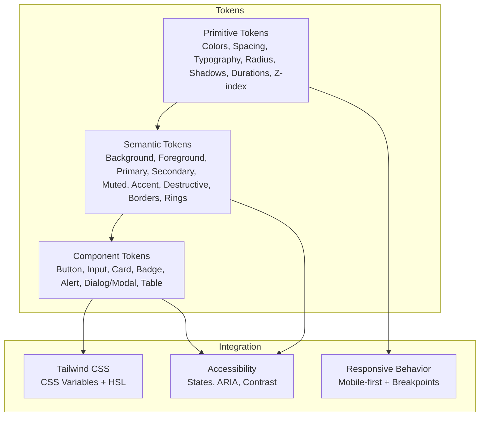

**Diagram sources**
- [token-architecture.md:1-225](file://ui-ux-pro-max-skill/.claude/skills/design-system/references/token-architecture.md#L1-L225)
- [primitive-tokens.md:1-204](file://ui-ux-pro-max-skill/.claude/skills/design-system/references/primitive-tokens.md#L1-L204)
- [semantic-tokens.md:1-216](file://ui-ux-pro-max-skill/.claude/skills/design-system/references/semantic-tokens.md#L1-L216)
- [component-tokens.md:1-215](file://ui-ux-pro-max-skill/.claude/skills/design-system/references/component-tokens.md#L1-L215)
- [tailwind-integration.md:1-252](file://ui-ux-pro-max-skill/.claude/skills/design-system/references/tailwind-integration.md#L1-L252)
- [tailwind-responsive.md:1-383](file://ui-ux-pro-max-skill/.claude/skills/ui-styling/references/tailwind-responsive.md#L1-L383)

**Section sources**
- [token-architecture.md:1-225](file://ui-ux-pro-max-skill/.claude/skills/design-system/references/token-architecture.md#L1-L225)
- [primitive-tokens.md:1-204](file://ui-ux-pro-max-skill/.claude/skills/design-system/references/primitive-tokens.md#L1-L204)
- [semantic-tokens.md:1-216](file://ui-ux-pro-max-skill/.claude/skills/design-system/references/semantic-tokens.md#L1-L216)
- [component-tokens.md:1-215](file://ui-ux-pro-max-skill/.claude/skills/design-system/references/component-tokens.md#L1-L215)
- [tailwind-integration.md:1-252](file://ui-ux-pro-max-skill/.claude/skills/design-system/references/tailwind-integration.md#L1-L252)
- [tailwind-responsive.md:1-383](file://ui-ux-pro-max-skill/.claude/skills/ui-styling/references/tailwind-responsive.md#L1-L383)

## Core Components
This section documents the neu- prefixed components and their capabilities as defined in the design system references.

- Button
  - Variants: default, secondary, outline, ghost, link, destructive.
  - Sizes: sm, default, lg, icon.
  - States: default, hover, active, focus, disabled, loading.
  - Anatomy: optional leading/trailing icons, label text.
  - Composition: use component tokens to derive background, text, border, padding, radius, font size, and transitions.

- Input
  - Variants: default, textarea, select, checkbox, radio, switch.
  - Sizes: sm, default, lg.
  - States: default, hover, focus, error, disabled.
  - Anatomy: optional label, placeholder/value, action icon(s), helper/error text.
  - Composition: use component tokens for background, border, focus ring, placeholder, disabled states, and sizing.

- Card
  - Variants: default, elevated, outline, interactive.
  - Anatomy: header (title, description), content, footer (actions).
  - Spacing: header, content, footer paddings and inter-element gaps.
  - Composition: use component tokens for background, foreground, border, shadow, radius, and paddings.

- Badge
  - Variants: default, secondary, outline, destructive, success, warning.
  - Sizes: sm, default, lg.
  - Composition: use component tokens for background, text color, padding, radius, and font size.

- Alert
  - Variants: default, destructive, success, warning.
  - Anatomy: icon, title, description, optional close button.
  - Composition: use component tokens for background, border, foreground, and spacing.

- Dialog
  - Sizes: sm, default, lg, xl, full.
  - Anatomy: header (title, description, close), content (scrollable), footer (actions).
  - Composition: use component tokens for overlay, dialog background, border, shadow, radius, and padding.

- Table
  - Row states: default, hover, selected, striped.
  - Cell alignment: text left, numbers right, status/badge center, actions right.
  - Spacing: cell and header paddings, compact/default/comfortable row heights.
  - Composition: use component tokens for header/background, body background, borders, and spacing.

**Section sources**
- [component-specs.md:1-237](file://ui-ux-pro-max-skill/.claude/skills/design-system/references/component-specs.md#L1-L237)
- [component-tokens.md:1-215](file://ui-ux-pro-max-skill/.claude/skills/design-system/references/component-tokens.md#L1-L215)

## Architecture Overview
The design system follows a layered token architecture with Tailwind CSS integration and responsive behavior. Components are styled via component tokens that reference semantic tokens, which in turn reference primitive tokens. Dark mode is supported by overriding semantic tokens in a dark class context.

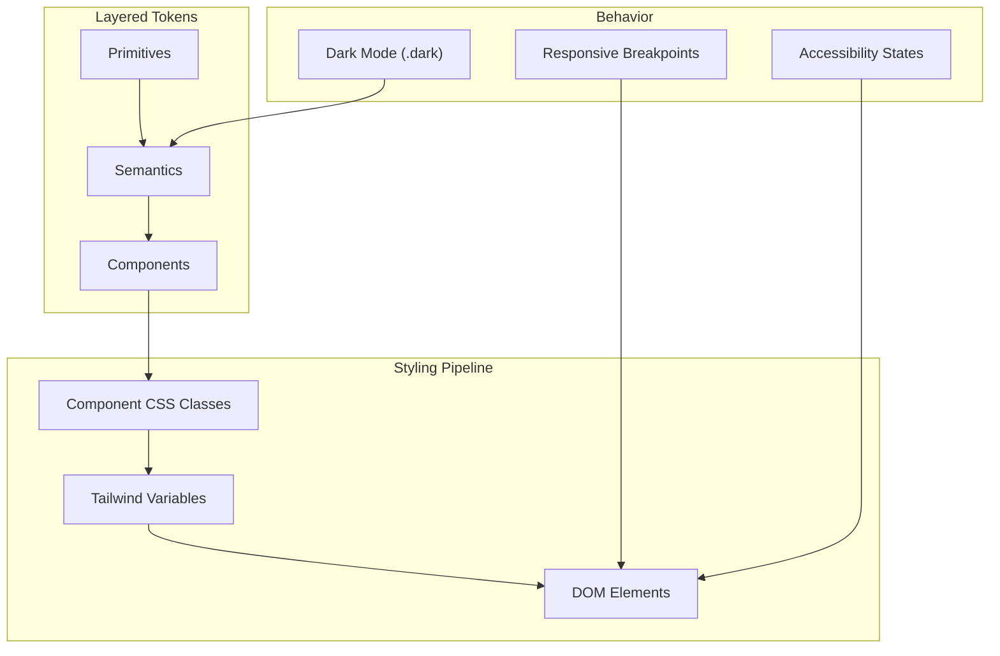

**Diagram sources**
- [token-architecture.md:1-225](file://ui-ux-pro-max-skill/.claude/skills/design-system/references/token-architecture.md#L1-L225)
- [component-tokens.md:1-215](file://ui-ux-pro-max-skill/.claude/skills/design-system/references/component-tokens.md#L1-L215)
- [tailwind-integration.md:1-252](file://ui-ux-pro-max-skill/.claude/skills/design-system/references/tailwind-integration.md#L1-L252)
- [states-and-variants.md:1-242](file://ui-ux-pro-max-skill/.claude/skills/design-system/references/states-and-variants.md#L1-L242)
- [tailwind-responsive.md:1-383](file://ui-ux-pro-max-skill/.claude/skills/ui-styling/references/tailwind-responsive.md#L1-L383)

## Detailed Component Analysis

### Button
- Props and styling
  - Variants: default, secondary, outline, ghost, link, destructive.
  - Sizes: sm, default, lg, icon.
  - States: default, hover, active, focus, disabled, loading.
  - Tokens: background, foreground, hover/active states, padding (x/y), radius, font size, weight.
- Accessibility
  - Focus ring via ring tokens; disabled via aria-disabled and pointer-events.
  - Loading state uses aria-busy and an assistive text element.
- Composition patterns
  - Use component tokens to define base styles and variant overrides.
  - Combine with Tailwind utilities for responsive sizing and transitions.

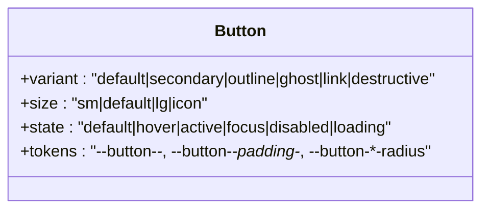

**Diagram sources**
- [component-specs.md:5-47](file://ui-ux-pro-max-skill/.claude/skills/design-system/references/component-specs.md#L5-L47)
- [component-tokens.md:5-47](file://ui-ux-pro-max-skill/.claude/skills/design-system/references/component-tokens.md#L5-L47)
- [states-and-variants.md:1-242](file://ui-ux-pro-max-skill/.claude/skills/design-system/references/states-and-variants.md#L1-L242)

**Section sources**
- [component-specs.md:5-47](file://ui-ux-pro-max-skill/.claude/skills/design-system/references/component-specs.md#L5-L47)
- [component-tokens.md:5-47](file://ui-ux-pro-max-skill/.claude/skills/design-system/references/component-tokens.md#L5-L47)
- [states-and-variants.md:1-242](file://ui-ux-pro-max-skill/.claude/skills/design-system/references/states-and-variants.md#L1-L242)

### Input
- Props and styling
  - Variants: default, textarea, select, checkbox, radio, switch.
  - Sizes: sm, default, lg.
  - States: default, hover, focus, error, disabled.
  - Tokens: background, border, focus ring, placeholder, disabled states, padding, radius, font size.
- Accessibility
  - Use aria-invalid for error states; associate labels; ensure focus visibility.
- Composition patterns
  - Apply component tokens for consistent base styling; vary via semantic tokens for error states.

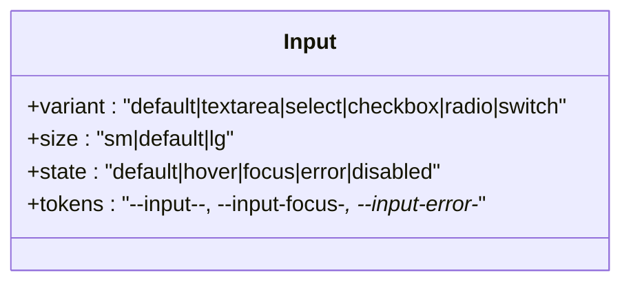

**Diagram sources**
- [component-specs.md:50-90](file://ui-ux-pro-max-skill/.claude/skills/design-system/references/component-specs.md#L50-L90)
- [component-tokens.md:49-79](file://ui-ux-pro-max-skill/.claude/skills/design-system/references/component-tokens.md#L49-L79)
- [states-and-variants.md:132-161](file://ui-ux-pro-max-skill/.claude/skills/design-system/references/states-and-variants.md#L132-L161)

**Section sources**
- [component-specs.md:50-90](file://ui-ux-pro-max-skill/.claude/skills/design-system/references/component-specs.md#L50-L90)
- [component-tokens.md:49-79](file://ui-ux-pro-max-skill/.claude/skills/design-system/references/component-tokens.md#L49-L79)
- [states-and-variants.md:132-161](file://ui-ux-pro-max-skill/.claude/skills/design-system/references/states-and-variants.md#L132-L161)

### Card
- Props and styling
  - Variants: default, elevated, outline, interactive.
  - Anatomy: header, content, footer; spacing and gap tokens.
  - Tokens: background, foreground, border, shadow, radius, padding.
- Composition patterns
  - Use component tokens to define elevation and hover states; combine with semantic tokens for surface colors.

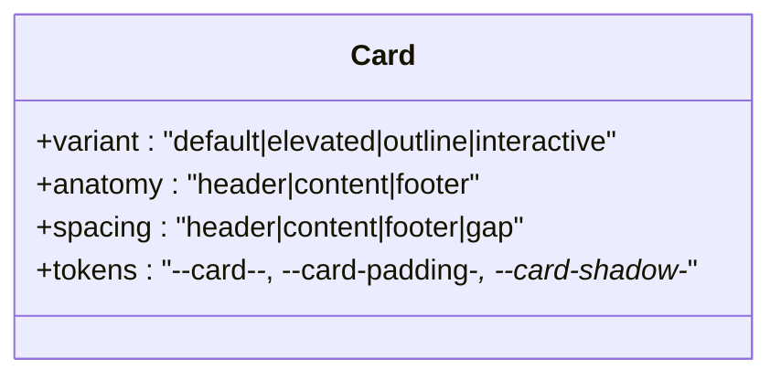

**Diagram sources**
- [component-specs.md:93-129](file://ui-ux-pro-max-skill/.claude/skills/design-system/references/component-specs.md#L93-L129)
- [component-tokens.md:81-102](file://ui-ux-pro-max-skill/.claude/skills/design-system/references/component-tokens.md#L81-L102)

**Section sources**
- [component-specs.md:93-129](file://ui-ux-pro-max-skill/.claude/skills/design-system/references/component-specs.md#L93-L129)
- [component-tokens.md:81-102](file://ui-ux-pro-max-skill/.claude/skills/design-system/references/component-tokens.md#L81-L102)

### Badge
- Props and styling
  - Variants: default, secondary, outline, destructive, success, warning.
  - Sizes: sm, default, lg.
  - Tokens: background, foreground, padding, radius, font size.
- Composition patterns
  - Use component tokens to maintain consistent color and sizing across contexts.

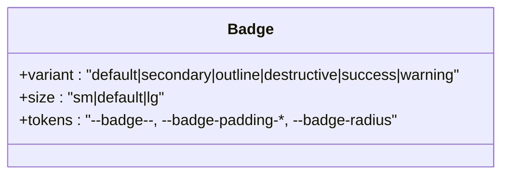

**Diagram sources**
- [component-specs.md:132-152](file://ui-ux-pro-max-skill/.claude/skills/design-system/references/component-specs.md#L132-L152)
- [component-tokens.md:104-130](file://ui-ux-pro-max-skill/.claude/skills/design-system/references/component-tokens.md#L104-L130)

**Section sources**
- [component-specs.md:132-152](file://ui-ux-pro-max-skill/.claude/skills/design-system/references/component-specs.md#L132-L152)
- [component-tokens.md:104-130](file://ui-ux-pro-max-skill/.claude/skills/design-system/references/component-tokens.md#L104-L130)

### Alert
- Props and styling
  - Variants: default, destructive, success, warning.
  - Anatomy: icon, title, description, optional close.
  - Tokens: background, border, foreground, spacing.
- Composition patterns
  - Use component tokens to unify alert visuals; pair with semantic tokens for status-specific colors.

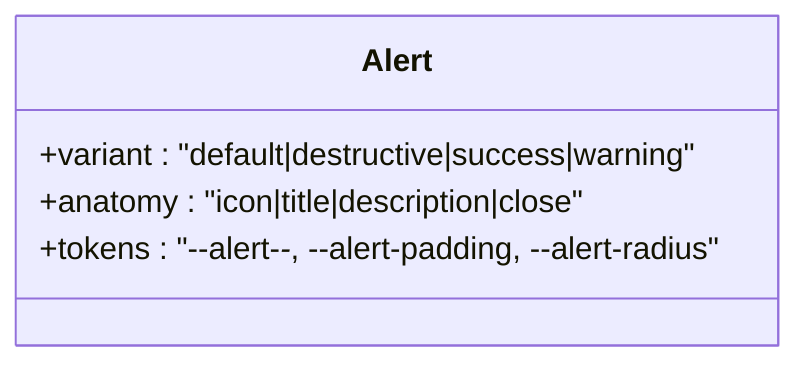

**Diagram sources**
- [component-specs.md:155-175](file://ui-ux-pro-max-skill/.claude/skills/design-system/references/component-specs.md#L155-L175)
- [component-tokens.md:132-149](file://ui-ux-pro-max-skill/.claude/skills/design-system/references/component-tokens.md#L132-L149)

**Section sources**
- [component-specs.md:155-175](file://ui-ux-pro-max-skill/.claude/skills/design-system/references/component-specs.md#L155-L175)
- [component-tokens.md:132-149](file://ui-ux-pro-max-skill/.claude/skills/design-system/references/component-tokens.md#L132-L149)

### Dialog
- Props and styling
  - Sizes: sm, default, lg, xl, full.
  - Anatomy: header, content, footer; overlay and modal tokens.
  - Tokens: overlay background, dialog background, border, shadow, radius, max width, padding.
- Composition patterns
  - Use component tokens to define consistent overlay and modal styles; adjust max width per size.

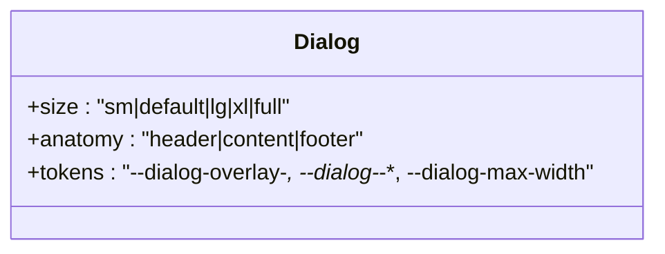

**Diagram sources**
- [component-specs.md:177-204](file://ui-ux-pro-max-skill/.claude/skills/design-system/references/component-specs.md#L177-L204)
- [component-tokens.md:151-169](file://ui-ux-pro-max-skill/.claude/skills/design-system/references/component-tokens.md#L151-L169)

**Section sources**
- [component-specs.md:177-204](file://ui-ux-pro-max-skill/.claude/skills/design-system/references/component-specs.md#L177-L204)
- [component-tokens.md:151-169](file://ui-ux-pro-max-skill/.claude/skills/design-system/references/component-tokens.md#L151-L169)

### Table
- Props and styling
  - Row states: default, hover, selected, striped.
  - Cell alignment: text left, numbers right, status/badge center, actions right.
  - Spacing: cell/header paddings, compact/default/comfortable row heights.
  - Tokens: header background/foreground, body background, row hover, borders, spacing.
- Composition patterns
  - Use component tokens to define striped and hover states; maintain consistent paddings.

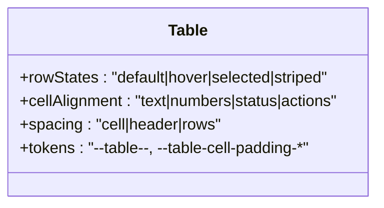

**Diagram sources**
- [component-specs.md:208-237](file://ui-ux-pro-max-skill/.claude/skills/design-system/references/component-specs.md#L208-L237)
- [component-tokens.md:171-191](file://ui-ux-pro-max-skill/.claude/skills/design-system/references/component-tokens.md#L171-L191)

**Section sources**
- [component-specs.md:208-237](file://ui-ux-pro-max-skill/.claude/skills/design-system/references/component-specs.md#L208-L237)
- [component-tokens.md:171-191](file://ui-ux-pro-max-skill/.claude/skills/design-system/references/component-tokens.md#L171-L191)

## Dependency Analysis
The design system’s styling pipeline depends on:
- Token layers: primitives feed semantics, which feed components.
- Tailwind integration: CSS variables mapped to Tailwind theme values for colors, radii, and transitions.
- Responsive behavior: mobile-first breakpoints and container queries.
- Accessibility: state definitions and ARIA patterns.

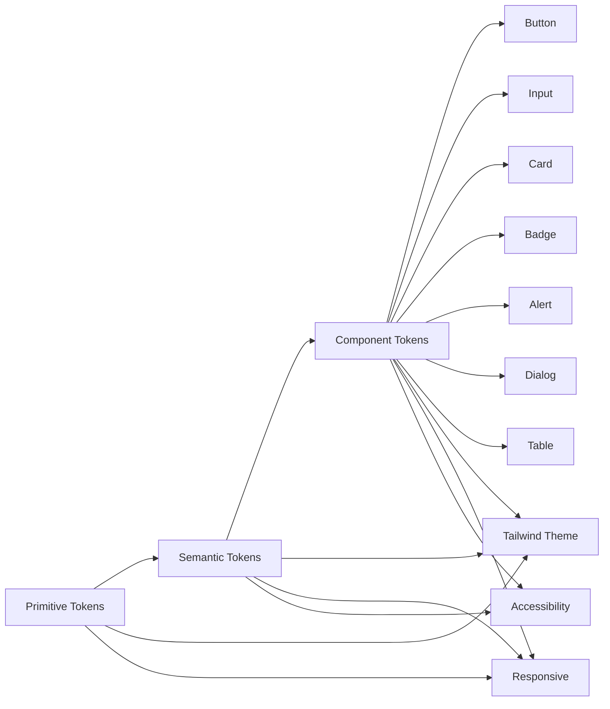

**Diagram sources**
- [token-architecture.md:1-225](file://ui-ux-pro-max-skill/.claude/skills/design-system/references/token-architecture.md#L1-L225)
- [component-tokens.md:1-215](file://ui-ux-pro-max-skill/.claude/skills/design-system/references/component-tokens.md#L1-L215)
- [tailwind-integration.md:1-252](file://ui-ux-pro-max-skill/.claude/skills/design-system/references/tailwind-integration.md#L1-L252)
- [tailwind-responsive.md:1-383](file://ui-ux-pro-max-skill/.claude/skills/ui-styling/references/tailwind-responsive.md#L1-L383)
- [states-and-variants.md:1-242](file://ui-ux-pro-max-skill/.claude/skills/design-system/references/states-and-variants.md#L1-L242)

**Section sources**
- [token-architecture.md:1-225](file://ui-ux-pro-max-skill/.claude/skills/design-system/references/token-architecture.md#L1-L225)
- [component-tokens.md:1-215](file://ui-ux-pro-max-skill/.claude/skills/design-system/references/component-tokens.md#L1-L215)
- [tailwind-integration.md:1-252](file://ui-ux-pro-max-skill/.claude/skills/design-system/references/tailwind-integration.md#L1-L252)
- [tailwind-responsive.md:1-383](file://ui-ux-pro-max-skill/.claude/skills/ui-styling/references/tailwind-responsive.md#L1-L383)
- [states-and-variants.md:1-242](file://ui-ux-pro-max-skill/.claude/skills/design-system/references/states-and-variants.md#L1-L242)

## Performance Considerations
- Prefer CSS transitions over JavaScript animations; use component tokens for consistent timing.
- Use transform and opacity for smooth, GPU-accelerated animations.
- Minimize heavy filters (e.g., blur) in performance-sensitive contexts; reserve for premium components.
- Keep component variants scoped to necessary states to reduce cascade complexity.
- Utilize Tailwind utilities for efficient, atomic styling.

[No sources needed since this section provides general guidance]

## Troubleshooting Guide
Common issues and resolutions:
- Insufficient color contrast
  - Ensure normal text meets 4.5:1 contrast; UI components meet 3:1; focus indicators meet 3:1.
  - Use semantic tokens to maintain contrast across themes.
- Disabled and loading states
  - Apply disabled attribute and aria-disabled; set pointer-events to none; reduce opacity.
  - For loading, use aria-busy and an assistive text element; keep spinner placement consistent.
- Error states
  - Use error border and focus ring tokens; place helper messages below inputs; clear on valid input.
- Accessibility labels and roles
  - Provide aria-labels for icon-only buttons; ensure form controls have labels or aria-labels.
  - Use semantic HTML elements (button, a, label) before ARIA attributes.
- Responsive edge cases
  - Test at exact breakpoints (320px, 640px, 768px, 1024px, 1280px); verify touch targets (min 44x44px).

**Section sources**
- [states-and-variants.md:209-242](file://ui-ux-pro-max-skill/.claude/skills/design-system/references/states-and-variants.md#L209-L242)
- [ux-guidelines.csv:36-42](file://ui-ux-pro-max-skill/src/ui-ux-pro-max/data/ux-guidelines.csv#L36-L42)
- [app-interface.csv:1-6](file://ui-ux-pro-max-skill/cli/assets/data/app-interface.csv#L1-L6)
- [tailwind-responsive.md:371-382](file://ui-ux-pro-max-skill/.claude/skills/ui-styling/references/tailwind-responsive.md#L371-L382)

## Conclusion
The design system provides a robust, layered token architecture that enables consistent theming, scalable component customization, and accessible UI patterns. By composing component tokens atop semantic and primitive layers, and integrating with Tailwind and responsive utilities, teams can build performant, inclusive interfaces across frameworks.

[No sources needed since this section summarizes without analyzing specific files]

## Appendices

### Design Tokens Reference
- Primitive tokens: colors (gray/blue scales), spacing (4px base), typography (sizes, line heights, weights, tracking), radii, shadows, motion durations, z-index.
- Semantic tokens: background/foreground, primary/secondary/muted/accent/destructive, borders/rings, spacing semantics, typography semantics, interactive states, dark mode overrides.
- Component tokens: button, input, card, badge, alert, dialog/modal, table.

**Section sources**
- [primitive-tokens.md:1-204](file://ui-ux-pro-max-skill/.claude/skills/design-system/references/primitive-tokens.md#L1-L204)
- [semantic-tokens.md:1-216](file://ui-ux-pro-max-skill/.claude/skills/design-system/references/semantic-tokens.md#L1-L216)
- [component-tokens.md:1-215](file://ui-ux-pro-max-skill/.claude/skills/design-system/references/component-tokens.md#L1-L215)

### Tailwind Integration and Responsive Behavior
- Tailwind configuration maps CSS variables to HSL-based colors, radii, and transitions; supports dark mode toggling and compatible shadcn/ui conventions.
- Responsive behavior follows a mobile-first approach with standard breakpoints and container queries.

**Section sources**
- [tailwind-integration.md:1-252](file://ui-ux-pro-max-skill/.claude/skills/design-system/references/tailwind-integration.md#L1-L252)
- [tailwind-responsive.md:1-383](file://ui-ux-pro-max-skill/.claude/skills/ui-styling/references/tailwind-responsive.md#L1-L383)

### Accessibility and Cross-Browser Compatibility
- Accessibility patterns include focus rings, disabled/loading/error states, ARIA attributes, and contrast requirements.
- Cross-browser compatibility is addressed by using standardized CSS transitions, focus-visible polyfills where needed, and avoiding unsupported features.

**Section sources**
- [states-and-variants.md:48-161](file://ui-ux-pro-max-skill/.claude/skills/design-system/references/states-and-variants.md#L48-L161)
- [shadcn-accessibility.md:295-361](file://ui-ux-pro-max-skill/.claude/skills/ui-styling/references/shadcn-accessibility.md#L295-L361)

### Component Implementation Flow (Buttons)
This sequence illustrates how component tokens are applied to generate button styles.

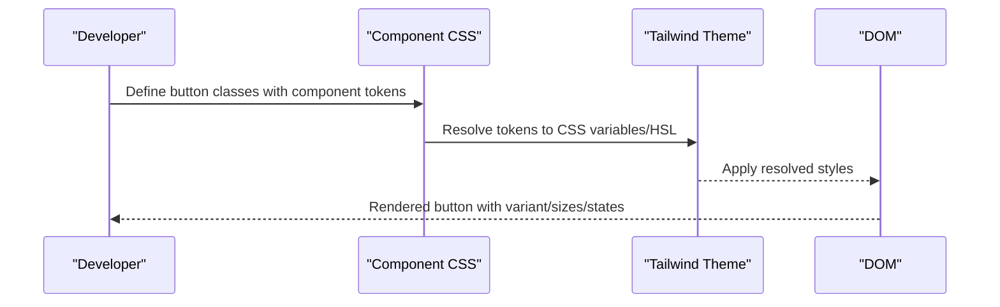

**Diagram sources**
- [generate-slide.py:162-189](file://ui-ux-pro-max-skill/.claude/skills/design-system/scripts/generate-slide.py#L162-L189)
- [component-tokens.md:5-47](file://ui-ux-pro-max-skill/.claude/skills/design-system/references/component-tokens.md#L5-L47)
- [tailwind-integration.md:128-172](file://ui-ux-pro-max-skill/.claude/skills/design-system/references/tailwind-integration.md#L128-L172)