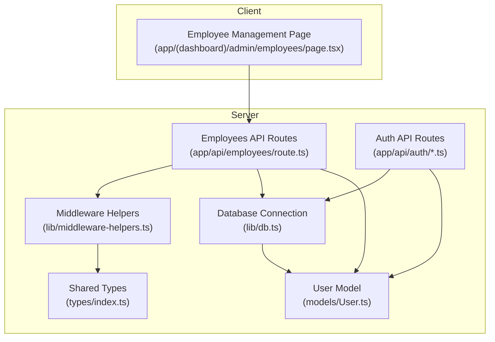
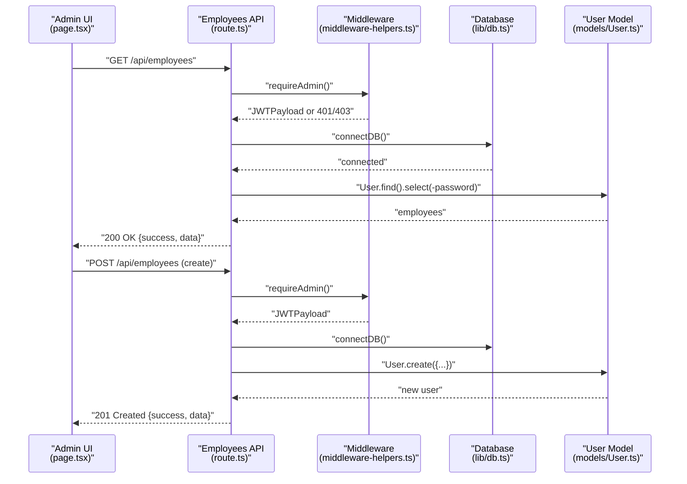
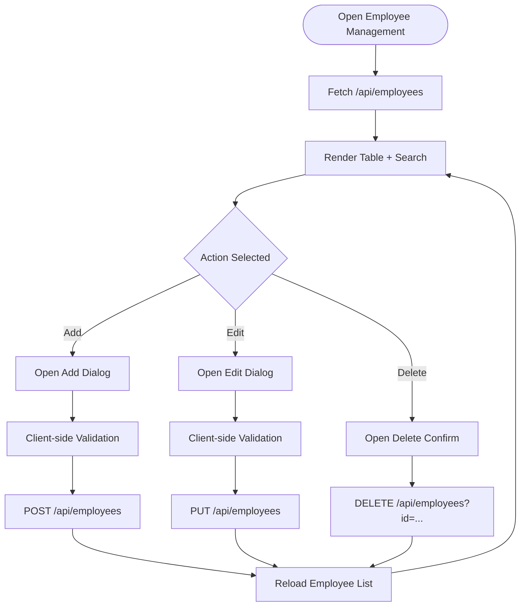
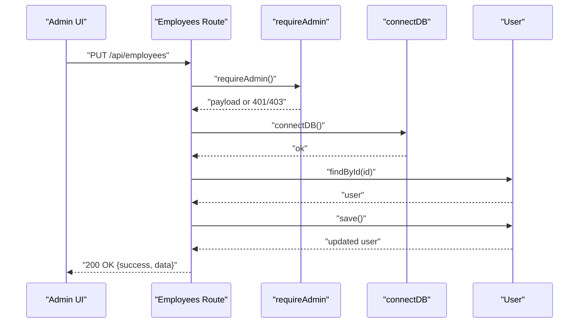
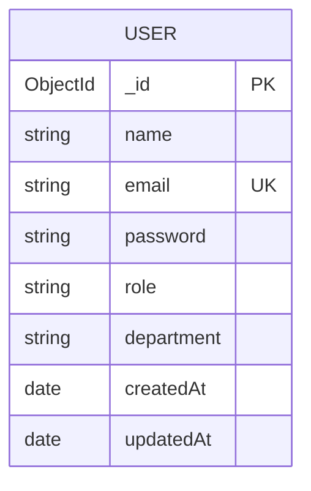
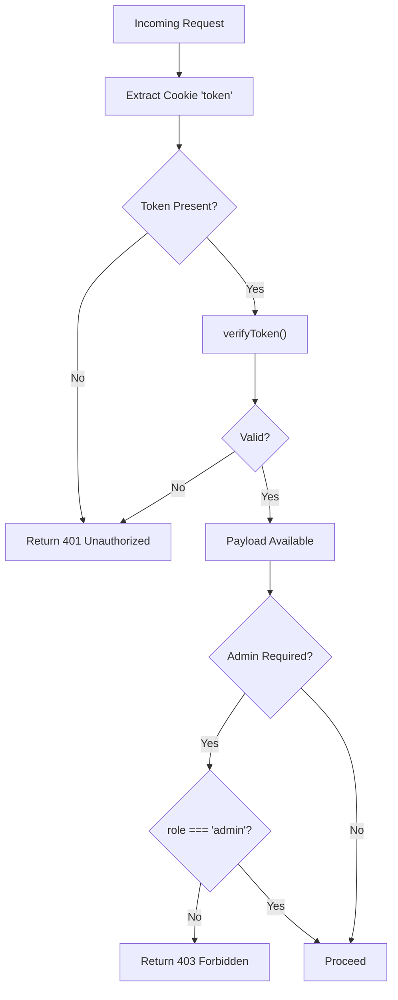
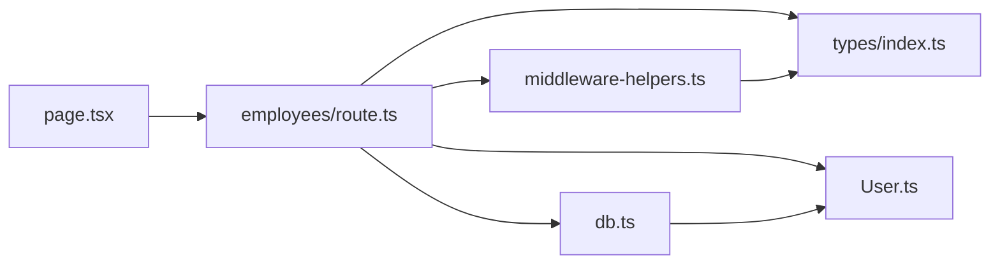

# User Management

<cite>
**Referenced Files in This Document**
- [app/(dashboard)/admin/employees/page.tsx](file://app/(dashboard)/admin/employees/page.tsx)
- [app/api/employees/route.ts](file://app/api/employees/route.ts)
- [models/User.ts](file://models/User.ts)
- [lib/middleware-helpers.ts](file://lib/middleware-helpers.ts)
- [lib/auth.ts](file://lib/auth.ts)
- [lib/db.ts](file://lib/db.ts)
- [types/index.ts](file://types/index.ts)
- [app/api/auth/me/route.ts](file://app/api/auth/me/route.ts)
- [app/api/auth/register/route.ts](file://app/api/auth/register/route.ts)
- [app/api/auth/seed/route.ts](file://app/api/auth/seed/route.ts)
</cite>

## Table of Contents
1. [Introduction](#introduction)
2. [Project Structure](#project-structure)
3. [Core Components](#core-components)
4. [Architecture Overview](#architecture-overview)
5. [Detailed Component Analysis](#detailed-component-analysis)
6. [Dependency Analysis](#dependency-analysis)
7. [Performance Considerations](#performance-considerations)
8. [Troubleshooting Guide](#troubleshooting-guide)
9. [Conclusion](#conclusion)

## Introduction
This document explains the user management subsystem responsible for employee administration and user data handling. It covers:
- Employee CRUD operations via the admin interface and backend routes
- Role assignment and department metadata
- Profile management and validation rules
- Admin-only controls and security enforcement
- Onboarding workflows, bulk operations, and data synchronization considerations
- Security and privacy practices for admin functions

## Project Structure
The user management feature spans a Next.js app with a dedicated admin page, API routes for employee operations, a User model, middleware for authentication and authorization, and shared types and utilities.

**Diagram sources**
- [app/(dashboard)/admin/employees/page.tsx:1-560](file://app/(dashboard)/admin/employees/page.tsx#L1-L560)
- [app/api/employees/route.ts:1-311](file://app/api/employees/route.ts#L1-L311)
- [lib/middleware-helpers.ts:1-80](file://lib/middleware-helpers.ts#L1-L80)
- [lib/db.ts:1-54](file://lib/db.ts#L1-L54)
- [models/User.ts:1-50](file://models/User.ts#L1-L50)
- [types/index.ts:1-61](file://types/index.ts#L1-L61)

**Section sources**
- [app/(dashboard)/admin/employees/page.tsx:1-560](file://app/(dashboard)/admin/employees/page.tsx#L1-L560)
- [app/api/employees/route.ts:1-311](file://app/api/employees/route.ts#L1-L311)
- [models/User.ts:1-50](file://models/User.ts#L1-L50)
- [lib/middleware-helpers.ts:1-80](file://lib/middleware-helpers.ts#L1-L80)
- [lib/db.ts:1-54](file://lib/db.ts#L1-L54)
- [types/index.ts:1-61](file://types/index.ts#L1-L61)

## Core Components
- Admin UI for employee management:
  - Lists employees with search and actions
  - Forms for adding/editing employees
  - Validation and error feedback
- Backend API for employee CRUD:
  - GET: List employees with optional search
  - POST: Create employee (admin-only)
  - PUT: Update employee (admin-only)
  - DELETE: Remove employee and associated attendance records (admin-only)
- User model and schema:
  - Fields: name, email, password, role, department, timestamps
  - Validation: required fields, unique email, enum role
- Middleware for security:
  - Authentication extraction and verification
  - Admin-only enforcement
- Utilities:
  - Password hashing and JWT signing/verification
  - Database connection caching

**Section sources**
- [app/(dashboard)/admin/employees/page.tsx:1-560](file://app/(dashboard)/admin/employees/page.tsx#L1-L560)
- [app/api/employees/route.ts:1-311](file://app/api/employees/route.ts#L1-L311)
- [models/User.ts:1-50](file://models/User.ts#L1-L50)
- [lib/middleware-helpers.ts:1-80](file://lib/middleware-helpers.ts#L1-L80)
- [lib/auth.ts:1-50](file://lib/auth.ts#L1-L50)
- [lib/db.ts:1-54](file://lib/db.ts#L1-L54)

## Architecture Overview
The admin UI communicates with the Employees API, which enforces admin-only access and interacts with the User model via Mongoose. Authentication and authorization are handled centrally.

**Diagram sources**
- [app/(dashboard)/admin/employees/page.tsx:80-97](file://app/(dashboard)/admin/employees/page.tsx#L80-L97)
- [app/api/employees/route.ts:9-60](file://app/api/employees/route.ts#L9-L60)
- [lib/middleware-helpers.ts:54-80](file://lib/middleware-helpers.ts#L54-L80)
- [lib/db.ts:28-51](file://lib/db.ts#L28-L51)
- [models/User.ts:4-41](file://models/User.ts#L4-L41)

## Detailed Component Analysis

### Employee Management UI
- Responsibilities:
  - Fetch employees from the backend
  - Local search and filtering
  - Add/Edit/Delete dialogs with validation
  - Display roles and departments
- Key behaviors:
  - Uses local state for form data and errors
  - Calls API endpoints for CRUD operations
  - Shows loading and error states

**Diagram sources**
- [app/(dashboard)/admin/employees/page.tsx:80-237](file://app/(dashboard)/admin/employees/page.tsx#L80-L237)

**Section sources**
- [app/(dashboard)/admin/employees/page.tsx:1-560](file://app/(dashboard)/admin/employees/page.tsx#L1-L560)

### Employees API Routes
- GET: Admin-only. Supports optional search query param to filter by name or email. Returns users excluding passwords.
- POST: Admin-only. Validates required fields, checks email uniqueness, hashes password, creates user, returns sanitized data.
- PUT: Admin-only. Validates presence of id, updates allowed fields (name, email, role, department), optionally updates password, checks email uniqueness if changing email.
- DELETE: Admin-only. Deletes user and all associated attendance records, then returns success.

**Diagram sources**
- [app/api/employees/route.ts:143-236](file://app/api/employees/route.ts#L143-L236)
- [lib/middleware-helpers.ts:54-80](file://lib/middleware-helpers.ts#L54-L80)
- [lib/db.ts:28-51](file://lib/db.ts#L28-L51)
- [models/User.ts:4-41](file://models/User.ts#L4-L41)

**Section sources**
- [app/api/employees/route.ts:1-311](file://app/api/employees/route.ts#L1-L311)

### User Model Schema and Validation
- Fields:
  - name: required, trimmed
  - email: required, unique, lowercase, trimmed
  - password: required, select:false by default
  - role: enum ["admin","employee"], default "employee"
  - department: string, default empty, trimmed
  - createdAt: Date
- Indexes:
  - email: 1 (for fast lookups)
- Timestamps enabled

**Diagram sources**
- [models/User.ts:4-41](file://models/User.ts#L4-L41)
- [types/index.ts:6-14](file://types/index.ts#L6-L14)

**Section sources**
- [models/User.ts:1-50](file://models/User.ts#L1-L50)
- [types/index.ts:1-61](file://types/index.ts#L1-L61)

### Authentication and Authorization
- Token extraction and verification:
  - Extract token from cookie, verify signature, return payload or null
- Require auth:
  - Returns payload if authenticated, else 401
- Require admin:
  - Returns payload if admin, else 401/403

**Diagram sources**
- [lib/middleware-helpers.ts:10-80](file://lib/middleware-helpers.ts#L10-L80)
- [lib/auth.ts:42-49](file://lib/auth.ts#L42-L49)

**Section sources**
- [lib/middleware-helpers.ts:1-80](file://lib/middleware-helpers.ts#L1-L80)
- [lib/auth.ts:1-50](file://lib/auth.ts#L1-L50)

### Supporting Auth Features
- Get current user profile:
  - Protected by auth middleware, returns user without password
- Register new user:
  - Public registration route, validates uniqueness and password length, creates user
- Seed default admin:
  - Creates a default admin if none exists, returns info with a note

**Section sources**
- [app/api/auth/me/route.ts:1-65](file://app/api/auth/me/route.ts#L1-L65)
- [app/api/auth/register/route.ts:43-101](file://app/api/auth/register/route.ts#L43-L101)
- [app/api/auth/seed/route.ts:7-65](file://app/api/auth/seed/route.ts#L7-L65)

## Dependency Analysis
- UI depends on:
  - API endpoints for data and mutations
  - Local validation and error handling
- API depends on:
  - Middleware for auth/admin checks
  - Database connection module
  - User model for persistence
- Shared types define contracts for requests/responses and JWT payloads
- Utilities provide hashing and token operations

**Diagram sources**
- [app/(dashboard)/admin/employees/page.tsx:1-560](file://app/(dashboard)/admin/employees/page.tsx#L1-L560)
- [app/api/employees/route.ts:1-311](file://app/api/employees/route.ts#L1-L311)
- [lib/middleware-helpers.ts:1-80](file://lib/middleware-helpers.ts#L1-L80)
- [lib/db.ts:1-54](file://lib/db.ts#L1-L54)
- [models/User.ts:1-50](file://models/User.ts#L1-L50)
- [types/index.ts:1-61](file://types/index.ts#L1-L61)

**Section sources**
- [app/(dashboard)/admin/employees/page.tsx:1-560](file://app/(dashboard)/admin/employees/page.tsx#L1-L560)
- [app/api/employees/route.ts:1-311](file://app/api/employees/route.ts#L1-L311)
- [models/User.ts:1-50](file://models/User.ts#L1-L50)
- [lib/middleware-helpers.ts:1-80](file://lib/middleware-helpers.ts#L1-L80)
- [lib/db.ts:1-54](file://lib/db.ts#L1-L54)
- [types/index.ts:1-61](file://types/index.ts#L1-L61)

## Performance Considerations
- Database connection caching:
  - Connection is cached globally to avoid reconnect overhead
- Query optimization:
  - Unique index on email for fast lookups
  - Compound index on userId+date and date index for attendance queries
- Data transfer:
  - API excludes password field by default
  - UI performs client-side filtering for search to reduce server load
- Recommendations:
  - Paginate large lists if growth continues
  - Add server-side search filters for scalability
  - Consider background jobs for bulk operations

[No sources needed since this section provides general guidance]

## Troubleshooting Guide
- Authentication failures:
  - Ensure a valid token cookie is present
  - Verify JWT secret is configured
- Admin access denied:
  - Confirm the user’s role is admin
- Duplicate email:
  - Email must be unique; change to a new address
- Internal server errors:
  - Check database connectivity and model initialization
- Client-side validation errors:
  - Name/email/password must meet minimum requirements

**Section sources**
- [lib/middleware-helpers.ts:10-80](file://lib/middleware-helpers.ts#L10-L80)
- [lib/auth.ts:7-11](file://lib/auth.ts#L7-L11)
- [app/api/employees/route.ts:78-99](file://app/api/employees/route.ts#L78-L99)
- [app/(dashboard)/admin/employees/page.tsx:120-142](file://app/(dashboard)/admin/employees/page.tsx#L120-L142)

## Conclusion
The user management system provides a secure, admin-controlled interface for employee administration with robust validation, role-based access, and clear separation of concerns between UI, API, and persistence layers. By leveraging middleware for security and Mongoose for schema enforcement, it supports reliable onboarding, updates, and deletion workflows while maintaining data integrity and privacy.